## Instrutor

- xxxxxxxxxxxxxxxxx (xxxxxxxxxxxxxxxxxxxxxx)
- Contato Linkedin: / [xxxxxxxx](https://www.linkedin.com/in/xxxxxxxxxxxxxx/)
- Perfil no Github: https://github.com/CarolinaSL

## Parte 1 - O que é qualidade de software?

### 🟩 Vídeo 01 - Apresentação do curso

<video width="60%" controls>
  <source src="000-Midia_e_Anexos/bootcamp_tqi_fullstack-modulo.08-curso.01-video_01.webm" type="video/webm">
    Seu navegador não suporta vídeo HTML5.
</video>

link do vídeo: https://web.dio.me/track/tqi-fullstack-developer/course/fundamentos-de-qualidade-de-software/learning/1f91a3e8-e08b-45c5-a540-4d6c77445562?autoplay=1

Este vídeo marca o início do curso de Fundamentos de Qualidade de Software na plataforma DIO. A instrutora Carolina Santana Lousada apresenta sua trajetória acadêmica e profissional, destacando a transição do desenvolvimento para a área de Qualidade (QA) e sua motivação em compartilhar conhecimento.

### Anotações

  

Neste vídeo, Carolina Santana Louzada, engenheira de qualidade de software na UOL EdTech, dá início ao curso de Fundamentos de Qualidade de Software. Ela será a guia nesta jornada, compartilhando sua experiência prática e conhecimento teórico sobre a área.

  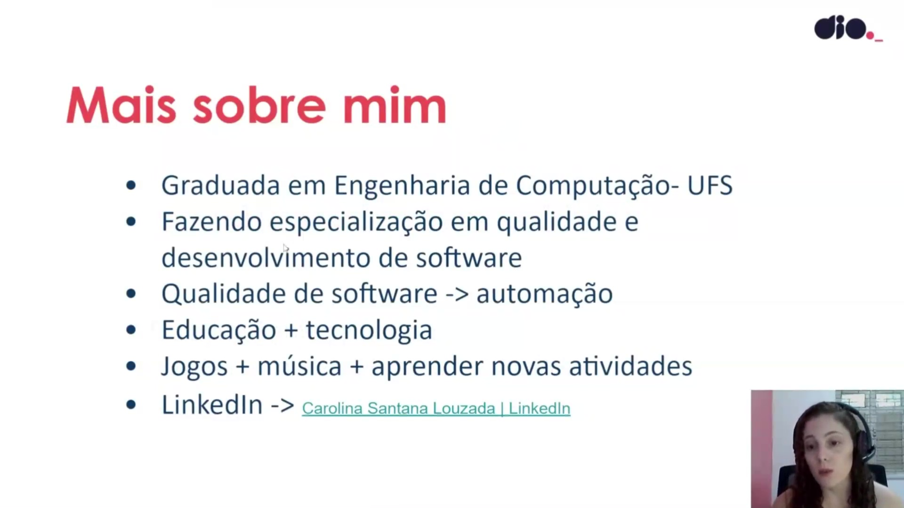

Carolina compartilha um pouco de sua história: é graduada em Engenharia de Computação pela UFS e está se especializando em qualidade e desenvolvimento de software. Sua paixão pela área começou no estágio, atuando como desenvolvedora back-end .NET, e evoluiu para automação de testes com ferramentas como Selenium, Cypress e automação mobile. Ela também destaca seu entusiasmo por unir tecnologia e educação, sendo expert na DIO, e seus hobbies pessoais como jogos, música e lutas. Ao final, convida os alunos a se conectarem com ela no LinkedIn.

  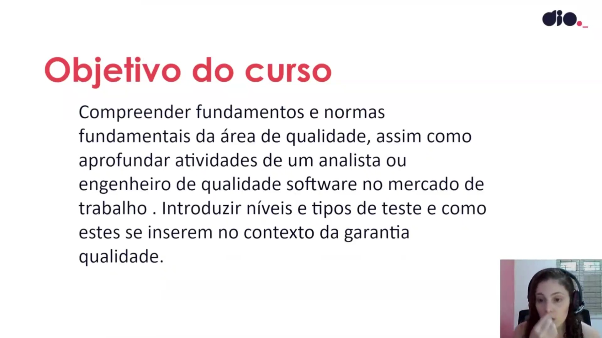

O objetivo principal deste curso é proporcionar uma compreensão sólida dos fundamentos e normas da qualidade de software, bem como aprofundar as atividades típicas de um analista ou engenheiro de qualidade no mercado de trabalho. Serão introduzidos os níveis e tipos de teste, mostrando como eles se inserem no contexto da garantia da qualidade.

  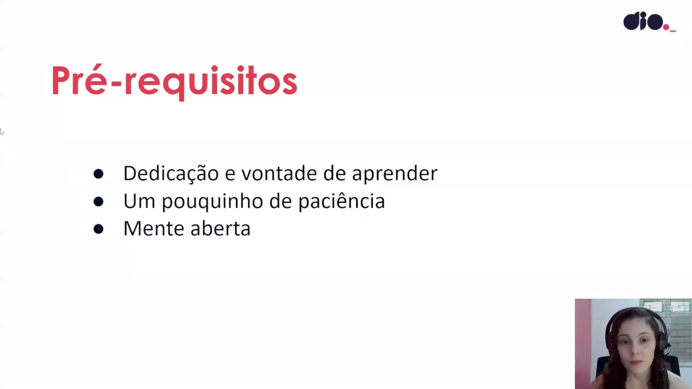

Para um melhor aproveitamento do curso, Carolina ressalta a importância de três atitudes: dedicação e vontade de aprender, um pouco de paciência e mente aberta. Esses elementos são fundamentais para absorver os conceitos e aplicá-los na prática, especialmente em uma área que exige constante evolução.

  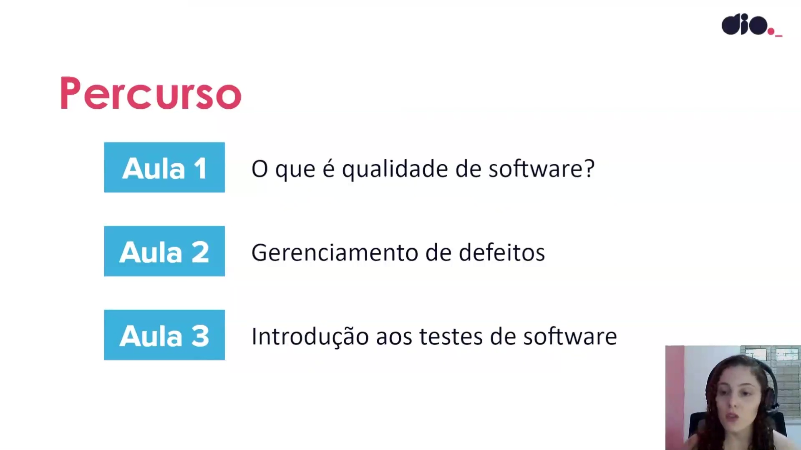

O curso está organizado em três aulas principais: na primeira, será abordado o conceito de qualidade de software; na segunda, o gerenciamento de defeitos; e na terceira, uma introdução aos testes de software. Esse percurso guiará o aluno desde os fundamentos até a aplicação prática no dia a dia de um profissional de qualidade.      

### 🟩 Vídeo 02 - Definindo qualidade

<video width="60%" controls>
  <source src="000-Midia_e_Anexos/bootcamp_tqi_fullstack-modulo.08-curso.01-video_02.webm" type="video/webm">
    Seu navegador não suporta vídeo HTML5.
</video>

link do vídeo: https://web.dio.me/track/tqi-fullstack-developer/course/fundamentos-de-qualidade-de-software/learning/410d4519-8fc9-4649-a94f-721166a92dbb?autoplay=1

A aula introduz a Qualidade de Software como uma disciplina multifacetada que vai além da simples ausência de erros, focando na satisfação de requisitos explícitos e implícitos.

### Anotações

  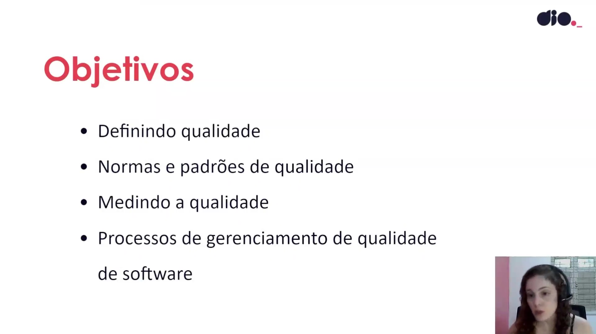

 
Neste slide, são apresentados os quatro objetivos principais da aula. O primeiro é compreender as diferentes definições de qualidade encontradas na literatura e em normas técnicas. Em seguida, vamos conhecer as principais normas e padrões que orientam a qualidade de software, como as famílias ISO e IEEE. O terceiro objetivo aborda a medição da qualidade, ou seja, como podemos quantificar e avaliar atributos de um software. Por fim, discutiremos os processos de gerenciamento da qualidade, que envolvem práticas e atividades para garantir que o produto final atenda aos requisitos esperados. Esses objetivos norteiam toda a exploração do tema ao longo da aula.

  

 
Aqui temos a primeira definição formal de qualidade, extraída da norma NBR/ISO 9000:2005. Essa norma é considerada a “mãe” das demais normas da família ISO 9000 e estabelece um conceito genérico de qualidade, aplicável a qualquer tipo de produto ou serviço. Segundo ela, qualidade é o “grau no qual um conjunto de características inerentes satisfaz a requisitos”. Isso significa que um produto tem qualidade na medida em que suas características intrínsecas (como funcionalidade, confiabilidade, etc.) atendem ao que foi especificado ou demandado. É uma definição ampla, que serve de base para as definições mais específicas de qualidade de software que veremos a seguir.

  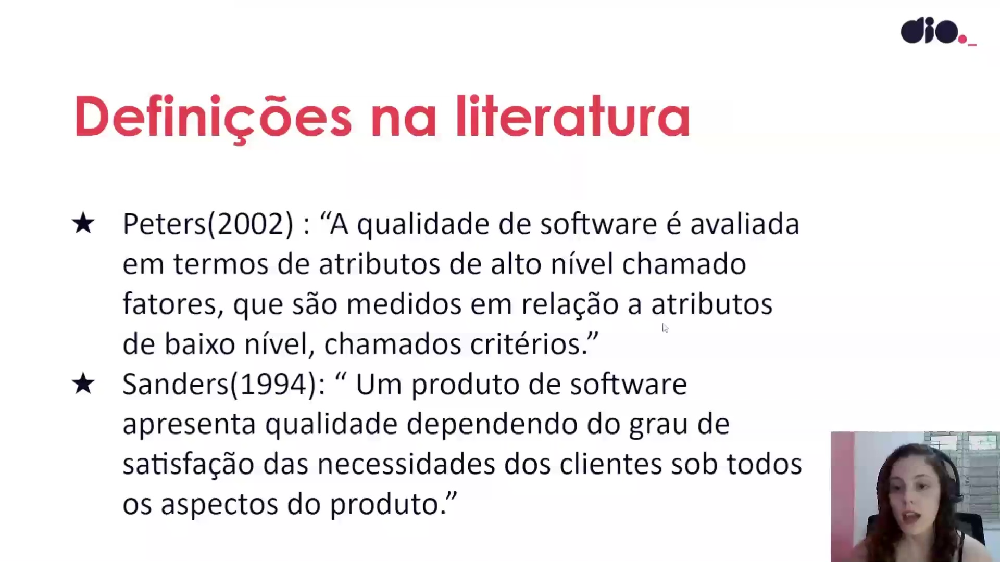

 
Este slide traz duas definições de qualidade de software propostas por autores renomados.  
- **Peters (2002):** “A qualidade de software é avaliada em termos de atributos de alto nível chamados fatores, que são medidos em relação a atributos de baixo nível, chamados critérios.” Ou seja, fatores como usabilidade e manutenibilidade (visão macro) são desdobrados em critérios objetivos e mensuráveis (como tempo de resposta, número de falhas, etc.).  
- **Sanders (1994):** “Um produto de software apresenta qualidade dependendo do grau de satisfação das necessidades dos clientes sob todos os aspectos do produto.” Essa visão coloca o cliente no centro: a qualidade está diretamente ligada a quão bem o software atende às suas necessidades, considerando todos os seus aspectos (funcionais, de desempenho, de interface, etc.).  
Ambas as definições reforçam a importância de traduzir necessidades em atributos mensuráveis e de garantir a satisfação do usuário.

  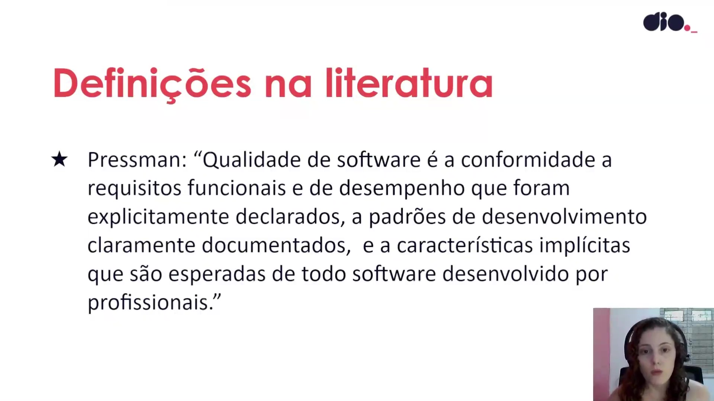

 Agora vemos a definição de Roger Pressman, um dos autores mais influentes na área de engenharia de software. Para ele, qualidade de software é “a conformidade a requisitos funcionais e de desempenho que foram explicitamente declarados, a padrões de desenvolvimento claramente documentados, e a características implícitas que são esperadas de todo software desenvolvido por profissionais.”  
Essa definição abrange três dimensões:  
1. **Requisitos explícitos:** aquilo que foi formalmente acordado com o cliente (funcionalidades, desempenho esperado).  
2. **Padrões de desenvolvimento:** boas práticas e normas que devem ser seguidas durante a construção do software.  
3. **Características implícitas:** expectativas não ditas, mas que qualquer usuário presume, como facilidade de uso, segurança básica e confiabilidade.  
Pressman destaca, assim, que qualidade não é apenas atender ao que foi pedido, mas também incorporar o que é esperado de um software bem feito.

  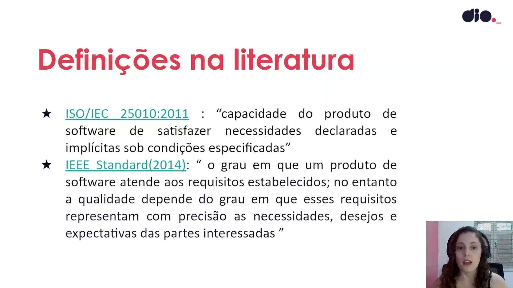

 
Este slide apresenta duas definições provenientes de importantes órgãos de padronização:  
- **ISO/IEC 25010:2011:** “Capacidade do produto de software de satisfazer necessidades declaradas e implícitas sob condições especificadas.” Essa norma atualiza conceitos anteriores e enfatiza que a qualidade deve ser avaliada em contextos de uso específicos, considerando tanto o que foi explicitado quanto o que está subentendido.  
- **IEEE Standard (2014):** “O grau em que um produto de software atende aos requisitos estabelecidos; no entanto, a qualidade depende do grau em que esses requisitos representam com precisão as necessidades, desejos e expectativas das partes interessadas.” O IEEE acrescenta uma camada crítica: de nada adianta atender rigorosamente a requisitos mal capturados. A qualidade só é alcançada se os requisitos refletirem fielmente o que os envolvidos realmente precisam e desejam.  
Ambas as definições reforçam a ligação indissociável entre requisitos e qualidade, e a importância de um processo de levantamento de requisitos bem executado.

  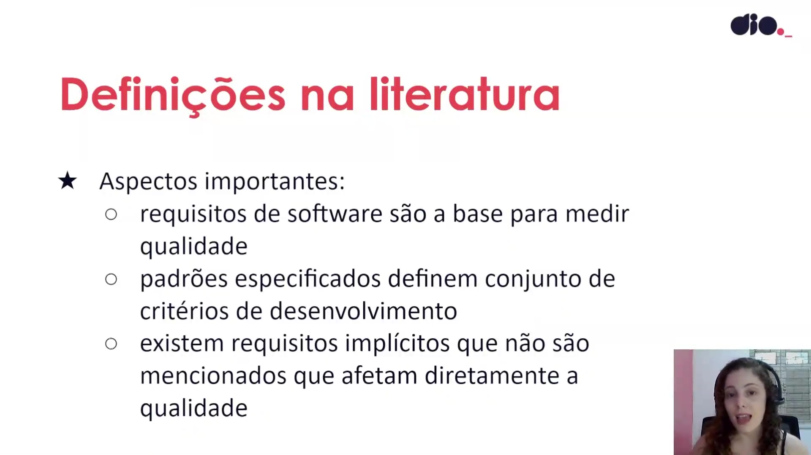

 
Aqui são destacados três aspectos fundamentais que devem ser considerados ao se definir e buscar qualidade de software:  
1. **Requisitos de software são a base para medir a qualidade:** é a partir deles que estabelecemos critérios, métricas e testes. Sem requisitos claros, não há como avaliar objetivamente se o software é de qualidade.  
2. **Padrões especificados definem conjuntos de critérios de desenvolvimento:** normas, guias e boas práticas (como coding standards, padrões de arquitetura) orientam a construção e garantem uniformidade e aderência a métodos consagrados.  
3. **Existem requisitos implícitos que não são mencionados, mas que afetam diretamente a qualidade:** são aquelas expectativas não verbalizadas pelo cliente, mas que qualquer profissional experiente sabe que devem ser atendidas (ex.: usabilidade intuitiva, tempo de resposta aceitável, robustez). Ignorar esses requisitos pode comprometer a percepção de qualidade mesmo que todos os requisitos explícitos tenham sido cumpridos.  
Esses pontos mostram que qualidade é um conceito multifacetado, que exige atenção tanto ao explícito quanto ao implícito, e que se apoia em requisitos bem definidos e em padrões de desenvolvimento.

  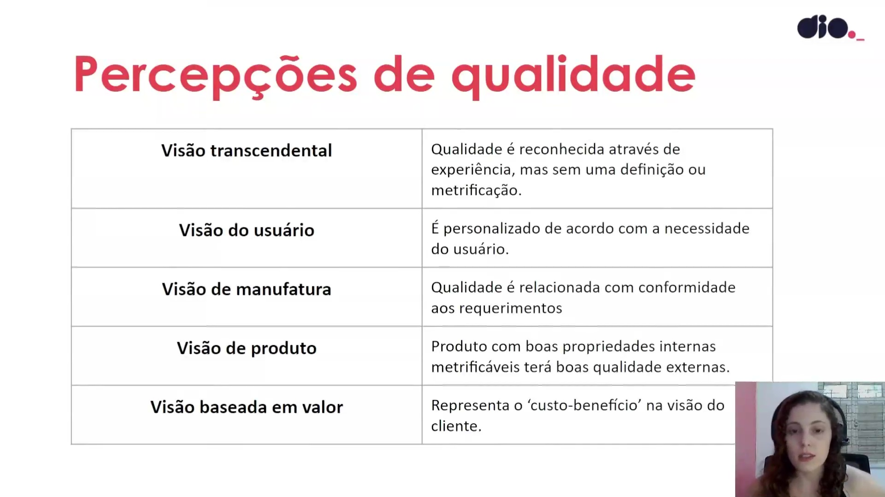

 
O último slide da aula apresenta as diferentes percepções que os envolvidos podem ter sobre qualidade. São cinco visões clássicas:  
- **Visão transcendental:** a qualidade é reconhecida intuitivamente, pela experiência, sem necessidade de medição. É aquela sensação de que um produto é bom “porque sim”.  
- **Visão do usuário:** a qualidade é personalizada de acordo com as necessidades de cada usuário. O que é qualidade para um pode não ser para outro, dependendo do contexto e das prioridades.  
- **Visão de manufatura:** foca na conformidade com os requisitos e especificações. Um produto de qualidade é aquele que foi construído exatamente como foi projetado, seguindo padrões.  
- **Visão do produto:** parte do princípio de que boas características internas (código limpo, arquitetura bem estruturada) resultam em boa qualidade externa (desempenho, confiabilidade).  
- **Visão baseada em valor:** associa qualidade ao custo-benefício percebido pelo cliente. O cliente avalia se o investimento vale a pena em relação aos benefícios entregues.  

Essas visões não são excludentes; na prática, a qualidade de um software é resultado da combinação de várias delas, dependendo do papel de quem a avalia (desenvolvedor, gerente, usuário, etc.). A tabela sintetiza como diferentes atores podem enxergar o mesmo produto sob ângulos distintos.      

### 🟩 Vídeo 03 - Normas e padrões de qualidade

<video width="60%" controls>
  <source src="000-Midia_e_Anexos/bootcamp_tqi_fullstack-modulo.08-curso.01-video_03.webm" type="video/webm">
    Seu navegador não suporta vídeo HTML5.
</video>

link do vídeo: https://web.dio.me/track/tqi-fullstack-developer/course/fundamentos-de-qualidade-de-software/learning/d6a0b597-c96e-41b2-a9c5-bb71f23d436f?autoplay=1

Este resumo explora a importância da padronização no desenvolvimento de software, detalhando as principais organizações normizadoras e as famílias de normas (ISO, IEEE, IEC) que definem o que é qualidade, desde a gestão até a execução técnica.

### Anotações

  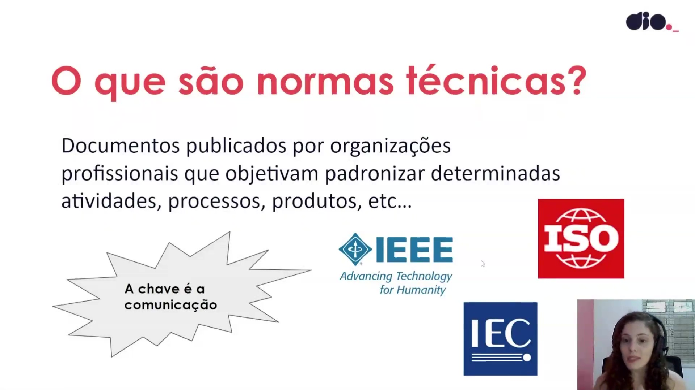

Este slide introduz o conceito fundamental de **normas técnicas**. Como vimos, elas são documentos publicados por organizações profissionais com o objetivo de padronizar atividades, processos e produtos. A grande importância da padronização, destacada na aula, é a **comunicação**. Quando uma equipe ou empresa adota as mesmas normas, todos "falam a mesma língua", utilizando as mesmas definições, siglas e termos. Isso minimiza mal-entendidos e garante que todos estejam alinhados, desde a concepção até a entrega de um produto ou serviço.

  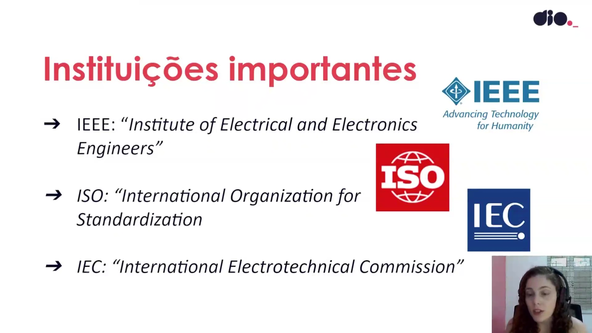

O slide apresenta as siglas e os nomes de três das mais importantes organizações mundiais que publicam normas técnicas. Vamos conhecer cada uma:

*   **IEEE:** *Institute of Electrical and Electronics Engineers* (Instituto de Engenheiros Eletricistas e Eletrônicos). É uma organização extremamente relevante para a engenharia e a academia, publicando diversos padrões e pesquisas.
*   **ISO:** *International Organization for Standardization* (Organização Internacional de Normalização). Como o próprio nome indica, seu foco principal é a criação de padrões internacionais para uma vasta gama de áreas.
*   **IEC:** *International Electrotechnical Commission* (Comissão Eletrotécnica Internacional). Atua fortemente na padronização de tecnologias relacionadas à eletricidade, eletrônica e áreas correlatas.

É muito comum vermos essas organizações trabalhando em conjunto. Por isso, é frequente encontrar normas identificadas como **ISO/IEC** ou **ISO/IEC/IEEE**, fruto de um consenso entre elas para criar documentos ainda mais abrangentes e robustos.

  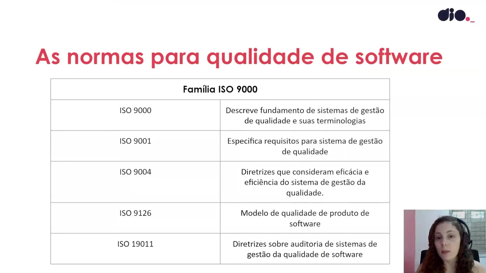

Este slide detalha a renomada **Família ISO 9000**, um conjunto de normas focado em sistemas de gestão da qualidade. Vamos explorar os principais componentes apresentados:

*   **ISO 9000:** Descreve os fundamentos e o vocabulário essencial para um sistema de gestão da qualidade. É a base conceitual.
*   **ISO 9001:** Especifica os **requisitos** que um sistema de gestão da qualidade deve atender. É a norma mais conhecida e usada para certificação.
*   **ISO 9004:** Fornece **diretrizes** para que as organizações possam alcançar não apenas a conformidade, mas também a eficácia e a eficiência em seus sistemas de gestão da qualidade.
*   **ISO 9126:** Esta norma é um marco histórico para a área de tecnologia, pois define um **modelo de qualidade para produto de software**. Ela estabelece características e subcaracterísticas para avaliar a qualidade de um software.
*   **ISO 19011:** Oferece diretrizes sobre como conduzir **auditorias** de sistemas de gestão da qualidade.

  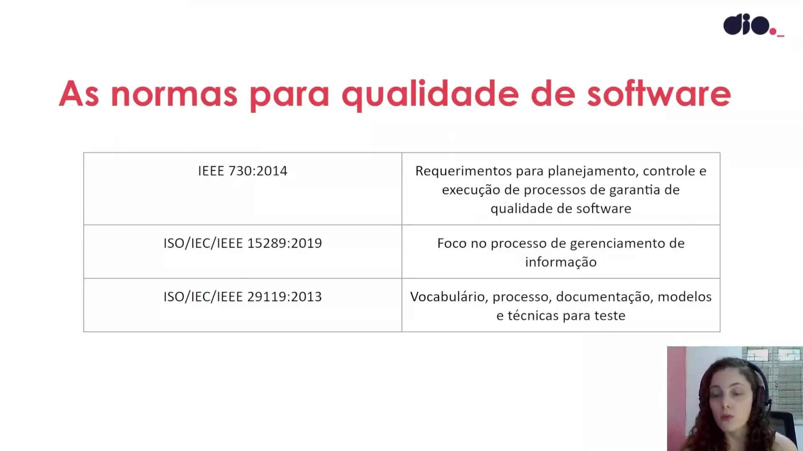

Dando continuidade às normas essenciais para a qualidade de software, este slide apresenta outras três de grande relevância, agora com a participação do IEEE em conjunto com a ISO e IEC:

*   **IEEE 730:2014:** Esta norma é fundamental para a **Garantia da Qualidade de Software** (*Software Quality Assurance* ou SQA). Ela estabelece os requisitos para o planejamento, controle e execução dos processos de garantia da qualidade.
*   **ISO/IEC/IEEE 15289:2019:** Foca no **gerenciamento da informação** ao longo do ciclo de vida do software. Ela define o conteúdo e a estrutura para a documentação de processos de software e sistemas.
*   **ISO/IEC/IEEE 29119:2013:** Esta é uma norma de extrema importância para a área de testes de software. Ela define um vocabulário padronizado, processos, modelos e técnicas para a realização de testes, sendo uma referência crucial para profissionais da área.

  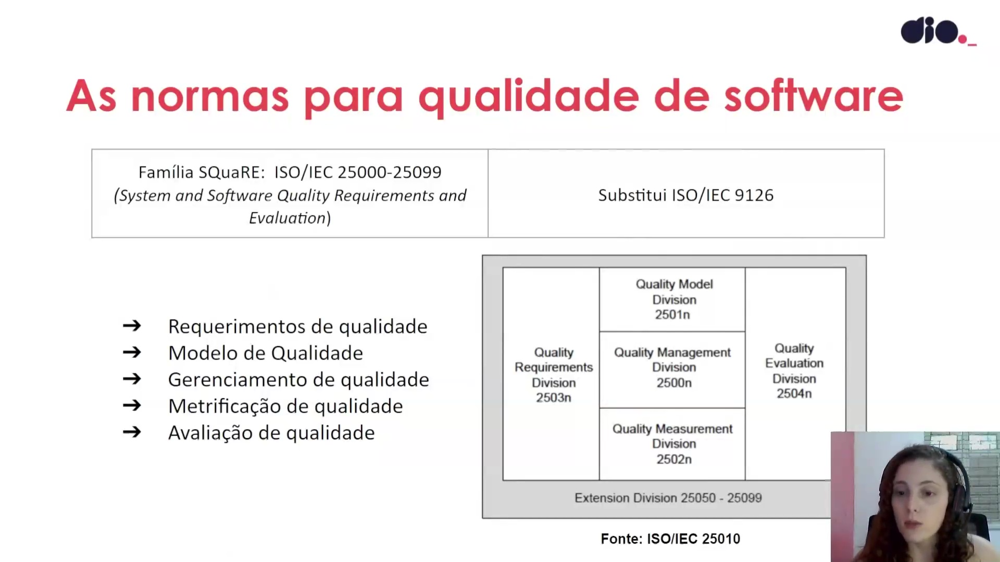

Chegamos à família de normas mais moderna e abrangente para a qualidade de produto de software: a **Família SQuaRE** (*System and Software Quality Requirements and Evaluation*), correspondente às normas **ISO/IEC 25000 a 25099**.

Esta família foi criada para substituir a antiga ISO 9126, trazendo conceitos atualizados e uma visão mais completa. Ela cobre cinco áreas principais da qualidade de software, como ilustrado no slide:

*   **Requerimentos de Qualidade:** Define como especificar os requisitos de qualidade para um sistema ou software.
*   **Modelo de Qualidade:** Apresenta um modelo detalhado com características e subcaracterísticas de qualidade, similar à sua antecessora, mas refinado.
*   **Gerenciamento de Qualidade:** Estabelece modelos e processos para gerenciar as atividades relacionadas à qualidade.
*   **Metrificação de Qualidade:** Fornece um conjunto de medidas e métricas para quantificar e avaliar as características de qualidade.
*   **Avaliação de Qualidade:** Define processos e orientações para a avaliação da qualidade de produtos de software, seja por desenvolvedores, adquirentes ou avaliadores independentes.

É importante lembrar que as normas servem como um guia técnico robusto, mas não são obrigatórias. Elas oferecem um excelente ponto de partida para construir processos sólidos e bem definidos, sempre lembrando que a qualidade deve ser pensada desde o início do projeto.      

### 🟩 Vídeo 04 - Medindo qualidade

<video width="60%" controls>
  <source src="000-Midia_e_Anexos/bootcamp_tqi_fullstack-modulo.08-curso.01-video_04.webm" type="video/webm">
    Seu navegador não suporta vídeo HTML5.
</video>

link do vídeo: https://web.dio.me/track/tqi-fullstack-developer/course/fundamentos-de-qualidade-de-software/learning/bb50b57a-47dc-45b5-b98c-367f96b4737e?autoplay=1

Este guia explora a visão holística da qualidade de software, indo além da simples execução de testes. Ele detalha como a qualidade é construída desde a definição dos processos internos até a percepção final do usuário, utilizando como base as normas ISO 9126 e ISO 25010.

### Anotações

  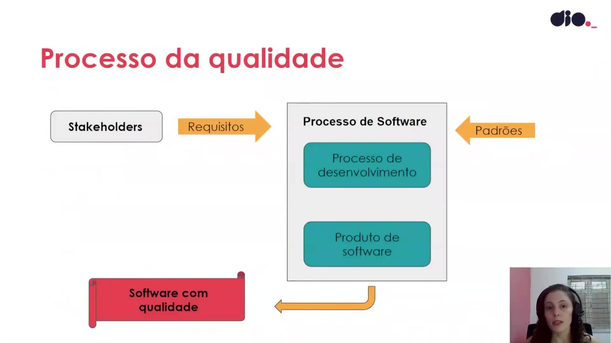

O slide apresenta o título “Processo da qualidade”, indicando que a qualidade em software não é um evento isolado, mas um conjunto de atividades que permeiam todo o ciclo de desenvolvimento. O processo de qualidade envolve desde a definição dos requisitos, passando pela padronização de código, metodologias de trabalho, até os testes e a entrega. A ideia central é que a qualidade deve ser incorporada em cada etapa, e não apenas verificada ao final. Assim, todos os envolvidos no projeto – analistas, desenvolvedores, testadores e gestores – são responsáveis por garantir que o produto atenda às expectativas, contribuindo com sugestões e melhorias contínuas.

  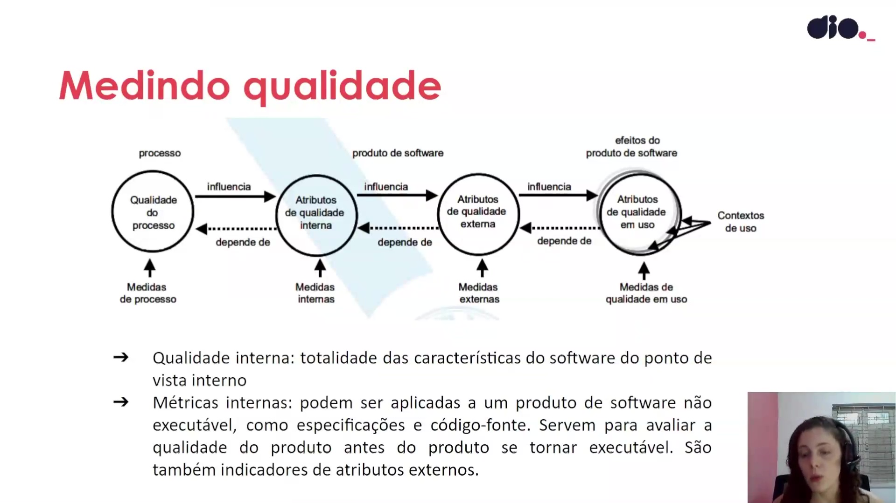

O slide introduz o conceito de **qualidade interna**, que se refere às características do software observadas do ponto de vista interno, ou seja, antes de o produto estar executável. As **métricas internas** são aplicadas a artefatos como especificações, modelos e código-fonte, permitindo avaliar a qualidade ainda nas fases iniciais. Exemplos dessas métricas incluem complexidade ciclomática, cobertura de testes unitários, aderência a padrões de codificação e modularidade. Uma boa qualidade interna influencia diretamente a qualidade externa, pois um código bem estruturado tende a gerar menos defeitos durante a execução.

  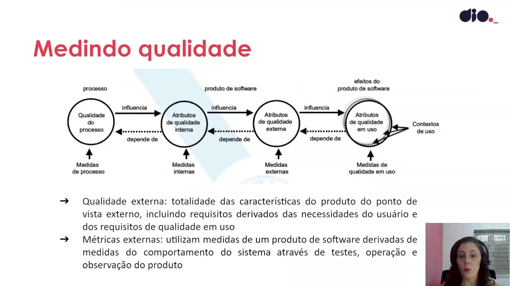

O slide aborda a **qualidade externa**, que corresponde ao comportamento do software quando executado, considerando requisitos funcionais e não funcionais derivados das necessidades do usuário. As **métricas externas** são obtidas por meio de testes, observação do sistema em ambiente de homologação ou produção, e medições de desempenho, segurança e confiabilidade. Diferentemente das métricas internas, as externas já refletem a interação do software com o ambiente e podem ser percebidas indiretamente pelo usuário, como a quantidade de falhas ou o tempo de resposta.

  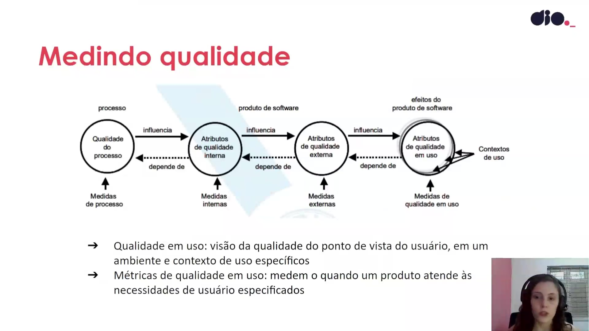

Aqui é apresentada a **qualidade em uso**, que representa a visão do usuário final em um contexto específico. Ela avalia o quanto o software atende às necessidades reais do negócio, considerando fatores como eficácia, produtividade, segurança e satisfação. As **métricas de qualidade em uso** medem o resultado da interação do usuário com o sistema, por exemplo, a taxa de conclusão de tarefas, o número de erros cometidos ou o nível de confiança do usuário. Essa perspectiva é fundamental para garantir que o produto entregue realmente agregue valor ao cliente.

  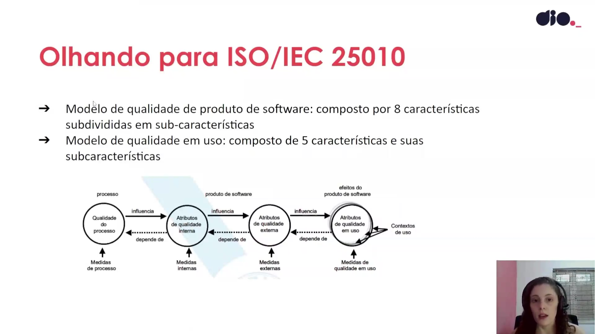

O slide resume a estrutura dos modelos de qualidade segundo a norma ISO/IEC 25010, que sucede a ISO 9126. São definidos dois modelos: o **modelo de qualidade de produto de software**, composto por 8 características e suas subcaracterísticas, e o **modelo de qualidade em uso**, formado por 5 características. Essa separação facilita a medição e o gerenciamento da qualidade sob diferentes perspectivas: uma mais técnica (produto) e outra mais voltada à experiência do usuário (em uso).

  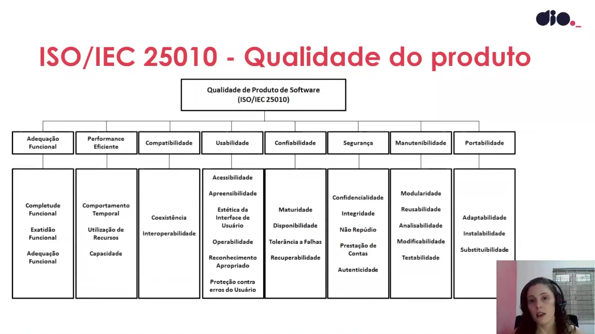

O slide detalha o **modelo de qualidade de produto** da ISO/IEC 25010, que estabelece oito características principais: adequação funcional, confiabilidade, usabilidade, eficiência de desempenho, manutenibilidade, portabilidade, compatibilidade e segurança. Cada uma dessas características é desdobrada em subcaracterísticas que permitem uma avaliação mais granular. Por exemplo, usabilidade inclui acessibilidade, estética da interface e operabilidade. Esse modelo orienta a definição de métricas internas e externas ao longo do desenvolvimento.

  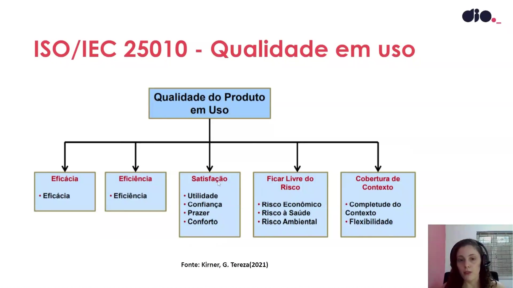

Por fim, a imagem apresenta o **modelo de qualidade em uso** da ISO/IEC 25010, que foca na interação do usuário com o sistema em seu ambiente real. As cinco características são: eficácia, eficiência, satisfação, liberdade de risco e cobertura de contexto. A satisfação, por exemplo, abrange utilidade, confiança, prazer e conforto. Esse modelo reflete o que o usuário efetivamente experimenta: se o software é útil, seguro e agradável de usar, independentemente de como foi construído internamente. A qualidade em uso é o resultado final de todas as outras qualidades e determina o sucesso do produto no mercado.      

### 🟩 Vídeo 05 - Processos de gerenciamento de qualidade

<video width="60%" controls>
  <source src="000-Midia_e_Anexos/bootcamp_tqi_fullstack-modulo.08-curso.01-video_05.webm" type="video/webm">
    Seu navegador não suporta vídeo HTML5.
</video>

link do vídeo: https://web.dio.me/track/tqi-fullstack-developer/course/fundamentos-de-qualidade-de-software/learning/5d7639a1-ef21-482d-aada-8299afc26367?autoplay=1

Este guia explora as atividades fundamentais do gerenciamento de qualidade de software, destacando que o processo vai muito além da simples execução de testes. O foco central é garantir a satisfação do usuário através de um ciclo contínuo de planejamento, garantia, controle e melhoria.

### Anotações

  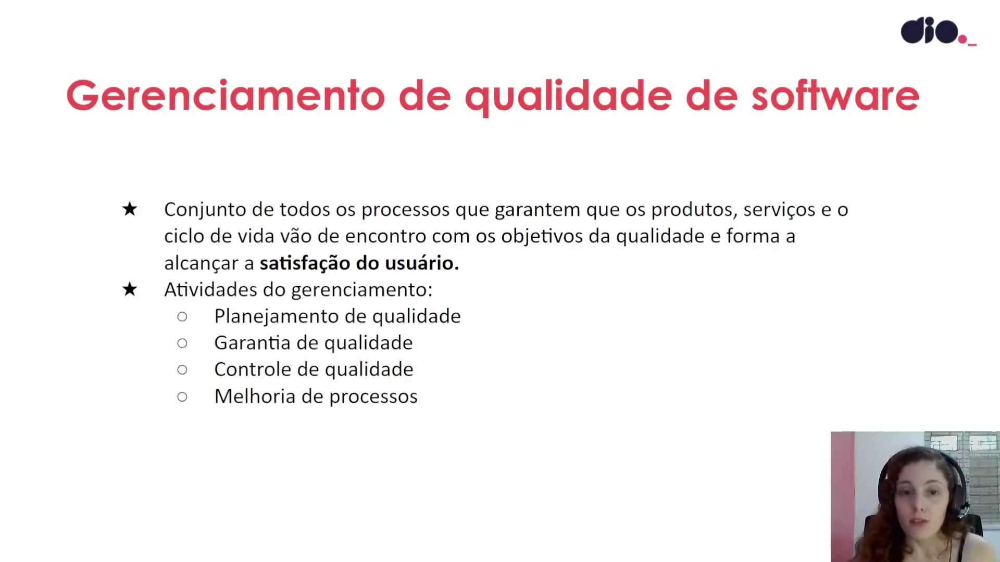

Este slide apresenta a definição de gerenciamento de qualidade, destacando que se trata do conjunto de processos que garantem que produtos, serviços e o ciclo de vida atendam aos objetivos de qualidade, visando a satisfação do usuário. Além disso, são listadas as quatro atividades principais desse gerenciamento: planejamento, garantia, controle e melhoria de processos, que serão detalhadas nos próximos slides.

  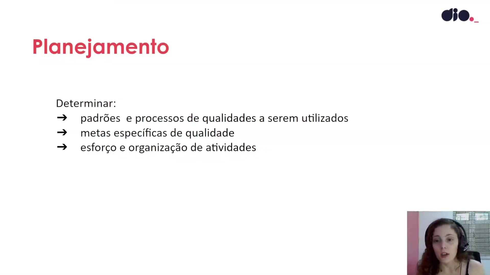

O planejamento da qualidade é a primeira atividade. Envolve definir quais padrões e processos serão adotados, estabelecer metas claras de qualidade para o projeto e planejar o esforço necessário, bem como a organização das atividades que garantirão que essas metas sejam alcançadas.

  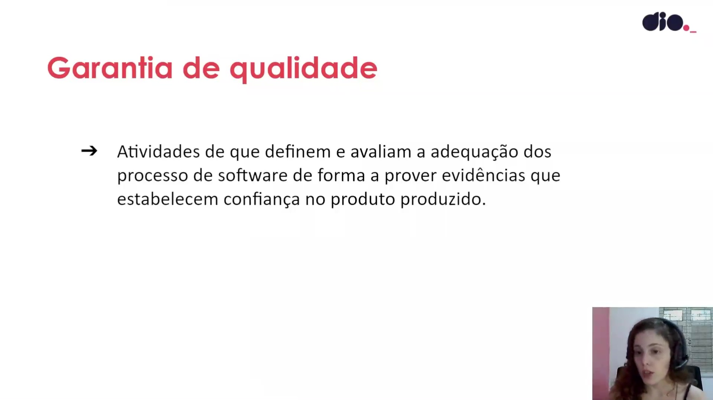

A garantia da qualidade foca em definir e avaliar a adequação dos processos de software. O objetivo é fornecer evidências que criem confiança de que o produto final será entregue com a qualidade esperada, ou seja, assegurar que os processos estão sendo seguidos corretamente.

  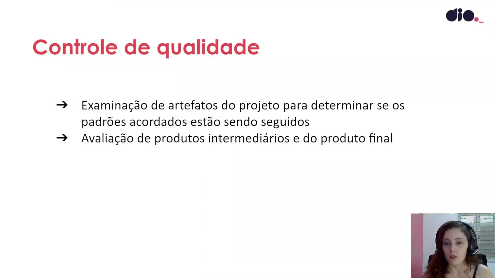

O controle da qualidade consiste na examinação dos artefatos produzidos ao longo do projeto, verificando se os padrões estabelecidos estão sendo cumpridos. Isso inclui a avaliação tanto de produtos intermediários quanto do produto final, garantindo que cada entrega atenda aos critérios de qualidade definidos.

  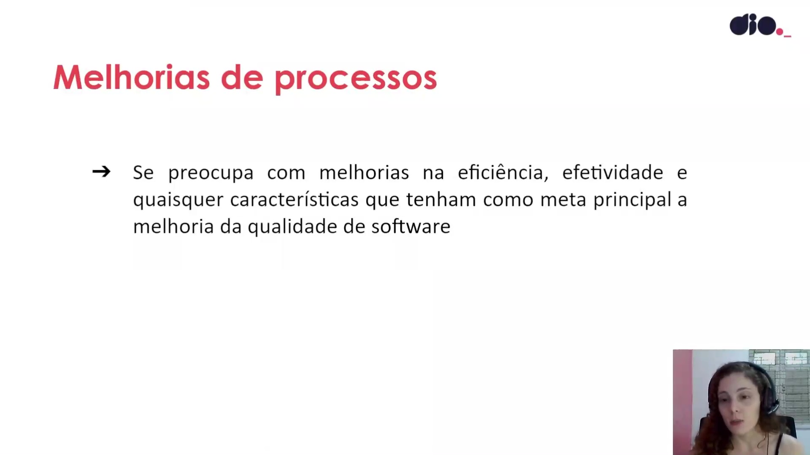

A melhoria de processos é uma atividade contínua que busca aumentar a eficiência e a efetividade dos processos de desenvolvimento. O foco está em identificar oportunidades de melhoria que impactem positivamente a qualidade do software, seja por meio de ajustes nos processos existentes ou da introdução de novas práticas.

  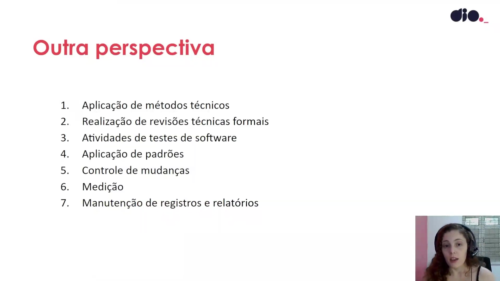

Este slide apresenta um conjunto de atividades operacionais que dão suporte ao gerenciamento da qualidade. Elas incluem desde a aplicação de métodos técnicos e revisões formais até testes, controle de mudanças, medição e manutenção de registros. Essas práticas ajudam a implementar os processos de garantia e controle no dia a dia do desenvolvimento.      

## Parte 2 - Gerenciamento de defeitos

### 🟩 Vídeo 06 - Falando em controle de qualidade

<video width="60%" controls>
  <source src="000-Midia_e_Anexos/bootcamp_tqi_fullstack-modulo.08-curso.01-video_06.webm" type="video/webm">
    Seu navegador não suporta vídeo HTML5.
</video>

link do vídeo: https://web.dio.me/track/tqi-fullstack-developer/course/fundamentos-de-qualidade-de-software/learning/696c20c0-3a82-4ea5-869d-84ba28c8e164?autoplay=1

Este resumo aborda os fundamentos do controle de qualidade no desenvolvimento de software, focando nas distinções entre análise estática e dinâmica, a diferença crucial entre verificação e validação, e o ciclo de vida dos defeitos (bugs).

### Anotações

  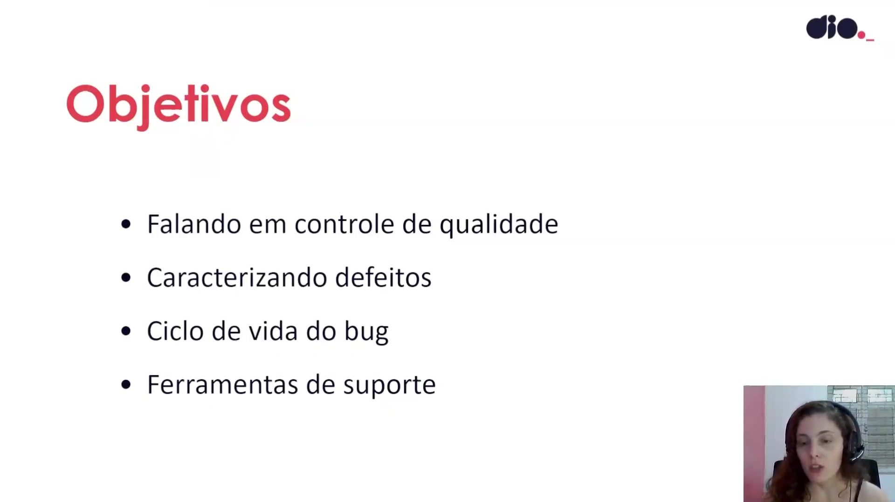

Este slide apresenta os objetivos da aula, organizados em quatro tópicos principais:  
- **Falando em controle de qualidade** – introdução ao papel do controle de qualidade no ciclo de desenvolvimento.  
- **Caracterizando defeitos** – como identificar, classificar e descrever os problemas encontrados.  
- **Ciclo de vida do bug** – as etapas que um defeito percorre desde sua detecção até o encerramento.  
- **Ferramentas de suporte** – exemplos de softwares utilizados para gerenciar e rastrear defeitos de forma eficiente.  

Esses pontos guiarão a discussão sobre como o gerenciamento de defeitos se integra às atividades de garantia da qualidade.

  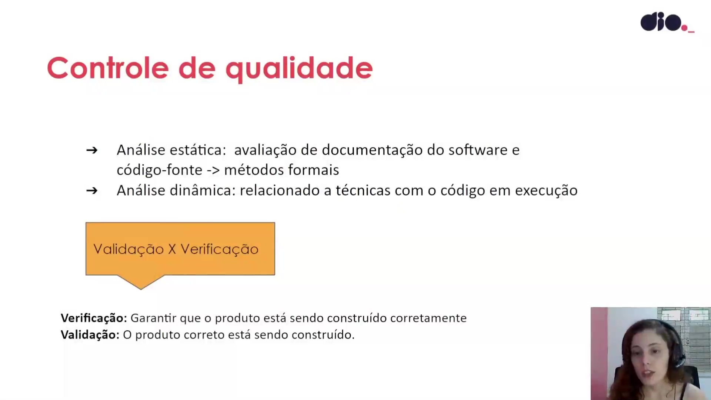

O slide estabelece a diferença entre análise estática e dinâmica, além dos conceitos de verificação e validação:

- **Análise estática**: avaliação da documentação e do código-fonte sem executar o programa. Inclui métodos formais, code review e uso de ferramentas automáticas de verificação.  
- **Análise dinâmica**: técnicas aplicadas com o código em execução, como os testes (funcionais, de desempenho, etc.).  

- **Verificação**: “Garantir que o produto está sendo construído corretamente” – ou seja, se o desenvolvimento segue as especificações técnicas.  
- **Validação**: “O produto correto está sendo construído” – verificar se o software atende às reais necessidades do usuário.  

Embora relacionados, verificação e validação respondem a perguntas diferentes: a primeira foca na conformidade com os requisitos documentados; a segunda, na adequação ao contexto do cliente.

  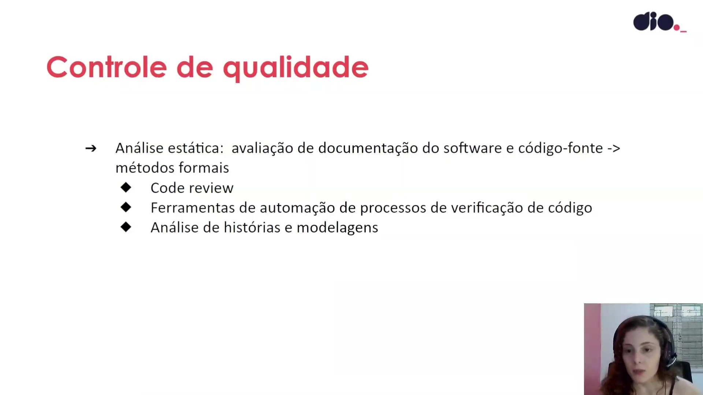

Este slide aprofunda a **análise estática**, listando suas principais atividades:

- **Code review** – revisão sistemática do código por outros desenvolvedores para identificar falhas, más práticas ou melhorias.  
- **Ferramentas de automação de processos de verificação de código** – softwares que analisam o código estaticamente (ex.: linters, analisadores de complexidade, cobertura estática) e podem ser integrados a pipelines de CI/CD.  
- **Análise de histórias e modelagens** – exame de artefatos como histórias de usuário, casos de uso, diagramas e fluxogramas para garantir que representem corretamente os requisitos e processos de negócio.  

Essas técnicas ajudam a prevenir defeitos antes mesmo da execução do código, reduzindo custos de correção e retrabalho.

  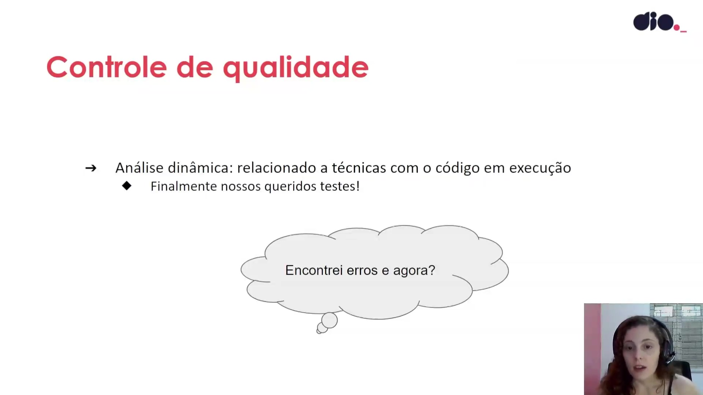

O último slide sintetiza a **análise dinâmica** e sua relação com os testes:

- **Análise dinâmica** envolve a execução do código para observar seu comportamento em tempo real. É o momento em que os testes (unitários, de integração, sistema, aceitação) são aplicados.  
- A frase “Finalmente nossos queridos testes!” destaca que é na análise dinâmica que a atividade de teste se concretiza, seja manual ou automatizada.  

O slide encerra o bloco conceitual e prepara o terreno para o próximo tema: o gerenciamento de defeitos – o que fazer quando os testes revelam erros.      

### 🟩 Vídeo 07 - Caracterizando defeitos

<video width="60%" controls>
  <source src="000-Midia_e_Anexos/bootcamp_tqi_fullstack-modulo.08-curso.01-video_07.webm" type="video/webm">
    Seu navegador não suporta vídeo HTML5.
</video>

link do vídeo: https://web.dio.me/track/tqi-fullstack-developer/course/fundamentos-de-qualidade-de-software/learning/ec066b99-618c-4308-a649-84b1c4723d8a?autoplay=1

Este resumo aborda a importância de identificar e analisar erros durante o ciclo de desenvolvimento de software, diferenciando terminologias técnicas e explorando as raízes comuns que levam a falhas no produto final.

### Anotações

  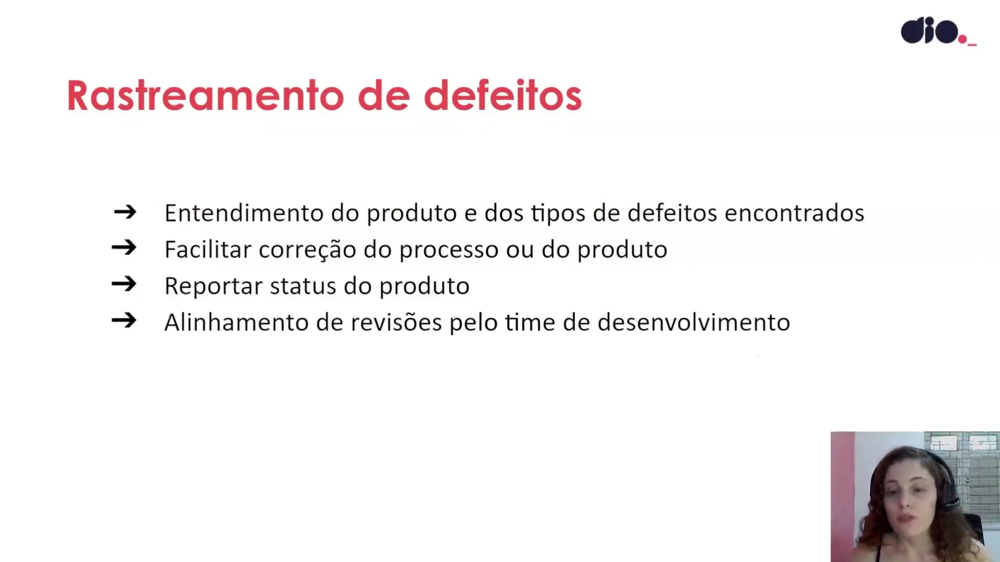

O slide apresenta os principais objetivos do rastreamento de defeitos no contexto da qualidade de software. A primeira finalidade é o **entendimento do produto e dos tipos de defeitos encontrados** – ao registrar e analisar os problemas, a equipe ganha visibilidade sobre quais áreas ou funcionalidades são mais suscetíveis a falhas, direcionando melhor os esforços de teste e melhoria. Em seguida, o rastreamento **facilita a correção do processo ou do produto**, pois com dados concretos é possível identificar se o defeito tem origem na codificação, na documentação, nos requisitos ou até no próprio processo de desenvolvimento, permitindo ações corretivas mais eficazes. Outro ponto crucial é o **reporte de status do produto** – ter um histórico rastreável de defeitos possibilita comunicar de forma transparente a qualidade atual do software para clientes, gestores e outras partes interessadas. Por fim, o rastreamento promove o **alinhamento de revisões pelo time de desenvolvimento**, já que os dados sobre os erros mais frequentes ou críticos ajudam os desenvolvedores a focarem suas revisões de código e a prevenirem problemas recorrentes.

  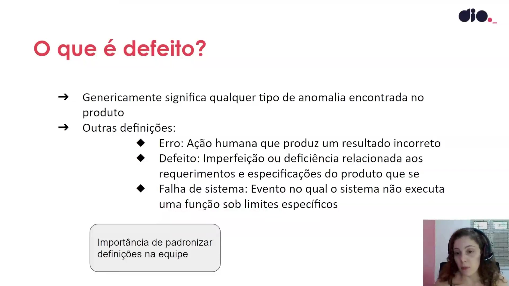

Este slide aborda a definição formal de defeito e diferencia termos que muitas vezes são usados como sinônimos no dia a dia, mas que possuem significados distintos na engenharia de software. De forma genérica, "defeito" pode ser entendido como qualquer anomalia no produto, porém a norma técnica detalha três conceitos importantes:

- **Erro**: é uma ação humana que resulta em um resultado incorreto. Por exemplo, um analista que interpreta mal uma necessidade do cliente comete um erro, o que pode gerar requisitos errados.
- **Defeito**: é uma imperfeição ou deficiência no produto em relação aos requisitos ou especificações. Geralmente é consequência de um erro humano (como o exemplo anterior) e está presente no artefato produzido (código, documento, modelo).
- **Falha de sistema**: é um evento em que o sistema não executa uma função dentro dos limites especificados, podendo ser causada por um defeito que se manifesta em determinadas condições de execução (por exemplo, falta de memória ou pico de acesso).

A ênfase final do slide está na **importância de padronizar definições na equipe** – ter um vocabulário comum evita mal-entendidos, melhora a comunicação entre os membros do time e assegura que todos classifiquem os problemas da mesma maneira, o que é essencial para uma gestão de qualidade eficiente.

  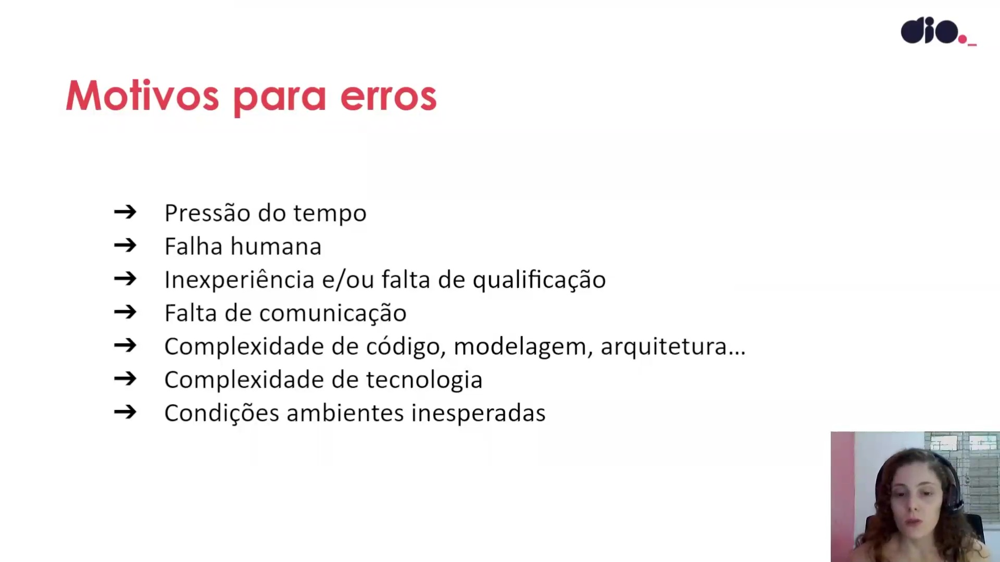

O slide lista as principais causas que levam à introdução de erros no desenvolvimento de software, servindo como um alerta para os pontos que a equipe deve monitorar e mitigar:

- **Pressão do tempo**: prazos apertados e entregas urgentes podem fazer com que atividades formais de garantia da qualidade sejam negligenciadas, aumentando a probabilidade de falhas.
- **Falha humana**: inclui desde enganos simples até erros de raciocínio lógico durante a codificação, algo inerente ao trabalho humano.
- **Inexperiência e/ou falta de qualificação**: membros da equipe que ainda estão aprendendo determinada tecnologia ou processo podem, sem intenção, introduzir problemas que não reconhecem como erros.
- **Falta de comunicação**: falhas na troca de informações entre clientes, Product Owners, desenvolvedores e testadores geram inconsistências e requisitos mal compreendidos.
- **Complexidade de código, modelagem, arquitetura**: sistemas intrincados ou decisões arquiteturais complexas escondem armadilhas que nem sempre são previstas pelos profissionais.
- **Complexidade de tecnologia**: o uso de tecnologias novas ou muito sofisticadas pode trazer desafios não dominados pela equipe.
- **Condições ambientes inesperadas**: situações como picos de acesso, ataques ou limitações de recursos de hardware que não foram consideradas no planejamento podem provocar falhas em produção.

Identificar essas origens ajuda a equipe a implementar ações preventivas, como treinamentos, melhorias na comunicação, revisões sistemáticas e testes mais abrangentes, reduzindo assim a incidência de erros.      

### 🟩 Vídeo 08 - Ciclo de vida do bug

<video width="60%" controls>
  <source src="000-Midia_e_Anexos/bootcamp_tqi_fullstack-modulo.08-curso.01-video_08.webm" type="video/webm">
    Seu navegador não suporta vídeo HTML5.
</video>

link do vídeo: https://web.dio.me/track/tqi-fullstack-developer/course/fundamentos-de-qualidade-de-software/learning/2202c676-3c8d-4e9b-be15-edd5fe403385?autoplay=1

O vídeo resume o processo de rastreamento, correção e reporte de defeitos em software, destacando que um bug possui um ciclo de vida próprio, assim como o software que ele habita.

### Anotações

  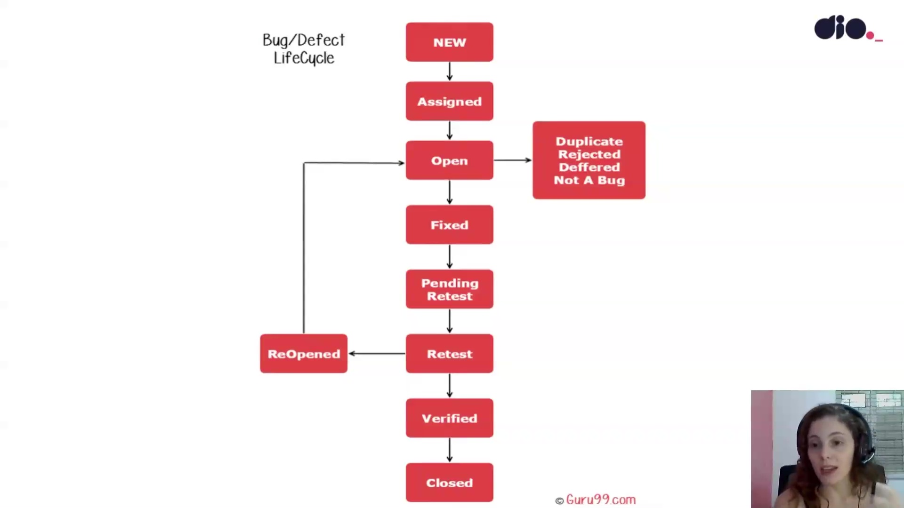

Este slide introduz o conceito de **Ciclo de Vida do Bug (ou Defeito)**. Assim como o software passa por fases de desenvolvimento e manutenção, cada bug identificado também percorre uma jornada dentro do processo de qualidade. O objetivo é rastrear o defeito desde o seu nascimento (quando é percebido pela primeira vez) até o seu encerramento (quando é corrigido, validado e aceito). O ciclo de vida do bug não é um padrão fixo, mas sim um fluxo de estados que a equipe define e adota para garantir transparência, organização e comunicação eficiente sobre o status de cada problema encontrado.

  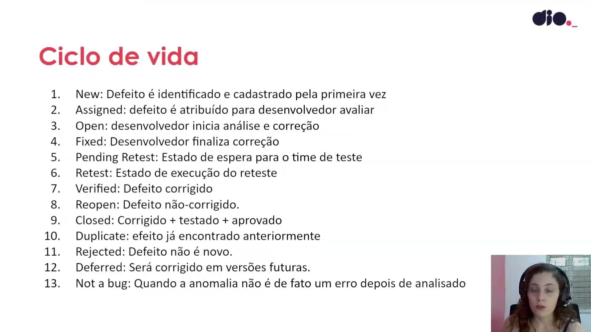

Este slide detalha os possíveis estados que um defeito pode assumir ao longo de seu ciclo de vida. O fluxo inicia com **New** (defeito cadastrado), passa para **Assigned** (atribuído a um desenvolvedor) e **Open** (em análise). Após a correção, o desenvolvedor marca como **Fixed** e o defeito entra em espera (**Pending Retest**) para ser retestado pela equipe de testes (**Retest**). Se a correção for validada, vai para **Verified** e, finalmente, **Closed**. Se o problema persistir, é **Reopen** e reinicia o ciclo. Existem também estados para situações especiais: **Duplicate** (já reportado anteriormente), **Rejected** (não é um defeito novo ou válido), **Deferred** (será corrigido em versão futura) e **Not a Bug** (a anomalia não se confirmou como erro, podendo ser um falso positivo ou problema de ambiente).

  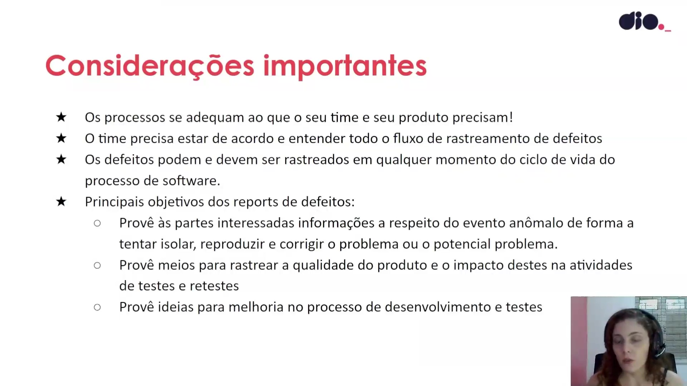

Aqui são apresentadas considerações fundamentais sobre a gestão de defeitos. Primeiro, reforça-se que o fluxo de vida do bug **deve ser adaptado à realidade do time e do produto**, não existindo uma regra única obrigatória. O mais importante é que toda a equipe (desenvolvedores, testadores, product owners) esteja alinhada e compreenda o fluxo definido para o rastreamento. Além disso, os defeitos podem e devem ser reportados **em qualquer momento do ciclo de desenvolvimento**, não apenas em fases específicas de teste. Os principais objetivos dos relatórios de defeitos incluem: fornecer informações detalhadas para reprodução e correção do problema; permitir o rastreamento da qualidade do produto e o impacto nas atividades de teste; e gerar insights para melhoria contínua dos processos de desenvolvimento e teste.

  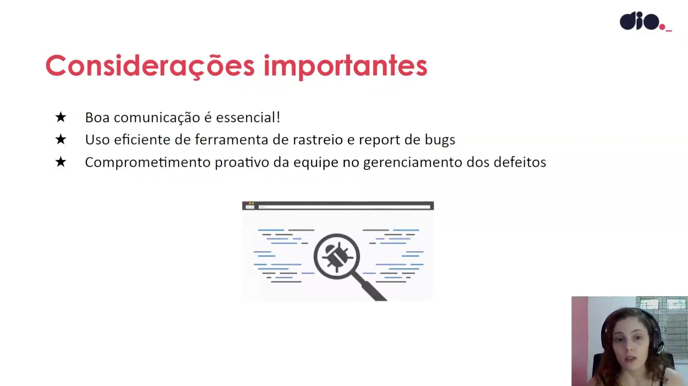

Esta sequência de considerações destaca os fatores humanos e ferramentais essenciais para uma gestão eficaz de defeitos. A **comunicação clara e constante** entre todos os envolvidos é a base para que os bugs sejam compreendidos e resolvidos adequadamente. O uso eficiente de **ferramentas de rastreamento** (como Jira, Trello, GitHub Issues, etc.) é crucial para centralizar as informações, garantir o histórico e facilitar o acompanhamento. Por fim, exige-se um **comprometimento proativo de toda a equipe**: não apenas os testadores devem se preocupar com os defeitos, mas os desenvolvedores também devem usar essas informações para melhorar a qualidade do código, criando testes unitários, refatorando e prevenindo problemas futuros.

  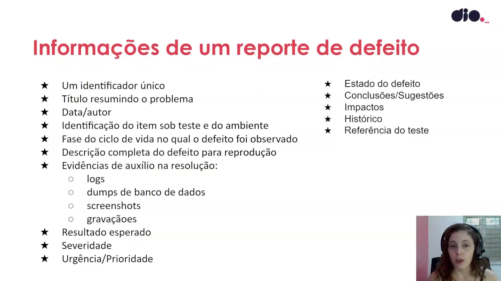

O último slide lista os campos essenciais que um bom relatório de defeito deve conter. Essas informações garantem que o problema seja compreendido, reproduzido e priorizado corretamente. Os principais itens incluem: **identificador único**, **título resumido**, **data e autor**, **descrição do ambiente e do item testado**, **fase do ciclo em que foi encontrado**, **descrição detalhada dos passos para reprodução**, **evidências** (logs, screenshots, vídeos), **resultado esperado versus resultado obtido**, **severidade** (impacto no sistema), **urgência/prioridade**, **estado atual**, **conclusões/sugestões**, **impactos em outras áreas**, **histórico de alterações** e **referência ao caso de teste que originou o defeito**. Um relato completo e rico em detalhes acelera a correção e aumenta a qualidade do produto final.      

### 🟩 Vídeo 09 - Ferramentas de suporte

<video width="60%" controls>
  <source src="000-Midia_e_Anexos/bootcamp_tqi_fullstack-modulo.08-curso.01-video_09.webm" type="video/webm">
    Seu navegador não suporta vídeo HTML5.
</video>

link do vídeo: https://web.dio.me/track/tqi-fullstack-developer/course/fundamentos-de-qualidade-de-software/learning/d6705a48-c781-434c-829e-504acbf20afe?autoplay=1

O vídeo aborda a etapa final da Aula 2 sobre ferramentas que auxiliam no ciclo de vida dos defeitos. O foco vai além do simples registro de bugs, explorando como plataformas modernas integram o rastreamento ao gerenciamento de projetos e à colaboração entre equipes.

### Anotações

  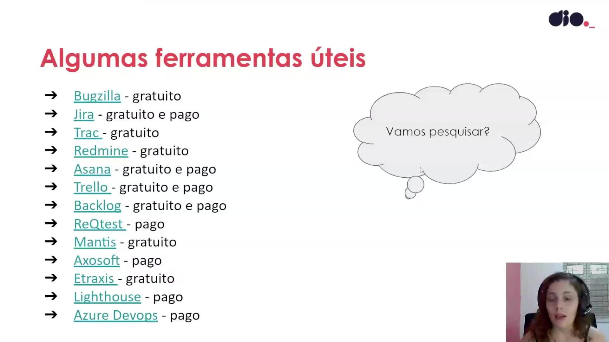

Este slide introduz o tema das ferramentas de suporte ao rastreamento de defeitos. A professora destaca que, embora algumas ferramentas sejam específicas para essa finalidade, muitas são plataformas completas de gerenciamento de projetos, como Jira e Azure DevOps. Essas plataformas permitem não apenas o rastreamento de defeitos, mas também o gerenciamento de equipes e projetos, com a possibilidade de integrar plugins e extensões para otimizar o processo. Além disso, é mencionado que ferramentas externas de execução de testes podem ter integração direta com soluções como Jira e Azure DevOps, facilitando o registro de bugs.

  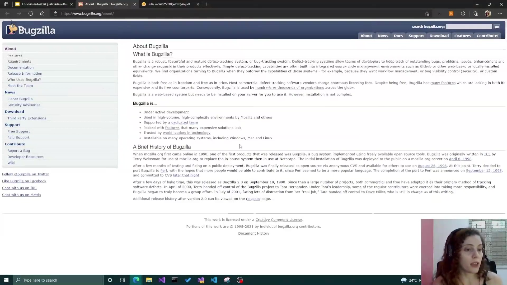

O slide mostra a página "About" do Bugzilla, uma ferramenta de rastreamento de bugs. A professora explica que o Bugzilla é uma ferramenta gratuita e de código aberto, popular entre os entusiastas de open source. Ela menciona que grandes empresas, como a Mozilla, utilizam o Bugzilla para gerenciar os bugs de seus produtos, permitindo que os próprios usuários reportem problemas encontrados.

  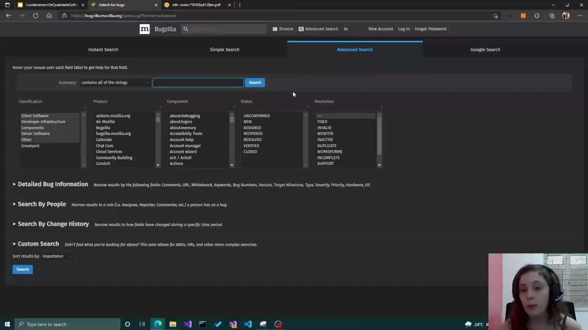

O slide exibe a funcionalidade de "Advanced Search" (Busca Avançada) do Bugzilla, especificamente no projeto da Mozilla. A professora demonstra como a ferramenta permite filtrar buscas por componente, tipo de produto e status do bug. Ela ressalta que o Bugzilla é um produto focado no rastreio e cadastro de bugs, e que para criar um novo bug, o usuário precisa estar logado na plataforma.

  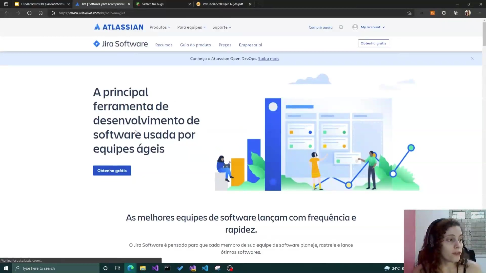

O slide apresenta a página inicial do Jira Software, da Atlassian. A professora o descreve como uma ferramenta de desenvolvimento completa, voltada para equipes ágeis, e que o rastreamento de bugs está integrado ao seu fluxo de trabalho. Ela também menciona que o Jira possui uma versão gratuita, que pode ser utilizada para testes e aprendizado.

  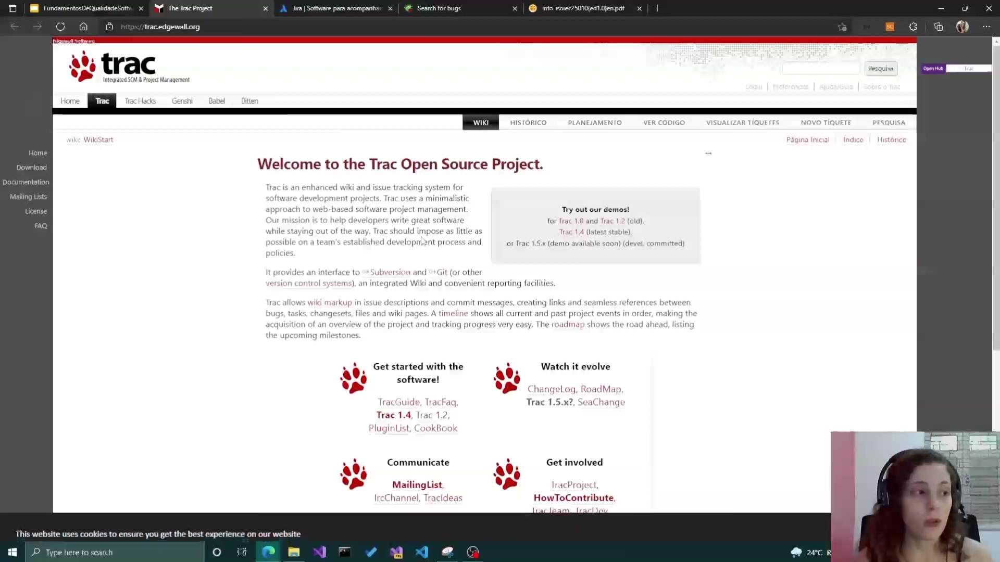

O slide mostra a página do projeto Trac, uma ferramenta de código aberto para gerenciamento de projetos e de defeitos. A professora destaca que o Trac é gratuito e também uma boa opção para quem busca uma solução open source.

  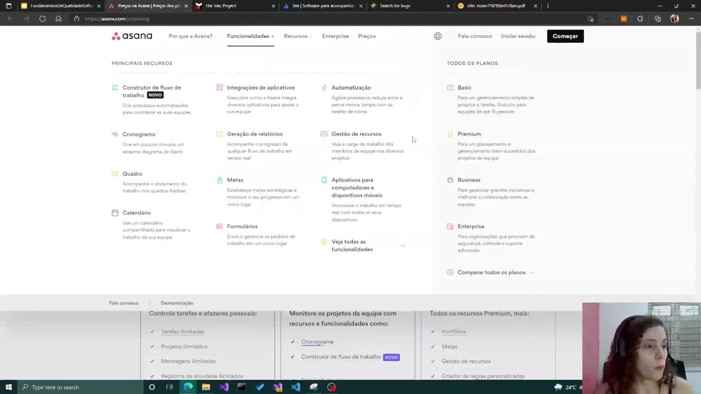

O slide exibe a página de funcionalidades e preços da Asana. A professora comenta que a Asana é uma ferramenta de gerenciamento de projetos bem conhecida no mercado, que oferece planos gratuitos e pagos para corporações, sendo uma solução bastante completa.

  

O slide mostra a página inicial do Trello. A professora explica que o Trello é uma ferramenta muito popular para gerenciamento de tarefas, baseada no sistema de quadros Kanban, que permite uma visualização clara do fluxo de trabalho. Ela acrescenta que o Trello também pode ser adaptado para o reporte de bugs.

  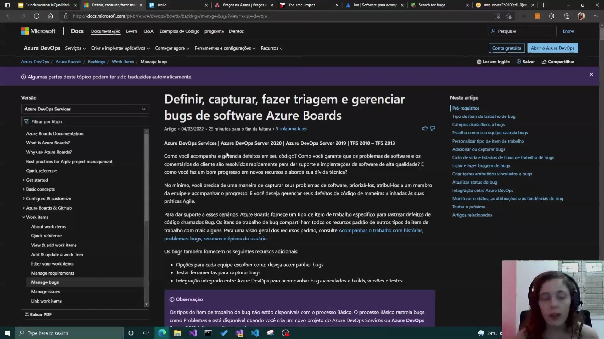

O slide apresenta a documentação do Azure DevOps, focando na gestão de bugs. A professora detalha como o reporte de bugs é completo na plataforma, permitindo customização e incluindo informações como título, ID, status, rastreamento de branch, discussões, passos para reprodução e critérios de aceite. Ela menciona que, embora exista uma versão de trial, os maiores benefícios são obtidos com a licença paga.

  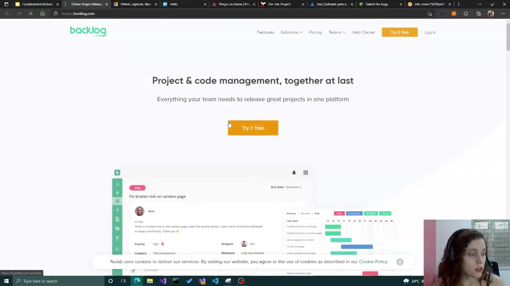

O slide mostra a página inicial da ferramenta Backlog. A professora explica que o Backlog, assim como outras ferramentas mencionadas, é uma plataforma de gerenciamento de projetos que inclui um fluxo para o gerenciamento de defeitos, e que possui versões gratuita e paga.

  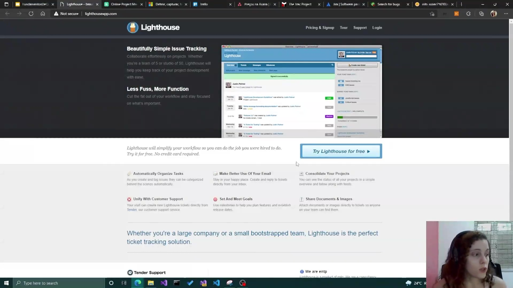

O slide exibe a página da ferramenta Lighthouse. A professora informa que o Lighthouse é uma plataforma paga, específica para o gerenciamento de defeitos. Ela menciona que a ferramenta oferece um período de trial, mas que seu modelo de negócio é diferente de outras que limitam o uso por número de usuários.

  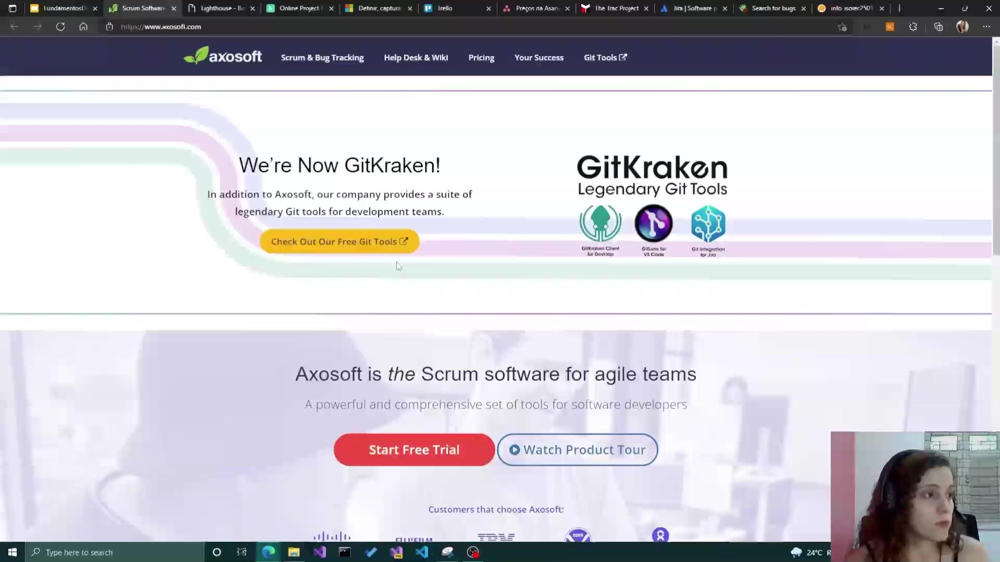

O slide mostra a página da Axosoft, que agora faz parte do GitKraken. A professora comenta que softwares mais completos, com muitas funcionalidades, raramente são gratuitos. Ela destaca que as ferramentas pagas, de ponta, geralmente se preocupam mais com a intuitividade e a estética da interface, o que pode ser notado em ferramentas como essa.

  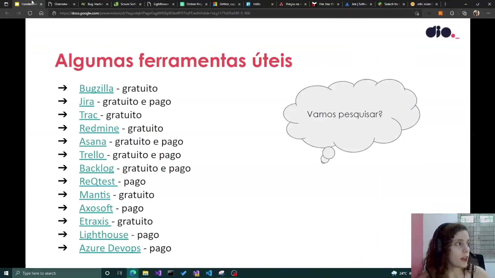

O slide final retorna à lista de "Algumas ferramentas úteis". A professora conclui a aula incentivando os alunos a pesquisarem sobre as ferramentas apresentadas e a refletirem sobre como elas podem agilizar os processos nas empresas. Ela deixa perguntas no ar para estimular a discussão e a reflexão dos alunos.      

## Parte 3 - Introdução aos testes de software

### 🟩 Vídeo 10 - Conceitos e objetivos

<video width="60%" controls>
  <source src="000-Midia_e_Anexos/bootcamp_tqi_fullstack-modulo.08-curso.01-video_10.webm" type="video/webm">
    Seu navegador não suporta vídeo HTML5.
</video>

link do vídeo: https://web.dio.me/track/tqi-fullstack-developer/course/fundamentos-de-qualidade-de-software/learning/31d13a45-dbcd-4596-82d6-51cabf7f2c78?autoplay=1

Este resumo aborda os conceitos essenciais do teste de software, seus objetivos estratégicos, a distinção entre testar e depurar, e os princípios fundamentais que regem a área. O foco é fornecer uma visão estruturada para quem deseja entender a formalidade e as habilidades técnicas por trás da garantia de qualidade.

### Anotações 

  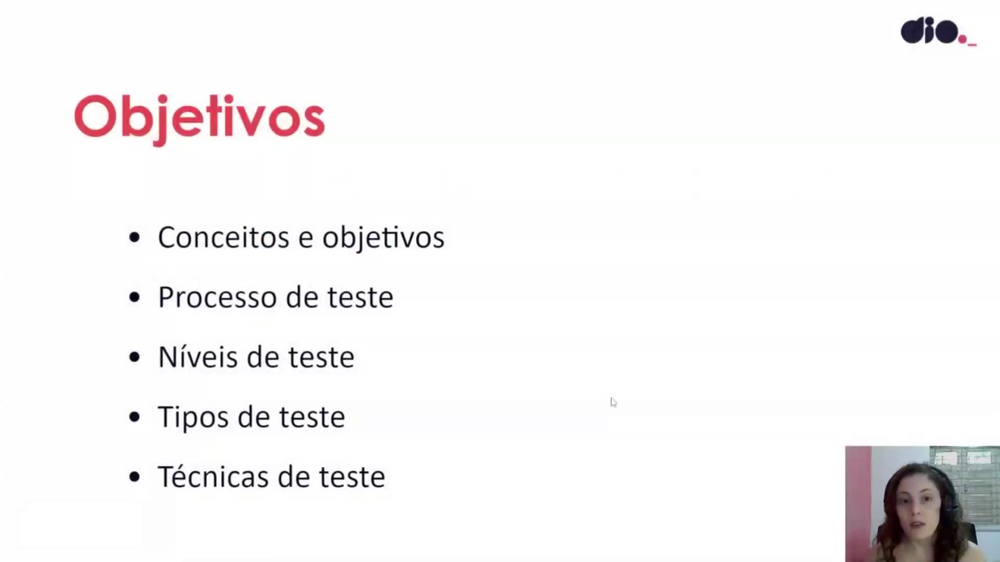

Este slide apresenta a estrutura da aula, listando os principais tópicos que serão abordados sobre teste de software. Começamos com os conceitos e objetivos, passando pelo processo, níveis, tipos e técnicas de teste. É um roteiro que mostra a abrangência do tema, desde a fundamentação até a prática, preparando o terreno para os detalhes que veremos a seguir.

  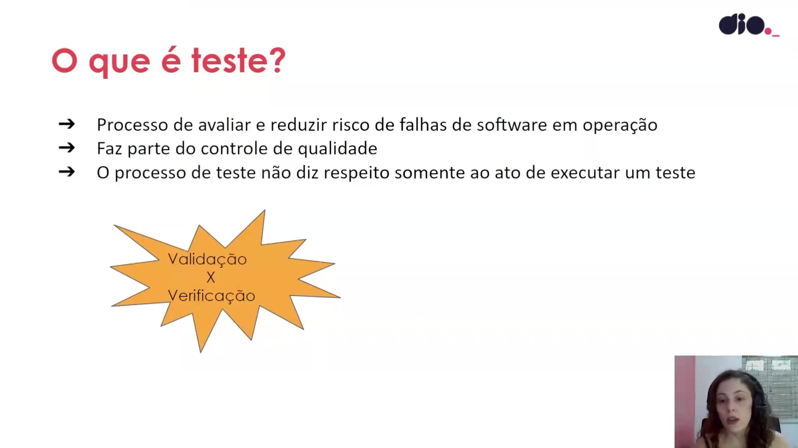

A imagem descreve a definição conceitual de teste de software. Ele é um processo que visa avaliar e reduzir o risco de falhas quando o software está em operação, fazendo parte do controle de qualidade. Além disso, destaca que o teste não se resume apenas à execução: envolve planejamento, preparação, análise de resultados e outras atividades que garantem a efetividade da avaliação.

  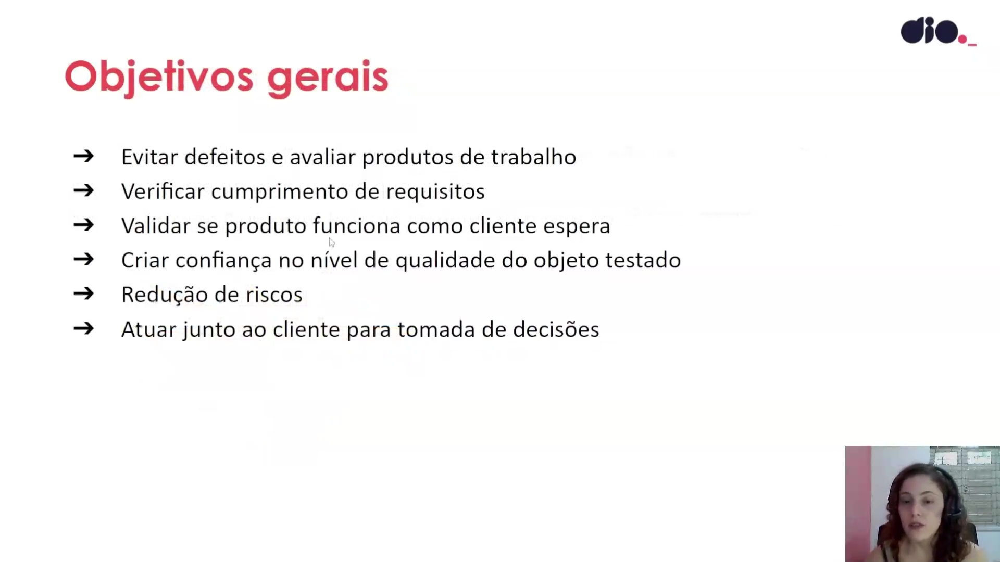

Aqui são apresentados os objetivos gerais do teste de software. Entre eles estão: evitar defeitos e avaliar produtos de trabalho; verificar se os requisitos foram cumpridos; validar se o produto atende às expectativas do cliente; gerar confiança na qualidade; reduzir riscos; e apoiar o cliente na tomada de decisões. Esses objetivos mostram que o teste vai além da 

  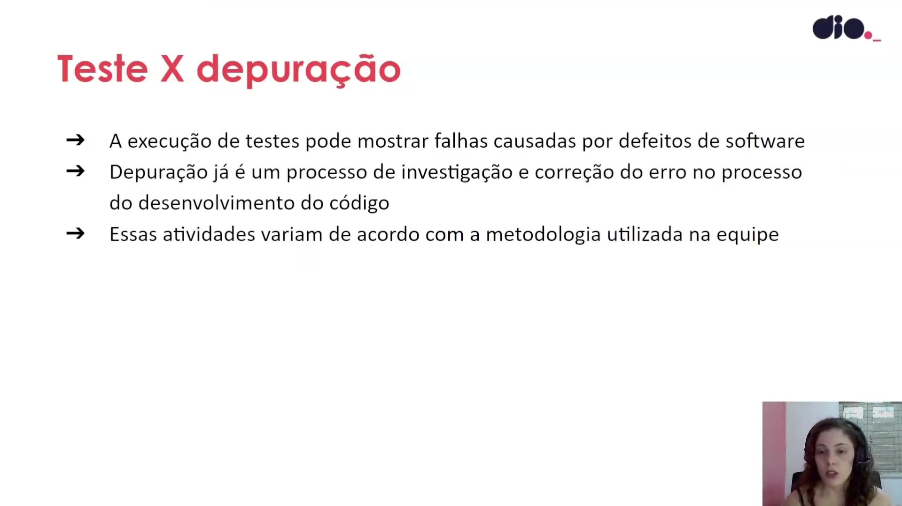

Este slide diferencia a execução de testes da atividade de depuração. Enquanto o teste evidencia falhas causadas por defeitos no software, a depuração é o processo de investigação e correção desses defeitos no código-fonte. A forma como essas atividades são realizadas pode variar conforme a metodologia adotada pela equipe (por exemplo, em métodos ágeis, pode haver maior colaboração entre testadores e desenvolvedores).

  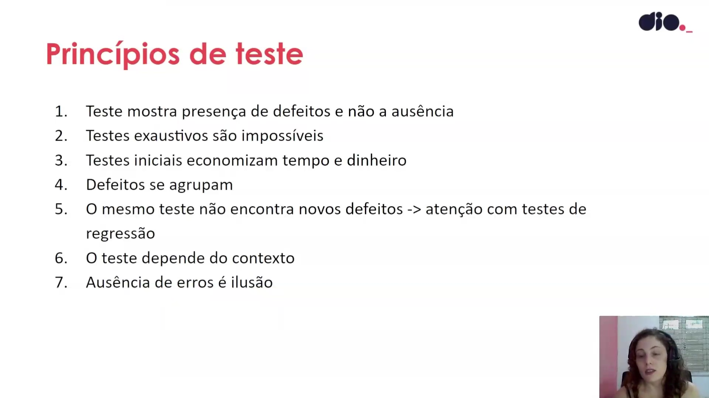

São apresentados os sete princípios fundamentais do teste de software:
1. O teste mostra a presença de defeitos, não sua ausência.
2. Testes exaustivos são impossíveis.
3. Testar no início economiza tempo e dinheiro.
4. Defeitos tendem a se agrupar.
5. O mesmo teste não encontra novos defeitos (cuidado com regressão).
6. O teste depende do contexto.
7. A ausência de erros é uma ilusão.
Esses princípios orientam a atividade de teste, lembrando que devemos sempre considerar limitações, riscos e a necessidade de adaptar as estratégias a cada situação.      

### 🟩 Vídeo 11 - Processo de teste

<video width="60%" controls>
  <source src="000-Midia_e_Anexos/bootcamp_tqi_fullstack-modulo.08-curso.01-video_11.webm" type="video/webm">
    Seu navegador não suporta vídeo HTML5.
</video>

link do vídeo: https://web.dio.me/track/tqi-fullstack-developer/course/fundamentos-de-qualidade-de-software/learning/4bb00894-8f15-4661-927b-2068566f7dcb?autoplay=1

Este resumo explora a complexidade do processo de teste de software, enfatizando que testar vai muito além da simples execução. O conteúdo detalha os fatores influenciadores, as estratégias de abordagem e as sete etapas fundamentais que compõem um ciclo de teste eficiente.

### Anotações

  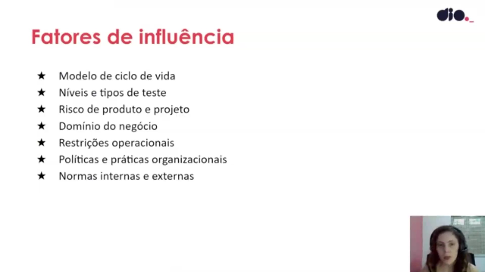

O processo de teste não é uma atividade isolada; ele é fortemente influenciado por diversos fatores contextuais. O slide apresenta os principais elementos que moldam a forma como planejamos e executamos os testes. O **modelo de ciclo de vida** do projeto (se ágil, cascata, etc.) determina a integração das atividades de teste. Os **níveis e tipos de teste** definem o escopo – por exemplo, testes unitários, de integração ou de sistema. O **risco do produto e do projeto** direciona esforços para áreas críticas. O **domínio do negócio** exige conhecimento específico para criar cenários relevantes. **Restrições operacionais** (como acesso a bancos de dados ou ambientes limitados) impõem adaptações nas técnicas. Por fim, **políticas organizacionais** e **normas internas/externas** (padrões de qualidade, regulamentações) estabelecem diretrizes obrigatórias. Todos esses fatores devem ser considerados no início do planejamento para que a estratégia de teste seja viável e eficaz.

  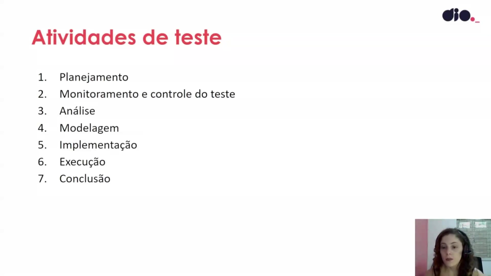

O processo de teste estruturado é composto por sete atividades principais, apresentadas em sequência lógica. O **Planejamento** define objetivos, recursos e cronograma. O **Monitoramento e controle** acompanha a execução comparando com o plano e toma ações corretivas. A **Análise** examina a base de teste (requisitos, documentos) para identificar o que testar. A **Modelagem** transforma condições de teste em casos de teste concretos. A **Implementação** prepara os dados, scripts e procedimentos necessários. A **Execução** roda os testes e registra resultados. Por fim, a **Conclusão** consolida os achados, gera relatórios e arquiva a documentação. Essas atividades não são necessariamente lineares em métodos ágeis, mas representam o fluxo completo de qualquer iniciativa de teste bem-sucedida.

  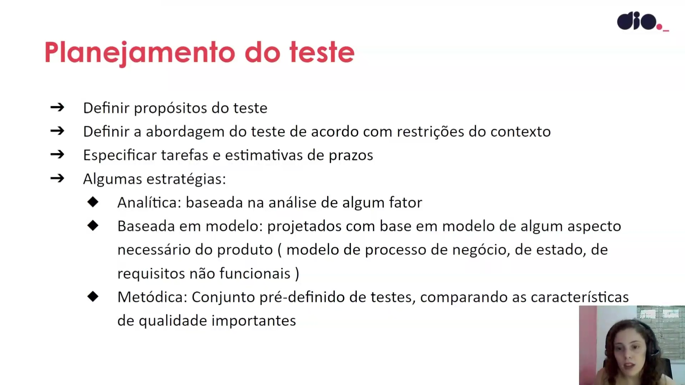

Durante o planejamento, é essencial definir os **propósitos do teste** (o que se quer alcançar) e a **abordagem** mais adequada, considerando restrições do contexto. Também são especificadas as tarefas e as estimativas de prazo. O slide introduz três estratégias comuns:  
- **Analítica**: baseia-se na análise de fatores como riscos ou requisitos para direcionar os testes.  
- **Baseada em modelo**: utiliza modelos do produto (ex.: diagramas de estado, processos de negócio) para derivar casos de teste.  
- **Metódica**: aplica um conjunto pré-definido de testes, frequentemente alinhado a características de qualidade importantes (como funcionalidade, usabilidade).  
Cada estratégia tem vantagens específicas e a escolha depende do contexto do projeto.

  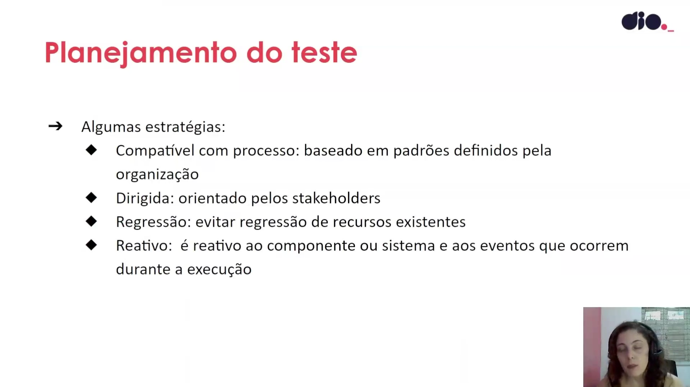

Complementando as estratégias anteriores, o slide apresenta outras abordagens:  
- **Compatível com processo**: segue padrões organizacionais já estabelecidos, garantindo conformidade com políticas internas.  
- **Dirigida**: orientada pelos stakeholders, que definem prioridades e áreas de foco.  
- **Regressão**: visa evitar a introdução de defeitos em funcionalidades existentes quando há mudanças no sistema.  
- **Reativo**: os testes são definidos dinamicamente, reagindo ao comportamento do sistema e a eventos durante a execução (como em exploração).  
Essas estratégias podem ser combinadas para atender necessidades específicas do projeto.

  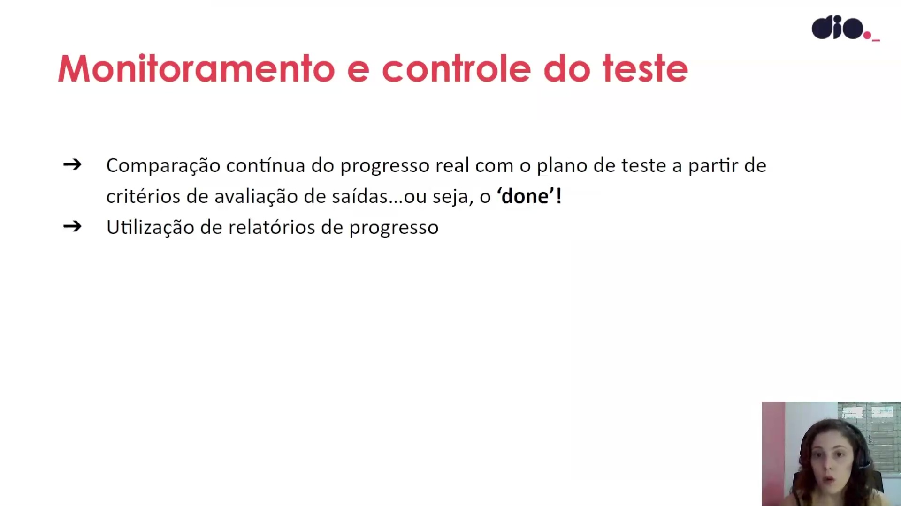

A atividade de **monitoramento e controle** consiste em comparar continuamente o progresso real com o plano de teste. Para isso, utilizam-se **critérios de avaliação de saídas** – ou seja, métricas que indicam quando uma atividade está realmente concluída (o famoso “done”). Relatórios de progresso são ferramentas fundamentais nessa etapa, pois documentam desvios, avanços e problemas, permitindo decisões gerenciais informadas. Sem esse acompanhamento, o projeto de teste pode perder o rumo e comprometer a qualidade final.

  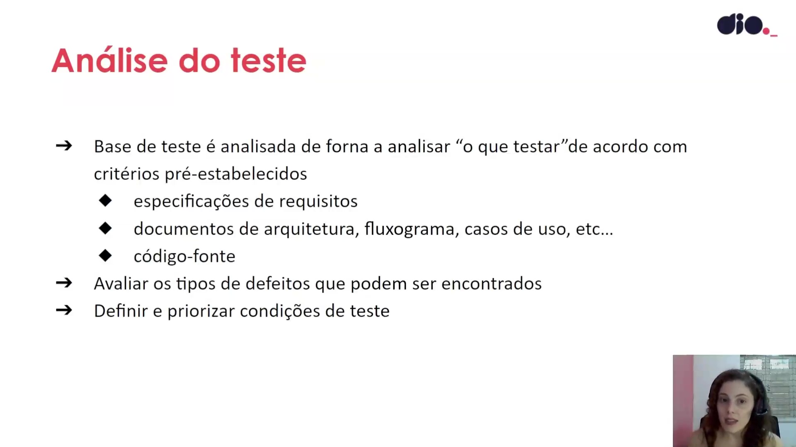

Na fase de **análise**, a base de teste (documentos como especificações de requisitos, diagramas de arquitetura, casos de uso e até código-fonte) é examinada para determinar **o que testar**. O objetivo é identificar condições de teste relevantes, priorizando-as conforme critérios pré-estabelecidos (por exemplo, risco ou complexidade). Além disso, avalia-se **quais tipos de defeitos** podem ser encontrados em cada parte do sistema, direcionando a criação de casos de teste mais eficazes. Essa etapa é crucial para garantir cobertura adequada e evitar retrabalho.

  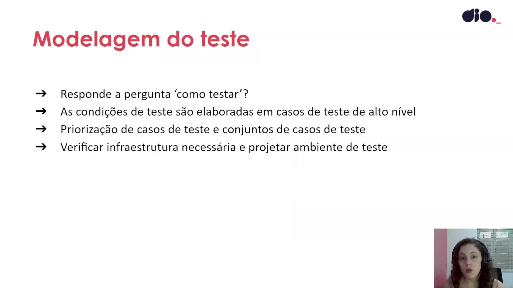

A **modelagem** responde à pergunta “como testar?”. As condições de teste identificadas na análise são agora elaboradas em **casos de teste de alto nível**, que descrevem o que será verificado sem detalhar passos de execução. É também o momento de priorizar esses casos e agrupá-los em conjuntos lógicos. Outro aspecto fundamental é verificar a infraestrutura necessária e **projetar o ambiente de teste**, garantindo que ele esteja disponível e configurado corretamente para a futura execução.

  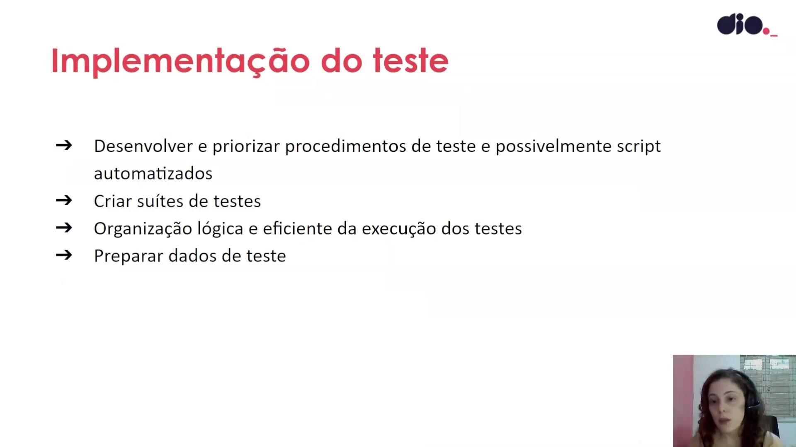

Na **implementação**, os casos de teste de alto nível são transformados em **procedimentos de teste** detalhados, com passos concretos e, quando aplicável, **scripts automatizados**. São criadas **suítes de testes** – agrupamentos organizados que facilitam a execução eficiente. Também se preparam os **dados de teste** necessários para cada cenário. Essa fase materializa todo o planejamento anterior em artefatos prontos para serem executados, garantindo que a execução ocorra sem imprevistos.

  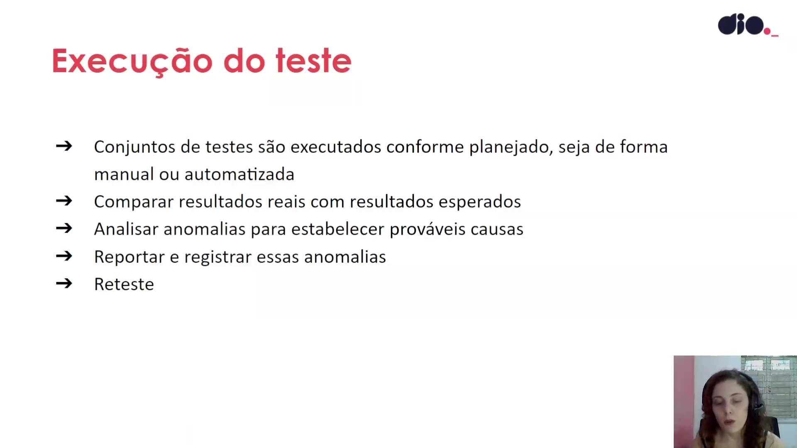

A **execução** é a fase em que os conjuntos de testes são rodados, manualmente ou por automação, conforme planejado. Durante a execução, os resultados reais são comparados com os esperados para identificar **anomalias**. Cada anomalia é analisada para estabelecer prováveis causas (defeitos no código, problemas nos dados, etc.). Em seguida, essas ocorrências são **reportadas e registradas** em ferramentas de gestão. Por fim, quando o defeito é corrigido, realiza-se o **reteste** para verificar se a correção foi eficaz e não introduziu novos problemas.

  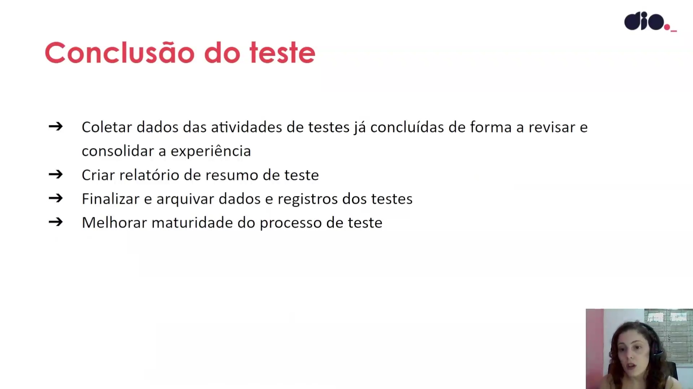

A **conclusão** do processo de teste envolve a coleta de dados de todas as atividades realizadas, permitindo revisar e consolidar a experiência adquirida. É gerado um **relatório de resumo de teste** que sintetiza os resultados, métricas e lições aprendidas. Os dados e registros dos testes são então finalizados e arquivados para referência futura. Por fim, essa reflexão contribui para **melhorar a maturidade do processo de teste** da organização, alimentando um ciclo contínuo de aperfeiçoamento.      

### 🟩 Vídeo 12 - Níveis de teste

<video width="60%" controls>
  <source src="000-Midia_e_Anexos/bootcamp_tqi_fullstack-modulo.08-curso.01-video_12.webm" type="video/webm">
    Seu navegador não suporta vídeo HTML5.
</video>

link do vídeo: https://web.dio.me/track/tqi-fullstack-developer/course/fundamentos-de-qualidade-de-software/learning/fcefda6d-3860-4f9b-85e6-cf7335b98810?autoplay=1

O vídeo aborda os diferentes níveis de teste no desenvolvimento de software, explicando o propósito e a importância de cada um, e finaliza com a apresentação da pirâmide de testes ideal versus a pirâmide invertida.

### Anotações

  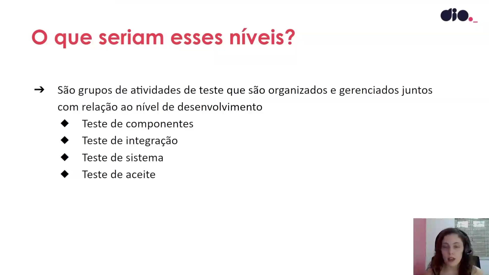

A imagem apresenta o conceito de níveis de teste, definindo-os como grupos de atividades de teste organizados e gerenciados de acordo com o nível de desenvolvimento. São listados os quatro níveis principais: Teste de Componentes, Teste de Integração, Teste de Sistema e Teste de Aceite. Essa visão introdutória estabelece a base para o detalhamento de cada nível ao longo da aula.

  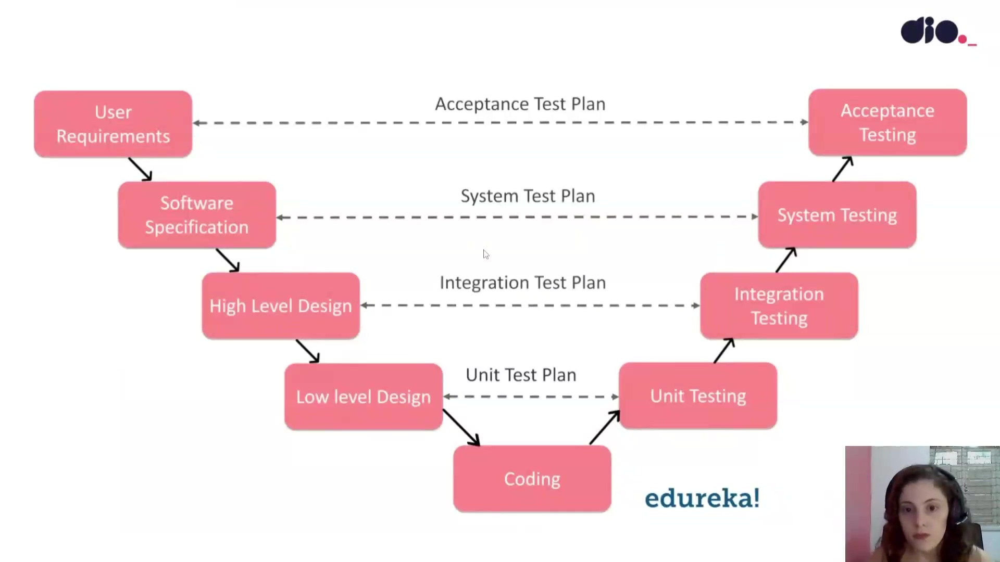

A imagem ilustra a correlação entre os níveis de desenvolvimento e os respectivos níveis de teste. Da esquerda para a direita, temos os artefatos de requisitos e design (User Requirements, Software Specification, High Level Design, Low Level Design) e, alinhados a eles, os planos e tipos de teste: Unit Test Plan e Unit Testing para baixo nível, Integration Test Plan para design de alto nível, System Test Plan e System Testing para especificação de software, e Acceptance Testing para requisitos de usuário. Essa correspondência mostra como cada fase de desenvolvimento possui uma estratégia de teste específica.

  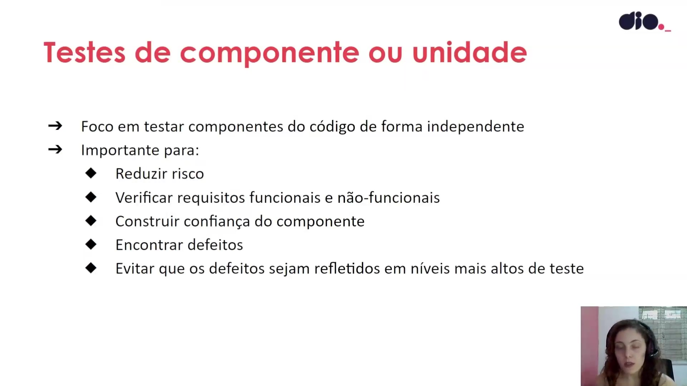

A imagem detalha o teste de componente (ou teste de unidade), enfatizando seu foco em testar partes independentes do código. São listados os principais objetivos: reduzir riscos, verificar requisitos funcionais e não funcionais, construir confiança no componente, encontrar defeitos precocemente e evitar que esses defeitos se propaguem para níveis mais avançados de teste. Esse nível é essencial para garantir a qualidade da base de código desde o início.

  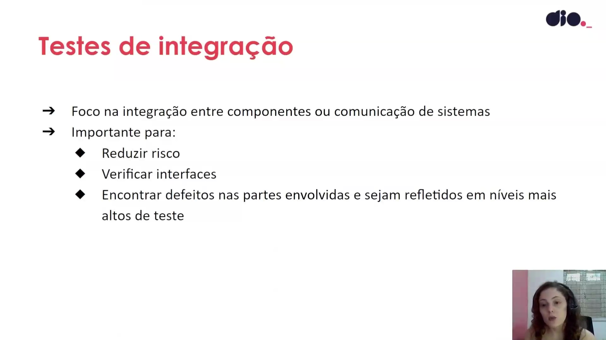

A imagem apresenta o teste de integração, que visa verificar a comunicação entre componentes ou sistemas. Seus benefícios incluem a redução de riscos, a validação de interfaces e a detecção de defeitos nas interações, impedindo que problemas de integração cheguem a estágios posteriores. Esse nível é crucial quando há dependências entre módulos ou sistemas externos.

  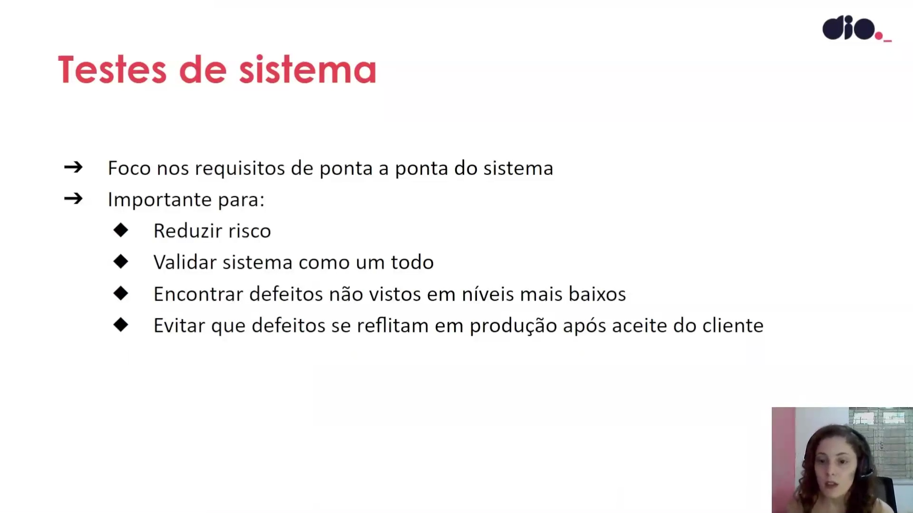

A imagem descreve o teste de sistema, que tem como foco a validação dos requisitos de ponta a ponta do sistema. Diferente dos níveis anteriores, aqui se testa o sistema como um todo, incluindo funcionalidades e fluxos completos. Os objetivos são reduzir riscos, validar o comportamento global, descobrir defeitos não identificados em testes menores e prevenir que falhas cheguem ao ambiente de produção.

  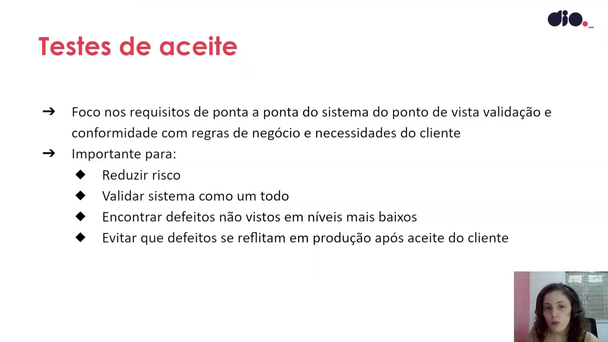

A imagem aborda o teste de aceite, que valida o sistema sob a ótica do usuário e das regras de negócio. Embora também foque em requisitos de ponta a ponta, seu diferencial é a perspectiva de conformidade com as necessidades do cliente e critérios de aceitação. Os benefícios incluem redução de riscos, validação completa, descoberta de defeitos residuais e garantia de que o sistema está pronto para produção antes da entrega final.

  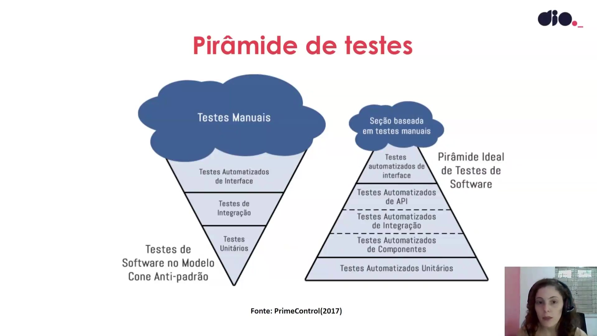

A imagem apresenta duas representações da pirâmide de testes. À esquerda, uma pirâmide invertida, considerada antipadrão, onde há grande quantidade de testes manuais no topo e poucos testes automatizados na base. À direita, a pirâmide ideal, com ampla base de testes de unidade, camada intermediária de testes de integração e API, e no topo uma pequena quantidade de testes de interface e manuais, destacando a importância da automação e da cobertura de código desde os níveis mais baixos.      

### 🟩 Vídeo 13 - Tipos de teste

<video width="60%" controls>
  <source src="000-Midia_e_Anexos/bootcamp_tqi_fullstack-modulo.08-curso.01-video_13.webm" type="video/webm">
    Seu navegador não suporta vídeo HTML5.
</video>

link do vídeo: https://web.dio.me/track/tqi-fullstack-developer/course/fundamentos-de-qualidade-de-software/learning/1b1b4b70-8d16-4101-bcbc-be4826a1692a?autoplay=1

O vídeo explora as diferentes categorias de testes de software, focando em objetivos específicos em vez de apenas cronogramas de desenvolvimento. Diferente dos "níveis de teste", os "tipos de teste" verificam características particulares do sistema, desde a funcionalidade até a performance e estrutura interna.

### Anotações

  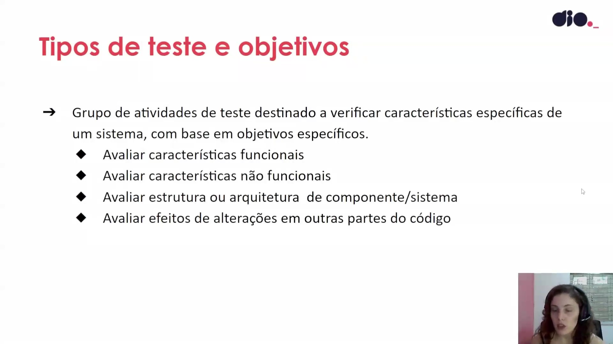

A imagem apresenta a definição de **tipos de teste**. Diferentemente dos níveis de teste, que estão ligados às etapas do desenvolvimento (componente, integração, sistema), os tipos de teste são organizados pelo **objetivo da verificação**. Eles formam grupos de atividades que podem ser aplicados em qualquer nível para avaliar aspectos específicos do software, como:

- **Características funcionais** – o que o sistema faz.
- **Características não funcionais** – como o sistema se comporta (desempenho, usabilidade, segurança).
- **Estrutura ou arquitetura** – a organização interna do código e dos componentes.
- **Efeitos de alterações** – impactos causados por modificações no código (regressão).

Essa classificação ajuda a planejar os testes de forma mais direcionada, garantindo que cada aspecto relevante do sistema seja verificado adequadamente.

  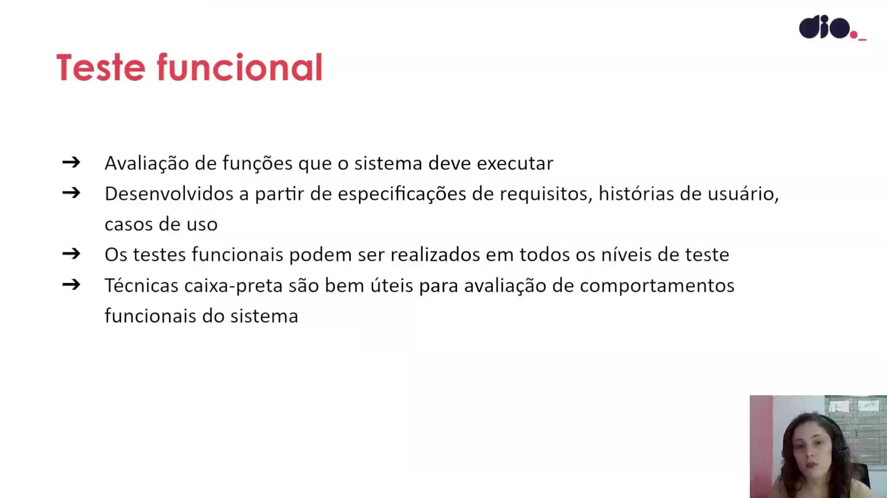

Este slide trata dos **testes funcionais**. O foco aqui é responder à pergunta: **“o que o sistema deve executar?”** . Ou seja, validamos se as funções implementadas estão de acordo com o esperado.

As principais fontes para criar esses testes são artefatos de especificação, como:
- Requisitos funcionais.
- Histórias de usuário.
- Casos de uso.

Os testes funcionais podem ser realizados em **todos os níveis de teste** (componente, integração, sistema e aceitação). Eles costumam empregar **técnicas de caixa-preta**, pois não dependem do conhecimento da estrutura interna do código, apenas das entradas e saídas esperadas. Um exemplo comum é o teste de interface, que simula a interação do usuário com o sistema.

  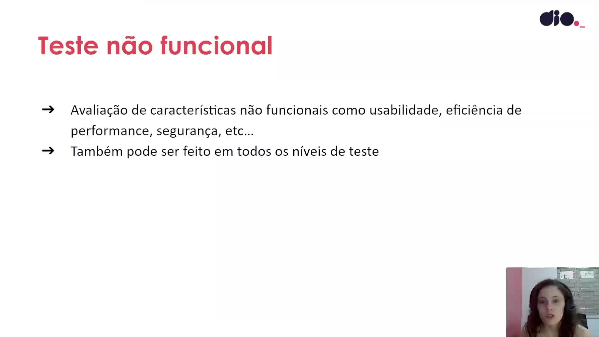

A imagem aborda os **testes não funcionais**. Diferentemente dos testes funcionais, que verificam **o que** o sistema faz, os testes não funcionais avaliam **como** o sistema se comporta sob determinadas condições.

Eles contemplam características como:
- **Usabilidade** – facilidade de uso.
- **Eficiência de performance** – tempo de resposta, consumo de recursos.
- **Segurança** – resistência a ataques e proteção de dados.
- Confiabilidade, portabilidade, manutenibilidade, entre outros.

Assim como os funcionais, os testes não funcionais também podem ser aplicados em **qualquer nível de teste**, desde componentes isolados até o sistema completo. São essenciais para garantir a qualidade da experiência do usuário e a robustez do software em cenários reais.

  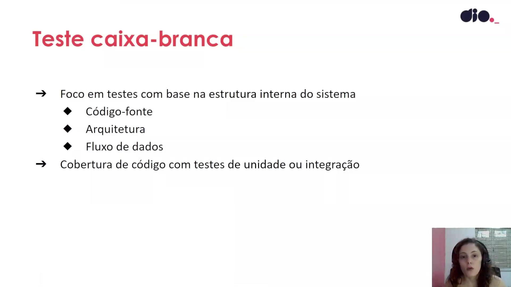

Este slide apresenta os **testes estruturais**, também conhecidos como **testes de caixa-branca**. Aqui o foco está na **estrutura interna** do sistema, e não no comportamento externo.

Os elementos analisados incluem:
- **Código-fonte** – verificação de lógica, fluxos e decisões.
- **Arquitetura** – relacionamento entre componentes, camadas e módulos.
- **Fluxo de dados** – como os dados são manipulados e transmitidos entre as partes do sistema.

Um conceito importante nesse tipo de teste é a **cobertura de código**, que mede quais partes do código foram executadas durante os testes. Os testes estruturais são comumente realizados nos níveis de **unidade e integração**, onde é possível acessar e instrumentar o código diretamente.

  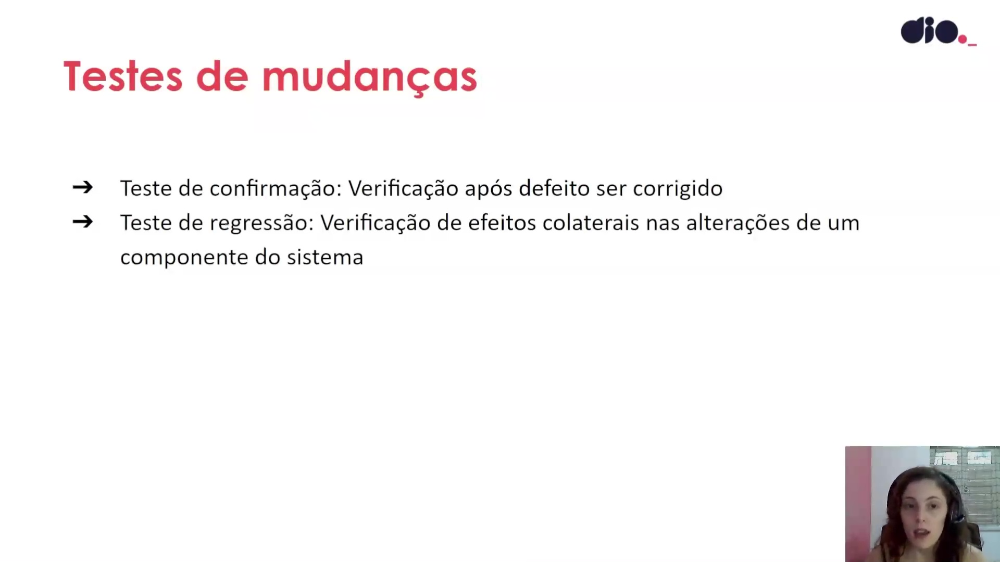

A última imagem trata de dois tipos de teste relacionados a **mudanças no sistema**:

- **Teste de confirmação** (ou re-teste): é executado após a correção de um defeito. O objetivo é verificar se o problema realmente foi resolvido e se a funcionalidade agora se comporta como esperado.

- **Teste de regressão**: é realizado para garantir que as alterações feitas no sistema (correções, novas funcionalidades, ajustes) não introduzam **efeitos colaterais** em partes que já estavam funcionando corretamente. Ele valida se o comportamento existente permanece estável após as modificações.

Ambos são fundamentais para manter a integridade do software ao longo de seu ciclo de evolução, evitando que correções gerem novos problemas.      

### 🟩 Vídeo 14 - Técnicas de teste

<video width="60%" controls>
  <source src="000-Midia_e_Anexos/bootcamp_tqi_fullstack-modulo.08-curso.01-video_14.webm" type="video/webm">
    Seu navegador não suporta vídeo HTML5.
</video>

link do vídeo: https://web.dio.me/track/tqi-fullstack-developer/course/fundamentos-de-qualidade-de-software/learning/0de6c486-b381-4b1c-b1a9-a3384d7de836?autoplay=1

### 🟩 Vídeo 15 - Conclusão

<video width="60%" controls>
  <source src="000-Midia_e_Anexos/bootcamp_tqi_fullstack-modulo.08-curso.01-video_15.webm" type="video/webm">
    Seu navegador não suporta vídeo HTML5.
</video>

link do vídeo:

##  Materiais de Apoio

# Certificado: 

- Link na plataforma: 
- Certificado em pdf: