## Instrutor

- Carolina Santana Louzada
- Perfil no Github: https://github.com/CarolinaSL

## Parte 1 - Processos de software

### 🟩 Vídeo 01 - Apresentação do curso

<video width="60%" controls>
  <source src="000-Midia_e_Anexos/bootcamp_tqi_fullstack-modulo.08-curso.02-video_01.webm" type="video/webm">
    Seu navegador não suporta vídeo HTML5.
</video>

link do vídeo: https://web.dio.me/track/tqi-fullstack-developer/course/metodologias-ageis-e-ciclo-de-desenvolvimento-de-software/learning/f099b8f1-d30f-4ce7-a1d2-4f5744acec80?autoplay=1

Este curso introdutório estabelece as bases para entender como o software é concebido, desenvolvido e testado no cenário moderno. A instrutora, Carolina Santana Lousada, traz sua experiência prática como Analista de QA na Venturus para conectar teoria e mercado.

### Anotações

  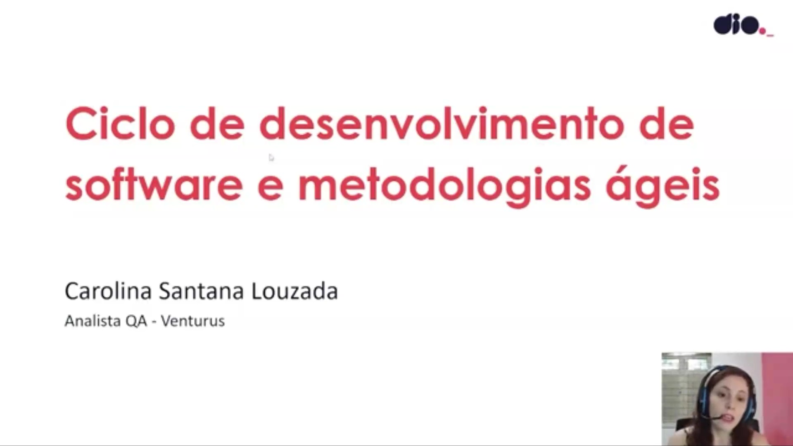

Neste slide de abertura, somos apresentados ao tema central do curso: **Ciclo de desenvolvimento de software e metodologias ágeis**. A instrutora, **Carolina Santana Louzada**, analista QA na Venturus, se apresenta e estabelece o contexto para os conteúdos que serão explorados. É a porta de entrada para compreendermos como os processos de software evoluíram até o modelo ágil e qual o papel da qualidade nesse cenário.

  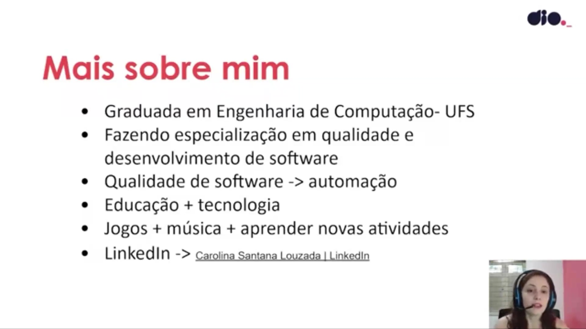

Aqui Carolina compartilha um pouco de sua trajetória profissional e interesses pessoais. Formada em Engenharia de Computação pela UFS, ela está em especialização na área de qualidade e desenvolvimento de software, com foco em automação de testes (utilizando ferramentas como Cypress, Selenium e atuando em stacks como .NET e Java). Além da tecnologia, destaca seu gosto por jogos, música (violão, flauta, piano) e aprendizado contínuo, reforçando a importância de estar sempre em evolução. Por fim, convida os alunos a se conectarem pelo LinkedIn para networking e troca de experiências.

  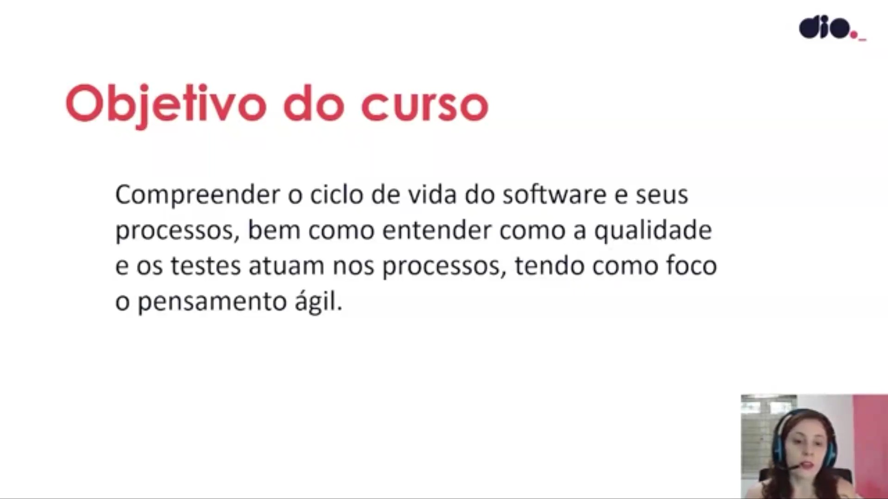

O objetivo do curso é apresentar o ciclo de vida do software e seus processos, mostrando como a qualidade e os testes se inserem nesse contexto, sempre sob a ótica do pensamento ágil. A proposta é que o aluno compreenda a integração entre desenvolvimento, testes e metodologias ágeis, preparando-se para atuar em times que adotam essas práticas.

  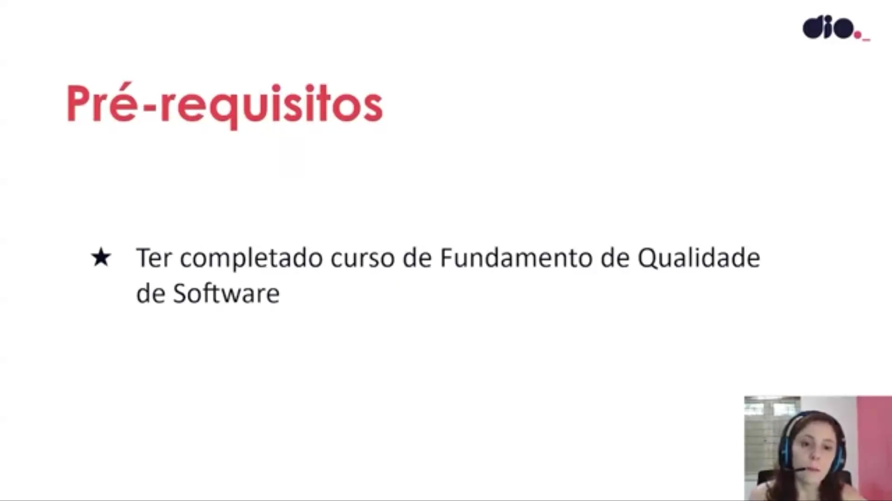

Para um melhor aproveitamento, recomenda-se que o aluno já tenha concluído o curso **"Fundamentos de Qualidade de Software"**, também ministrado por Carolina. Esse pré‑requisito garante que conceitos básicos sobre qualidade já foram assimilados, permitindo que este curso se aprofunde diretamente nos processos de desenvolvimento e nas metodologias ágeis sem necessidade de revisões introdutórias.

  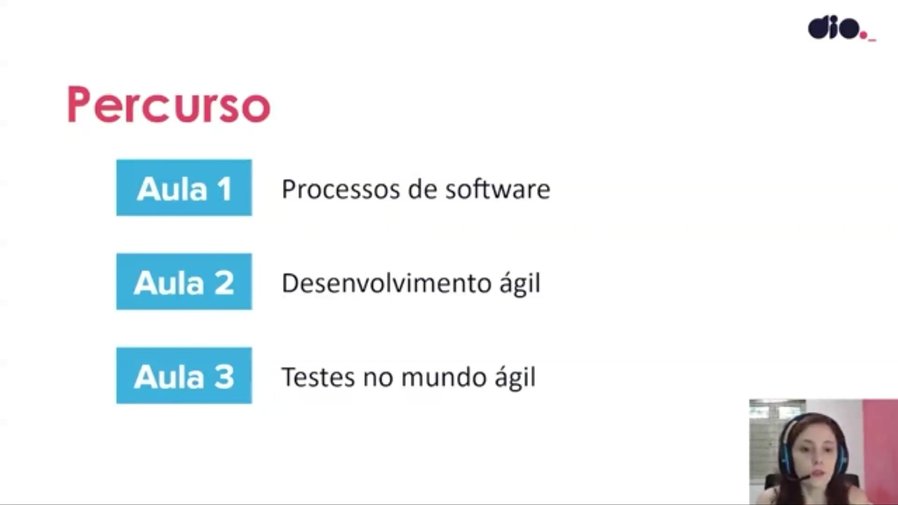

O curso está estruturado em três aulas, que seguem uma progressão lógica:

- **Aula 1 – Processos de software:** abordagem genérica sobre os estágios do desenvolvimento e os modelos tradicionais (clássicos).  
- **Aula 2 – Desenvolvimento ágil:** introdução à cultura ágil, seus valores, princípios e os principais modelos (Scrum, XP, etc.).  
- **Aula 3 – Testes no mundo ágil:** estratégias, métodos e práticas de testes adaptados ao contexto ágil, mostrando como a qualidade se integra ao fluxo contínuo de entregas.

Essa divisão permite ao aluno evoluir do entendimento dos processos tradicionais até a aplicação prática da qualidade em times ágeis.      

### 🟩 Vídeo 02 - Definindo processo, fluxo e padrões de software

<video width="60%" controls>
  <source src="000-Midia_e_Anexos/bootcamp_tqi_fullstack-modulo.08-curso.02-video_02.webm" type="video/webm">
    Seu navegador não suporta vídeo HTML5.
</video>

link do vídeo: https://web.dio.me/track/tqi-fullstack-developer/course/metodologias-ageis-e-ciclo-de-desenvolvimento-de-software/learning/27265ac5-f8d0-4c2a-8b0a-1dfa7f305e16?autoplay=1

Este resumo aborda os conceitos iniciais sobre processos de software, destacando que o desenvolvimento vai além da técnica, sendo um esforço social e adaptável que exige organização e responsabilidade compartilhada.

### Anotações

  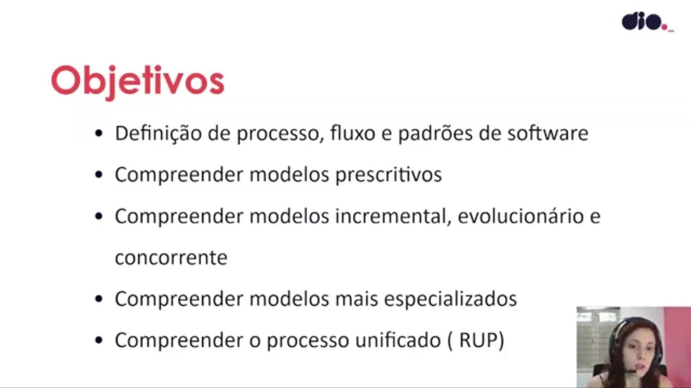

Este slide apresenta os objetivos da aula, que incluem a definição de processo, fluxo e padrões de software, a compreensão de modelos prescritivos, incremental, evolucionário e concorrente, modelos especializados e o processo unificado (RUP). Esses tópicos serão abordados ao longo da aula para fornecer uma visão geral dos processos de software.

  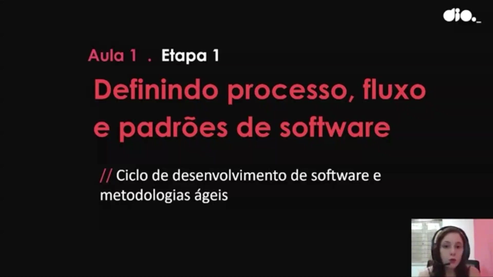

A primeira etapa da aula foca na definição de processo, fluxo e padrões de software, contextualizando o ciclo de desenvolvimento e as metodologias ágeis. O objetivo é estabelecer a base conceitual para entender como os processos organizam o trabalho de desenvolvimento.

  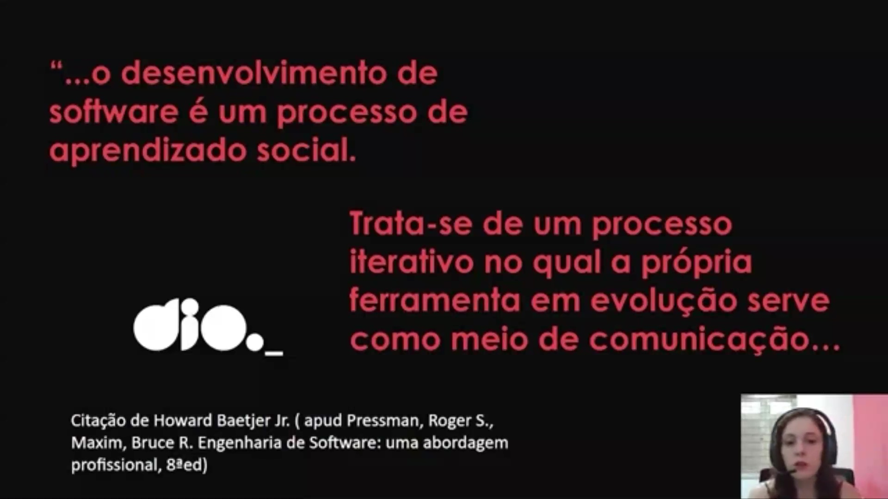

A citação de Howard Baetjer Jr. destaca que o desenvolvimento de software é um processo de aprendizado social, iterativo, onde a ferramenta em evolução serve como meio de comunicação. Isso enfatiza a natureza dinâmica e colaborativa do desenvolvimento, onde o processo se adapta e evolui com a interação entre as pessoas.

  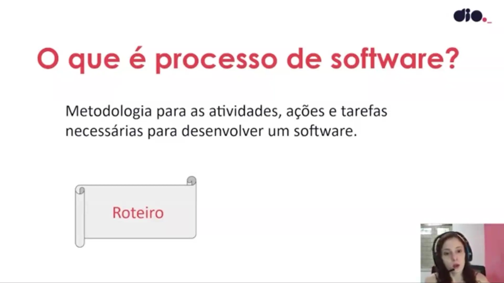

O slide define processo de software como uma metodologia que organiza as atividades, ações e tarefas necessárias para desenvolver um software. É um conjunto estruturado de práticas que guiam a equipe desde a concepção até a entrega do produto.

  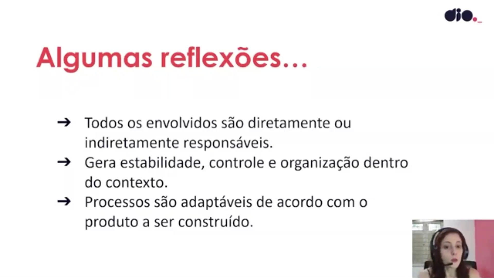

Este slide apresenta características importantes de um processo de software: envolve todos os participantes, direta ou indiretamente; proporciona estabilidade, controle e organização; e é adaptável conforme o produto a ser construído. Ou seja, 

  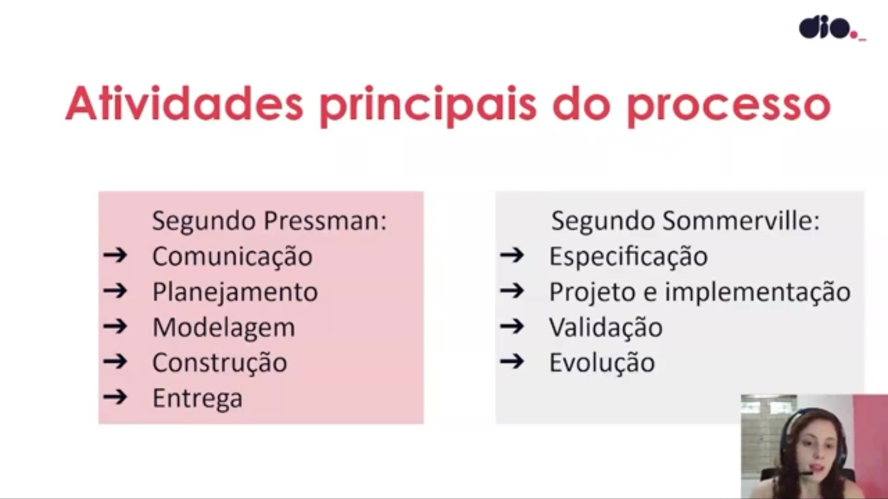

O slide compara as atividades principais do processo de software segundo dois autores renomados. Para Pressman, as atividades são: Comunicação, Planejamento, Modelagem, Construção e Entrega. Já Sommerville propõe: Especificação, Projeto e implementação, Validação e Evolução. Ambas as visões refletem etapas essenciais para o desenvolvimento, desde o entendimento do problema até a manutenção do software.

  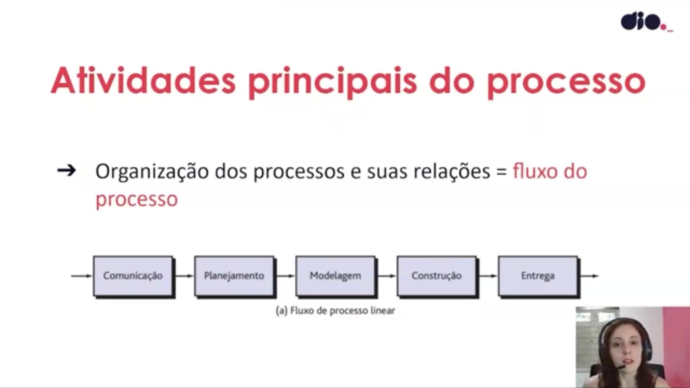

O conceito de fluxo de processo é introduzido: a organização dos processos e suas relações. O slide mostra um exemplo de fluxo linear, onde as etapas são executadas em sequência. Esse é um dos modelos possíveis de organização das atividades.

  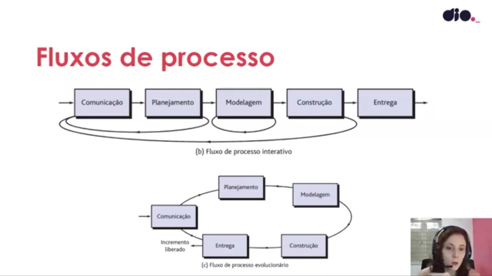

Esta imagem provavelmente ilustra um tipo específico de fluxo de processo, como um diagrama de setas ou iteração. O conteúdo visual, embora não detalhado no texto, sugere a representação gráfica da relação entre as etapas do processo, complementando a explicação anterior sobre fluxos.

  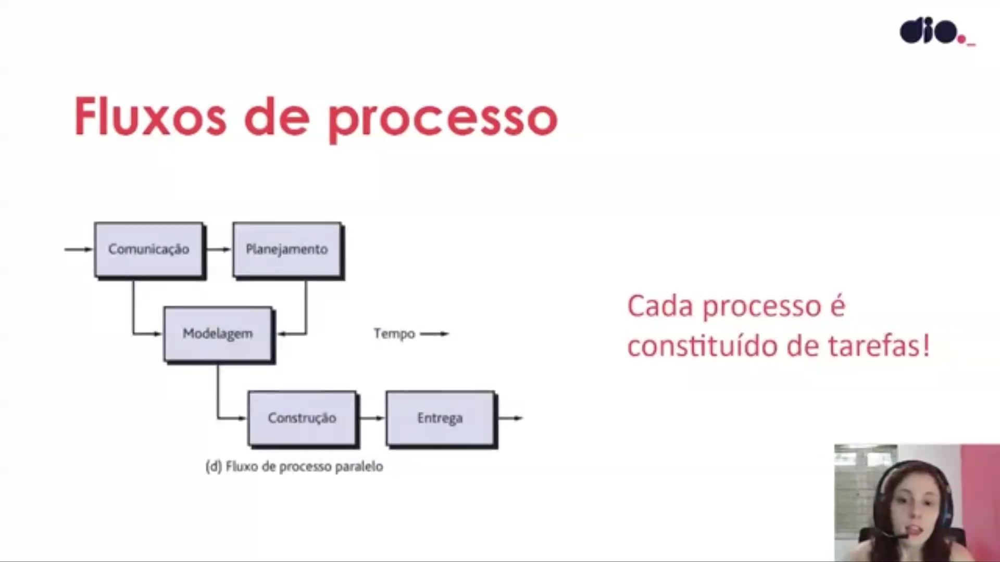

O slide reforça que os fluxos de processo são compostos por tarefas. Cada processo pode ser desmembrado em atividades menores e tarefas específicas, que são executadas de acordo com o fluxo definido. Isso ajuda no gerenciamento e na organização do trabalho.

  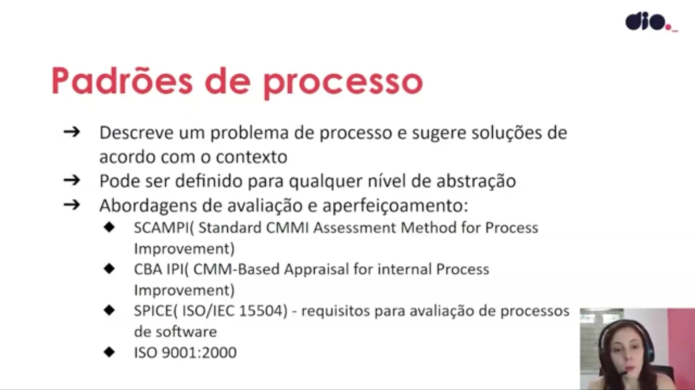

O último slide aborda a melhoria de processos, mencionando que se pode descrever um problema de processo e sugerir soluções conforme o contexto. Também lista abordagens de avaliação e aperfeiçoamento, como SCAMPI (para CMMI), CBA IPI, SPICE (ISO/IEC 15504) e ISO 9001:2000. Esses modelos e normas ajudam as organizações a avaliar e melhorar seus processos de software.      

### 🟩 Vídeo 03 - Modelo Prescritivo

<video width="60%" controls>
  <source src="000-Midia_e_Anexos/bootcamp_tqi_fullstack-modulo.08-curso.02-video_03.webm" type="video/webm">
    Seu navegador não suporta vídeo HTML5.
</video>

link do vídeo: https://web.dio.me/track/tqi-fullstack-developer/course/metodologias-ageis-e-ciclo-de-desenvolvimento-de-software/learning/c1b073e4-f17f-42a3-9fbc-bb7e612d8d08?autoplay=1

Este vídeo explora os modelos tradicionais de desenvolvimento, conhecidos como "prescritivos", focando em sua estrutura linear, na importância da documentação e nos desafios práticos que levaram ao surgimento das metodologias ágeis.

### Anotações

  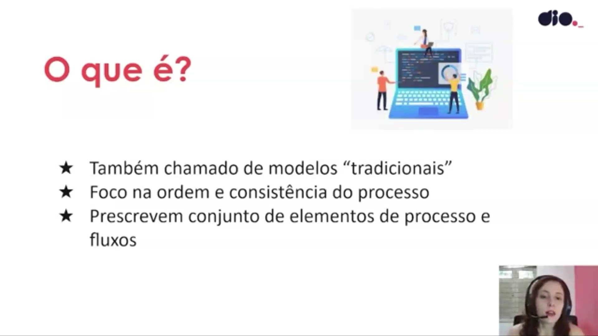

Os **modelos prescritivos** – também chamados de **modelos tradicionais** – surgiram nos primórdios da engenharia de software, inspirados em processos da manufatura. Eles se caracterizam por **estabelecer uma ordem rígida e uma consistência bem definida** para as atividades de desenvolvimento. Em vez de deixar o fluxo de trabalho livre, esses modelos “prescrevem” um conjunto de etapas, elementos e fluxos que devem ser seguidos como um roteiro, garantindo que tudo ocorra de forma previsível e controlada. Essa abordagem busca trazer disciplina e organização, mas também impõe uma rigidez que pode ser um desafio em projetos com requisitos voláteis.
 

  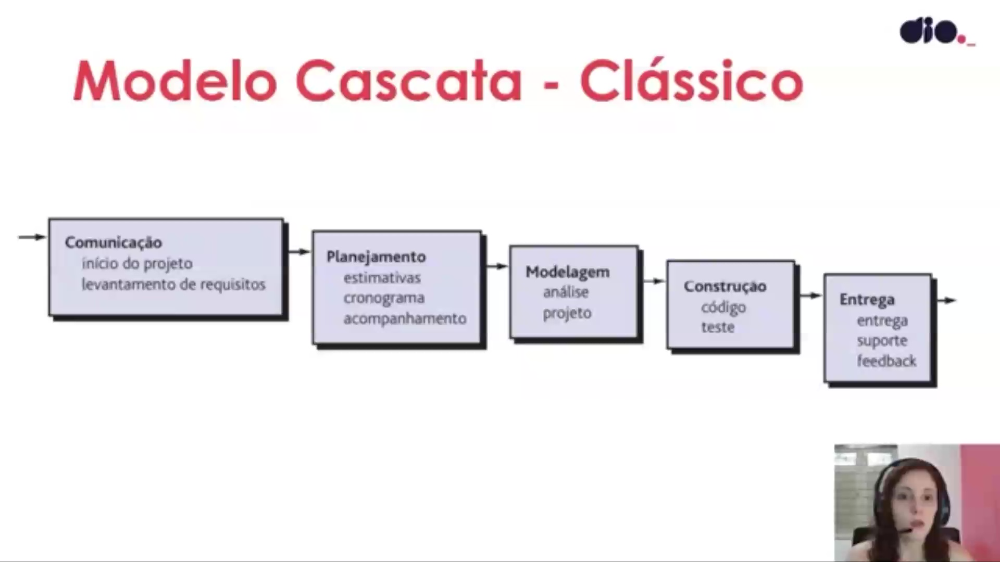

O **Modelo Cascata (ou Clássico)** é o exemplo mais conhecido de modelo prescritivo. Ele organiza o desenvolvimento em fases sequenciais e bem delimitadas: geralmente começa com a **definição de requisitos**, segue para o **projeto** (design), depois para a **implementação**, **testes** e, por fim, a **manutenção**. Cada fase só começa quando a anterior é completamente finalizada, formando uma espécie de “cascata” de atividades. Esse formato linear traz clareza sobre o que deve ser feito em cada momento, mas também exige que tudo seja muito bem planejado desde o início, pois mudanças posteriores são difíceis e custosas.

  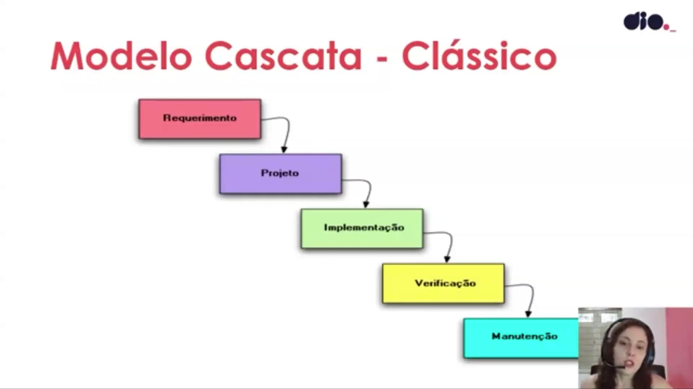

Esta imagem reforça a estrutura do Modelo Cascata, destacando seu fluxo linear e a ênfase na documentação formal ao final de cada etapa. Na prática, cada fase produz artefatos específicos (como documentos de requisitos, diagramas de projeto, código-fonte, relatórios de teste) que servem de entrada para a fase seguinte. Essa rigidez faz com que o modelo seja adequado para projetos com requisitos muito bem compreendidos e estáveis, onde o risco de mudanças durante o desenvolvimento é baixo. No entanto, ele também pode levar a longos períodos sem uma versão executável do software, já que a implementação só ocorre após a conclusão das fases anteriores.

  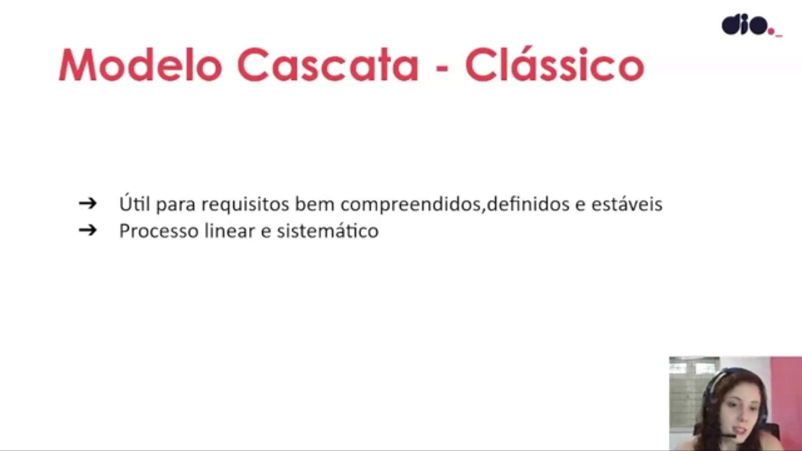

O Modelo Cascata é mais indicado quando os **requisitos são bem compreendidos, definidos e estáveis** desde o início do projeto. Como cada etapa depende da conclusão da anterior, é essencial que não haja dúvidas ou mudanças significativas ao longo do caminho. Além disso, ele impõe um **processo linear e sistemático**, onde o progresso é medido pela conclusão de marcos bem definidos. Essa característica facilita o gerenciamento e o controle, mas também torna o modelo pouco flexível para lidar com incertezas ou adaptações constantes.

  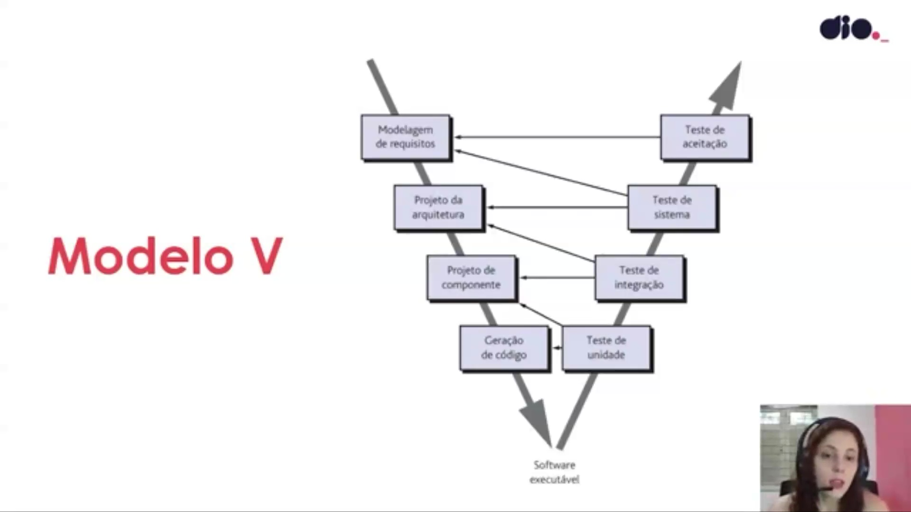

O **Modelo V** é uma evolução do Cascata que enfatiza a **relação entre as atividades de desenvolvimento e as de garantia de qualidade**. Ele mantém a mesma estrutura sequencial, mas a organiza em formato de “V”: no lado esquerdo, as fases de definição (requisitos, projeto); no lado direito, as fases de verificação e validação (testes unitários, de integração, de sistema). A ideia é que cada etapa de desenvolvimento tenha uma etapa de teste correspondente, garantindo que a qualidade seja construída ao longo de todo o processo. Apesar dessa melhoria, a essência permanece a mesma do Cascata: um fluxo linear e rígido.

  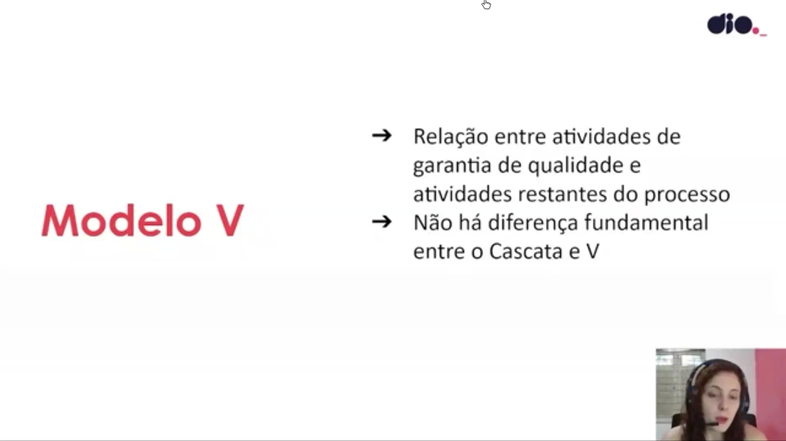

No Modelo V, a ênfase está na **relação direta entre as atividades de garantia de qualidade** (testes) e as atividades restantes do processo. Por exemplo, enquanto os requisitos são definidos, já se planejam os testes de aceitação; durante o projeto, planejam-se os testes de sistema. Isso cria um **paralelismo conceitual** que ajuda a detectar problemas mais cedo. Apesar dessa melhoria, **não há diferença fundamental entre o Cascata e o Modelo V** em termos de rigidez e sequencialidade – ambos exigem que as fases sejam concluídas antes de avançar e são igualmente resistentes a mudanças.

  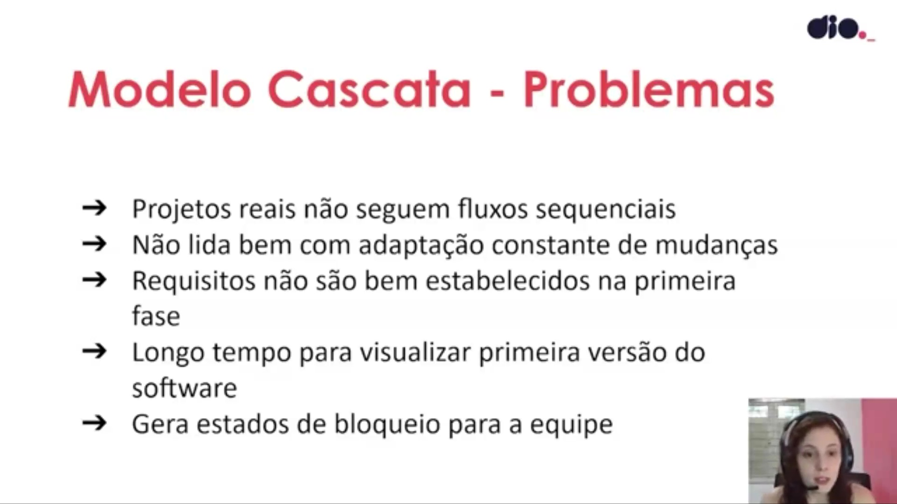

Apesar de sua utilidade em contextos específicos, os modelos prescritivos (Cascata e V) apresentam limitações importantes na prática:

- **Projetos reais raramente seguem fluxos puramente sequenciais** – iterações e retrabalhos são comuns.
- **Não lidam bem com mudanças constantes** – qualquer alteração nos requisitos pode exigir retomar fases inteiras.
- **Os requisitos raramente são completamente estabelecidos na primeira fase** – muitas vezes, eles evoluem com o entendimento do cliente e do time.
- **O tempo para visualizar a primeira versão funcional do software é muito longo** – o cliente só vê algo executável perto do fim.
- **Isso pode gerar estados de bloqueio para a equipe** – membros ficam ociosos aguardando a conclusão de fases anteriores ou sobrecarregados quando várias atividades se acumulam.

Essas limitações motivaram o surgimento de abordagens mais flexíveis e iterativas, como os modelos ágeis, que buscam entregar valor continuamente e se adaptar às mudanças.      

### 🟩 Vídeo 04 - Modelos incremental, iterativo e concorrente

<video width="60%" controls>
  <source src="000-Midia_e_Anexos/bootcamp_tqi_fullstack-modulo.08-curso.02-video_04.webm" type="video/webm">
    Seu navegador não suporta vídeo HTML5.
</video>

link do vídeo: https://web.dio.me/track/tqi-fullstack-developer/course/metodologias-ageis-e-ciclo-de-desenvolvimento-de-software/learning/eb23b403-9fc3-4665-b1e6-f7ba682c9d43?autoplay=1

O vídeo descreve os modelos de desenvolvimento que vão além do tradicional "Cascata", focando em abordagens incrementais, evolucionárias e concorrentes. O objetivo é entender como cada modelo lida com a complexidade, os requisitos e a entrega de valor ao cliente.

### Anotações

  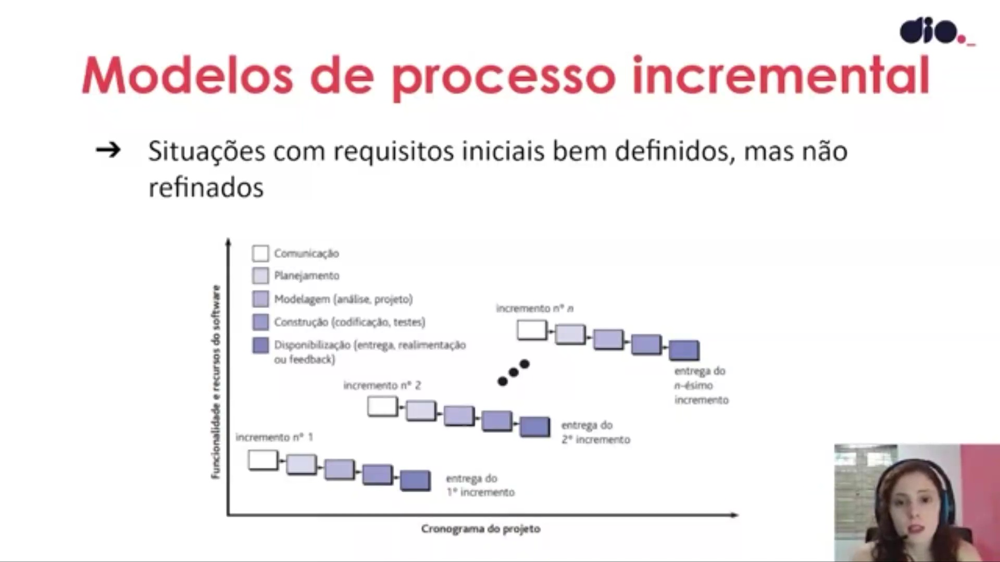

Esta imagem introduz o **modelo incremental**. Ela destaca que esse modelo é adequado quando os requisitos iniciais já estão bem definidos, mas ainda precisam ser refinados ao longo do projeto. A ideia é que, a partir de uma base clara, o software seja desenvolvido em partes (incrementos), cada uma entregando funcionalidades adicionais. Dessa forma, é possível obter feedback e ajustar os requisitos sem interromper o fluxo principal de desenvolvimento.

  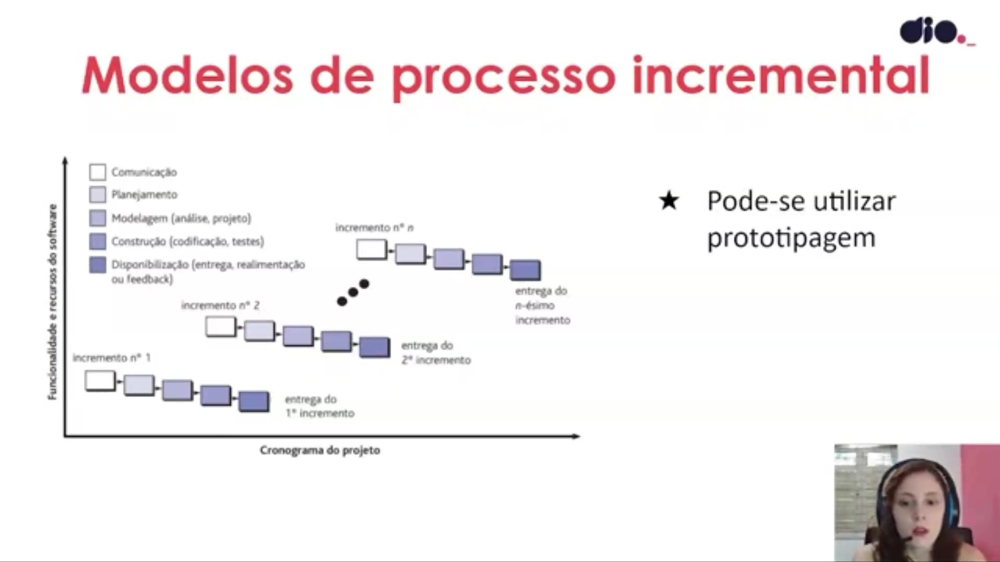

A imagem apresenta uma estratégia complementar ao modelo incremental: o uso de **prototipagem**. Quando os requisitos não são totalmente fechados, a construção de protótipos permite validar ideias rapidamente com o usuário. No contexto incremental, os protótipos podem ser utilizados em cada ciclo para refinar as necessidades antes de desenvolver o incremento final, garantindo maior alinhamento com as expectativas do cliente.

  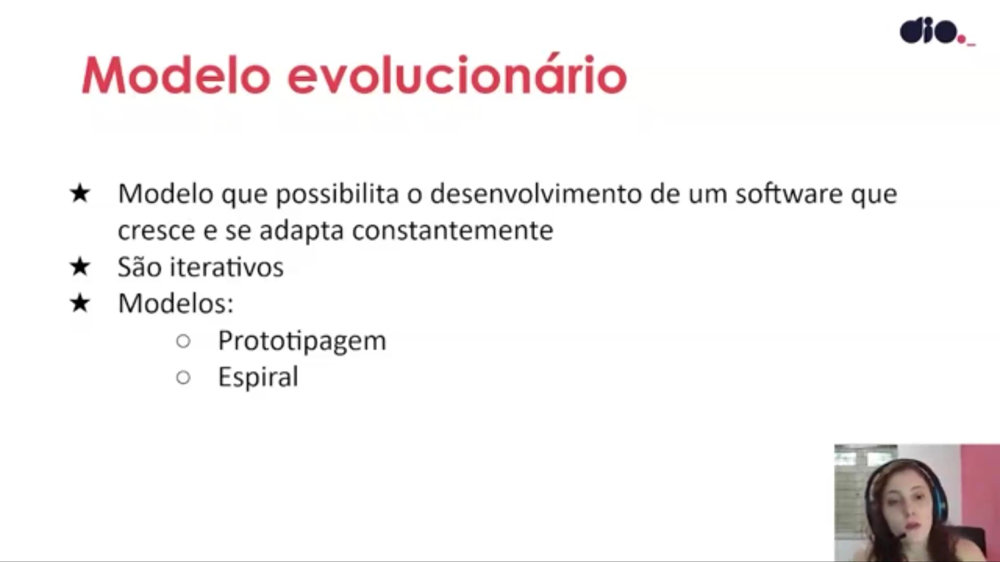

Agora temos a definição do **modelo evolucionário**. Diferente do incremental, que parte de requisitos bem definidos, o evolucionário é indicado para projetos complexos e que exigem adaptação constante. Ele é composto por modelos iterativos, sendo os principais a **prototipagem** e o **modelo espiral**. A ênfase está na capacidade do software de crescer e se modificar à medida que o entendimento do problema evolui.

  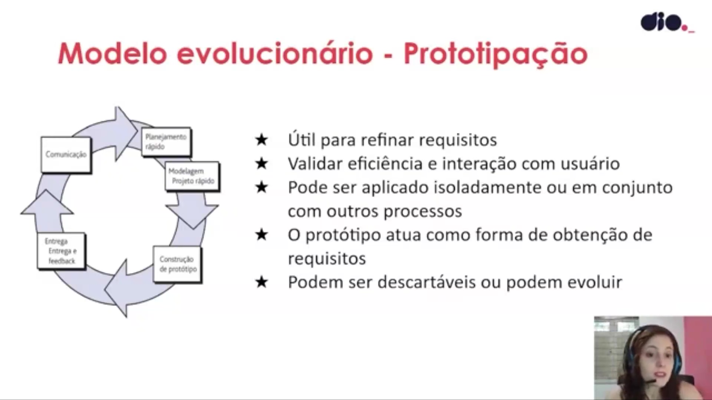

Esta imagem detalha a **prototipação** dentro do contexto evolucionário. O protótipo é uma ferramenta poderosa para refinar requisitos, validar a interação com o usuário e obter feedback precoce. Pode ser usado isoladamente ou combinado com outros processos. Uma característica importante é que os protótipos podem ser **descartáveis** (apenas para esclarecimento) ou **evolutivos** (servindo de base para o produto final).

  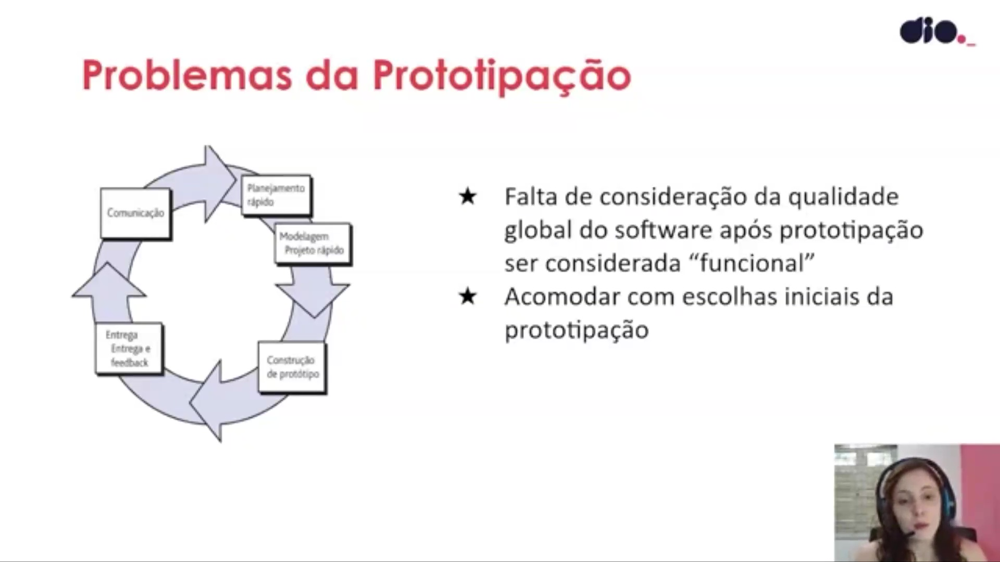

A imagem alerta para um problema comum na prototipação: a **falta de consideração da qualidade global**. Quando o protótipo é visto como “funcional” pelo cliente, a equipe pode se acomodar com as decisões iniciais (interface, arquitetura) e negligenciar melhorias necessárias para a qualidade de longo prazo. Isso acontece porque o foco excessivo na entrega rápida pode substituir a busca por um software bem estruturado.

  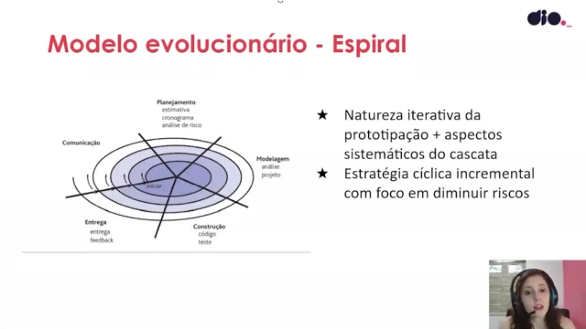

Aqui é apresentado o **modelo espiral**, que combina a natureza iterativa da prototipagem com a abordagem sistemática do modelo cascata. Sua principal característica é a ênfase na **análise de riscos** a cada ciclo. O desenvolvimento ocorre em espirais, onde cada volta representa um ciclo de planejamento, análise de riscos, engenharia e avaliação. Isso permite que o software evolua de forma controlada, com constante replanejamento baseado nos riscos identificados.

  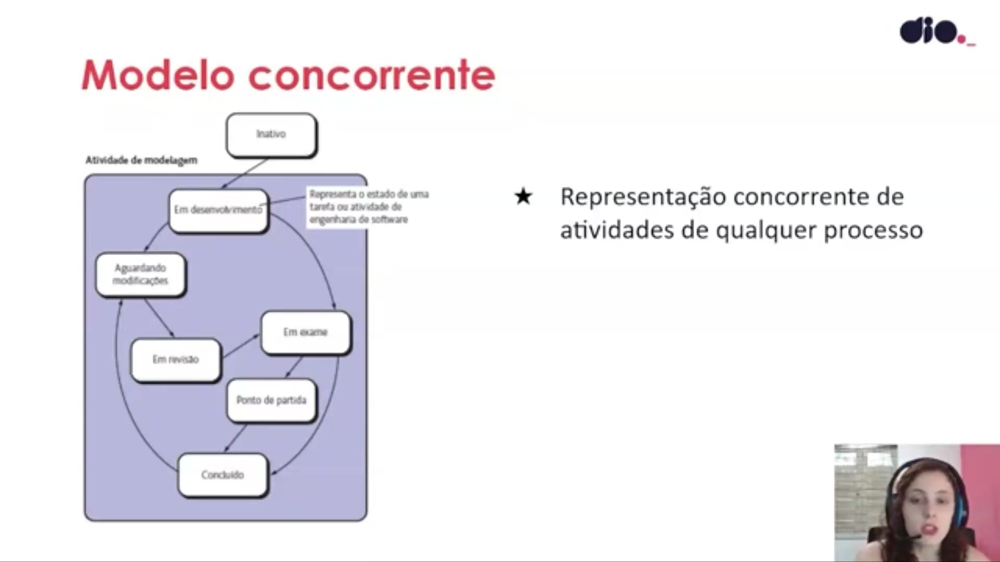

Por fim, a imagem ilustra o **modelo concorrente**, também conhecido como engenharia concorrente. Diferente dos modelos sequenciais, aqui as atividades podem ocorrer em paralelo e em diferentes estados. O diagrama mostra que uma mesma tarefa pode estar, por exemplo, em desenvolvimento, aguardando modificações, em avaliação ou concluída, e pode transitar entre esses estados conforme necessário. Isso reflete a realidade de projetos onde várias atividades acontecem simultaneamente.      

### 🟩 Vídeo 05 - Modelos especializados

<video width="60%" controls>
  <source src="000-Midia_e_Anexos/bootcamp_tqi_fullstack-modulo.08-curso.02-video_05.webm" type="video/webm">
    Seu navegador não suporta vídeo HTML5.
</video>

link do vídeo: https://web.dio.me/track/tqi-fullstack-developer/course/metodologias-ageis-e-ciclo-de-desenvolvimento-de-software/learning/413e9499-f148-499c-9959-b2e840fd5a4d?autoplay=1

Este vídeo descreve abordagens de engenharia de software que utilizam técnicas e métodos específicos para contextos onde modelos genéricos não são suficientes. Do uso de componentes comerciais à precisão matemática dos métodos formais, entenda como cada modelo otimiza o ciclo de vida do software.

### Anotações

  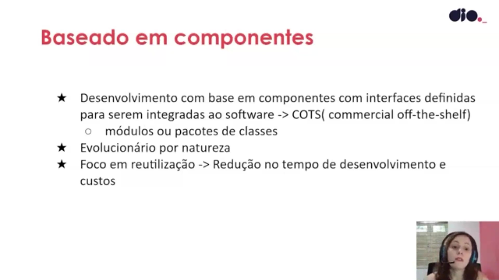

O modelo **Baseado em Componentes** foca na construção de software através da integração de partes preexistentes, conhecidas como componentes, bibliotecas ou módulos. Esses componentes possuem **interfaces bem definidas**, o que permite que sejam acoplados diretamente ao sistema sem a necessidade de redesenhar sua lógica interna.

Uma característica central deste modelo é a utilização de itens **COTS (Commercial Off-The-Shelf)**, que são produtos comerciais prontos para uso. Esta abordagem é **evolucionária por natureza**, pois o sistema cresce conforme novos componentes são integrados. O principal benefício é o **foco na reutilização**, o que resulta em uma significativa **redução no tempo de desenvolvimento e nos custos**, uma vez que não é necessário gastar tempo modelando ou verificando como implementar funcionalidades que já estão disponíveis no mercado.

  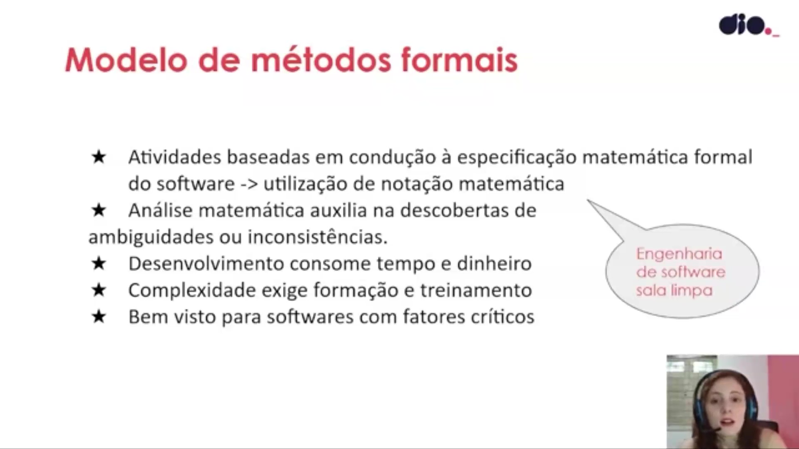

O **Modelo de Métodos Formais** é uma abordagem rigorosa baseada em **especificações matemáticas** para o desenvolvimento de software. Ele utiliza notação matemática para descrever o comportamento do sistema, o que permite uma análise profunda que auxilia na **descoberta de ambiguidades ou inconsistências** que passariam despercebidas em métodos convencionais.

Embora seja extremamente eficaz para garantir a correção do sistema, este modelo **consome muito tempo e dinheiro**, e sua complexidade exige **formação e treinamento especializado** da equipe. Por esses motivos, ele é especialmente bem visto e recomendado para o desenvolvimento de **softwares com fatores críticos**, como sistemas de controle de tráfego aéreo ou dispositivos médicos, onde a falha não é uma opção. Esta metodologia está fortemente associada ao conceito de **Engenharia de Software de Sala Limpa (Cleanroom Software Engineering)**, que visa a produção de software com zero defeitos através de verificação rigorosa.

  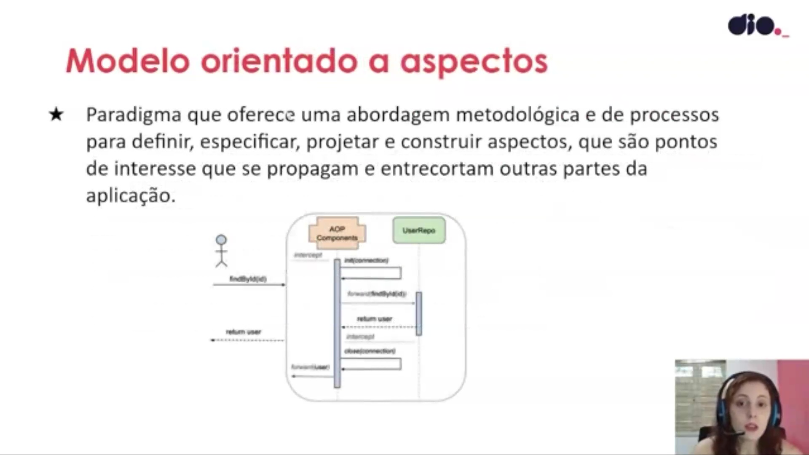

O **Modelo Orientado a Aspectos (AOP - Aspect-Oriented Programming)** é um paradigma que fornece métodos e processos para definir e construir **aspectos**. Aspectos são pontos de interesse (como segurança, log ou transações) que não pertencem a um único módulo, mas que se **propagam e entrecortam outras partes da aplicação**.

No diagrama apresentado, vemos um exemplo de como um aspecto pode interceptar uma chamada. O fluxo mostra um ator chamando o método `findById(id)`. Em vez de a chamada ir direto para o repositório (`UserRepo`), ela passa por **AOP Components**. O componente de aspecto pode realizar uma ação (como abrir uma conexão ou verificar permissões) antes de encaminhar (`forward`) a requisição para o `UserRepo`. Após o repositório retornar o usuário, o aspecto pode novamente interceptar a resposta para fechar a conexão ou realizar logs antes de devolver o resultado final ao chamador. Isso permite manter o código de negócio limpo, separando as preocupações transversais da lógica principal.

### 🟩 Vídeo 06 - Processo Unificado

<video width="60%" controls>
  <source src="000-Midia_e_Anexos/bootcamp_tqi_fullstack-modulo.08-curso.02-video_06.webm" type="video/webm">
    Seu navegador não suporta vídeo HTML5.
</video>

link do vídeo: https://web.dio.me/track/tqi-fullstack-developer/course/metodologias-ageis-e-ciclo-de-desenvolvimento-de-software/learning/6fcd6f11-3ed4-4a88-b6bb-552fd5615f1e?autoplay=1

O Processo Unificado representa um marco na engenharia de software, surgindo como uma resposta à rigidez do modelo cascata e aproveitando a ascensão da orientação a objetos. Este resumo explora sua origem, pilares e as fases que compõem seu ciclo de vida.

### Anotações

  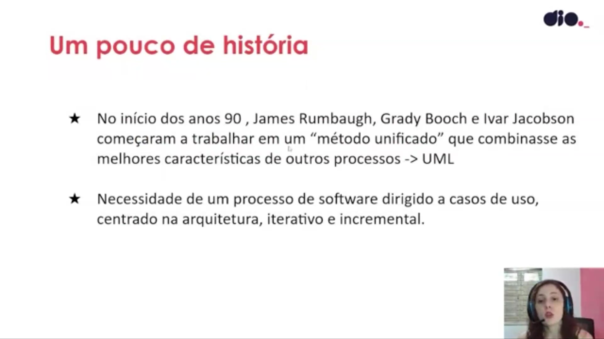

No início dos anos 90, os engenheiros de software James Rumbaugh, Grady Booch e Ivar Jacobson uniram esforços para criar um “método unificado” que combinasse as melhores características dos processos existentes, resultando na UML (Unified Modeling Language). Esse método deveria ser **dirigido a casos de uso** (para capturar requisitos), **centrado na arquitetura** (para garantir robustez) e **iterativo e incremental** (para entregar valor continuamente). A imagem apresenta esse contexto histórico e os princípios fundamentais que nortearam o desenvolvimento do Processo Unificado.

  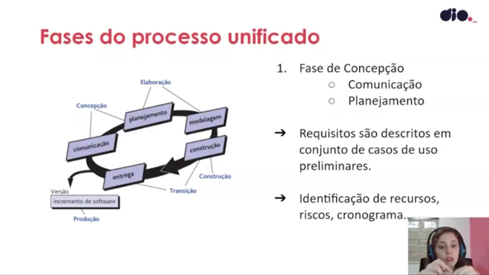

**Fase de Concepção (Inception)**  
Nesta primeira fase, o foco está nas atividades de **comunicação e planejamento**. Os requisitos são descritos por meio de um conjunto de **casos de uso preliminares**, que ajudam a entender o escopo do sistema. Também são identificados os recursos necessários, os principais riscos do projeto e um cronograma inicial. É o momento de alinhar expectativas com o cliente e definir a viabilidade do software.

  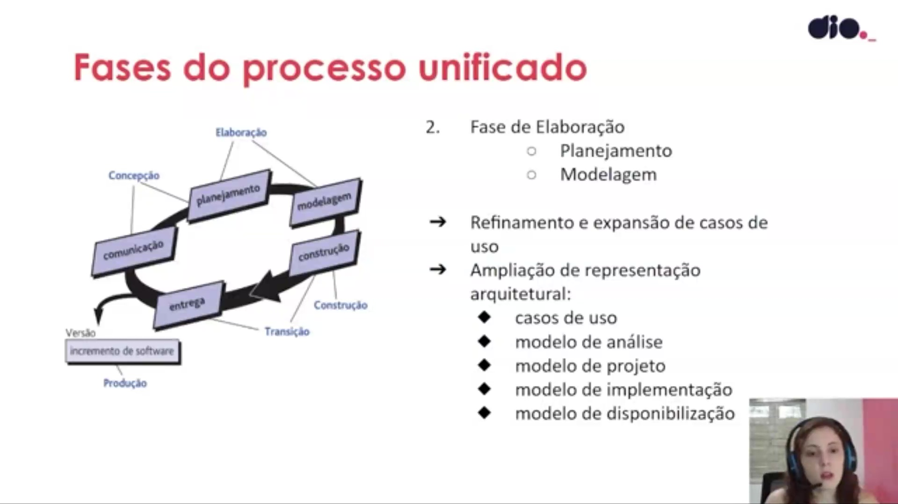

**Fase de Elaboração (Elaboration)**  
Agora entram em cena atividades de **planejamento e modelagem** mais aprofundadas. Os casos de uso são refinados e expandidos, e a arquitetura do sistema é amplamente detalhada. Diversos modelos são produzidos: **modelo de casos de uso** (visão funcional), **modelo de análise** (estrutura conceitual), **modelo de projeto** (solução técnica), **modelo de implementação** (código) e **modelo de disponibilização** (implantação). Essa fase estabelece uma base sólida para a construção.

  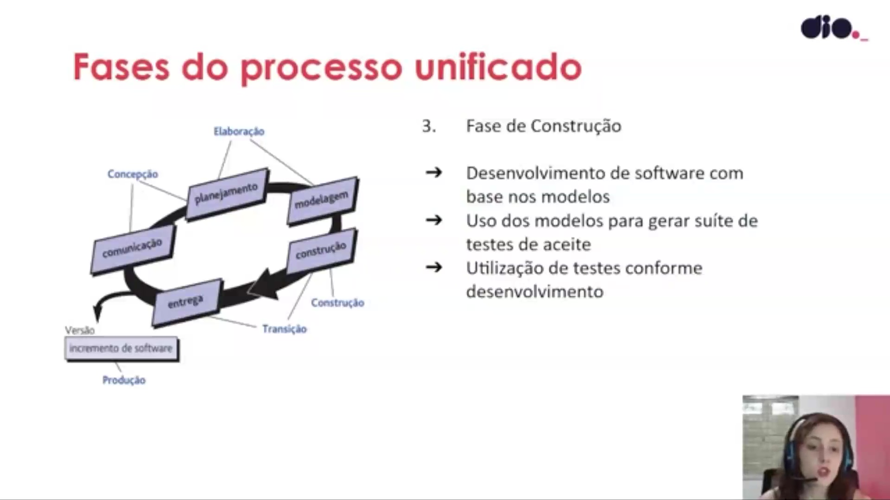

**Fase de Construção (Construction)**  
É a fase de **desenvolvimento efetivo** do software, tomando como base os modelos criados na elaboração. A partir desses modelos, é possível gerar uma **suíte de testes de aceitação** que orienta a validação do sistema. Os testes são aplicados conforme o avanço da implementação, garantindo que cada incremento atenda aos requisitos especificados. O código é produzido de forma iterativa, sempre integrado e testado.

  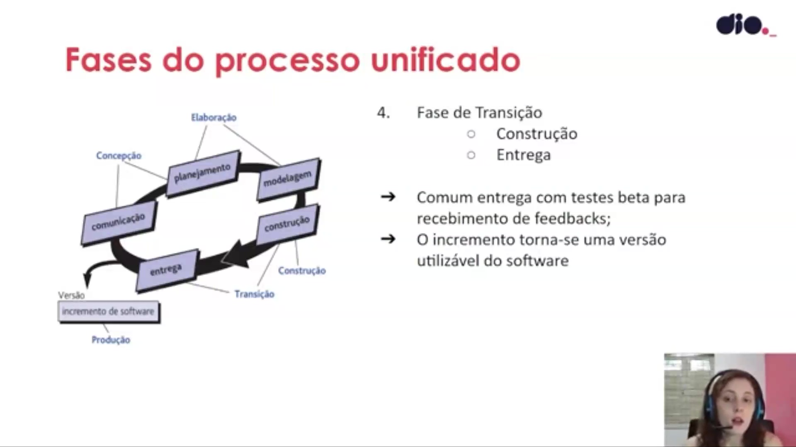

**Fase de Transição (Transition)**  
A transição cobre as atividades finais de **construção e entrega**. O software é colocado em produção, geralmente por meio de **testes beta**, para que usuários reais forneçam feedback. Com base nesse retorno, ajustes são realizados e o incremento se torna uma **versão utilizável** do produto. É o momento de preparar o ambiente, treinar usuários e garantir uma implantação suave.

  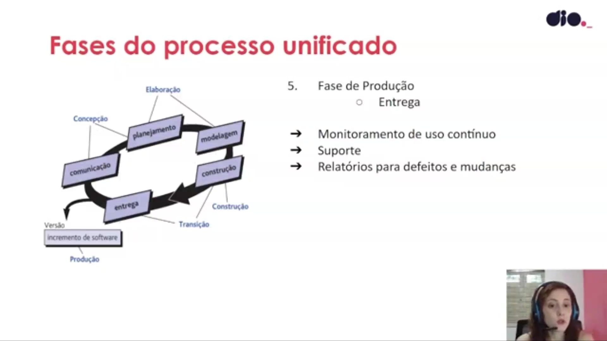

**Fase de Produção (Production)**  
Após a entrega, o software entra em operação contínua. As atividades principais são: **monitoramento do uso**, **suporte ao usuário** e **coleta de relatórios** sobre defeitos e solicitações de mudança. Métricas de desempenho e estabilidade são obtidas para orientar melhorias e correções. Essa fase se estende por toda a vida útil do sistema, garantindo que ele permaneça alinhado às necessidades dos usuários.

  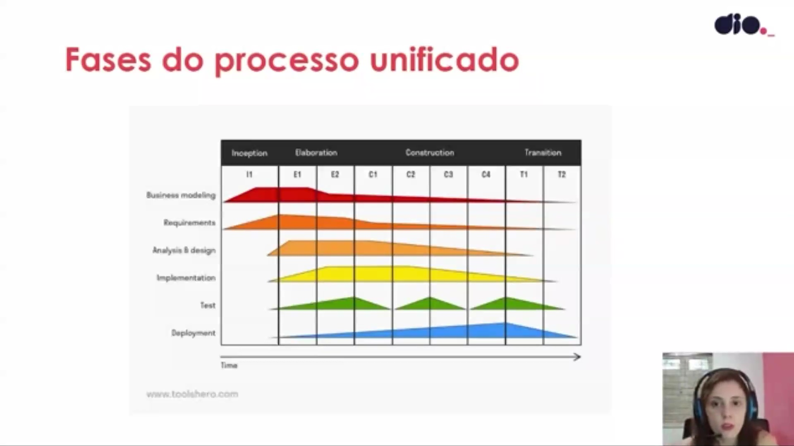

A imagem ilustra a relação entre as **fases do Processo Unificado** (Concepção, Elaboração, Construção, Transição, Produção) e as **disciplinas ou atividades** (Modelagem de Negócios, Requisitos, Análise e Design, Implementação, Teste, Implantação). Cada disciplina tem maior ou menor intensidade ao longo das fases, mas todas estão presentes de forma contínua. Por exemplo, a implementação começa tímida na concepção, cresce na elaboração e atinge o pico na construção, enquanto os testes se intensificam nas fases finais. Esse fluxo iterativo e incremental permite adaptações constantes e entrega progressiva de valor.

  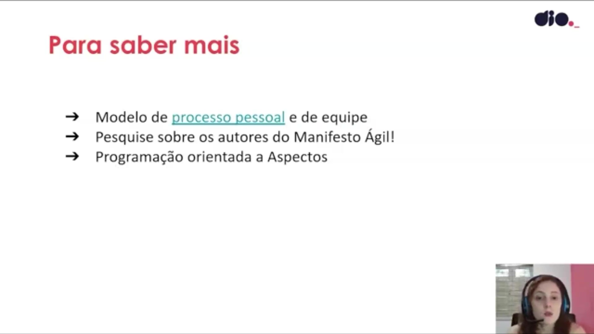

Como encerramento da aula, são sugeridos temas para aprofundamento:  
- **Modelo de Processo Pessoal e de Equipe** – abordagens que focam no indivíduo e nas dinâmicas sociais do desenvolvimento.  
- **Manifesto Ágil** – seus autores e princípios, conectando com a agilidade nos processos.  
- **Programação Orientada a Aspectos** – paradigma que complementa a orientação a objetos, separando preocupações transversais.  
Esses tópicos ampliam a visão sobre processos de software e preparam para discussões mais avançadas.      

## Parte 2 - Desenvolvimento ágil

### 🟩 Vídeo 07 - O manifesto ágil

<video width="60%" controls>
  <source src="000-Midia_e_Anexos/bootcamp_tqi_fullstack-modulo.08-curso.02-video_07.webm" type="video/webm">
    Seu navegador não suporta vídeo HTML5.
</video>

link do vídeo: https://web.dio.me/track/tqi-fullstack-developer/course/metodologias-ageis-e-ciclo-de-desenvolvimento-de-software/learning/b673a949-3620-4c90-9e22-89693fb6d094?autoplay=1

Esta introdução aborda a transição dos modelos tradicionais de desenvolvimento de software para as metodologias ágeis. A aula explora a origem do Manifesto Ágil, seus valores fundamentais, princípios e a justificativa econômica e cultural para sua adoção no mercado de TI.

### Anotações

  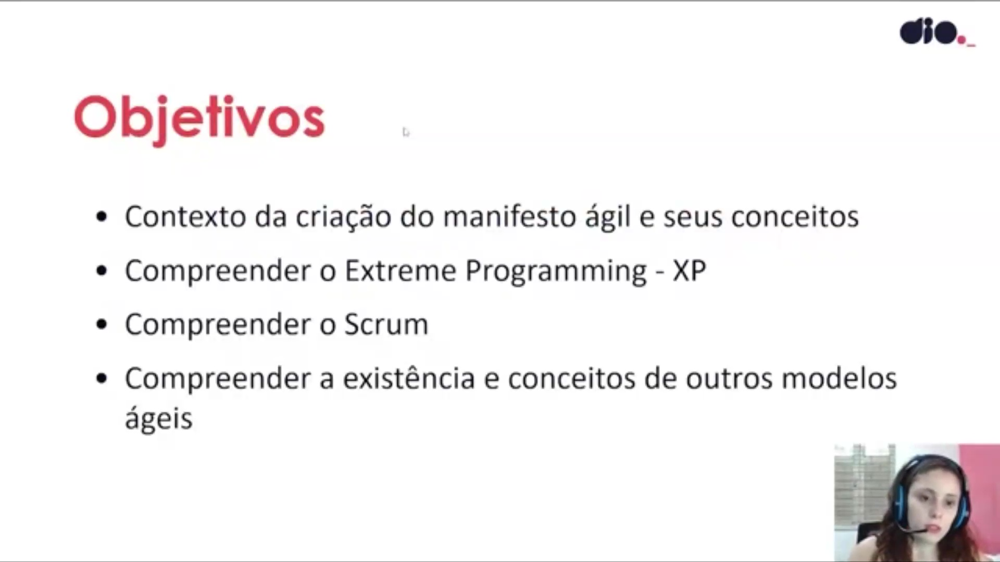

**Objetivos da Aula**

Este slide apresenta os quatro objetivos principais que serão abordados ao longo desta aula. Primeiramente, vamos explorar o contexto histórico que levou à criação do Manifesto Ágil e os seus conceitos fundamentais. Em seguida, o foco será compreender duas metodologias ágeis específicas: o Extreme Programming (XP) e o Scrum, que é amplamente adotado no mercado. Por fim, discutiremos a existência e os conceitos básicos de outros modelos ágeis que podem ser encontrados no ambiente de desenvolvimento de software.

  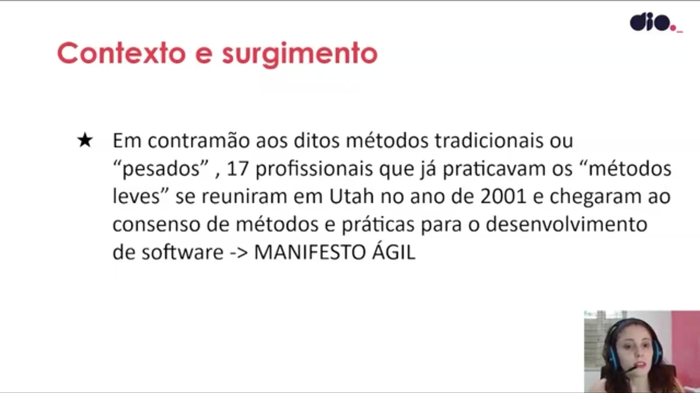

**Contexto e Surgimento do Manifesto Ágil**

A imagem destaca o movimento de oposição aos métodos tradicionais de desenvolvimento, também chamados de "métodos pesados". Em 2001, um grupo de 17 profissionais, que já aplicavam com sucesso os chamados "métodos leves" em seus projetos, reuniu-se em Utah. O resultado desse encontro foi a criação do Manifesto Ágil, um documento que consolidou práticas e princípios comuns que tornavam o desenvolvimento de software mais eficiente e adaptável, em contraste com a rigidez dos modelos prescritivos da época.

  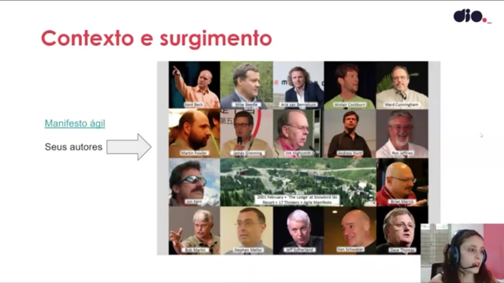

**Os Autores do Manifesto Ágil**

Este slide apresenta os 17 profissionais que foram fundamentais na criação do Manifesto Ágil. Figuras como Kent Beck, Martin Fowler, James Grenning e Andrew Hunt são alguns dos nomes que contribuíram com sua vasta experiência em engenharia de software. Muitos deles são autores de livros e pesquisas influentes, especialmente nas áreas de qualidade e testes de software. Conhecer o trabalho desses pioneiros é uma forma de aprofundar o entendimento sobre os fundamentos e a evolução das metodologias ágeis.

  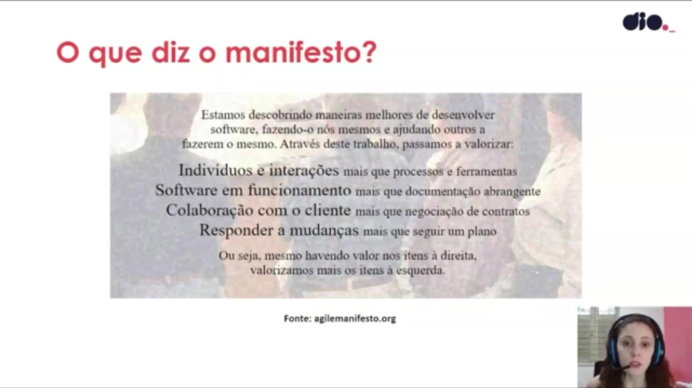

**Os Quatro Valores do Manifesto Ágil**

O núcleo do Manifesto Ágil é composto por quatro valores fundamentais. Eles estabelecem uma nova hierarquia de prioridades no desenvolvimento de software, valorizando:
*   **Indivíduos e interações** mais que processos e ferramentas.
*   **Software em funcionamento** mais que documentação abrangente.
*   **Colaboração com o cliente** mais que negociação de contratos.
*   **Responder a mudanças** mais que seguir um plano.

É crucial entender que os itens à direita (processos, documentação, contratos e planos) não são desprezados, mas sim, os itens à esquerda são considerados mais valiosos e devem receber maior foco e atenção.

  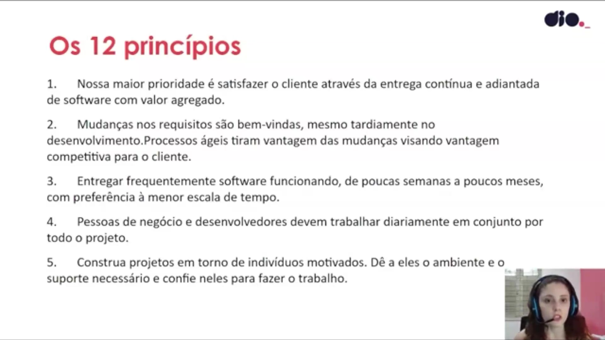

**Os 12 Princípios Ágeis (Parte 1)**

A partir dos quatro valores, foram derivados 12 princípios que guiam a aplicação da agilidade. Os cinco primeiros, apresentados aqui, enfatizam:
1.  **Satisfação do cliente** através da entrega contínua e adiantada de software com valor.
2.  **Acolhimento de mudanças** nos requisitos, mesmo em fases tardias, para vantagem competitiva do cliente.
3.  **Entregas frequentes** de software funcionando, em intervalos curtos (de semanas a meses).
4.  **Trabalho conjunto e diário** entre pessoas de negócio e desenvolvedores durante todo o projeto.
5.  **Construção de projetos em torno de indivíduos motivados**, fornecendo o ambiente e suporte necessários, e confiando neles para a execução do trabalho.
6. **O método mais eficiente e eficaz de transmitir informações para e entre uma equipe de desenvolvimento é por meio de conversa face a face** - ⭐️ princípio não citado no vídeo - conversas face a face são a forma mais eficiente e eficaz de compartilhar informações dentro de uma equipe de desenvolvimento.

  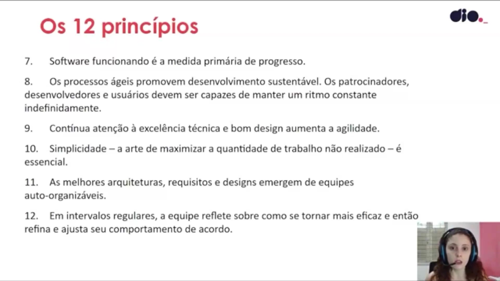

**Os 12 Princípios Ágeis (Parte 2)**

A continuação dos 12 princípios aborda aspectos de qualidade, simplicidade e melhoria contínua:

7.  **Software funcionando** como a medida primária de progresso.
8.  **Desenvolvimento sustentável**, onde patrocinadores, desenvolvedores e usuários conseguem manter um ritmo constante.
9.  **Excelência técnica e bom design**, que aumentam a agilidade e facilitam a manutenção.
10. **Simplicidade**, maximizando a quantidade de trabalho não realizado (ou seja, fazer apenas o necessário).
12. **Equipes auto-organizáveis**, das quais emergem as melhores arquiteturas, requisitos e designs.
12. **Reflexão e ajuste regulares** da equipe para se tornar mais eficaz, refinando seu comportamento continuamente.

  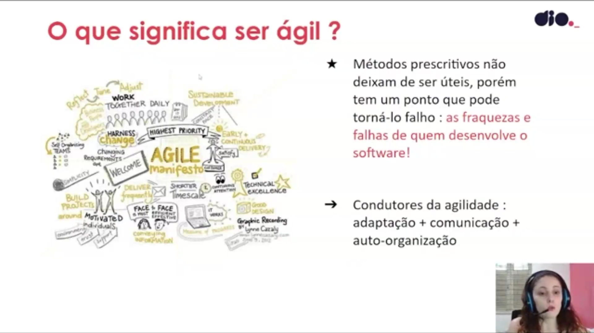

**O Significado de Ser Ágil**

Ser ágil vai além de seguir um processo; trata-se de adotar uma cultura. Os métodos prescritivos, embora úteis, podem falhar ao não considerar as fraquezas e falhas humanas envolvidas no desenvolvimento. A agilidade, por outro lado, é conduzida por três pilares: **adaptação**, **comunicação** e **auto-organização**. A capacidade de se adaptar, comunicar-se constantemente e organizar-se como equipe é o que permite navegar pela complexidade e imprevisibilidade inerentes à criação de software.

  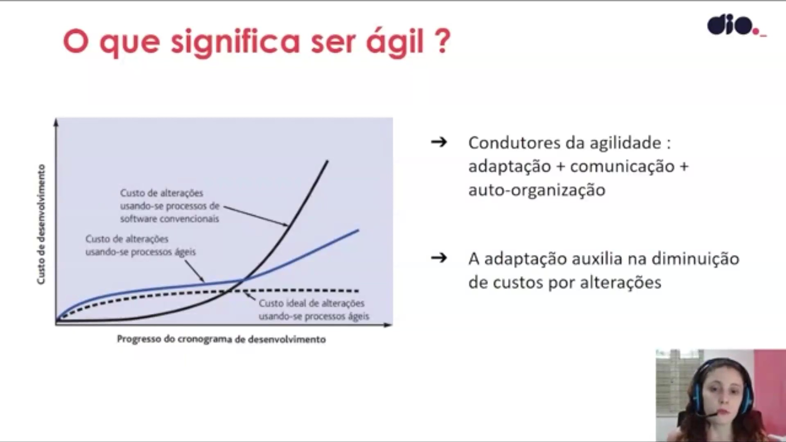

**Agilidade e o Custo de Mudanças**

Uma das grandes vantagens da agilidade é o impacto no custo de adaptações. Em modelos prescritivos tradicionais, o custo de uma alteração aumenta significativamente com o passar do tempo (linha ascendente). Os processos ágeis, por sua natureza iterativa e adaptativa, conseguem manter o custo das mudanças muito mais próximo da "curva ideal" (linha tracejada), que é baixa e estável. Isso significa que responder a mudanças de requisitos ou de escopo se torna financeiramente mais viável durante todo o ciclo de vida do projeto.

  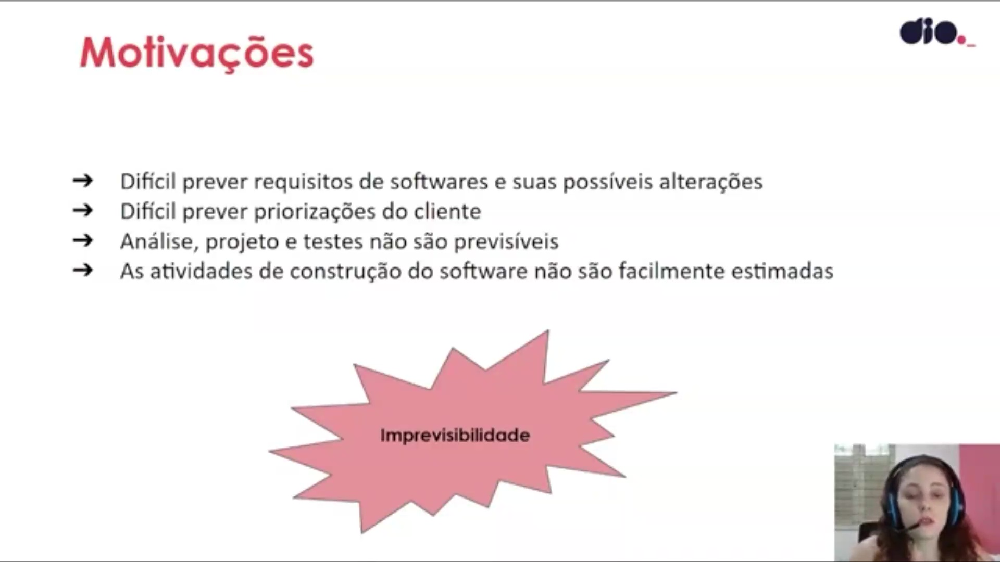

**A Imprevisibilidade como Motor da Agilidade**

A adoção de métodos ágeis é uma resposta direta à natureza imprevisível do desenvolvimento de software. O slide lista diversas fontes dessa imprevisibilidade que justificam a necessidade de um processo mais flexível:
*   É difícil prever requisitos de software e suas constantes alterações.
*   É difícil prever as priorizações do cliente, que podem mudar.
*   Atividades como análise, projeto e testes são inerentemente imprevisíveis.
*   As atividades de construção do software (codificação) são notoriamente difíceis de estimar com precisão.

Portanto, a agilidade não é uma escolha arbitrária, mas uma estratégia para lidar com a realidade complexa e mutável da engenharia de software.      

### 🟩 Vídeo 08 - Extreme Programming

<video width="60%" controls>
  <source src="000-Midia_e_Anexos/bootcamp_tqi_fullstack-modulo.08-curso.02-video_08.webm" type="video/webm">
    Seu navegador não suporta vídeo HTML5.
</video>

link do vídeo: https://web.dio.me/track/tqi-fullstack-developer/course/metodologias-ageis-e-ciclo-de-desenvolvimento-de-software/learning/2cbd24ec-81c2-4c3c-a8e2-0b4550a6bbac?autoplay=1

O Extreme Programming (XP) é uma das metodologias ágeis mais influentes, focada intensamente na qualidade do código e na satisfação do cliente através de ciclos curtos e feedback constante.

### Anotações

  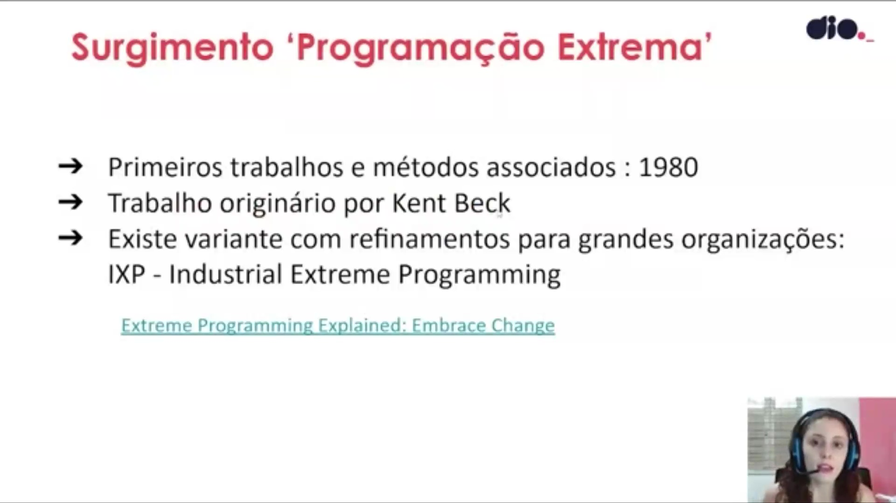

A imagem apresenta os marcos iniciais do Extreme Programming (XP).  
- **Origem**: os primeiros trabalhos associados a métodos ágeis remontam ao início da década de 1980.  
- **Criador**: Kent Beck é o responsável por formalizar e dar nome ao XP, a partir de sua experiência em um projeto real.  
- **Publicação de referência**: o livro *Extreme Programming Explained: Embrace Change* (exibido na imagem) é a obra fundamental que sistematiza a metodologia.  
- **Variante para grande escala**: existe o IXP (Industrial Extreme Programming), um refinamento do XP para organizações de grande porte e projetos complexos.  

A mensagem central é que o XP não surgiu do nada, mas foi consolidado por Kent Beck a partir de práticas já existentes, sempre com o lema de “abraçar mudanças”.

  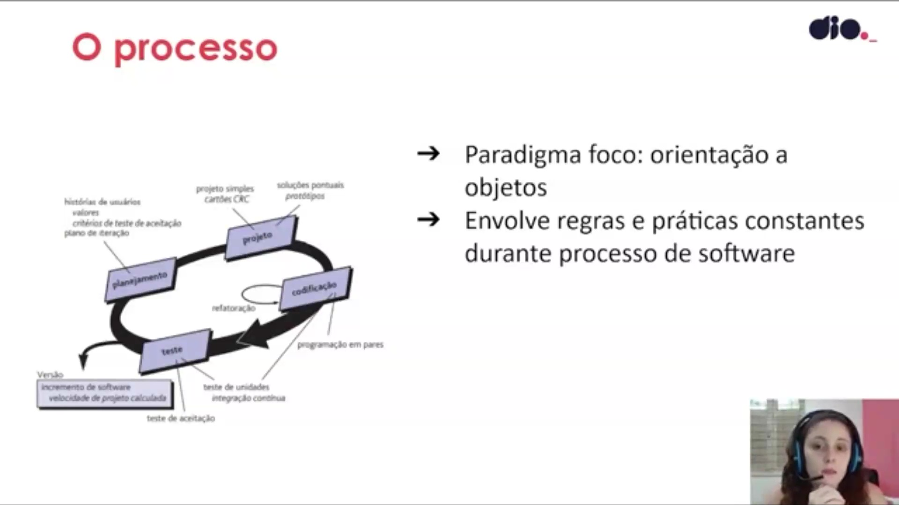

O slide destaca dois pilares fundamentais do XP:  
- **Paradigma orientado a objetos (POO)**: a metodologia foi concebida tendo a orientação a objetos como base, o que influencia diretamente suas práticas de projeto e codificação.  
- **Regras e práticas constantes**: diferentemente de frameworks genéricos, o XP define um conjunto rigoroso de regras e práticas que devem ser seguidas de forma contínua durante todo o processo de desenvolvimento – não se trata apenas de uma filosofia, mas de uma disciplina concreta.

Essa ênfase na POO e na constância das práticas é o que torna o XP uma metodologia voltada especialmente para a produção de software de qualidade.

  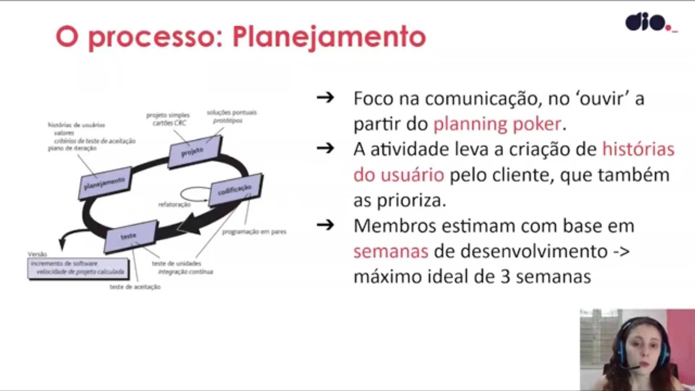

A imagem aborda a fase de **planejamento** no XP, com destaque para:  
- **Comunicação e escuta ativa**: o cliente é ouvido por meio de técnicas como o *planning poker*, onde a equipe discute e estima o esforço das funcionalidades.  
- **Criação de histórias do usuário**: o próprio cliente escreve as histórias e também as prioriza.  
- **Estimativas baseadas em tempo**: os membros da equipe estimam a duração das histórias em semanas de desenvolvimento, com um limite máximo ideal de **3 semanas** por história.  

O *planning poker* promove o consenso entre os desenvolvedores, equilibrando diferentes percepções (juniores e seniores) e garantindo que o planejamento seja realista e colaborativo.

  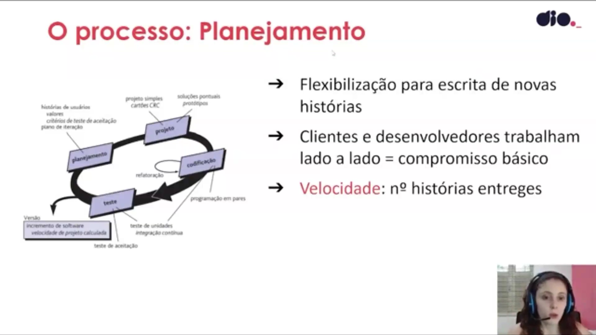

A imagem (classificada como código, mas com conteúdo conceitual) apresenta características da dinâmica de trabalho no XP:  
- **Flexibilidade para novas histórias**: o planejamento não é engessado; novas histórias podem ser escritas a qualquer momento.  
- **Compromisso básico**: clientes e desenvolvedores trabalham lado a lado, assegurando comunicação direta e rápida.  
- **Métrica de velocidade**: a equipe mede a *velocidade* (número de histórias entregues por ciclo) para calibrar o planejamento dos ciclos futuros, tornando as estimativas cada vez mais precisas.

A velocidade funciona como um indicador da capacidade real da equipe, permitindo ajustes contínuos no que pode ser entregue.

  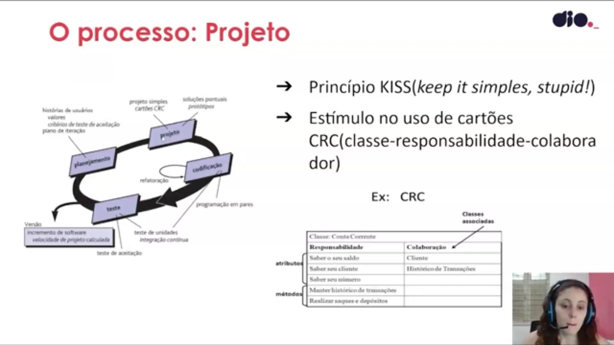

A imagem (com classificação de código) ilustra o **princípio KISS** (*Keep It Simple, Stupid*) e introduz os **cartões CRC** (Classe‑Responsabilidade‑Colaborador).  

- **KISS**: a simplicidade é a chave – deve‑se buscar a solução mais simples que funcione, evitando complexidade desnecessária.  
- **Cartões CRC**: são uma ferramenta de modelagem rápida e colaborativa, típica da orientação a objetos. Cada cartão contém:  
  - **Classe**: nome da classe.  
  - **Responsabilidades**: o que a classe deve fazer.  
  - **Colaboradores**: outras classes com as quais ela se relaciona.  
  - **Atributos** (indicados na imagem) e **métodos** complementam a descrição.  

O exemplo visual (com atributos centralizados) mostra como esses cartões ajudam a equipe a projetar a estrutura do sistema de forma leve e compartilhada.

  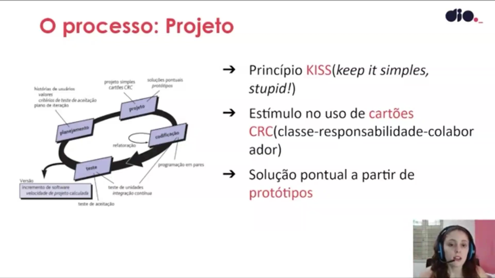

A imagem reforça o princípio **KISS** e o uso de **cartões CRC**, acrescentando a prática de **prototipação**.  

- **Solução pontual a partir de protótipos**: a construção de protótipos (muitas vezes apenas com a interface visual) permite validar ideias com o cliente de forma rápida, antes de investir no desenvolvimento completo.  
- A prototipação é uma ferramenta de comunicação que se encaixa perfeitamente no espírito ágil, pois entrega feedback imediato e reduz retrabalho.  

Dessa forma, o XP combina modelagem leve (CRC) com experimentação concreta (protótipos) para alinhar as expectativas e simplificar o desenvolvimento.

  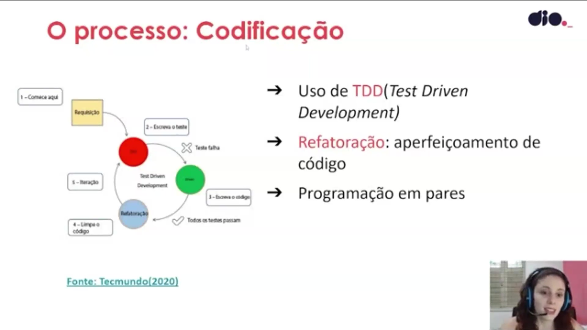

A imagem aborda práticas essenciais da **codificação** no XP:  
- **TDD (Test Driven Development)**: desenvolvimento orientado a testes. Primeiro escreve‑se o teste (que falha), depois o código mínimo para passar no teste e, por fim, refatora‑se.  
- **Refatoração**: aperfeiçoamento contínuo do código sem alterar seu comportamento externo, mantendo‑o limpo e adaptável.  
- **Programação em pares**: dois desenvolvedores trabalham juntos no mesmo computador; um escreve o código enquanto o outro revisa e sugere melhorias em tempo real. Os papéis podem ser alternados.  

A fonte indicada (Tecmundo, 2020) sugere que a imagem pode conter uma ilustração ou esquema dessas práticas. O TDD e a programação em pares são marcas registradas do XP, aumentando a qualidade e a troca de conhecimento.

  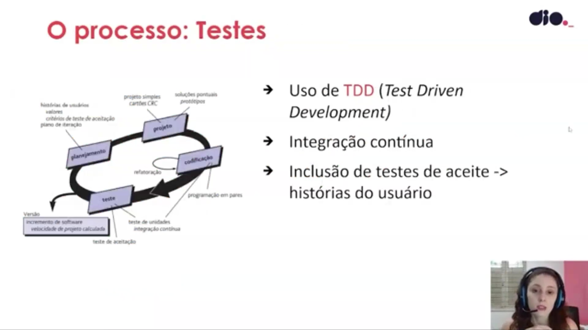

A imagem (classificada como código) dá continuidade às práticas de garantia de qualidade no XP:  
- **TDD** (já apresentado) é novamente destacado.  
- **Integração contínua**: os desenvolvedores integram seu código ao repositório principal várias vezes ao dia, com builds e testes automatizados, detectando problemas precocemente.  
- **Testes de aceite**: são criados a partir das histórias do usuário e validam se o sistema atende aos critérios definidos pelo cliente.  

Essas práticas, em conjunto, garantem que o software evolua de forma estável e que as funcionalidades entregues estejam sempre em conformidade com o que foi solicitado.

  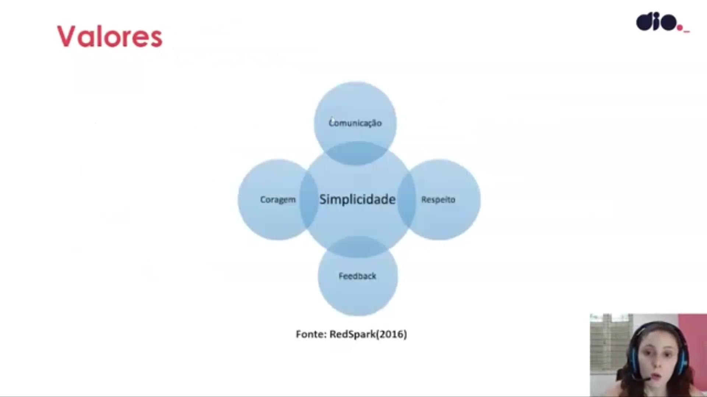

A imagem apresenta os **cinco valores fundamentais do Extreme Programming**, conforme ilustração da RedSpark (2016):  
- **Simplicidade**: fazer o necessário, da maneira mais simples possível.  
- **Respeito**: considerar as ideias e os papéis de todos na equipe.  
- **Comunicação**: manter diálogo constante, especialmente com o cliente.  
- **Coragem**: enfrentar problemas, mudar o que precisa ser mudado e assumir decisões difíceis.  
- **Feedback**: obter retorno rápido e contínuo do código, dos testes e do cliente.  

Esses valores são a base cultural do XP e estão totalmente alinhados com o Manifesto Ágil. Eles guiam as atitudes da equipe e a aplicação prática de todas as regras e práticas.

  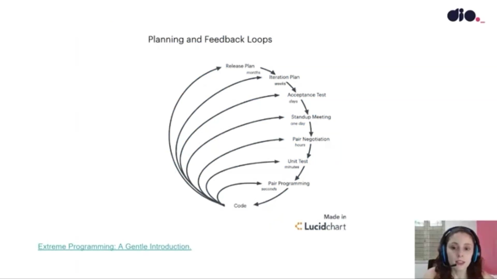

O último slide conceitual sintetiza a estrutura iterativa do XP por meio dos **ciclos de planejamento e feedback** (*Planning and Feedback Loops*).  

- Cada iteração (tipicamente de uma a três semanas) envolve planejamento, desenvolvimento, testes e entrega de um incremento do software.  
- Os loops de feedback ocorrem em múltiplos níveis:  
  - **Diário**: programação em pares e integração contínua.  
  - **Iteração**: reuniões de planejamento e revisão com o cliente.  
  - **Projeto**: a cada release, o cliente valida o conjunto de funcionalidades entregues.  

Essa dinâmica garante que o projeto se adapte rapidamente a mudanças e que o cliente tenha visibilidade constante do progresso. O link indicado (*extremeprogramming.org*) oferece uma introdução gentil a esses conceitos.      

### 🟩 Vídeo 09 - Scrum

<video width="60%" controls>
  <source src="000-Midia_e_Anexos/bootcamp_tqi_fullstack-modulo.08-curso.02-video_09.webm" type="video/webm">
    Seu navegador não suporta vídeo HTML5.
</video>
link do vídeo: https://web.dio.me/track/tqi-fullstack-developer/course/metodologias-ageis-e-ciclo-de-desenvolvimento-de-software/learning/9a11bf24-76f9-43bb-ab6b-2e16b16a898e?autoplay=1

O vídeo apresenta uma visão geral do Scrum, explorando suas origens, fundamentos teóricos, papéis fundamentais, eventos cíclicos e artefatos. O Scrum é definido como um framework leve projetado para ajudar pessoas, times e organizações a gerar valor por meio de soluções adaptativas para problemas complexos.

### Anotações

  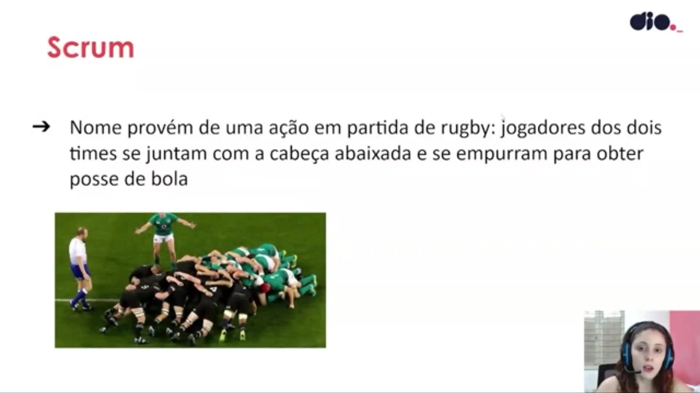

O nome Scrum tem origem no rugby, esporte em que os jogadores se unem com a cabeça baixa e se empurram para disputar a posse da bola. Essa imagem ilustra exatamente esse momento: um grupo compacto de atletas empurrando juntos. A analogia é proposital: no desenvolvimento de software, o time precisa atuar de forma integrada, auto-organizada e com esforço conjunto para alcançar o objetivo, assim como os jogadores no campo. Foi essa ideia de união e empurrar na mesma direção que inspirou Jeff Sutherland no início dos anos 1990 a batizar o framework.

  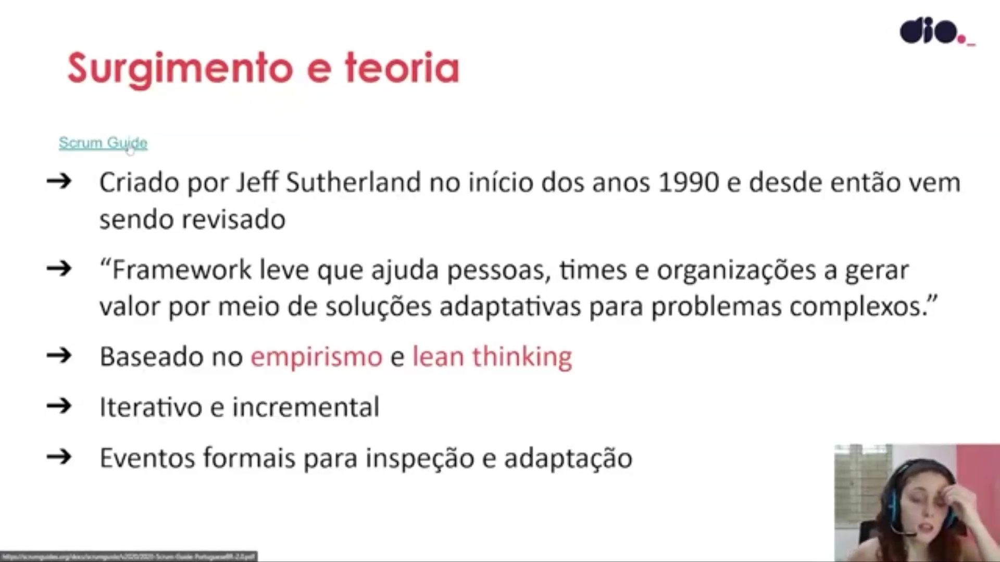

Este slide apresenta a base conceitual do Scrum. Ele foi criado por Jeff Sutherland no início dos anos 1990 e é continuamente revisado pela comunidade, resultando no Scrum Guide. O Guia define o Scrum como um framework leve que ajuda times e organizações a gerar valor por meio de soluções adaptativas para problemas complexos. Seus fundamentos são o empirismo (aprender pela experimentação e observação) e o lean thinking (pensamento enxuto, evitar desperdícios). O processo é iterativo e incremental, e conta com eventos formais destinados à inspeção e adaptação contínuas.

  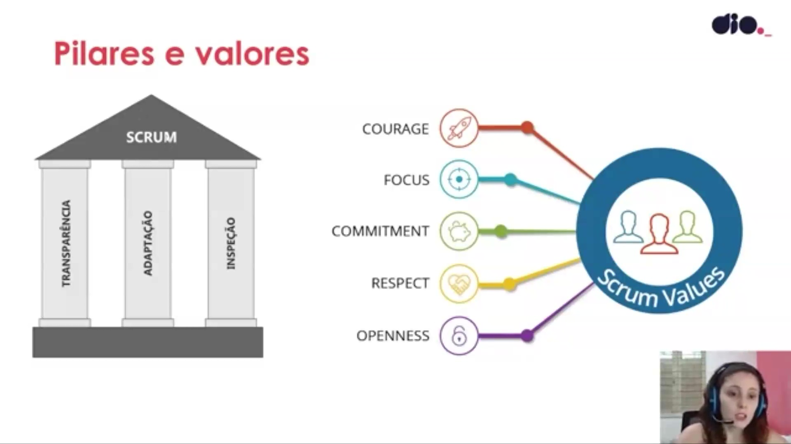

A imagem destaca os três pilares que sustentam o Scrum: transparência, inspeção e adaptação. A transparência garante que todos os aspectos do processo sejam visíveis e compreendidos por quem executa o trabalho. A inspeção permite verificar frequentemente o progresso e os artefatos em direção ao objetivo. A adaptação possibilita ajustes rápidos sempre que algo foge do esperado. Esses pilares funcionam de forma encadeada: só é possível inspecionar o que é transparente, e só se adapta com eficácia aquilo que foi devidamente inspecionado. Além deles, o Scrum também se apoia em valores como coragem, foco, comprometimento, respeito e abertura, que ajudam a construir a cultura da equipe.

  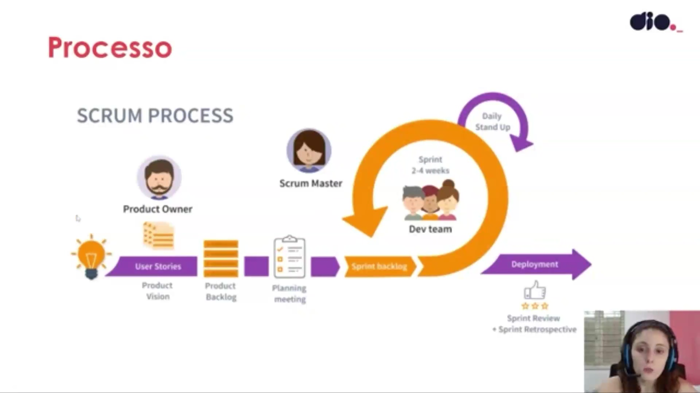

O slide apresenta uma visão geral do fluxo do processo Scrum. Tudo começa com a visão do produto, que é desdobrada pelo Product Owner em funcionalidades descritas como histórias de usuário e mantidas no Product Backlog. No evento de Planejamento da Sprint (Sprint Planning), o time define a meta da Sprint e seleciona os itens que serão trabalhados, criando o Sprint Backlog. Durante a Sprint (geralmente de duas a quatro semanas), ocorrem reuniões diárias (Daily Scrum) para inspecionar o progresso. Ao final, entrega-se um incremento pronto e realizado, seguido dos eventos de Revisão da Sprint (Sprint Review) e Retrospectiva da Sprint (Sprint Retrospective). O ciclo então se repete.

  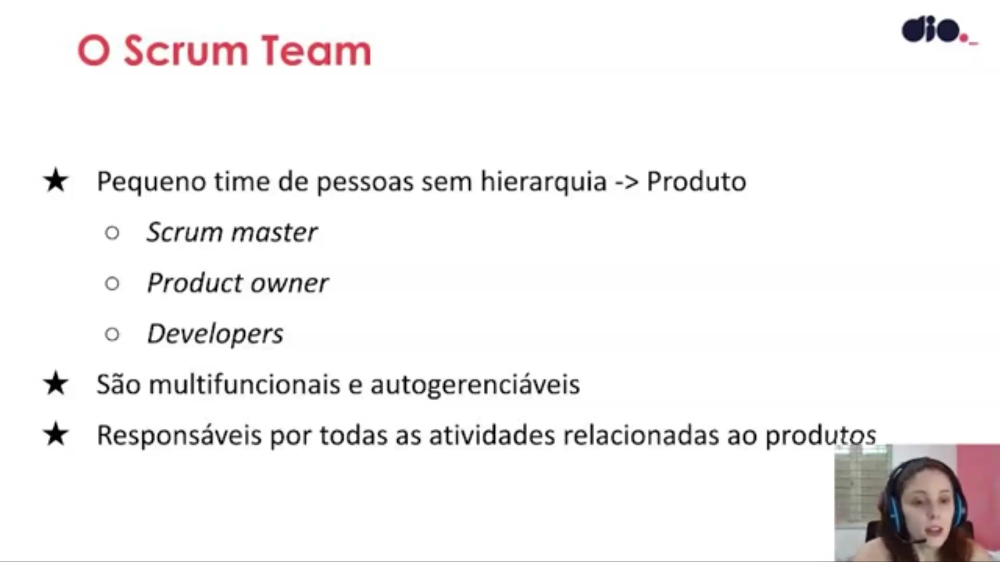

Esta imagem descreve a composição do Scrum Team. Diferente de equipes tradicionais, aqui não existe hierarquia interna — todos são igualmente importantes e responsáveis pelo sucesso do produto. O time é formado por três papéis: o Product Owner, o Scrum Master e os Developers. Eles devem ser multifuncionais (possuir todas as habilidades necessárias para entregar o incremento) e autogerenciáveis (decidir internamente como realizar o trabalho). A responsabilidade por todas as atividades relacionadas ao produto é compartilhada por todo o time.

  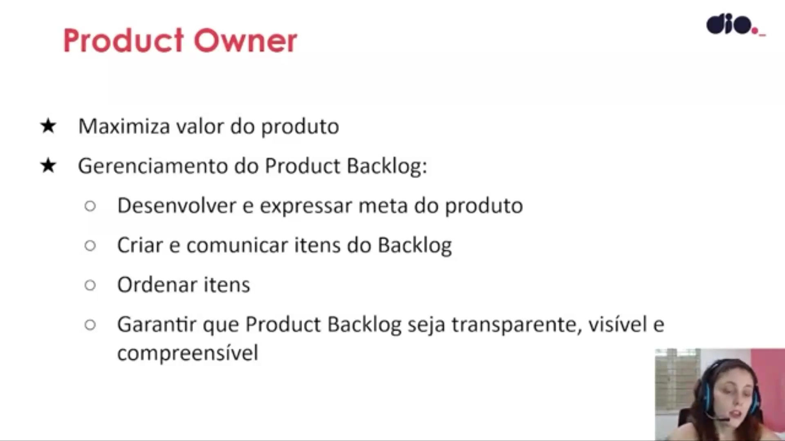

O Product Owner (PO) é o responsável por maximizar o valor do produto resultante do trabalho do time. Sua principal ferramenta é o gerenciamento do Product Backlog, que inclui: desenvolver e comunicar claramente a meta do produto; criar e refinar os itens do backlog; ordenar (priorizar) esses itens conforme o valor de negócio; e garantir que o backlog seja transparente, visível e compreensível para todos os envolvidos. O PO atua como a voz do cliente dentro do time.

  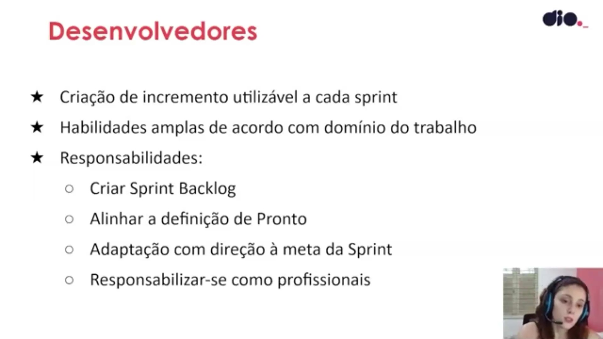

Os Desenvolvedores (Developers) são os profissionais responsáveis por criar um incremento utilizável a cada Sprint. Eles possuem habilidades diversas, adequadas ao domínio do trabalho, e são coletivamente responsáveis por: elaborar o Sprint Backlog (planejamento detalhado do que será feito); definir e seguir a “Definição de Pronto” (critérios de qualidade); adaptar-se constantemente para atingir a meta da Sprint; e assumir responsabilidade profissional sobre suas entregas. Neste contexto, “desenvolvedores” inclui não só programadores, mas também testadores, analistas e qualquer pessoa que contribua diretamente para a construção do produto.

  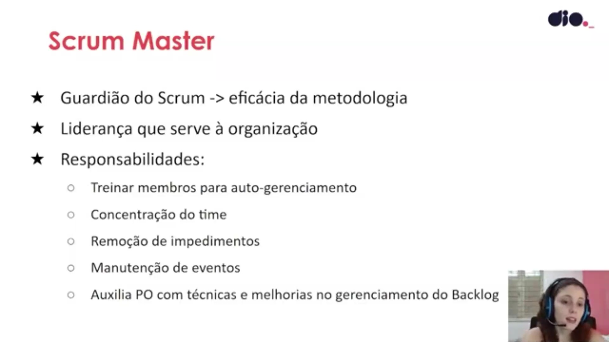

O Scrum Master é o guardião do processo, responsável por garantir a eficácia da metodologia. Ele exerce uma liderança de serviço, atuando para: treinar o time em autogerenciamento; manter o foco do time; remover impedimentos que atrapalhem o progresso; assegurar que todos os eventos ocorram e sejam produtivos; e auxiliar o Product Owner com técnicas de gerenciamento do backlog e melhorias contínuas. Seu papel não é de gerente, mas de facilitador e coach.

  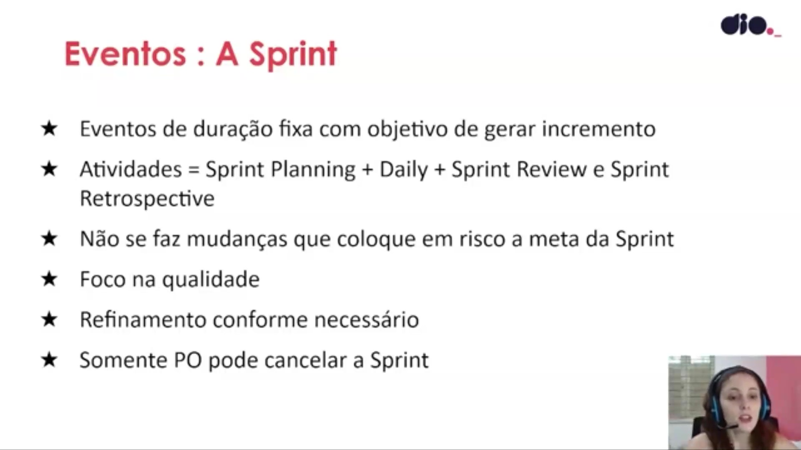

A Sprint é o coração do Scrum: um evento de duração fixa (geralmente entre uma e quatro semanas) no qual um incremento potencialmente utilizável é criado. Durante a Sprint ocorrem os demais eventos: Sprint Planning, Daily Scrum, Sprint Review e Sprint Retrospective. Uma regra importante é que não se fazem mudanças que coloquem em risco a meta da Sprint. A qualidade deve ser mantida e o backlog pode ser refinado conforme necessário. Somente o Product Owner tem autoridade para cancelar uma Sprint, o que é raro e indica que a meta perdeu o sentido.

  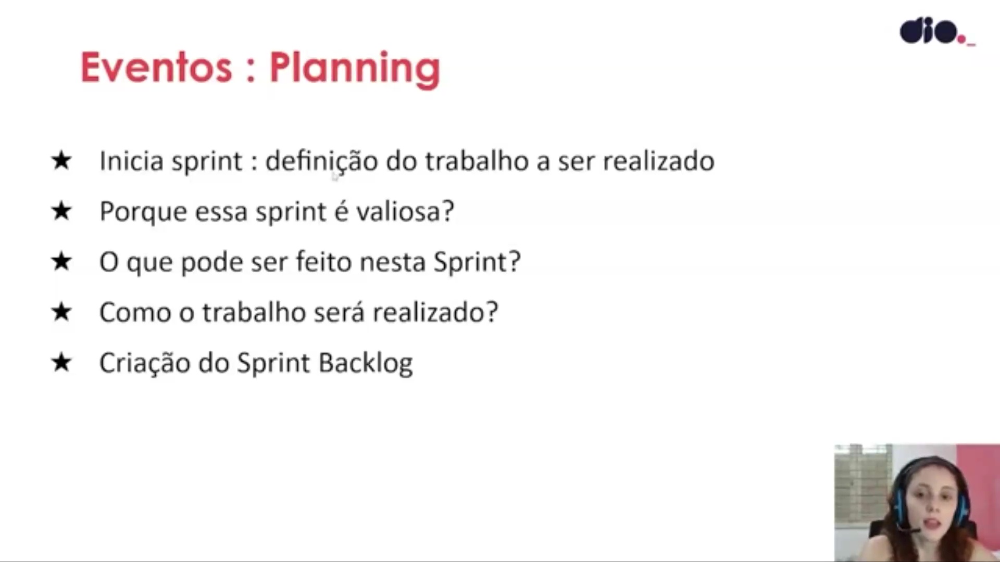

O Sprint Planning é o evento que inicia a Sprint. Nele, o time responde a três perguntas fundamentais: “Por que esta Sprint é valiosa?” (definição da meta), “O que pode ser feito nesta Sprint?” (seleção dos itens do Product Backlog) e “Como o trabalho será realizado?” (planejamento detalhado). O resultado é o Sprint Backlog, um plano composto pela meta da Sprint e pelo conjunto de itens selecionados, além de um plano inicial para entregá-los.

  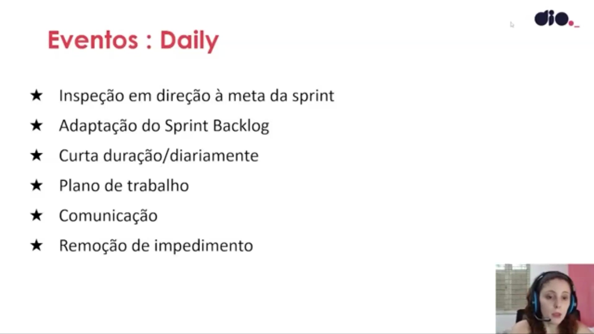

A Daily Scrum (reunião diária) é um evento curto, de no máximo 15 minutos, realizado todos os dias da Sprint. Seu objetivo é inspecionar o progresso em direção à meta da Sprint e adaptar o Sprint Backlog conforme necessário. Os desenvolvedores planejam o trabalho das próximas 24 horas, identificam impedimentos e alinham a comunicação. Não é uma reunião de status para gerentes, mas sim uma oportunidade de auto-organização do time.

  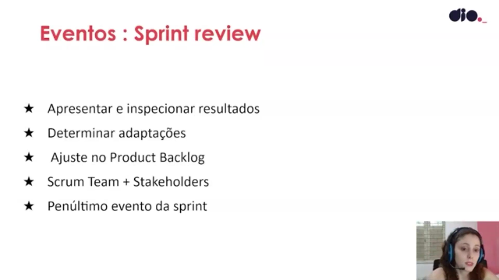

A Sprint Review é realizada ao final da Sprint e tem como objetivo apresentar e inspecionar o incremento produzido. Participam o Scrum Team e os principais stakeholders. O time demonstra o que foi concluído, discute o que funcionou e o que pode ser melhorado, e o Product Owner ajusta o Product Backlog com base no feedback recebido. É um evento colaborativo, não uma simples apresentação; dele podem surgir novas prioridades e direcionamentos para as próximas Sprints.

  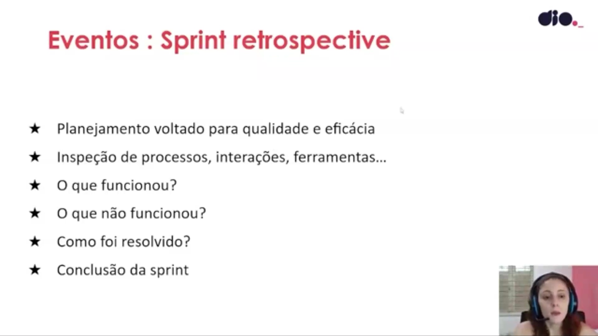

A Sprint Retrospective é o último evento da Sprint, focado na melhoria contínua do time. Nela, o Scrum Team inspeciona seu próprio processo: interações, ferramentas, práticas e comportamentos. As perguntas-chave são: “O que funcionou bem?”, “O que não funcionou?” e “Como resolvemos os problemas?”. O objetivo é identificar ajustes que aumentem a qualidade e a eficácia, gerando um plano de melhorias para a próxima Sprint. Diferente da Review, que olha para o produto, a Retrospective olha para o time e seu modo de trabalho.

  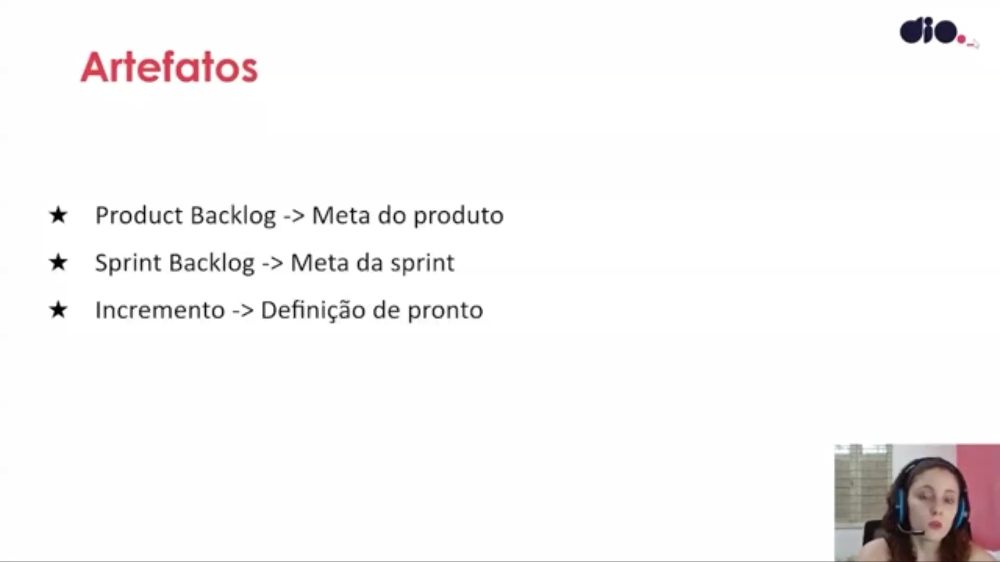

O framework estabelece estruturas organizacionais para que o trabalho transcorra com transparência. Essas estruturas são denominadas Artefatos e cada uma é guiada por um elemento fundamental de compromisso:

- O Product Backlog tem o seu foco de direcionamento atrelado e ancorado à Meta do produto.
- O Sprint Backlog está diretamente associado e tem o compromisso atrelado à Meta da Sprint.
- O resultado final das Sprints, o Incremento, deve ser julgado e atrelado com base no cumprimento rigoroso da Definição de pronto (Definition of Done).

### 🟩 Vídeo 10 - Outros modelos ágeis

<video width="60%" controls>
  <source src="000-Midia_e_Anexos/bootcamp_tqi_fullstack-modulo.08-curso.02-video_10.webm" type="video/webm">
    Seu navegador não suporta vídeo HTML5.
</video>

link do vídeo: https://web.dio.me/track/tqi-fullstack-developer/course/metodologias-ageis-e-ciclo-de-desenvolvimento-de-software/learning/4bc85417-bfaf-4b2d-ae6e-cdc2416e4218?autoplay=1

O vídeo apresenta modelos ágeis menos convencionais, mas altamente eficazes, como o DSDM, o Processo Unificado Ágil (AUP) e o Kanban, destacando suas filosofias, estruturas e aplicações práticas no desenvolvimento de software.

### Anotações

  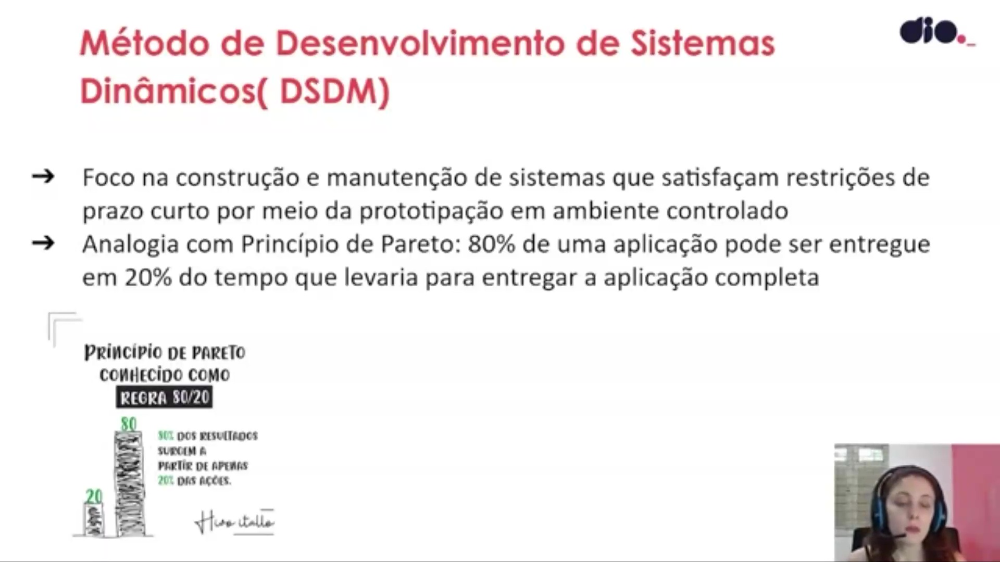

A imagem apresenta o conceito fundamental do Método de Desenvolvimento de Sistemas Dinâmicos (DSDM), que é focado em projetos com restrições de prazo curto. Ela destaca duas ideias principais: a construção e manutenção de sistemas por meio de prototipação em ambiente controlado, e a aplicação do Princípio de Pareto (80/20) ao desenvolvimento de software. Segundo esse princípio, 80% de uma aplicação pode ser entregue em apenas 20% do tempo que seria necessário para entregar a aplicação completa. Isso significa que o DSDM prioriza a entrega rápida do essencial, deixando funcionalidades menos críticas para iterações futuras.

  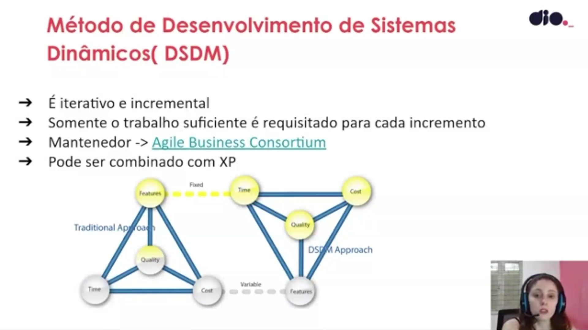

Aqui são apresentadas as características centrais do DSDM. O método é iterativo e incremental, ou seja, o sistema é construído em partes (incrementos) e cada parte é refinada em ciclos repetitivos (iterações). Uma particularidade é que apenas o trabalho suficiente é requisitado para cada incremento, focando no que é realmente necessário naquele momento. O método é mantido pelo *Agile Business Consortium* e pode ser combinado com Extreme Programming (XP), mostrando sua flexibilidade e alinhamento com outras práticas ágeis.

  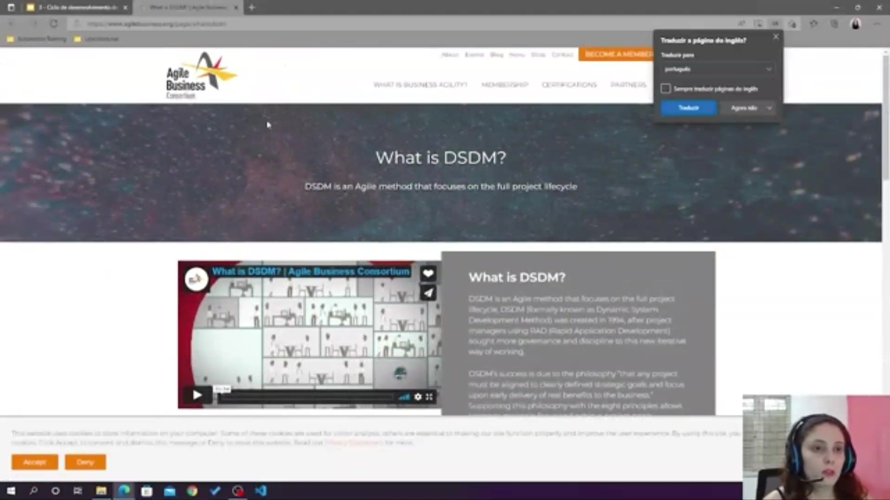

Esta imagem ilustra uma comparação entre a abordagem tradicional de desenvolvimento e a abordagem DSDM, conforme explicado na videoaula. No modelo tradicional, as funcionalidades (escopo) são fixadas desde o início, enquanto o tempo e o custo podem variar para atingir a qualidade desejada. Já no DSDM, o tempo é fixo (prazo curto) e as funcionalidades tornam-se variáveis, priorizando a entrega do que é mais importante dentro do prazo estabelecido, sem comprometer a qualidade. Essa inversão de prioridades é essencial para projetos com restrições temporais rígidas.

  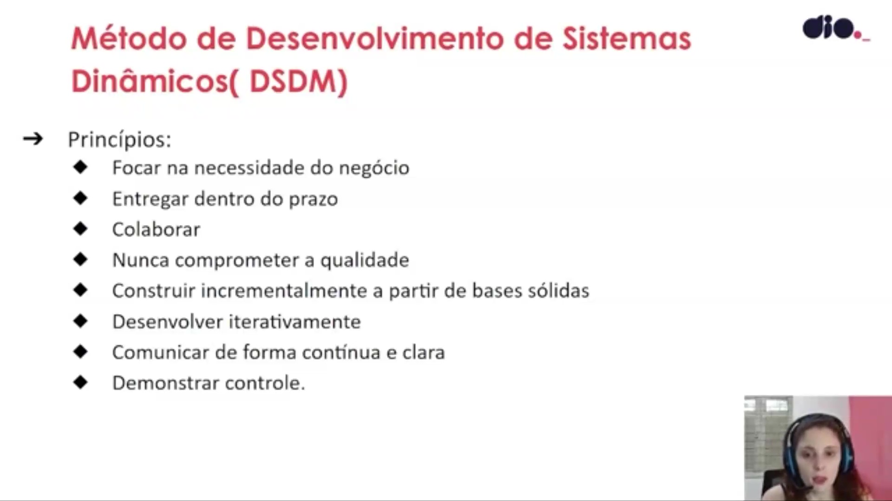

A imagem lista os oito princípios do DSDM, que orientam a aplicação do método. São eles: focar na necessidade do negócio, entregar dentro do prazo, colaborar, nunca comprometer a qualidade, construir incrementalmente a partir de bases sólidas, desenvolver iterativamente, comunicar de forma contínua e clara, e demonstrar controle. Esses princípios reforçam o alinhamento com o Manifesto Ágil, priorizando a entrega de valor, a qualidade e a colaboração, mas com ênfase na gestão rigorosa de prazos e na comunicação constante.

  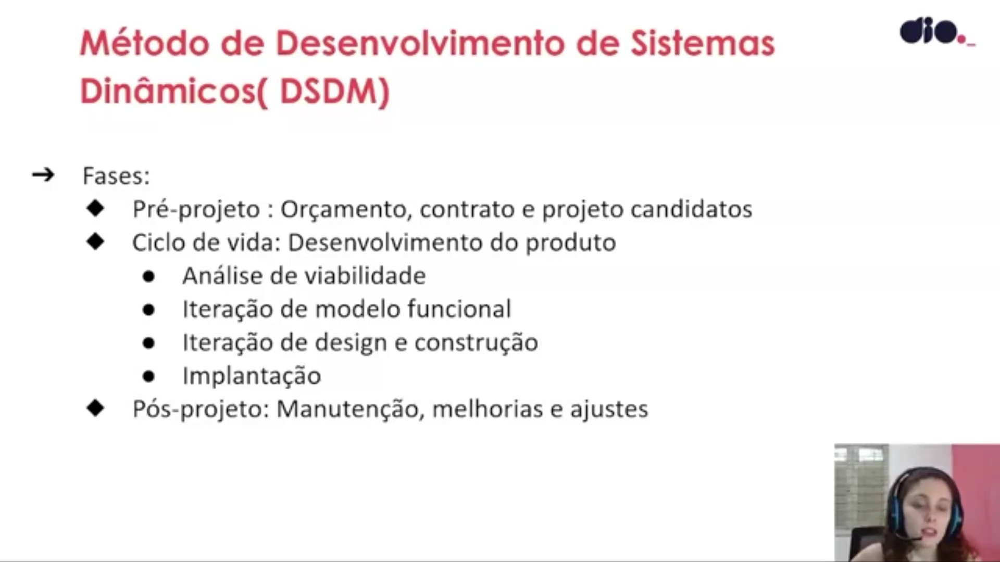

A imagem descreve as fases do ciclo de vida do DSDM, divididas em três grandes blocos: pré-projeto, ciclo de vida do produto e pós-projeto. No pré-projeto, são definidos orçamento, contrato e avaliação de projetos candidatos. O ciclo de vida efetivo começa com a análise de viabilidade, seguida por iterações de modelo funcional (onde a prototipação é usada para refinar requisitos), iterações de design e construção, e finalmente a implantação. O pós-projeto abrange manutenção, melhorias e ajustes contínuos.

  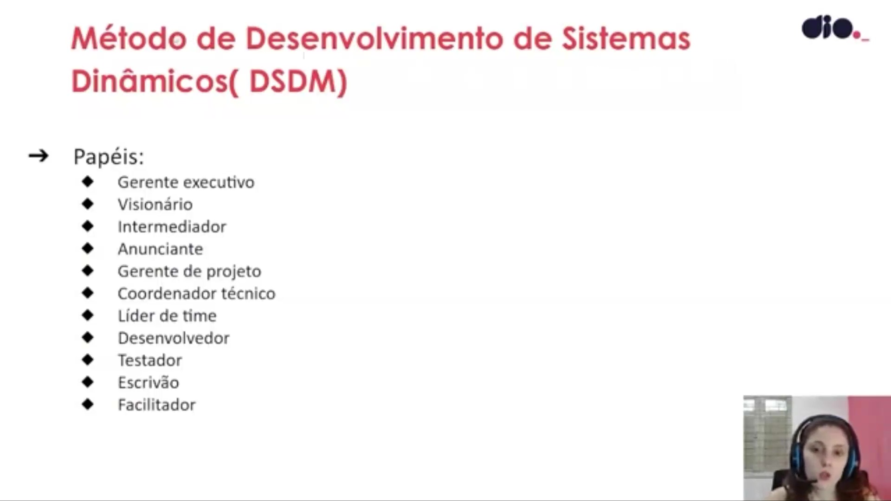

Diferentemente de outros frameworks ágeis mais enxutos, o DSDM define uma estrutura de papéis bem detalhada. A imagem lista os principais papéis envolvidos: gerente executivo, visionário, intermediador, anunciante, gerente de projeto, coordenador técnico, líder de time, desenvolvedor, testador, escrivão e facilitador. Cada um desses papéis tem responsabilidades específicas, o que torna o DSDM adequado para projetos que exigem uma governança mais clara e a participação de múltiplos stakeholders.

  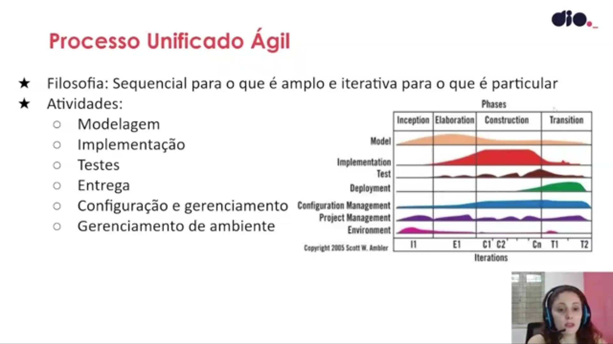

A imagem introduz o Processo Unificado Ágil, uma adaptação do RUP (Rational Unified Process) para contextos ágeis. Sua filosofia combina abordagens sequenciais para o que é amplo (visão macro do projeto) e iterativas para o que é particular (detalhes internos). As atividades principais permanecem as mesmas do processo unificado tradicional: modelagem, implementação, testes, entrega, configuração e gerenciamento, e gerenciamento de ambiente. A diferença está na execução dessas atividades em ciclos iterativos, permitindo maior flexibilidade e adaptação.

  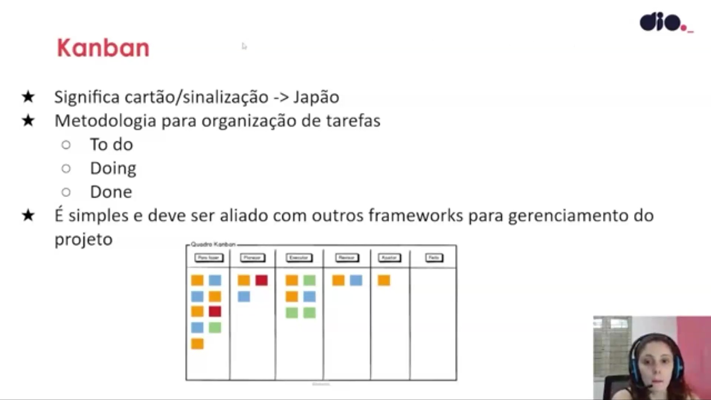

A imagem apresenta o Kanban, uma metodologia visual de organização de tarefas originária do Japão (a palavra significa "cartão" ou "sinalização"). O Kanban é baseado em um quadro com colunas que representam o fluxo de trabalho, tipicamente "To Do" (a fazer), "Doing" (fazendo) e "Done" (concluído). Sua simplicidade permite que seja facilmente combinado com outros frameworks ágeis, como Scrum, para melhorar a transparência e o gerenciamento do fluxo de tarefas. O Kanban não prescreve papéis ou eventos específicos, sendo uma ferramenta adaptável a diferentes contextos.

  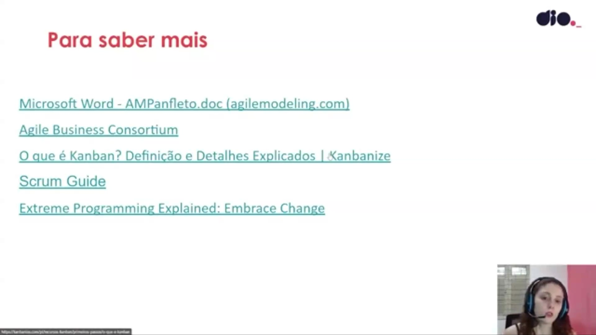

A imagem final traz sugestões de leitura e referências para aprofundamento nos temas abordados na aula. São indicados: o site do *Agile Business Consortium* (mantenedor do DSDM), um artigo sobre Kanban, o Guia do Scrum (Scrum Guide) e o livro *Extreme Programming Explained*. Esses materiais complementam o estudo das metodologias ágeis apresentadas e são recursos valiosos para quem deseja se aprofundar ou buscar certificações.      

## Parte 3 - Testes no mundo ágil

### 🟩 Vídeo 11 - Contextualizando a atividade de teste

<video width="60%" controls>
  <source src="000-Midia_e_Anexos/bootcamp_tqi_fullstack-modulo.08-curso.02-video_11.webm" type="video/webm">
    Seu navegador não suporta vídeo HTML5.
</video>

link do vídeo: https://web.dio.me/track/tqi-fullstack-developer/course/metodologias-ageis-e-ciclo-de-desenvolvimento-de-software/learning/092857c3-3c98-4de9-b259-dde20a489ace?autoplay=1

Esta aula encerra o curso focando na integração das atividades de teste e garantia de qualidade (QA) dentro da metodologia ágil. O objetivo principal é demonstrar que o teste não é uma fase isolada ao final do projeto, mas uma atividade contínua e estratégica que permeia todo o ciclo de desenvolvimento.

### Anotações

  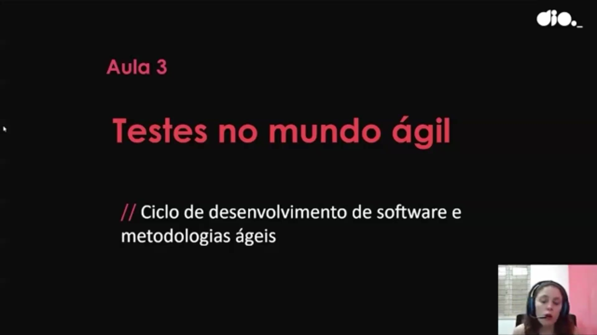

O slide apresenta o título da aula: "Testes no mundo ágil". Ele serve como ponto de partida para a discussão, indicando que o foco não é mais o teste em processos tradicionais, mas sim como a atividade de garantia de qualidade se adapta e se insere nos ciclos de desenvolvimento ágeis. A imagem remete ao ciclo de desenvolvimento, reforçando que os testes são uma parte integrante desse fluxo.

  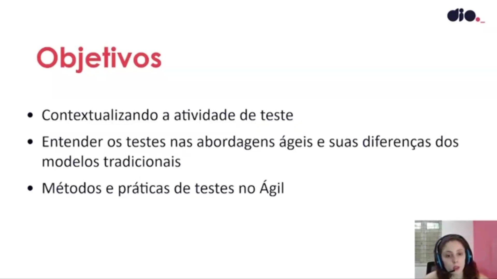

Este slide lista os três objetivos principais que guiarão a aula. Primeiro, busca-se contextualizar a atividade de teste dentro do universo ágil. Em seguida, o objetivo é compreender as particularidades dos testes em abordagens ágeis e como elas se diferenciam dos modelos tradicionais de desenvolvimento. Por fim, a aula apresentará métodos e práticas de testes específicos para o contexto ágil.

  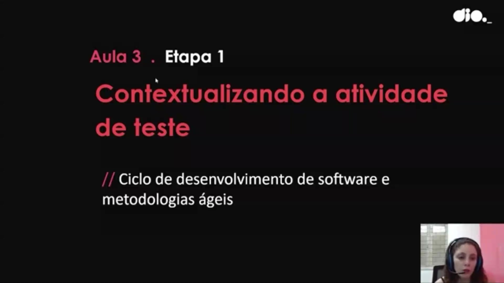

A imagem anuncia o início da primeira etapa da aula, que tem como foco "Contextualizando a atividade de teste". Isso significa que, antes de mergulhar nas práticas específicas, é essencial estabelecer uma base comum sobre o papel e a importância dos testes no ciclo de desenvolvimento de software, preparando o terreno para entender sua aplicação no contexto ágil.

  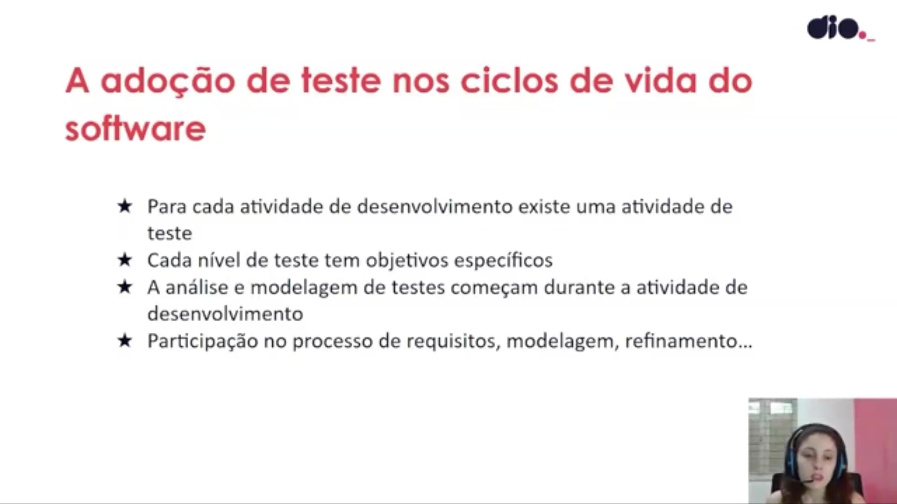

O slide aborda a adoção de testes no ciclo de vida do software, reforçando princípios fundamentais que se aplicam a qualquer metodologia. Ele destaca que a atividade de teste não é um momento isolado, mas sim algo que acompanha todo o desenvolvimento. Cada atividade de desenvolvimento gera uma atividade de teste correspondente, e cada nível de teste (unitário, integração, sistema) possui objetivos específicos. Além disso, a análise e modelagem dos testes devem começar cedo, simultaneamente às atividades de desenvolvimento, com a participação de quem testa desde a fase de requisitos e modelagem.

  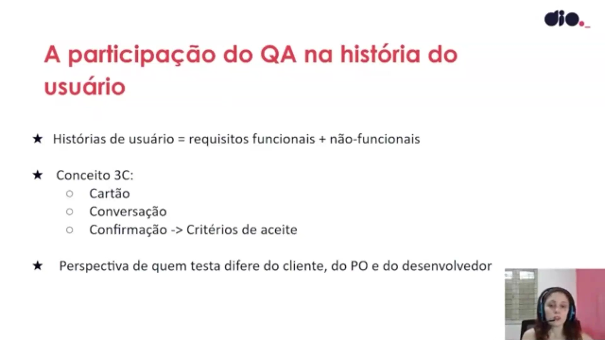

A imagem detalha a participação do profissional de QA (Quality Assurance) no contexto das histórias de usuário (User Stories). Ela explica que as histórias de usuário representam os requisitos, tanto funcionais quanto não funcionais, e são frequentemente estruturadas pelo conceito dos 3Cs: **Cartão** (a descrição da história), **Conversação** (o diálogo para detalhar a funcionalidade) e **Confirmação** (que se desdobra nos critérios de aceite). O ponto crucial é que a perspectiva de quem testa é diferente da visão do cliente, do Product Owner (PO) e do desenvolvedor, o que torna sua participação desde o início essencial para enxergar cenários que outros podem não perceber.

  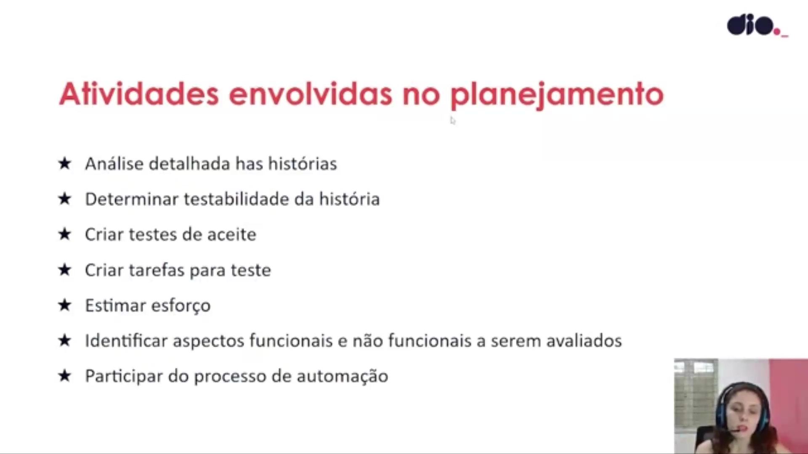

Este slide lista as atividades práticas de planejamento que envolvem o QA no desenvolvimento ágil. O profissional deve realizar uma análise detalhada das histórias, determinar se são "testáveis" (considerando, por exemplo, a complexidade para automação) e criar os testes de aceite com base nos critérios definidos. Também é sua função criar tarefas de teste, estimar o esforço necessário para executá-las (participando de cerimônias como a Planning), e identificar quais aspectos funcionais e não funcionais merecem uma atenção mais crítica. Por fim, o QA deve participar ativamente do processo de automação de testes, atuando como um "guardião da qualidade" que garante a cobertura e a manutenção dos testes automatizados.

  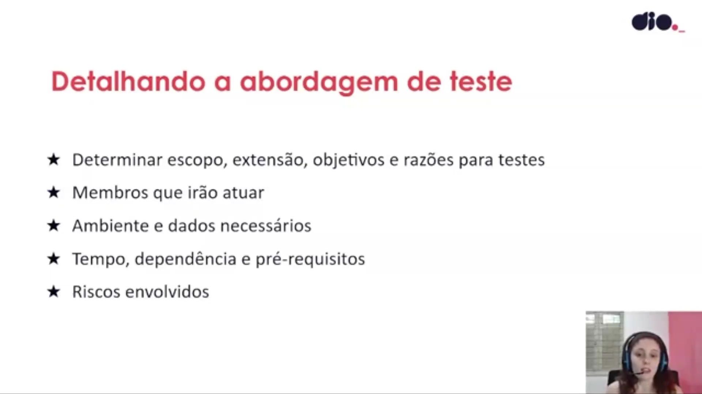

O último slide trata do detalhamento da abordagem de teste no contexto ágil. Embora não seja formalizada em um documento extenso e estático como nos modelos tradicionais, a equipe de QA precisa ter clareza sobre diversos aspectos de forma implícita e colaborativa. É necessário determinar o escopo e os objetivos dos testes, quem serão os responsáveis pela execução, quais ambientes e dados de teste são necessários, e considerar também o tempo disponível, dependências, pré-requisitos e, crucialmente, os riscos envolvidos naquilo que será ou não testado. Essa análise, muitas vezes mental ou registrada de forma leve, é fundamental para o sucesso da qualidade em um ambiente ágil.      

### 🟩 Vídeo 12 - Testes nas abordagens ágeis

<video width="60%" controls>
  <source src="000-Midia_e_Anexos/bootcamp_tqi_fullstack-modulo.08-curso.02-video_12.webm" type="video/webm">
    Seu navegador não suporta vídeo HTML5.
</video>

link do vídeo: https://web.dio.me/track/tqi-fullstack-developer/course/metodologias-ageis-e-ciclo-de-desenvolvimento-de-software/learning/c1085c75-472f-4e17-8066-1b543417044d?autoplay=1

O vídeo explica como as atividades de teste se integram ao desenvolvimento ágil (especialmente no framework Scrum), destacando a mudança de mentalidade do "testador tradicional" para o "guardião da qualidade" em ciclos curtos e iterativos.

### Anotações

  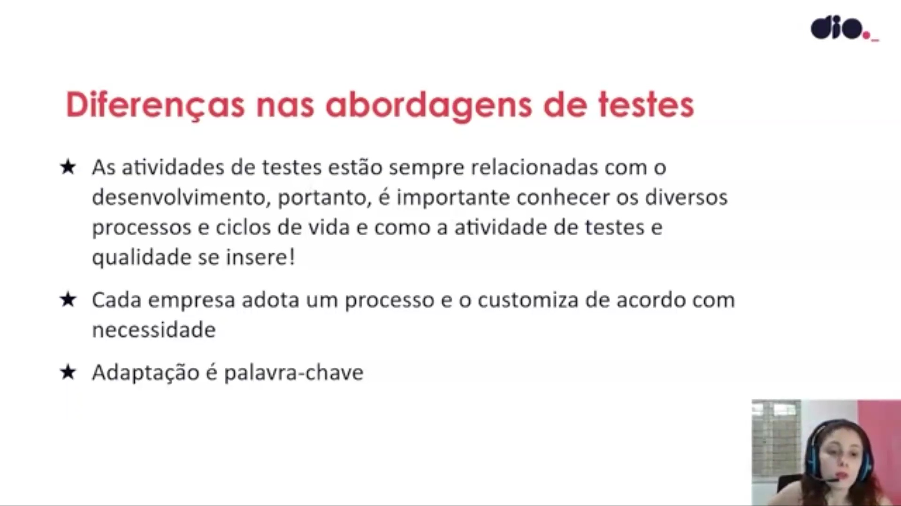

Este slide introduz a ideia fundamental de que as atividades de teste não existem isoladamente; elas estão intrinsecamente ligadas ao processo de desenvolvimento. Por isso, é essencial que o profissional de qualidade conheça diferentes ciclos de vida e processos de software, pois cada empresa adota e customiza suas práticas conforme suas necessidades específicas. A palavra-chave aqui é **adaptação**: não existe uma receita única, e o QA deve ser capaz de ajustar suas abordagens para se adequar ao contexto do projeto e do time.

  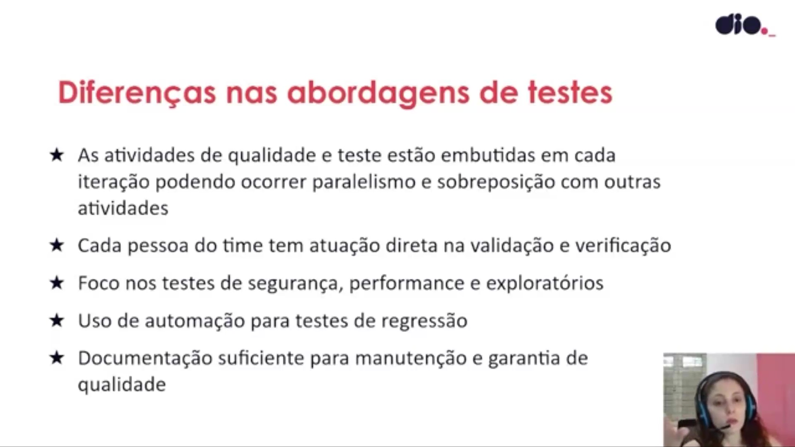

Neste segundo slide, aprofundamos como as práticas de teste se manifestam no dia a dia ágil. As atividades de qualidade e teste estão **embutidas em cada iteração**, podendo ocorrer em paralelo com outras tarefas, como desenvolvimento e refinamento. Isso significa que todos no time (desenvolvedores, PO, QA) têm participação direta na validação e verificação. O foco se desloca para testes mais estratégicos: **segurança, performance e testes exploratórios**, além do uso intensivo de **automação para testes de regressão**, garantindo que novas entregas não quebrem funcionalidades antigas. A documentação, por sua vez, deve ser **suficiente** – nem excessiva, nem escassa – para manter a qualidade sem burocracia.

  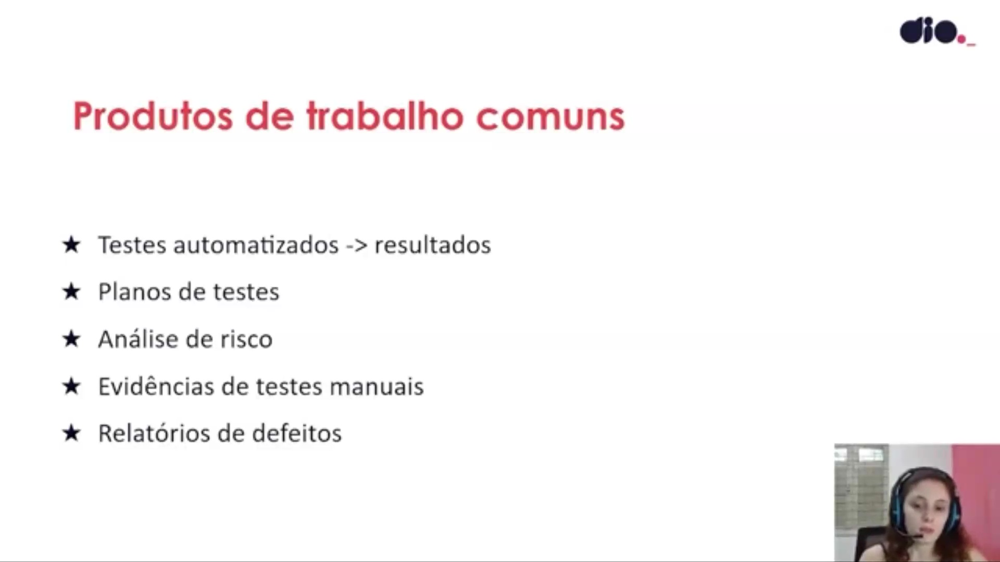

A imagem lista os **produtos de trabalho mais comuns** gerados pelas atividades de teste em contextos ágeis. Diferentemente de modelos tradicionais, esses artefatos devem ser objetivos e diretos, pois a agilidade demanda respostas rápidas. Os principais são:
- **Resultados de testes automatizados** – relatórios sintéticos que mostram falhas e sucessos.
- **Planos de teste** – mesmo em times ágeis, planeja-se o escopo, mas de forma enxuta.
- **Análise de risco** – identifica pontos críticos que podem impactar o usuário ou o negócio.
- **Evidências de testes manuais** – capturas ou logs que comprovam a execução.
- **Relatórios de defeitos** – registro claro e conciso dos problemas encontrados, facilitando a correção.

  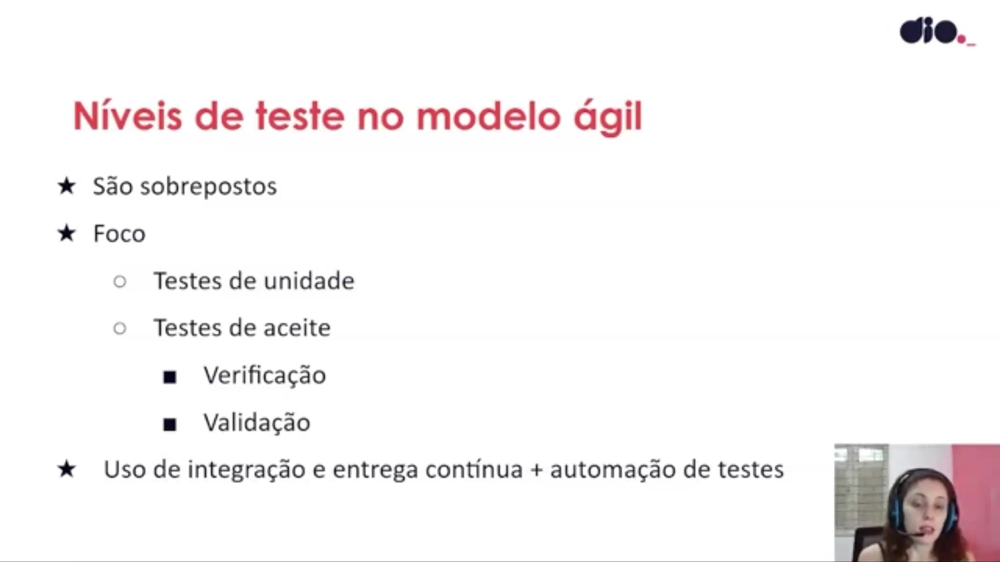

No modelo ágil, os níveis de teste não são estanques; eles **se sobrepõem** para garantir detecção precoce de defeitos. O foco principal está em dois níveis:
- **Testes de unidade** – a base da pirâmide de testes, executados pelos desenvolvedores para verificar partes isoladas do código.
- **Testes de aceite** – validam se a funcionalidade atende aos critérios definidos com o cliente, envolvendo verificação (o sistema foi construído corretamente?) e validação (construímos o produto certo?).

Além disso, a integração e entrega contínuas (CI/CD) são aliadas essenciais, permitindo que a automação execute esses testes de forma recorrente e dê feedback rápido à equipe.

  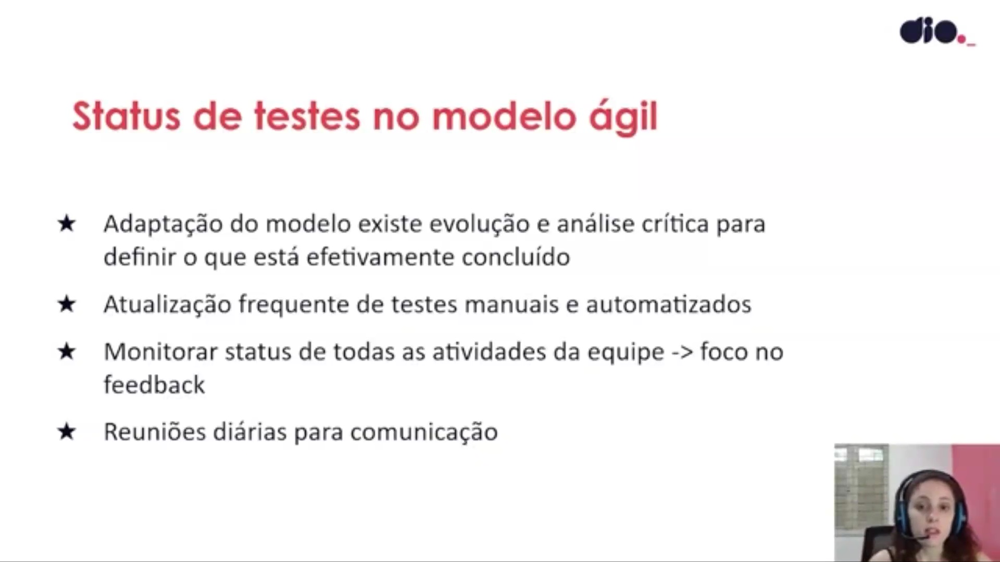

O acompanhamento do **status dos testes** em times ágeis é dinâmico e transparente. Como o processo é adaptativo, a equipe evolui e revisa constantemente o que significa "concluído" (Definition of Done). Para isso, é necessário:
- Atualizar com frequência os testes manuais e automatizados, refletindo mudanças no código.
- Monitorar o andamento de todas as atividades, com **foco no feedback** rápido, não na burocracia.
- Utilizar as **reuniões diárias** como momento de comunicação, onde cada membro, inclusive o QA, compartilha progressos, impedimentos e descobertas.

Essa prática garante que a qualidade seja inspecionada continuamente e que ajustes sejam feitos em tempo hábil.

  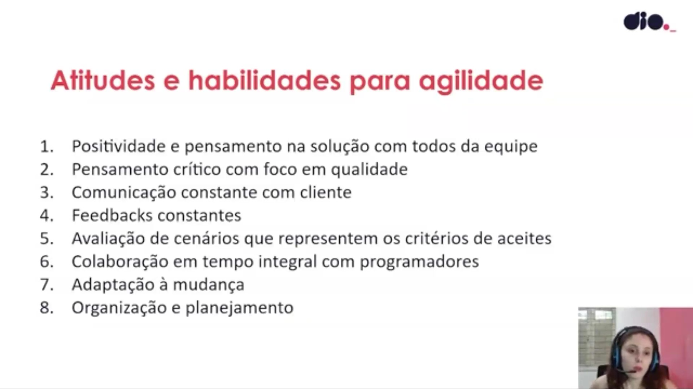

Além de técnicas e processos, a atuação em um time ágil exige **atitudes e habilidades** específicas. O slide enumera oito competências essenciais para quem trabalha com qualidade:
1. **Positividade e pensamento na solução** – colaborar para resolver problemas, não apenas apontá-los.
2. **Pensamento crítico com foco em qualidade** – questionar e avaliar sob a ótica do usuário.
3. **Comunicação constante com o cliente** – garantir alinhamento sobre expectativas.
4. **Feedbacks constantes** – dar e receber retornos de forma contínua.
5. **Avaliação de cenários que representem os critérios de aceite** – traduzir requisitos em testes significativos.
6. **Colaboração em tempo integral com programadores** – parceria próxima para evitar retrabalho.
7. **Adaptação à mudança** – flexibilidade para ajustar prioridades e abordagens.
8. **Organização e planejamento** – mesmo com dinamismo, é preciso estruturar o trabalho.

  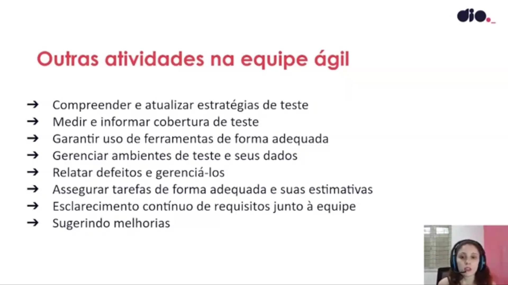

Por fim, o slide apresenta as **atividades práticas** que um profissional de qualidade desempenha em um ambiente ágil. Elas vão além da execução de testes e incluem:
- Compreender e atualizar as estratégias de teste conforme o projeto evolui.
- Medir e informar a cobertura dos testes, garantindo visibilidade.
- Garantir o uso adequado de ferramentas de automação e apoio.
- Gerenciar ambientes de teste e os dados necessários para as execuções.
- Relatar e gerenciar defeitos de forma estruturada.
- Assegurar que as tarefas de teste sejam bem estimadas e planejadas.
- Esclarecer continuamente os requisitos junto à equipe, evitando ambiguidades.
- Sugerir melhorias no processo e no produto, atuando como agente de evolução da qualidade.      

### 🟩 Vídeo 13 - Métodos de testes nos modelos ágeis

<video width="60%" controls>
  <source src="000-Midia_e_Anexos/bootcamp_tqi_fullstack-modulo.08-curso.02-video_13.webm" type="video/webm">
    Seu navegador não suporta vídeo HTML5.
</video>
link do vídeo: https://web.dio.me/track/tqi-fullstack-developer/course/metodologias-ageis-e-ciclo-de-desenvolvimento-de-software/learning/75cfb364-4f7d-46d9-b7ff-a4a8675e2eb4?autoplay=1

### 🟩 Vídeo 14 - Conclusão

<video width="60%" controls>
  <source src="000-Midia_e_Anexos/bootcamp_tqi_fullstack-modulo.08-curso.02-video_14.webm" type="video/webm">
    Seu navegador não suporta vídeo HTML5.
</video>
link do vídeo:

##  Materiais de Apoio

# Certificado: 

- Link na plataforma: 
- Certificado em pdf: