## Instrutor

- Carolina Santana Louzada
- Perfil no Github: https://github.com/CarolinaSL

## Parte 1 - Introdução

### 🟩 Vídeo 01 - Introdução

<video width="60%" controls>
  <source src="000-Midia_e_Anexos/bootcamp_tqi_fullstack-modulo.08-curso.03-video_01.webm" type="video/webm">
    Seu navegador não suporta vídeo HTML5.
</video>

link do vídeo: https://web.dio.me/track/tqi-fullstack-developer/course/introducao-a-testes-de-software/learning/0c6e3021-7351-4a64-8f69-3e8cebc221fa?autoplay=1

Curso introdutório sobre a disciplina de testes na engenharia de software.

### Anotações

  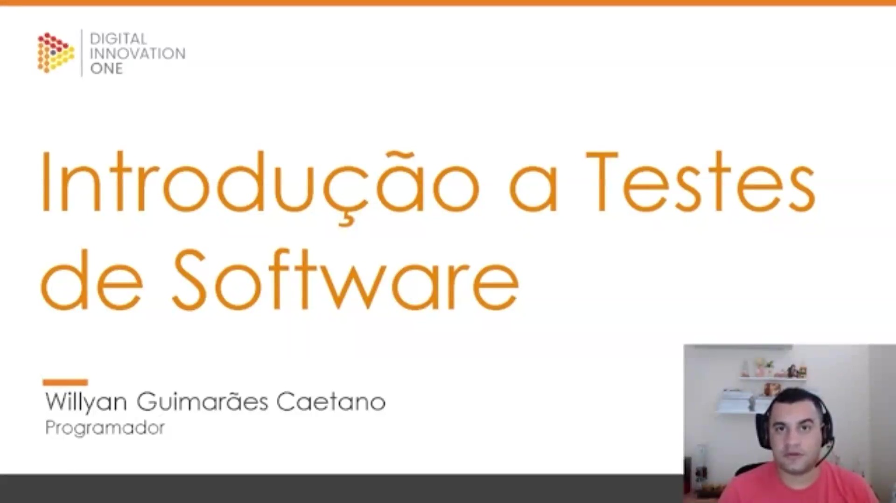

Este slide de abertura apresenta o título do curso **“Introdução a Testes de Software”** e o nome do instrutor, **Willyan Guimarães Caetano**. É o ponto de partida da nossa jornada: a partir daqui começaremos a explorar os fundamentos, a importância e as aplicações dos testes no desenvolvimento de software.

  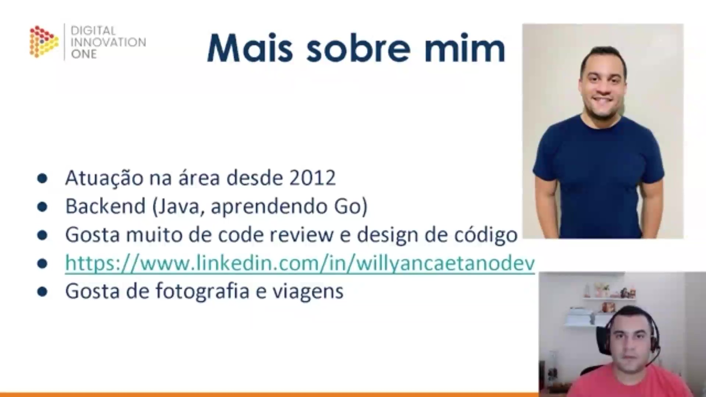

Agora conhecemos um pouco mais sobre o instrutor. Willyan atua na área desde 2012, com foco em desenvolvimento backend – especialmente em Java (no qual é certificado) e, mais recentemente, estudando Go. Ele compartilha seu interesse por code review e design de código, práticas fundamentais para a construção de software de qualidade. O slide também traz seu LinkedIn para contato profissional e menciona seus hobbies: fotografia e viagens, mostrando um lado pessoal que equilibra a vida profissional.

  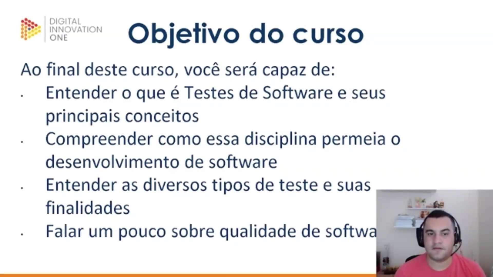

Este slide resume os **objetivos do curso**. Ao final, espera-se que você seja capaz de:
- Entender o conceito de testes de software e sua terminologia principal;
- Compreender como os testes se integram ao processo de desenvolvimento;
- Conhecer os diferentes tipos de teste (unitários, integração, sistema, etc.) e suas finalidades;
- Discutir noções básicas sobre qualidade de software.
Esses pontos nortearão todo o conteúdo que será abordado nas próximas aulas.

  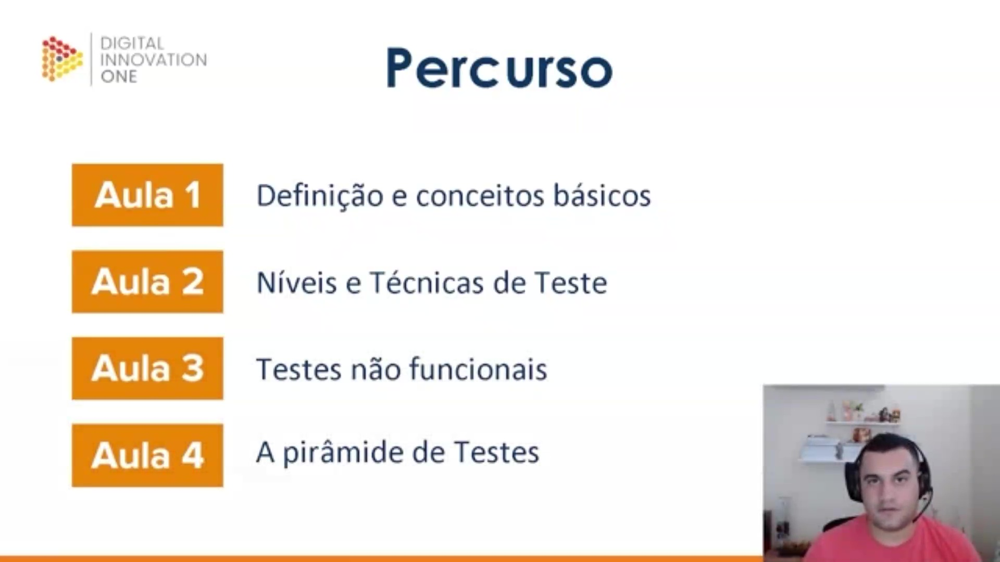

O **percurso do curso** está organizado em quatro aulas:
- **Aula 1 – Definição e conceitos básicos**: introdução à terminologia e fundamentos dos testes.
- **Aula 2 – Níveis e Técnicas de Teste**: exploração dos níveis (unitário, integração, sistema) e técnicas (caixa preta, caixa branca).
- **Aula 3 – Testes não funcionais**: abordagem de requisitos como desempenho, segurança e usabilidade.
- **Aula 4 – A pirâmide de Testes**: apresentação da estratégia de automação e do equilíbrio entre os diferentes tipos de teste.

Essa estrutura progressiva garante uma aprendizagem sólida e aplicável.      

## Parte 2 - Definição e conceitos básicos

### 🟩 Vídeo 02 - Definição de Testes

<video width="60%" controls>
  <source src="000-Midia_e_Anexos/bootcamp_tqi_fullstack-modulo.08-curso.03-video_02.webm" type="video/webm">
    Seu navegador não suporta vídeo HTML5.
</video>

link do vídeo: https://web.dio.me/track/tqi-fullstack-developer/course/introducao-a-testes-de-software/learning/da0d3708-1f93-4f86-8661-2fcb26833655?autoplay=1

Esta aula inaugural estabelece a base para o entendimento do teste de software como uma disciplina crítica da Engenharia de Software. O foco vai além da simples detecção de erros, explorando o impacto psicológico e financeiro das falhas no mundo real, além de definir formalmente o que significa "testar" e quais são as limitações intrínsecas dessa atividade.

### Anotações

  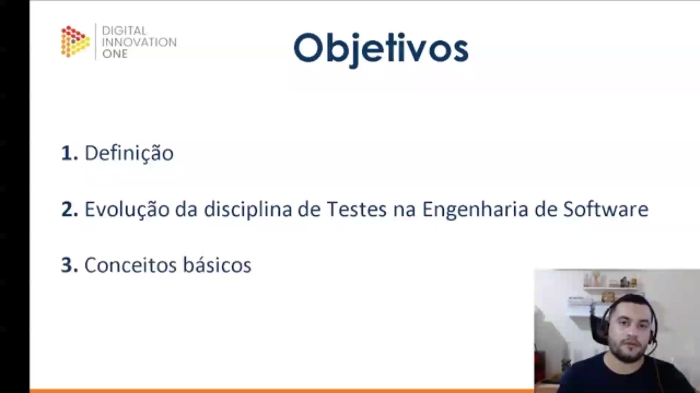

Este slide apresenta a estrutura geral da aula, listando os três tópicos principais que serão abordados: a definição de teste de software, a evolução dessa disciplina no contexto da engenharia de software e os conceitos básicos que fundamentam a área.

  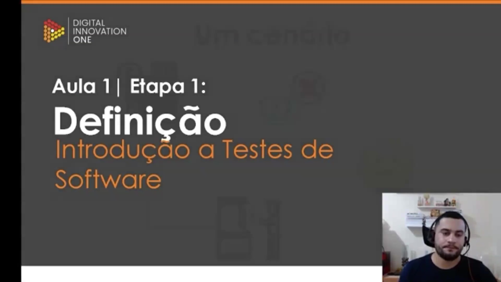

A imagem marca o início da primeira etapa da aula, dedicada à definição de teste de software. O título "Introdução a Testes de Software" contextualiza o espectador para os conceitos introdutórios que serão explorados.

  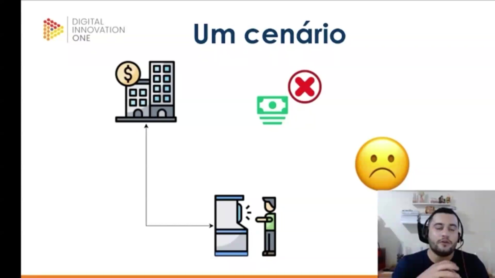

Conteúdo não identificado com segurança a partir do material disponível.

  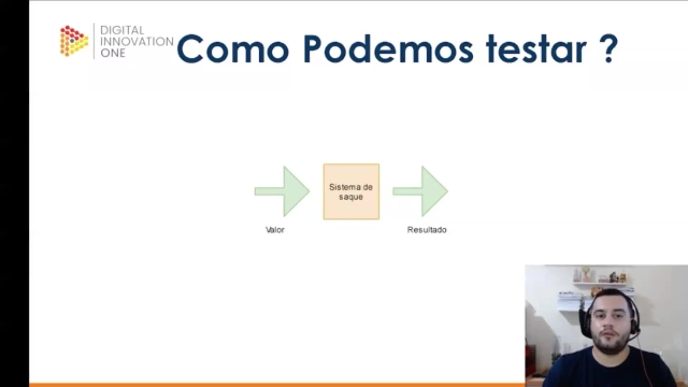

O slide levanta a questão central sobre as formas de testar um software. A pergunta "Como podemos testar?" introduz a reflexão sobre metodologias, níveis e tipos de teste que serão detalhados ao longo da disciplina.

  

A imagem reúne manchetes reais que ilustram falhas em sistemas de software e seus impactos: transtornos para usuários, prejuízos financeiros e bugs de grande repercussão. Esses exemplos concretos evidenciam a relevância dos testes para evitar ou minimizar problemas em produção.

  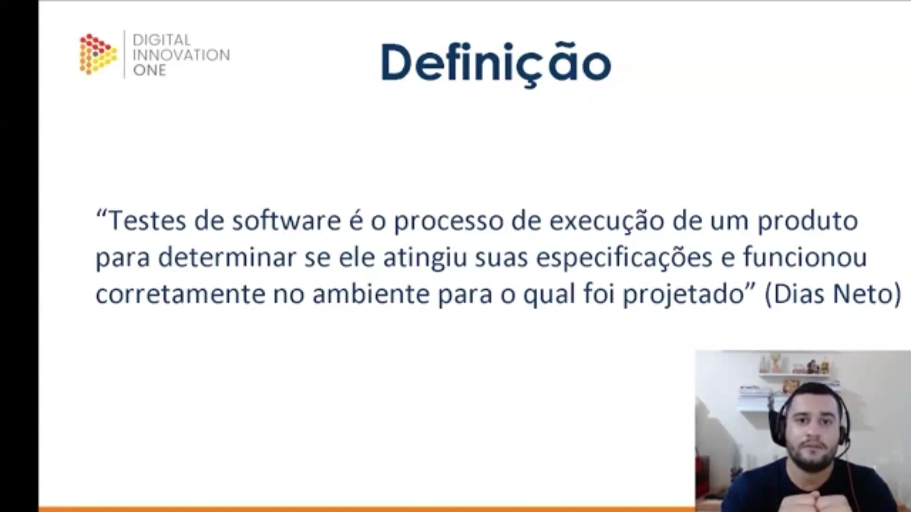

O slide apresenta a definição de teste de software segundo Dias Neto, destacando o teste como um processo de execução do produto para verificar se ele atende às especificações e funciona corretamente no ambiente para o qual foi projetado. Essa definição enfatiza o caráter de validação e verificação da atividade.

  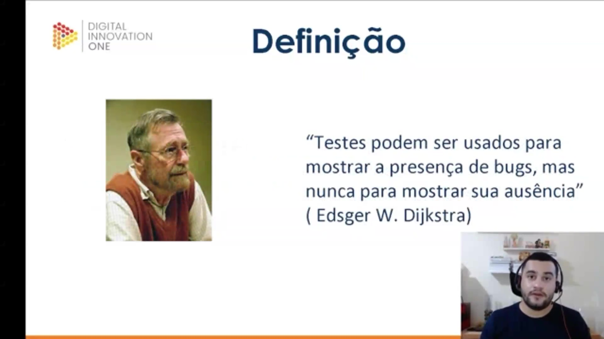

A célebre frase de Edsger W. Dijkstra resume uma verdade fundamental sobre testes: eles podem revelar a existência de defeitos, mas jamais provar a ausência total deles. O slide reforça o objetivo dos testes como uma atividade de busca por falhas, não de certificação de correção absoluta.

  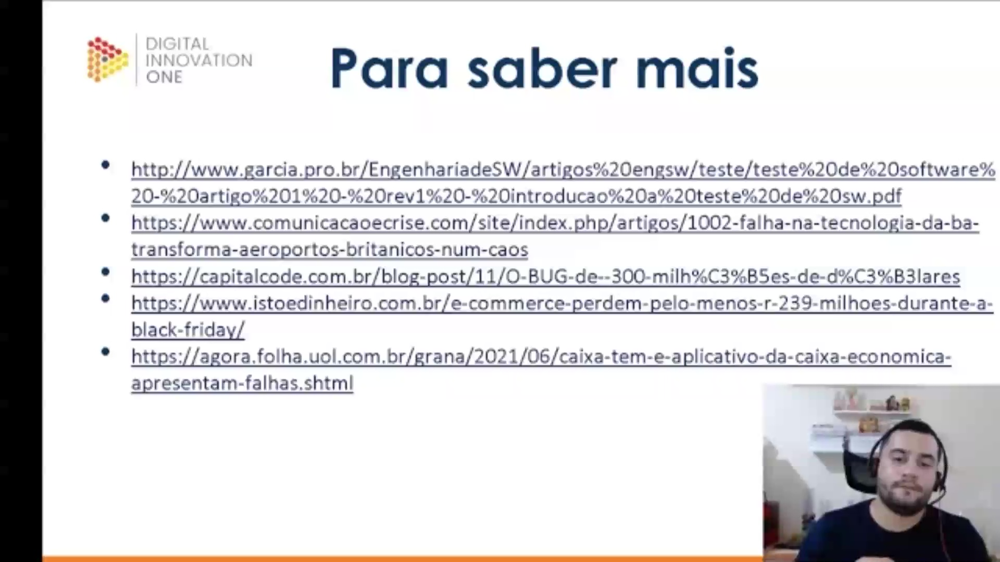

A seção "Para saber mais" disponibiliza links para artigos e notícias que aprofundam os exemplos de bugs e prejuízos mencionados anteriormente, além de textos introdutórios sobre teste de software. Esses recursos complementares permitem que o aluno explore os casos reais e amplie seu conhecimento sobre a importância dos testes.      

### 🟩 Vídeo 03 - Evolução de Testes na Engenharia de Software

<video width="60%" controls>
  <source src="000-Midia_e_Anexos/bootcamp_tqi_fullstack-modulo.08-curso.03-video_03.webm" type="video/webm">
    Seu navegador não suporta vídeo HTML5.
</video>

link do vídeo: https://web.dio.me/track/tqi-fullstack-developer/course/introducao-a-testes-de-software/learning/662cb408-c15e-4f5e-b05b-3756579b37be?autoplay=1

O vídeo aborda a transição histórica e metodológica dos testes de software, contrastando o modelo tradicional Cascata com as modernas Metodologias Ágeis. O foco está em como a qualidade deixou de ser uma etapa final para se tornar um processo contínuo e integrado.

### Anotações

  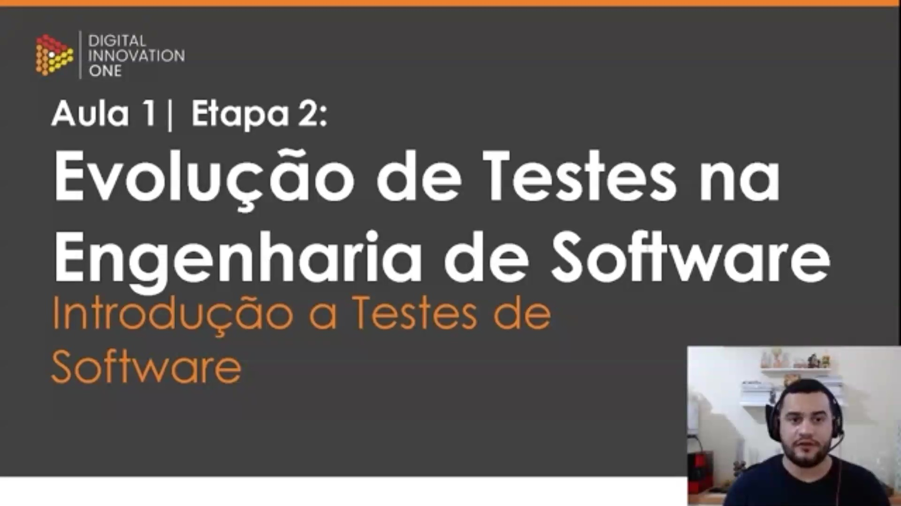

Esta é a tela de abertura da aula, apresentando o título **"Evolução de Testes na Engenharia de Software"** e indicando que se trata da **Etapa 2 da Aula 1** do curso de Introdução a Testes de Software. O objetivo desta etapa é compreender como as práticas de teste evoluíram ao longo do tempo, acompanhando as mudanças nos processos de desenvolvimento, desde abordagens tradicionais até as metodologias ágeis.

  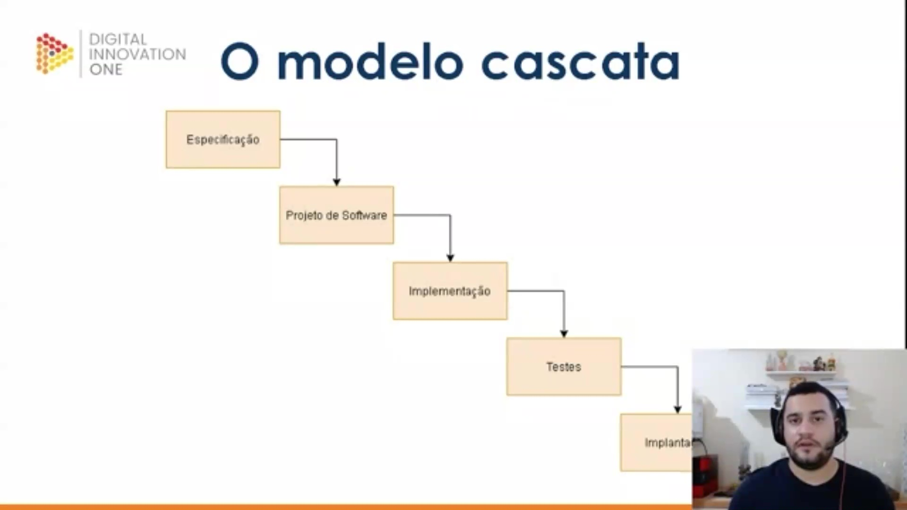

O slide ilustra o **modelo cascata** (*waterfall*), um dos primeiros processos de desenvolvimento de software. Nele, as fases são executadas de forma sequencial e rígida: especificação de requisitos, projeto, implementação, testes e implantação. Cada fase depende da conclusão da anterior, e não há retorno. Nesse contexto, os testes eram realizados apenas no final, geralmente por uma equipe separada, que verificava se o software estava de acordo com a especificação. Essa abordagem limitava a interação entre desenvolvimento e teste, tornando o processo mais lento e sujeito a erros.

  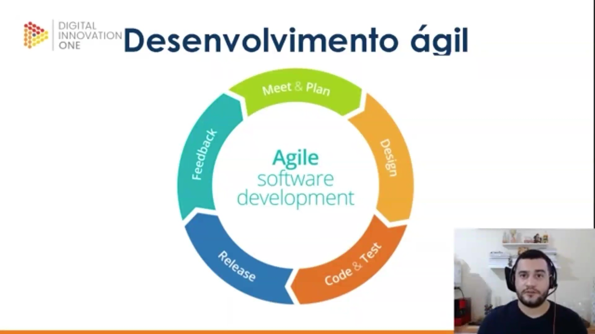

O **desenvolvimento ágil** trouxe uma mudança de paradigma, baseada em ciclos iterativos e incrementais. Como mostra o slide, o processo é contínuo: a cada iteração, as atividades de análise, projeto, desenvolvimento e testes são realizadas de forma integrada. Isso aproxima o teste do desenvolvimento, permitindo feedback rápido e correções precoces. Surgem práticas como TDD (*Test-Driven Development*), integração contínua e automação de testes. Além disso, a responsabilidade pela qualidade é compartilhada por todo o time, incluindo desenvolvedores e profissionais de QA (*Quality Assurance*).

  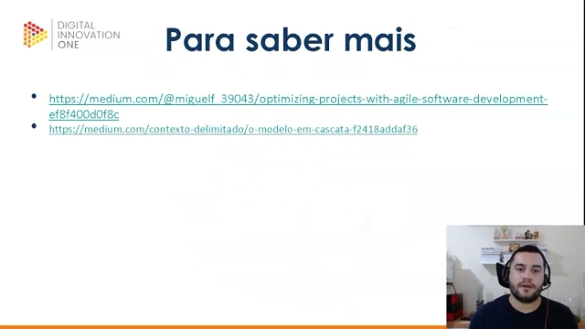

Neste slide, são disponibilizados **links complementares** para aprofundamento nos temas abordados: um artigo sobre otimização de projetos com desenvolvimento ágil e outro sobre o modelo cascata. Esses recursos ajudam a consolidar o entendimento sobre os processos de desenvolvimento e a evolução dos testes. O instrutor também reforça o convite para participar do fórum e da comunidade no Discord para tirar dúvidas.      

### 🟩 Vídeo 04 - Conceitos básicos

<video width="60%" controls>
  <source src="000-Midia_e_Anexos/bootcamp_tqi_fullstack-modulo.08-curso.03-video_04.webm" type="video/webm">
    Seu navegador não suporta vídeo HTML5.
</video>

link do vídeo: https://web.dio.me/track/tqi-fullstack-developer/course/introducao-a-testes-de-software/learning/ac4a1a8c-b6a1-4184-9e9b-fad69852fc89?autoplay=1

O vídeo resume os conceitos fundamentais apresentados na primeira aula do curso de Teste de Software, focando na terminologia técnica essencial e nas distinções entre processos de qualidade.

### Anotações

  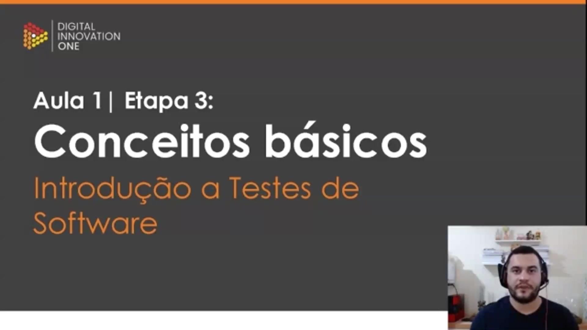

Este slide apresenta o título da primeira aula e sua etapa inicial, introduzindo os conceitos fundamentais que serão abordados no curso de Testes de Software. A imagem funciona como uma abertura, situando o estudante no tema central da aula: os conceitos básicos da área. A partir daqui, serão exploradas as definições essenciais para compreender o universo dos testes, como defeito, erro e falha, além de verificação e validação.

  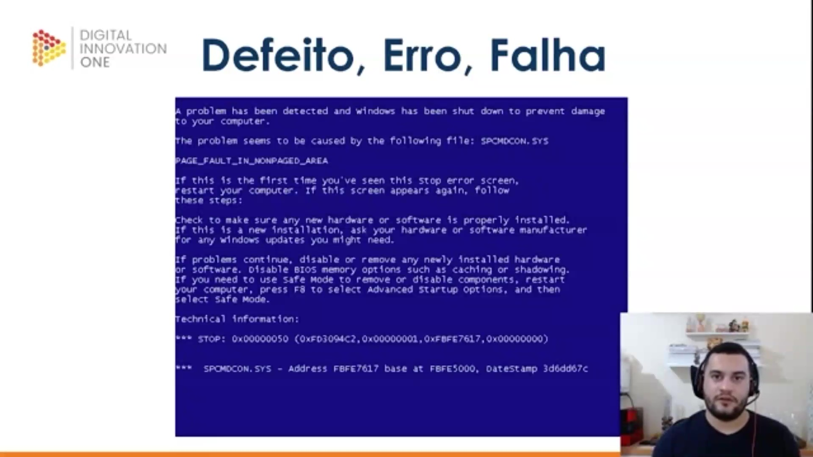

O slide destaca três termos frequentemente confundidos no dia a dia, mas que possuem significados técnicos distintos na engenharia de software. **Defeito** (ou bug) é a causa raiz, um problema na implementação – por exemplo, uma linha de código escrita incorretamente. **Erro** é a ação humana que origina o defeito, como um equívoco do desenvolvedor ao interpretar um requisito. Já **falha** é o comportamento incorreto observado pelo usuário quando o sistema executa o trecho com defeito; a clássica "tela azul" do Windows é um exemplo de falha, pois representa a manifestação visível de um erro. Compreender essa hierarquia ajuda a identificar e corrigir problemas de forma mais precisa.

  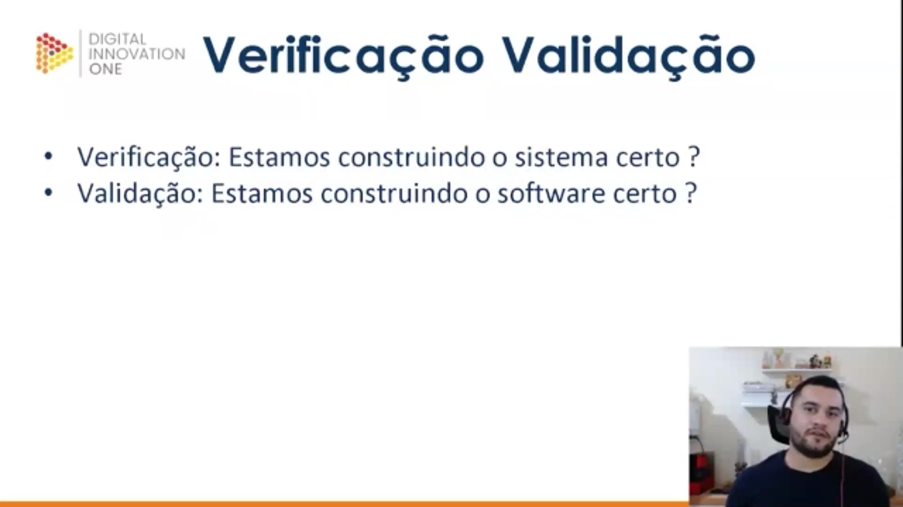

O slide apresenta duas perguntas-chave que definem os conceitos de verificação e validação. **Verificação** pergunta: “Estamos construindo o sistema certo?” – ou seja, o software está sendo desenvolvido de acordo com as especificações técnicas, documentos e requisitos levantados? É um processo mais interno, que checa se o produto foi construído corretamente. **Validação** pergunta: “Estamos construindo o software certo?” – aqui o foco é o usuário e o negócio: o sistema realmente atende às necessidades e expectativas de quem irá utilizá-lo? Um sistema pode ser construído tecnicamente perfeito (verificado), mas não resolver o problema do usuário (não validado). Ambos são complementares e essenciais para a qualidade.

  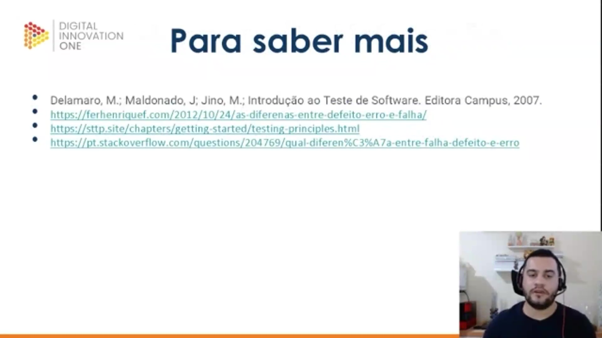

A última imagem reúne referências bibliográficas e links para aprofundamento nos tópicos discutidos. O livro "Introdução ao Teste de Software", de Delamaro, Maldonado e Jino (Editora Campus, 2007), é uma obra clássica que aborda de forma completa os fundamentos da área. Os links complementares direcionam para artigos e discussões em comunidades técnicas, onde é possível explorar exemplos práticos e esclarecer dúvidas sobre as diferenças entre defeito, erro e falha. Esses materiais são recomendados para quem deseja consolidar o conhecimento e continuar os estudos em testes de software.      

## Parte 3 - Níveis e técnicas de teste

### 🟩 Vídeo 05 - Níveis de Teste

<video width="60%" controls>
  <source src="000-Midia_e_Anexos/bootcamp_tqi_fullstack-modulo.08-curso.03-video_05.webm" type="video/webm">
    Seu navegador não suporta vídeo HTML5.
</video>

link do vídeo: https://web.dio.me/track/tqi-fullstack-developer/course/introducao-a-testes-de-software/learning/ac4a1a8c-b6a1-4184-9e9b-fad69852fc89?autoplay=1

O vídeo resume os principais conceitos da segunda aula do curso de Introdução a Teste de Software, explorando desde as menores unidades de código até a validação final pelo usuário.

### Anotações

  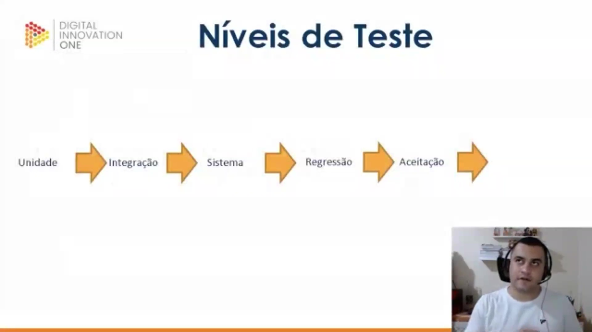

A imagem exibe um trecho de código de teste de unidade escrito em Python, utilizando o módulo `unittest`. Observa-se a definição de uma classe de teste que herda de `unittest.TestCase` e métodos que iniciam com `test_`, cada um verificando uma pequena funcionalidade isolada – como operações matemáticas ou manipulação de strings – por meio de asserções (`assertEqual`, `assertTrue` etc.). Esse é o exemplo típico da primeira etapa de validação de software: garantir que cada unidade (função/método) funcione corretamente de forma independente.

  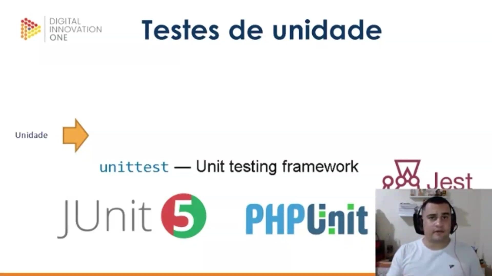

A imagem apresenta os nomes e logotipos de quatro frameworks de teste de unidade amplamente utilizados: **unittest** (Python), **JUnit 5** (Java), **PHPUnit** (PHP) e **Jest** (JavaScript). Cada um deles segue o mesmo princípio: permitir que o desenvolvedor escreva e execute testes automatizados para pequenas partes do código, como funções e métodos. O slide reforça que o conceito de teste unitário é independente de linguagem, existindo ferramentas específicas para cada ecossistema.

  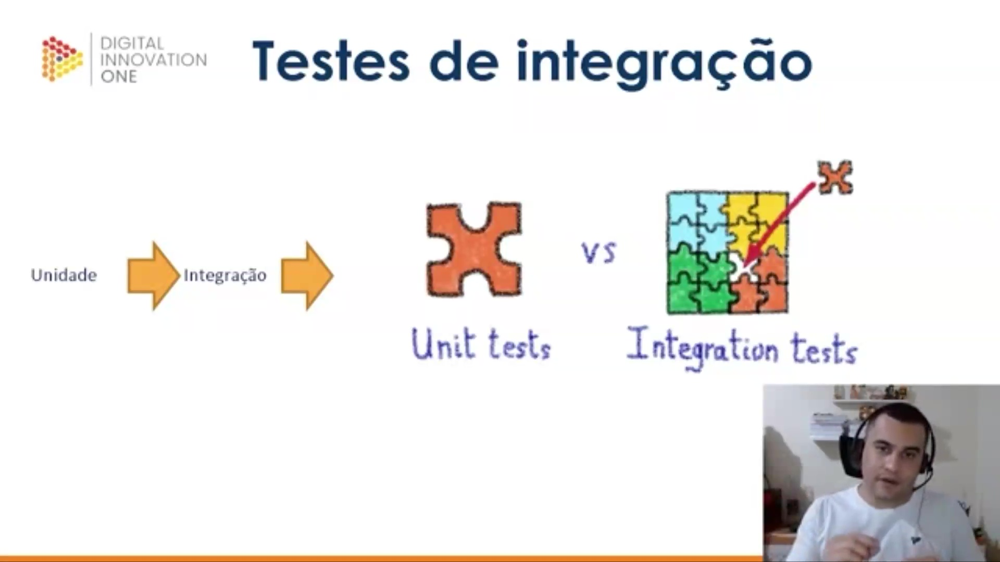

A imagem ilustra a diferença entre **testes de unidade** e **testes de integração** por meio de dois blocos. O bloco menor (unidade) representa os testes focados em partes isoladas do código. O bloco maior (integração) mostra a combinação dessas unidades, frequentemente envolvendo interações com bancos de dados, APIs ou outros componentes externos. O objetivo do teste de integração é validar se os módulos funcionam corretamente quando combinados, garantindo que a comunicação entre eles ocorra sem falhas.

  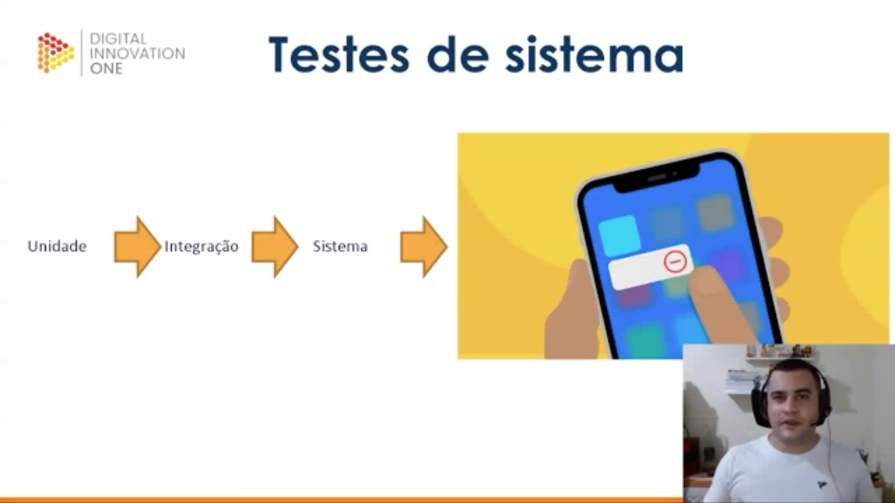

O slide traz o título **Testes de sistema** e remete ao momento em que uma versão estável ou minimamente estável do software é implantada em um ambiente de homologação. Nessa fase, o sistema é testado como um todo, simulando o uso real por usuários ou testadores, que interagem com a interface gráfica, APIs ou linhas de comando para verificar se todas as funcionalidades atendem aos requisitos especificados. É uma validação de mais alto nível, focada no comportamento completo da aplicação.

  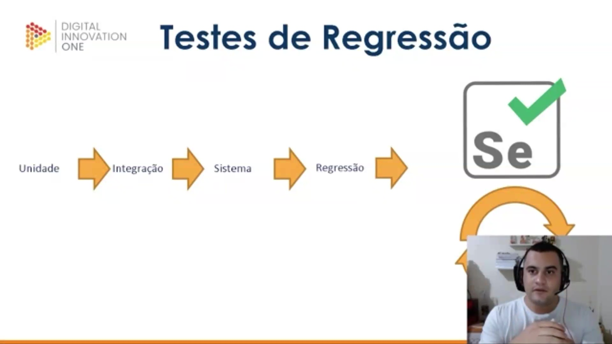

A imagem aborda o conceito de **testes de regressão**, representado por um ciclo que indica a reavaliação contínua do software. O teste de regressão consiste em executar novamente os testes já existentes (unitários, integração, sistema) sempre que novas funcionalidades ou correções são adicionadas, garantindo que o que já funcionava não seja quebrado pelas alterações. Ferramentas como **Selenium** são citadas como exemplo de automação que permite simular ações do usuário em um navegador para verificar se o sistema continua operando conforme o esperado após mudanças.

  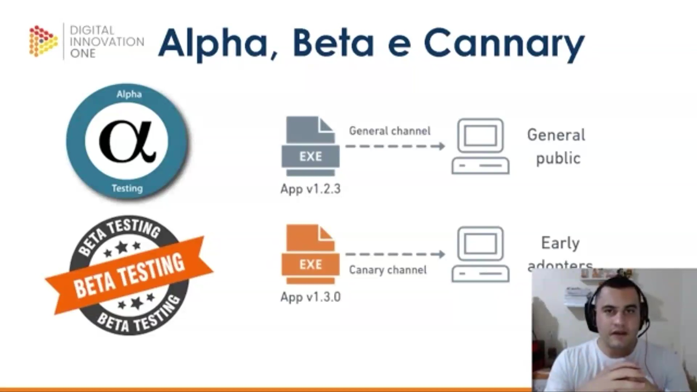

O código mostrado é um exemplo de script de teste automatizado com **Selenium WebDriver**. Nele, vemos comandos para abrir um navegador, acessar uma URL, preencher campos de formulário (como login e senha), clicar em botões e verificar se determinados elementos aparecem na página. Esse tipo de teste é usado tanto para testes de sistema quanto para regressão, pois permite repetir rapidamente cenários completos de uso da aplicação web, assegurando que interações complexas continuem funcionando após alterações no código.

  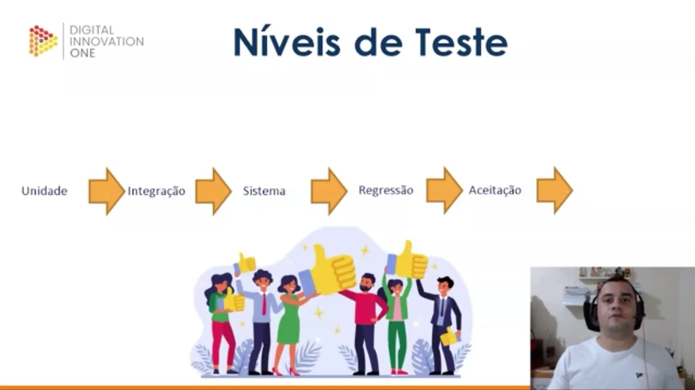

O slide apresenta as estratégias de **testes alfa, beta e canary**, que são formas de validar o software com usuários reais antes de um lançamento completo.  
- **Alfa**: versão inicial disponibilizada para um grupo restrito (geralmente interno), ainda com possibilidade de ajustes.  
- **Beta**: versão mais madura, liberada para um público maior (clientes estratégicos ou comunidade) para obter feedback.  
- **Canary**: estratégia de deploy onde a nova versão é lançada gradualmente, inicialmente para uma pequena parcela de usuários, enquanto a maioria continua na versão estável; após validação, a atualização é expandida para todos. A imagem ilustra essa ideia com duas versões (1.2.3 e 1.3.0) e diferentes públicos.

  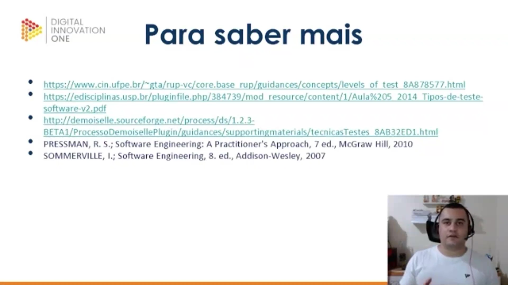

A imagem exibe um trecho de um cenário escrito em **Gherkin**, linguagem usada no **Behavior Driven Development (BDD)**. O formato segue a estrutura “Dado / Quando / Então” (Given/When/Then), descrevendo o comportamento esperado do sistema em linguagem próxima do natural. Esse tipo de especificação executável automatiza os **testes de aceitação**, permitindo que os requisitos sejam validados diretamente contra a implementação, garantindo que o software atende ao que foi acordado com o cliente ou usuário.

### 🟩 Vídeo 06 - Técnicas de Teste

<video width="60%" controls>
  <source src="000-Midia_e_Anexos/bootcamp_tqi_fullstack-modulo.08-curso.03-video_06.webm" type="video/webm">
    Seu navegador não suporta vídeo HTML5.
</video>

link do vídeo: https://web.dio.me/track/tqi-fullstack-developer/course/introducao-a-testes-de-software/learning/22405a0c-b923-4526-841e-a38e64b6d6ca?autoplay=1

O conteúdo aborda os fundamentos das técnicas de teste, explorando como diferentes abordagens (Caixa Branca, Preta e Cinza) são aplicadas em diversos níveis do desenvolvimento de software para garantir a qualidade e a conformidade com os requisitos.

### Anotações

  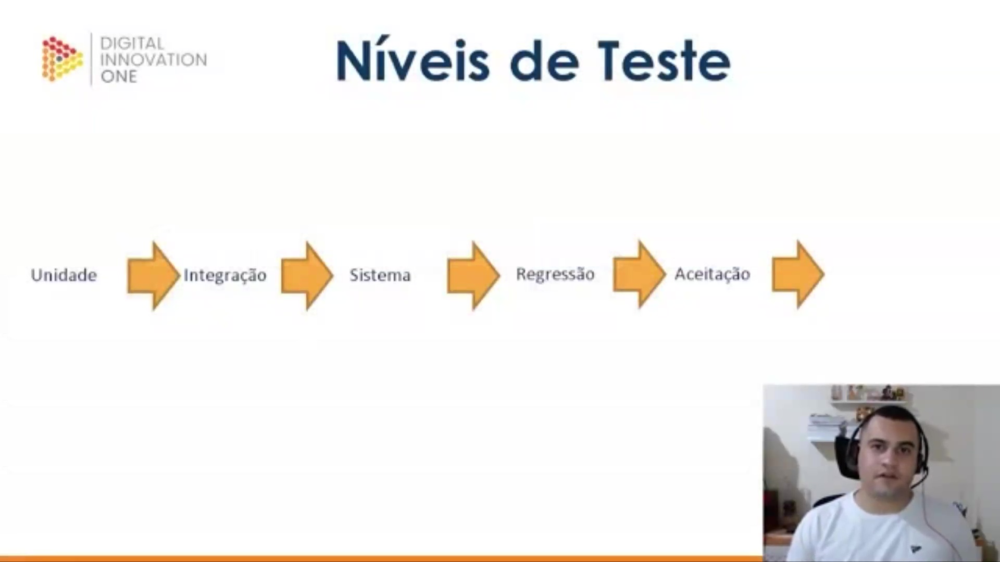

Os níveis de teste representam as diferentes etapas em que podemos verificar a qualidade de um software, desde as menores unidades até o sistema completo. Entre eles estão: **teste de unidade** (foco em componentes individuais), **teste de integração** (verifica a interação entre módulos), **teste de sistema** (avalia o sistema como um todo), **teste de regressão** (garante que mudanças não quebrem funcionalidades existentes) e **teste de aceitação** (valida se o software atende às necessidades do usuário). Cada nível possui objetivos específicos e é executado em momentos distintos do desenvolvimento.

  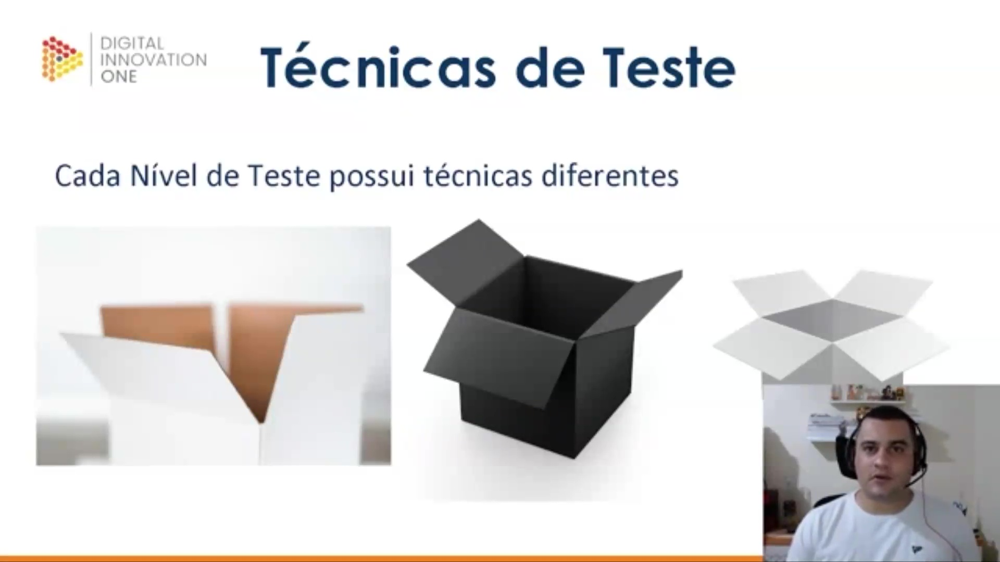

As **técnicas de teste** definem a abordagem utilizada para projetar e executar os testes em cada nível. Enquanto os níveis respondem "o que testar", as técnicas respondem "como testar". Nesta aula, exploraremos três principais técnicas: **caixa branca**, **caixa preta** e **caixa cinza**, que se diferenciam pelo conhecimento que o testador tem sobre a estrutura interna do software.

  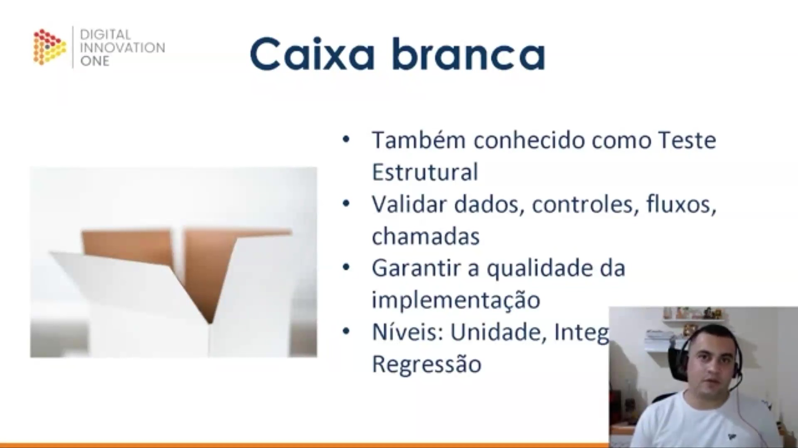

O **teste de caixa branca** (ou estrutural) parte do conhecimento do código-fonte. O testador analisa a lógica interna, os fluxos de controle, as chamadas de funções e a cobertura dos caminhos possíveis. É muito aplicado nos níveis de **unidade**, **integração** e **regressão**, pois exige acesso direto ao código para garantir a qualidade da implementação e identificar possíveis falhas estruturais.

  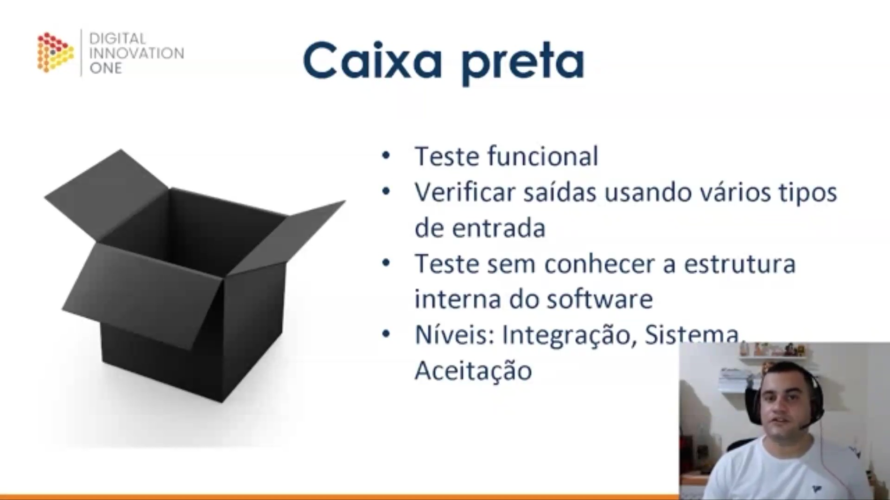

No **teste de caixa preta**, o foco está no comportamento externo do software. O testador não conhece a implementação interna; ele fornece entradas e verifica se as saídas estão de acordo com o esperado, baseando-se nos requisitos funcionais. Esse tipo de teste é comum nos níveis de **integração**, **sistema** e **aceitação**, onde se valida se o software atende às necessidades do usuário final.

  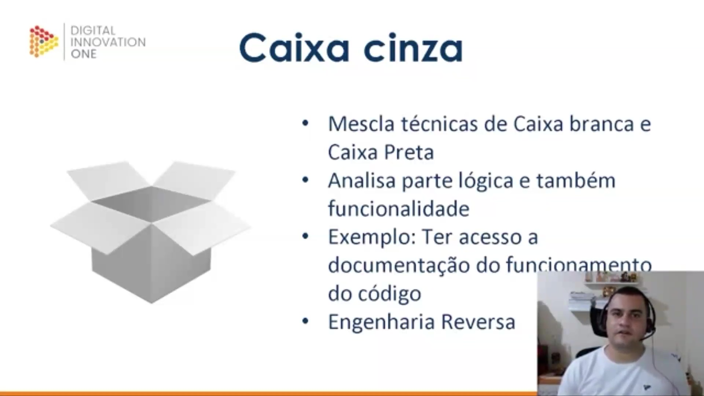

O **teste de caixa cinza** combina elementos das duas abordagens anteriores: o testador possui conhecimento parcial da estrutura interna (como documentação ou acesso ao código fonte) e, ao mesmo tempo, realiza testes funcionais. Isso permite uma análise mais aprofundada, como em atividades de **engenharia reversa**, onde se busca entender o funcionamento do software a partir de sua documentação ou comportamento observado.

  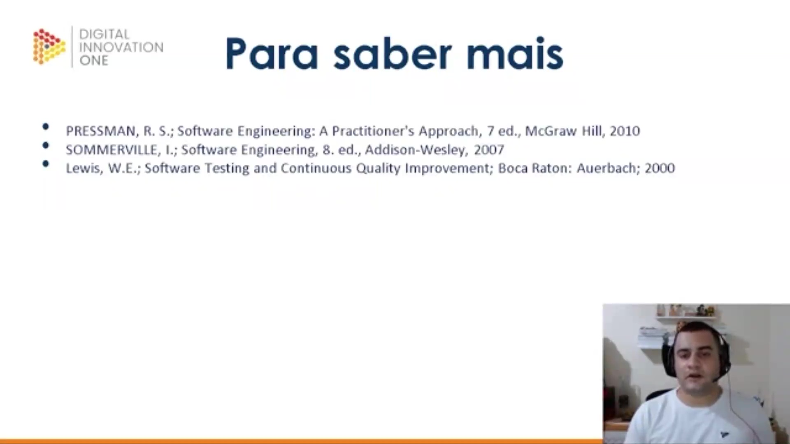

Aprofunde seus conhecimentos em teste de software com as obras clássicas de **Pressman**, **Sommerville** e **Lewis**. Estes livros abordam desde fundamentos até práticas avançadas de garantia de qualidade e melhoria contínua, sendo referências essenciais para profissionais da área.

## Parte 4 - Testes não funcionais

### 🟩 Vídeo 07 - O que são Testes não funcionais

<video width="60%" controls>
  <source src="000-Midia_e_Anexos/bootcamp_tqi_fullstack-modulo.08-curso.03-video_07.webm" type="video/webm">
    Seu navegador não suporta vídeo HTML5.
</video>

link do vídeo: https://web.dio.me/track/tqi-fullstack-developer/course/introducao-a-testes-de-software/learning/8853b86a-f2b7-44f7-b492-a4d3a069ee92?autoplay=1

Enquanto os testes funcionais focam no "o que" o sistema faz (regras de negócio), os testes não funcionais focam no "como" o sistema se comporta. Eles são baseados em requisitos técnicos que, embora muitas vezes invisíveis para o usuário final, são cruciais para o sucesso e a confiabilidade do software.

### Anotações

  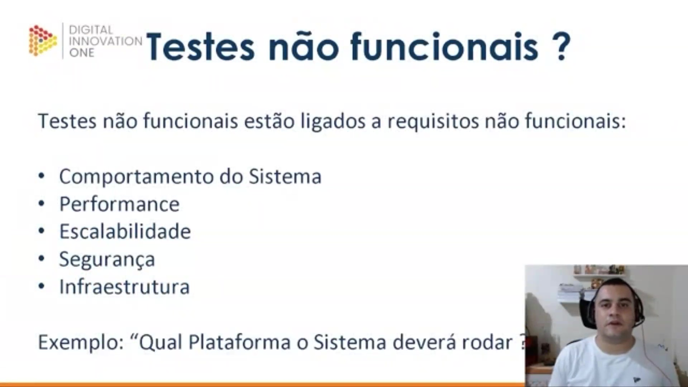

A imagem apresenta o conceito de **testes não funcionais** e sua relação com os **requisitos não funcionais**. Enquanto os requisitos funcionais descrevem o que o sistema deve fazer (regras de negócio), os não funcionais definem **como o sistema deve se comportar** em aspectos como: comportamento geral, performance, escalabilidade, segurança e infraestrutura. O exemplo destacado — “Qual plataforma o sistema deverá rodar?” — ilustra uma típica preocupação não funcional, que muitas vezes não é especificada pelo cliente, mas é essencial para o sucesso do software.

  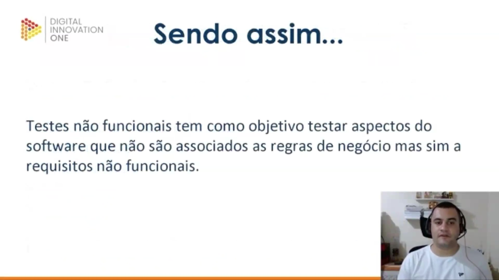

Este slide sintetiza o objetivo dos testes não funcionais: **testar aspectos do software que não estão ligados diretamente às regras de negócio**, mas sim aos requisitos não funcionais. Em outras palavras, enquanto os testes funcionais verificam se as funcionalidades implementadas atendem ao que foi solicitado, os testes não funcionais garantem que o sistema possua as qualidades esperadas de desempenho, segurança, robustez, etc., mesmo sob condições adversas.

  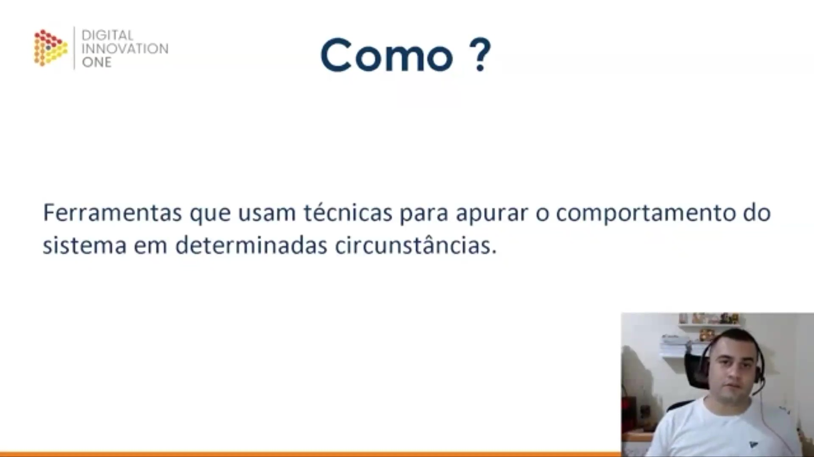

A imagem introduz a questão prática: **como** realizar testes não funcionais? A resposta está no uso de **ferramentas especializadas** que aplicam técnicas para avaliar o comportamento do sistema em diferentes circunstâncias. Essas ferramentas permitem simular condições de carga, estresse, ataques de segurança, entre outras, gerando métricas e relatórios que ajudam a identificar gargalos e vulnerabilidades.

  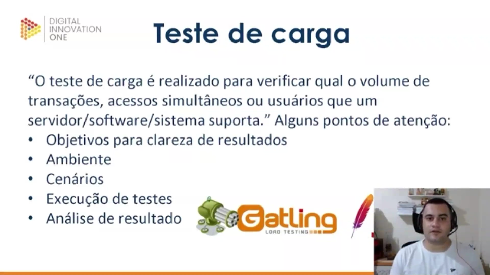

O slide define **teste de carga** e lista pontos fundamentais para sua execução. O objetivo é verificar o volume de transações, acessos simultâneos ou usuários que o sistema suporta sem degradação. Para que o teste seja eficaz, é preciso definir claramente os **objetivos**, preparar um **ambiente** o mais próximo possível do real, elaborar **cenários** representativos, executar os testes de forma controlada e, por fim, **analisar os resultados** obtidos. Ferramentas como Gatling e Apache JMeter são exemplos muito utilizados nesse tipo de teste.

  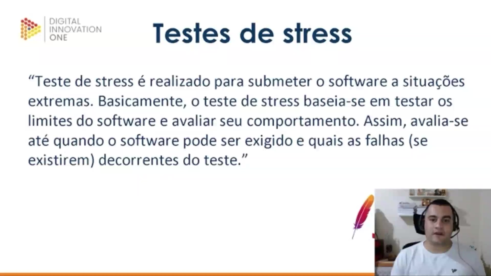

A imagem aborda o **teste de estresse**, que difere do teste de carga por buscar **situações extremas** até que o sistema atinja seus limites e apresente falhas. Enquanto o teste de carga avalia o comportamento sob carga esperada, o teste de estresse eleva a carga progressivamente para descobrir o ponto de ruptura e observar como o sistema se recupera (ou não). Esse tipo de teste é crucial para planejar estratégias de escalabilidade e tolerância a falhas. A imagem provavelmente ilustra um exemplo de configuração ou resultado de uma ferramenta como o JMeter, também usado para essa finalidade.

  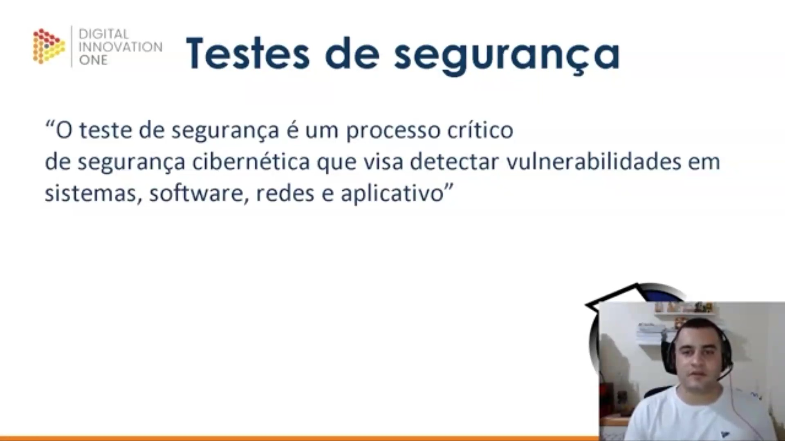

O slide apresenta o **teste de segurança**, definido como um processo crítico para detectar vulnerabilidades em sistemas, software, redes e aplicativos. A imagem do **ZAP (Zed Attack Proxy)** é mencionada como exemplo de ferramenta amplamente utilizada para automatizar a busca por falhas como XSS, SQL injection e outras brechas de segurança. O objetivo é identificar e corrigir esses pontos antes que o software entre em produção, reduzindo riscos de ataques.

  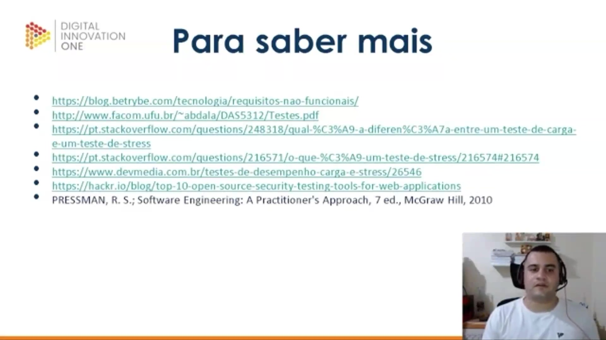

A última imagem reúne uma série de **referências e links úteis** para aprofundamento nos tópicos abordados: requisitos não funcionais, diferenças entre teste de carga e estresse, ferramentas de teste de segurança, além da referência clássica de engenharia de software (PRESSMAN). Esses materiais complementam a aula e oferecem ao estudante a possibilidade de explorar com mais detalhes cada tipo de teste não funcional, bem como conhecer as ferramentas citadas (Gatling, JMeter, ZAP) e suas aplicações práticas.      

## Parte 5 - A pirâmide de Testes

### 🟩 Vídeo 08 - A pirâmide de Testes

<video width="60%" controls>
  <source src="000-Midia_e_Anexos/bootcamp_tqi_fullstack-modulo.08-curso.03-video_08.webm" type="video/webm">
    Seu navegador não suporta vídeo HTML5.
</video>

link do vídeo: https://web.dio.me/track/tqi-fullstack-developer/course/introducao-a-testes-de-software/learning/b7f660b9-2225-47dd-929f-6e6fd500dd89?autoplay=1

##  Materiais de Apoio

# Certificado: 

- Link na plataforma: 
- Certificado em pdf: