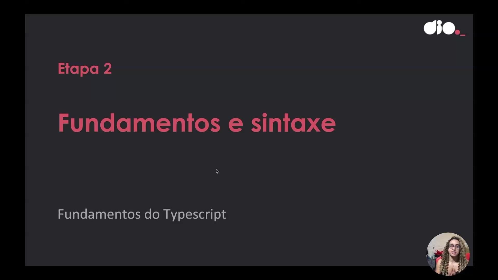
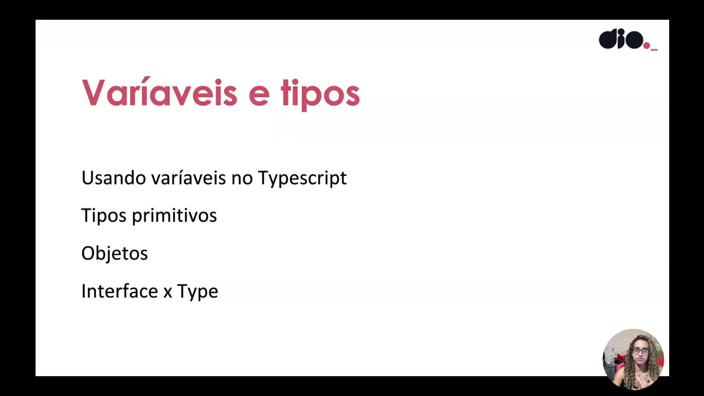
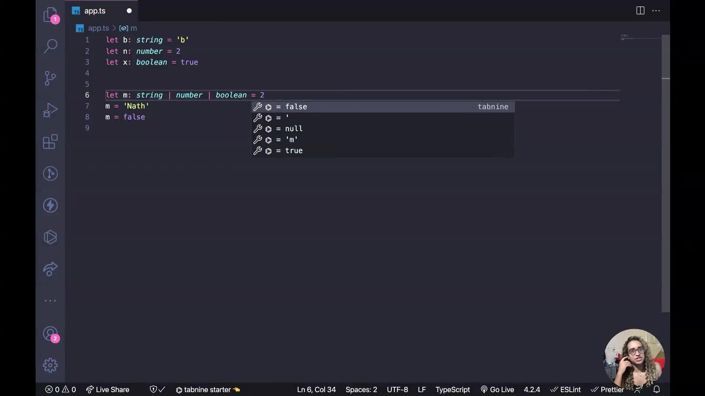

- Instrutor:  Nathally Souza (Software Engineer | Startup Founder | Javascript, Typescript, Cloud, Frontend, Backend)
- Contato Linkedin: / [nathsouza](https://www.linkedin.com/in/nathsouza/)

# Parte 1: O que é o TypeScript

## 🟩 Vídeo 01 - Introdução

<video width="60%" controls>
  <source src="000-Midia_e_Anexos/formacao_typescript_fullstack-modulo_01-Curso_01-Video_01.webm" type="video/webm">
    Seu navegador não suporta vídeo HTML5.
</video>

Link do vídeo:https://web.dio.me/track/formacao-typescript-fullstack-developer/course/o-que-e-o-typescript/learning/88a53e9c-b178-42ff-8278-85ea34126c30?autoplay=1

A instrutora **Natalie Souza**, desenvolvedora no Itaú, se apresenta e introduz um módulo de um curso de **introdução ao Typescript**, que faz parte de uma trilha Full Stack. Natalie compartilha sua transição de uma **carreira de dez anos no jornalismo** para a tecnologia, motivada pelo desejo de **transformar e impactar a sociedade**. Ela também aborda sua identidade como **mulher trans/travesti** e a importância de sua posição para **comunidades sub-representadas** na área de tecnologia. Finalmente, ela detalha que o **objetivo do curso** é ensinar a sintaxe básica do Typescript e **conceitos de orientação a objetos**, mencionando que o pré-requisito é ter uma base em lógica de programação.

## 🟩 Vídeo 02 - Conhecendo o Typescript

<video width="60%" controls>
  <source src="000-Midia_e_Anexos/formacao_typescript_fullstack-modulo_01-Curso_01-Video_02.webm" type="video/webm">
    Seu navegador não suporta vídeo HTML5.
</video>

Link do vídeo: https://web.dio.me/track/formacao-typescript-fullstack-developer/course/o-que-e-o-typescript/learning/a8aab96a-40fd-4601-bfbb-a387614fda39?autoplay=1

O material fornece uma introdução detalhada ao **TypeScript**, explicando que ele é uma linguagem de programação e um superset do **JavaScript** que adiciona uma camada de tipagem. O instrutor demonstra a necessidade do TypeScript ao mostrar as limitações do JavaScript puro no controle de tipos, ilustrando como o JavaScript pode concatenar strings em vez de somar números. Em seguida, o vídeo orienta os alunos através da **configuração completa do ambiente**, incluindo a instalação do Node.js, a instalação global e local do TypeScript, e a inicialização de um projeto. Finalmente, a instrução mostra como o TypeScript oferece um **feedback rápido de erros** de tipagem diretamente no VS Code, um recurso que **aumenta a produtividade** ao evitar a necessidade de transpilar o código manualmente após cada mudança, especialmente com a ajuda de ferramentas como o TS Node dev.

### Anotações

A instrutora inicia a demonstração com o seguinte código:

```javascript
const soma = (a, b) => {
  console.log(a + b)
}

soma(2, 2)
```

Resultado:

```
4
```

Em seguida, a função é chamada novamente, desta vez utilizando strings como parâmetros:

```python
const soma = (a, b) => {
  console.log(a + b)
}

soma(2, 2)
soma('Nath', 'Souza')
```

Resultado:

```
4
NathSouza
```

Explicação técnica: no JavaScript, o operador + possui comportamento SOBRECARGA IMPLÍCITA:

- Quando aplicado a valores numéricos, realiza a adição aritmética.
- Quando aplicado a valores do tipo string, realiza a concatenação.

Assim, ao passar os argumentos 'Nath' e 'Souza', o operador + concatena os dois valores, produzindo a saída NathSouza.

#### O que significa "comportamento de sobrecarga implícita" 
- Em linguagens de programação, sobrecarga ocorre quando um mesmo operador ou função pode assumir comportamentos diferentes dependendo do tipo dos operandos ou argumentos. 
- No caso específico do JavaScript, não existe uma sobrecarga explícita definida pelo programador (como em C++ ou Java). O que acontece é um comportamento implícito do operador +:
  
	- Operandos numéricos→ o operador realiza adição aritmética.
		- Exemplo: 2 + 2 → 4
	- Operandos do tipo string→ o operador realiza concatenação de strings.
		- Exemplo: 'Nath' + 'Souza' → 'NathSouza'
	- Operandos mistos (string + número) → o número é convertido implicitamente em string, e ocorre concatenação.
		- Exemplo: 'Idade: ' + 30 → 'Idade: 30'

- Esse comportamento é chamado de sobrecarga implícita do operador +, pois o programador não define manualmente como o operador deve agir; o motor do JavaScript decide automaticamente com base nos tipos envolvidos, aplicando coerção de tipos (type coercion).

O Javascript Original não tem o controle de tipos. 

# Parte 2: Fundamentos e sintaxe

## 🟩 Vídeo 03 - Variáveis e tipos

<video width="60%" controls>
  <source src="000-Midia_e_Anexos/formacao_typescript_fullstack-modulo_01-Curso_01-Video_03.webm" type="video/webm">
    Seu navegador não suporta vídeo HTML5.
</video>

Link do vídeo: https://web.dio.me/track/formacao-typescript-fullstack-developer/course/o-que-e-o-typescript/learning/8f3cfcc8-85b8-444b-ae9f-cff4a5b3322c?autoplay=1

O vídeo consiste em uma aula técnica que introduz os **fundamentos e a sintaxe básica do TypeScript**, destacando a importância da **tipagem estática** para a segurança do código. A instrutora detalha as três formas de declarar variáveis — **var, let e const** — recomendando evitar o uso de escopo global por questões de proteção. O conteúdo explica os **tipos primitivos**, como strings, números e booleanos, demonstrando como definir explicitamente a natureza de cada dado. Além disso, o texto aborda o uso de **union types** e faz uma crítica ao uso excessivo do tipo **any**, que descaracteriza as vantagens da linguagem. Por fim, a aula reforça que o TypeScript proporciona um **feedback rápido** durante o desenvolvimento, preparando o terreno para o estudo de objetos e interfaces.

### Anotações

<p align="center">

</p>

Esta etapa marca o início do estudo sobre os **fundamentos e a sintaxe básica** do TypeScript. O foco inicial é compreender como a introdução de tipos modifica a escrita do JavaScript tradicional, proporcionando uma transição suave para quem já conhece a linguagem base e um passo a passo estruturado para iniciantes. Nesta fase, o objetivo é entender o impacto da tipagem no ciclo de desenvolvimento.

<p align="center">

</p>

Nesta parte da aula, os tópicos abordados focam na estrutura essencial da linguagem, incluindo:

* **Variáveis e tipos**: Como declarar e manipular dados.
* **Tipos primitivos**: O uso de `string`, `number` e `boolean`.
* **Objetos**: A estrutura de dados complexos.
* **Interface x Type**: As principais diferenças e aplicações de cada um para definir contratos de dados.

O aprendizado é direcionado para a prática direta no VS Code, priorizando a segurança e o controle do código através da tipagem.

<p align="center">

</p>

A declaração de variáveis no TypeScript utiliza `let` e `const`, abandonando o uso do `var` devido à sua insegurança por escopo global. Ao definir variáveis, o TypeScript permite a **tipagem explícita** através da sintaxe de dois pontos (`:`), o que garante que a variável aceite apenas o tipo de dado definido, como demonstrado abaixo:

```typescript
let b: string = 'Nath'
let n: number = 2
let x: boolean = true

let m: string | number = 2
m = 'Nath'

```

O exemplo acima também ilustra o uso do **Union Type** (`|`), que permite a uma variável (`m`) aceitar mais de um tipo específico (neste caso, `string` ou `number`). Tentar atribuir um valor `boolean` a essa variável resultaria em um erro imediato do editor.

<p align="center">

</p>

Embora o TypeScript ofereça flexibilidade, o uso do tipo `any` deve ser evitado sempre que possível. Ao declarar uma variável como `any`, ela passa a aceitar qualquer tipo de dado, o que anula os benefícios de segurança e feedback rápido da linguagem.

```typescript
let m: any = 2
m = 'Nath'
m = false

```

O uso indiscriminado do `any` compromete a integridade da aplicação. Ele deve ser reservado para contextos específicos onde a tipagem dinâmica é estritamente necessária, mantendo-se a preferência por tipos bem definidos para garantir a robustez do código.


## 🟩 Vídeo 04 - Objetos e interfaces

<video width="60%" controls>
  <source src="000-Midia_e_Anexos/formacao_typescript_fullstack-modulo_01-Curso_01-Video_03.webm" type="video/webm">
    Seu navegador não suporta vídeo HTML5.
</video>

Link do vídeo: https://web.dio.me/track/formacao-typescript-fullstack-developer/course/o-que-e-o-typescript/learning/0f530f9b-6172-4177-a649-401b7347cb67?autoplay=1

## 🟩 Vídeo 05 - Decisões e repetições

<video width="60%" controls>
  <source src="000-Midia_e_Anexos/formacao_typescript_fullstack-modulo_01-Curso_01-Video_05.webm" type="video/webm">
    Seu navegador não suporta vídeo HTML5.
</video>

Link do vídeo:

## 🟩 Vídeo 06 - Estruturas de Repetição

<video width="60%" controls>
  <source src="000-Midia_e_Anexos/formacao_typescript_fullstack-modulo_01-Curso_01-Video_06.webm" type="video/webm">
    Seu navegador não suporta vídeo HTML5.
</video>

Link do vídeo:

## 🟩 Vídeo 07 - Array

<video width="60%" controls>
  <source src="000-Midia_e_Anexos/formacao_typescript_fullstack-modulo_01-Curso_01-Video_07.webm" type="video/webm">
    Seu navegador não suporta vídeo HTML5.
</video>

Link do vídeo:

## 🟩 Vídeo 08 - Manipulando Arrays

<video width="60%" controls>
  <source src="000-Midia_e_Anexos/formacao_typescript_fullstack-modulo_01-Curso_01-Video_08.webm" type="video/webm">
    Seu navegador não suporta vídeo HTML5.
</video>

Link do vídeo:

# Parte 3: Materiais de Apoio e Questionário


# Certificado: 

- Link na plataforma: 
- Certificado em pdf: 
