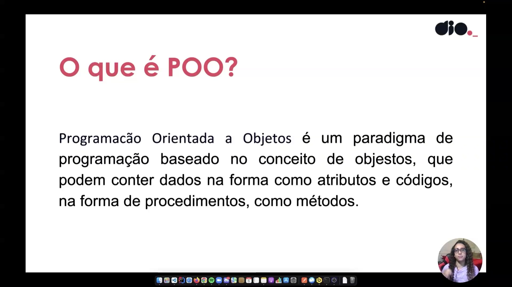
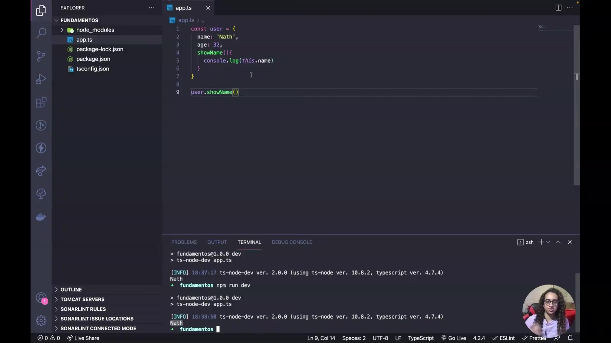
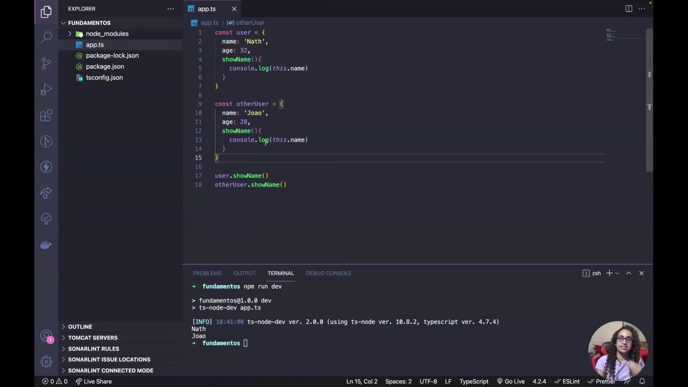
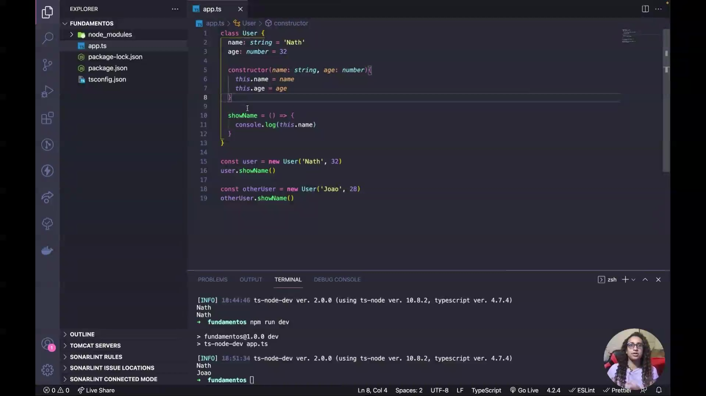
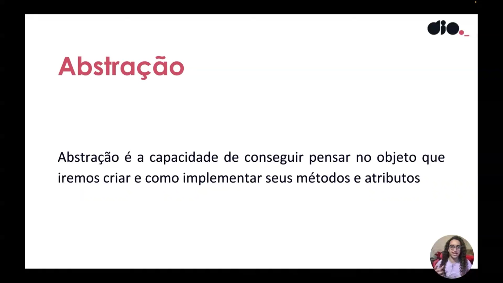
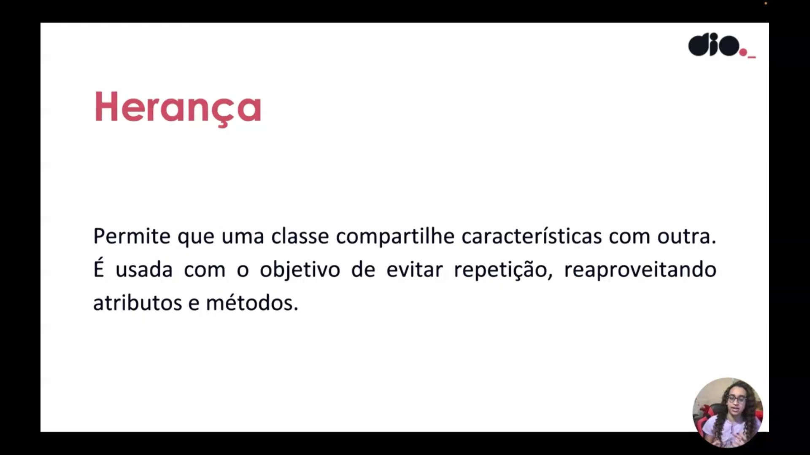
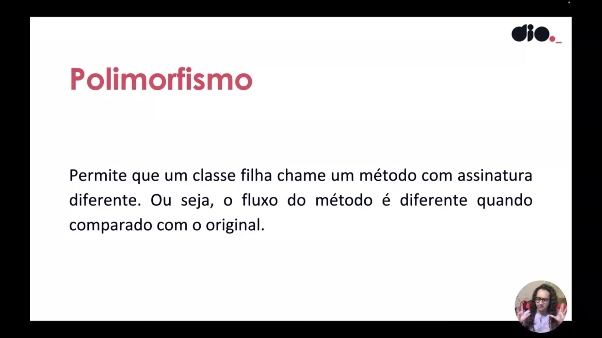
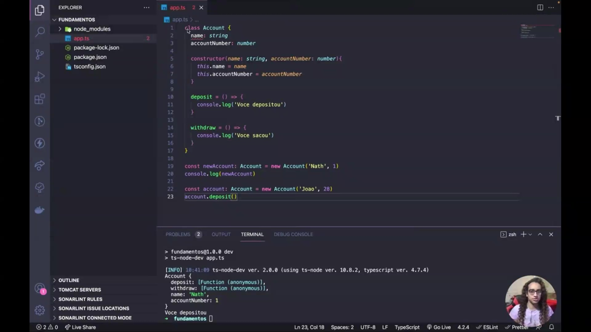

## Instrutor

- Nathally Souza (Software Engineer | Startup Founder | Javascript, Typescript, Cloud, Frontend, Backend)
- Contato Linkedin: / [nathsouza](https://www.linkedin.com/in/nathsouza/)

# Parte 1 - Fundamentos e sintaxe

## 🟩 Vídeo 01 - Apresentação

<video width="60%" controls>
  <source src="000-Midia_e_Anexos/formacao_typescript_fullstack-modulo_01-Curso_02-Video_01.wenm" type="video/webm">
    Seu navegador não suporta vídeo HTML5.
</video>

Link do vídeo: https://web.dio.me/track/formacao-typescript-fullstack-developer/course/programacao-orientada-a-objetos-com-typescript-22/learning/dd2fb167-13ec-426e-ac01-d0ca35b88438?autoplay=1 

Esta introdução marca o início de uma jornada educacional focada no desenvolvimento de software através da **programação orientada a objetos**. A instrutora **Natalie Souza**, profissional da área de engenharia, apresenta as diretrizes fundamentais para o aprendizado da linguagem **TypeScript**. O material busca capacitar os alunos a aplicarem conceitos teóricos em estruturas de código práticas e eficientes. Para um bom aproveitamento, é indispensável que o estudante já possua **conhecimentos prévios** obtidos no módulo introdutório da plataforma. Através de uma abordagem direta, o curso promete explorar todo o **universo tecnológico** dessa metodologia de programação.


## 🟩 Vídeo 02 - O que é POO

<video width="60%" controls>
  <source src="000-Midia_e_Anexos/formacao_typescript_fullstack-modulo_01-Curso_02-Video_02.wenm" type="video/webm">
    Seu navegador não suporta vídeo HTML5.
</video>

Link do vídeo: https://web.dio.me/track/formacao-typescript-fullstack-developer/course/programacao-orientada-a-objetos-com-typescript-22/learning/25753d13-39ac-4bc1-ab77-38f2f58fb027?autoplay=1

O vídeo aborda os fundamentos da **programação orientada a objetos (POO)** utilizando **TypeScript**, destacando a importância desse paradigma para a carreira de desenvolvimento. A autora explica que objetos são estruturas compostas por **atributos**, que representam dados, e **métodos**, que definem comportamentos ou funcionalidades. Para evitar a repetição de código ao criar múltiplos objetos semelhantes, introduz-se o conceito de **classes**, que funcionam como moldes para a criação de instâncias. É detalhado o papel do **método construtor** na inicialização de propriedades e o uso da palavra-chave **this** para referenciar atributos internos do próprio objeto. Por fim, a fonte demonstra como a aplicação de boas práticas, como o **Clean Code**, facilita a manutenção e a rastreabilidade dos parâmetros em sistemas mais complexos.

### Anotações

<p align="center">

</p>

A **Programação Orientada a Objetos (POO)** é um paradigma de programação fundamentado no conceito de **objetos**. Esses objetos são estruturas que agrupam dados e comportamentos:

* **Atributos:** Representam os dados ou características do objeto.
* **Métodos:** Representam o código ou procedimentos, funcionando como as funcionalidades do objeto.

Compreender este paradigma é um passo essencial para o desenvolvimento de sistemas mais organizados e para a consolidação da carreira como pessoa desenvolvedora.

<p align="center">

</p>

Neste exemplo prático inicial, criamos um objeto literal chamado `user`. Ele possui dois atributos (`name` e `age`) e um método chamado `showName`. O método utiliza a palavra reservada `this` para referenciar a propriedade do próprio objeto.

```typescript
const user = {
  name: 'Nath',
  age: 32,
  showName(){
    console.log(this.name)
  }
}

user.showName()

```

Ao executar `user.showName()`, o sistema acessa internamente o atributo `name` do objeto e imprime o valor "Nath" no terminal.

<p align="center">

</p>

Quando precisamos de múltiplos usuários com a mesma estrutura, a abordagem de objetos literais causa repetição de código. Abaixo, um segundo objeto `otherUser` é criado manualmente, replicando a estrutura de atributos e métodos do primeiro, alterando apenas os valores.

```typescript
const user = {
  name: 'Nath',
  age: 32,
  showName(){
    console.log(this.name)
  }
}

const otherUser = {
  name: 'Joao',
  age: 28,
  showName(){
    console.log(this.name)
  }
}

user.showName()
otherUser.showName()

```

Embora o código funcione e imprima "Nath" e "Joao", essa repetição não é eficiente para sistemas de larga escala, como cadastros de usuários.

<p align="center">

</p>

Para resolver a repetição de código, utilizamos **Classes**. Uma classe funciona como uma "fôrma" para criar objetos. Através do método `constructor`, definimos quais parâmetros o objeto deve receber no momento da criação (instanciação).

```typescript
class User {
  name: string = 'Nath'
  age: number = 32

  constructor(name: string, age: number) {
    this.name = name
    this.age = age
  }

  showName = () => {
    console.log(this.name)
  }
}

const user = new User('Nath', 32)
user.showName()

const otherUser = new User('Joao', 28)
otherUser.showName()

```

O uso do `this` dentro do construtor (`this.name = name`) garante que o valor passado como parâmetro seja atribuído corretamente à propriedade do objeto que está sendo criado. Assim, com uma única classe, podemos instanciar diversos objetos (como `user` e `otherUser`) com dados diferentes, reaproveitando toda a lógica de métodos e estrutura.      


## 🟩 Vídeo 03 - Classes e tipos

<video width="60%" controls>
  <source src="000-Midia_e_Anexos/formacao_typescript_fullstack-modulo_01-Curso_02-Video_03.wenm" type="video/webm">
    Seu navegador não suporta vídeo HTML5.
</video>

Link do vídeo: https://web.dio.me/track/formacao-typescript-fullstack-developer/course/programacao-orientada-a-objetos-com-typescript-22/learning/0e030a09-a274-461d-b985-4b7a6c7da984?autoplay=1

O vídeo apresenta os pilares fundamentais da **Programação Orientada a Objetos (POO)** por meio de uma aula prática voltada ao desenvolvimento de um sistema bancário fictício, o **DBank**. A instrutora detalha a **abstração** como o processo de identificar atributos e métodos essenciais, a **herança** como forma de compartilhar características entre classes para evitar a repetição de código, e o **polimorfismo** como a capacidade de alterar o comportamento de métodos em classes filhas. Além da teoria, o conteúdo demonstra a **implementação em código**, enfatizando a importância da **tipagem** para a manutenção e documentação do software. O exemplo prático utiliza a criação de uma classe de conta com funcionalidades de **depósito e saque**, ilustrando como instanciar objetos reais. Por fim, o material introduz a ideia de **classes mãe e filha**, preparando o terreno para conceitos mais avançados de reaproveitamento de lógica.

### Anotações

<p align="center">

</p>

A **abstração** é o primeiro dos três conceitos fundamentais da Orientação a Objetos abordados. Ela consiste na capacidade de mentalizar e projetar o objeto que será criado, definindo como seus métodos e atributos serão implementados. Esse processo exige a compreensão do **contexto de negócio**; por exemplo, ao projetar um sistema bancário como o "DBank", a abstração permite identificar que um usuário precisa de atributos como nome, número de documento e conta, além de métodos funcionais como sacar e depositar.

<p align="center">

</p>

A **herança** é o segundo conceito chave, permitindo que uma classe compartilhe suas características com outras. O objetivo principal é o reaproveitamento de código, evitando repetições desnecessárias ao fazer com que uma classe herde atributos e métodos de uma classe ancestral. Na prática, isso estabelece uma comunicação entre classes onde uma pode passar suas propriedades para que outra as utilize de forma estruturada.

<p align="center">

</p>

O **polimorfismo** está diretamente relacionado à herança e descreve a capacidade de uma classe filha invocar um método que possui uma assinatura ou fluxo diferente do original na classe mãe. Embora a classe filha herde características, ela não precisa ser idêntica à classe genérica; ela pode adaptar o comportamento dos métodos para atender às suas necessidades específicas, alterando a forma como a ação é executada em comparação ao modelo original.

<p align="center">

</p>

Nesta etapa, a abstração é aplicada diretamente no código para iniciar a construção do sistema **DBank**. É definida a classe `Account`, que estabelece a estrutura para as contas dos usuários com tipagem explícita para auxiliar na manutenção e documentação do código. O exemplo demonstra a criação da classe com atributos de nome e número da conta, um construtor para inicialização e métodos para operações bancárias básicas.

```typescript
class Account {
  name: string
  accountNumber: number

  constructor(name: string, accountNumber: number){
    this.name = name
    this.accountNumber = accountNumber
  }

  deposit = () => {
    console.log('Você depositou')
  }

  withdraw() {
    console.log('Você sacou')
  }
}

const newAccount: Account = new Account('Nath', 1)
console.log(newAccount)

const account: Account = new Account('Joao', 28)
account.deposit()

```

O código também exemplifica a **instanciação** de objetos. Ao criar `newAccount` e `account`, os objetos passam a ter o tipo da classe `Account`. O terminal confirma a execução, exibindo as propriedades do objeto e a mensagem de confirmação do método de depósito.      


## 🟩 Vídeo 04 - Herança

<video width="60%" controls>
  <source src="000-Midia_e_Anexos/formacao_typescript_fullstack-modulo_01-Curso_02-Video_04.wenm" type="video/webm">
    Seu navegador não suporta vídeo HTML5.
</video>

Link do vídeo: https://web.dio.me/track/formacao-typescript-fullstack-developer/course/programacao-orientada-a-objetos-com-typescript-22/learning/4ff2edac-8eca-4fff-978f-0b2fce765ef0?autoplay=1 


## 🟩 Vídeo 05 - Módulos

<video width="60%" controls>
  <source src="000-Midia_e_Anexos/formacao_typescript_fullstack-modulo_01-Curso_02-Video_05.wenm" type="video/webm">
    Seu navegador não suporta vídeo HTML5.
</video>

Link do vídeo: 


## 🟩 Vídeo 06 - Visibilidade de atributos e métodos

<video width="60%" controls>
  <source src="000-Midia_e_Anexos/formacao_typescript_fullstack-modulo_01-Curso_02-Video_06.wenm" type="video/webm">
    Seu navegador não suporta vídeo HTML5.
</video>

Link do vídeo: 


## 🟩 Vídeo 07 - Readonly

<video width="60%" controls>
  <source src="000-Midia_e_Anexos/formacao_typescript_fullstack-modulo_01-Curso_02-Video_07.wenm" type="video/webm">
    Seu navegador não suporta vídeo HTML5.
</video>

Link do vídeo: 


# Certificado: 

- Link na plataforma: 
- Certificado em pdf: 
