## Instrutor

- Nathally Souza (Software Engineer | Startup Founder | Javascript, Typescript, Cloud, Frontend, Backend)
- Contato Linkedin: / [nathsouza](https://www.linkedin.com/in/nathsouza/)

# Parte 1 - Fundamentos e sintaxe

## 🟩 Vídeo 01 - Apresentação

<video width="60%" controls>
  <source src="000-Midia_e_Anexos/formacao_typescript_fullstack-modulo_01-Curso_02-Video_01.wenm" type="video/webm">
    Seu navegador não suporta vídeo HTML5.
</video>

Link do vídeo: https://web.dio.me/track/formacao-typescript-fullstack-developer/course/programacao-orientada-a-objetos-com-typescript-22/learning/dd2fb167-13ec-426e-ac01-d0ca35b88438?autoplay=1 

Esta introdução marca o início de uma jornada educacional focada no desenvolvimento de software através da **programação orientada a objetos**. A instrutora **Natalie Souza**, profissional da área de engenharia, apresenta as diretrizes fundamentais para o aprendizado da linguagem **TypeScript**. O material busca capacitar os alunos a aplicarem conceitos teóricos em estruturas de código práticas e eficientes. Para um bom aproveitamento, é indispensável que o estudante já possua **conhecimentos prévios** obtidos no módulo introdutório da plataforma. Através de uma abordagem direta, o curso promete explorar todo o **universo tecnológico** dessa metodologia de programação.


## 🟩 Vídeo 02 - O que é POO

<video width="60%" controls>
  <source src="000-Midia_e_Anexos/formacao_typescript_fullstack-modulo_01-Curso_02-Video_02.wenm" type="video/webm">
    Seu navegador não suporta vídeo HTML5.
</video>

Link do vídeo: https://web.dio.me/track/formacao-typescript-fullstack-developer/course/programacao-orientada-a-objetos-com-typescript-22/learning/25753d13-39ac-4bc1-ab77-38f2f58fb027?autoplay=1

O vídeo aborda os fundamentos da **programação orientada a objetos (POO)** utilizando **TypeScript**, destacando a importância desse paradigma para a carreira de desenvolvimento. A autora explica que objetos são estruturas compostas por **atributos**, que representam dados, e **métodos**, que definem comportamentos ou funcionalidades. Para evitar a repetição de código ao criar múltiplos objetos semelhantes, introduz-se o conceito de **classes**, que funcionam como moldes para a criação de instâncias. É detalhado o papel do **método construtor** na inicialização de propriedades e o uso da palavra-chave **this** para referenciar atributos internos do próprio objeto. Por fim, a fonte demonstra como a aplicação de boas práticas, como o **Clean Code**, facilita a manutenção e a rastreabilidade dos parâmetros em sistemas mais complexos.

### Anotações

<p align="center">

</p>

A **Programação Orientada a Objetos (POO)** é um paradigma de programação fundamentado no conceito de **objetos**. Esses objetos são estruturas que agrupam dados e comportamentos:

* **Atributos:** Representam os dados ou características do objeto.
* **Métodos:** Representam o código ou procedimentos, funcionando como as funcionalidades do objeto.

Compreender este paradigma é um passo essencial para o desenvolvimento de sistemas mais organizados e para a consolidação da carreira como pessoa desenvolvedora.

<p align="center">

</p>

Neste exemplo prático inicial, criamos um objeto literal chamado `user`. Ele possui dois atributos (`name` e `age`) e um método chamado `showName`. O método utiliza a palavra reservada `this` para referenciar a propriedade do próprio objeto.

```typescript
const user = {
  name: 'Nath',
  age: 32,
  showName(){
    console.log(this.name)
  }
}

user.showName()

```

Ao executar `user.showName()`, o sistema acessa internamente o atributo `name` do objeto e imprime o valor "Nath" no terminal.

<p align="center">

</p>

Quando precisamos de múltiplos usuários com a mesma estrutura, a abordagem de objetos literais causa repetição de código. Abaixo, um segundo objeto `otherUser` é criado manualmente, replicando a estrutura de atributos e métodos do primeiro, alterando apenas os valores.

```typescript
const user = {
  name: 'Nath',
  age: 32,
  showName(){
    console.log(this.name)
  }
}

const otherUser = {
  name: 'Joao',
  age: 28,
  showName(){
    console.log(this.name)
  }
}

user.showName()
otherUser.showName()

```

Embora o código funcione e imprima "Nath" e "Joao", essa repetição não é eficiente para sistemas de larga escala, como cadastros de usuários.

<p align="center">

</p>

Para resolver a repetição de código, utilizamos **Classes**. Uma classe funciona como uma "fôrma" para criar objetos. Através do método `constructor`, definimos quais parâmetros o objeto deve receber no momento da criação (instanciação).

```typescript
class User {
  name: string = 'Nath'
  age: number = 32

  constructor(name: string, age: number) {
    this.name = name
    this.age = age
  }

  showName = () => {
    console.log(this.name)
  }
}

const user = new User('Nath', 32)
user.showName()

const otherUser = new User('Joao', 28)
otherUser.showName()

```

O uso do `this` dentro do construtor (`this.name = name`) garante que o valor passado como parâmetro seja atribuído corretamente à propriedade do objeto que está sendo criado. Assim, com uma única classe, podemos instanciar diversos objetos (como `user` e `otherUser`) com dados diferentes, reaproveitando toda a lógica de métodos e estrutura.      


## 🟩 Vídeo 03 - Classes e tipos

<video width="60%" controls>
  <source src="000-Midia_e_Anexos/formacao_typescript_fullstack-modulo_01-Curso_02-Video_03.wenm" type="video/webm">
    Seu navegador não suporta vídeo HTML5.
</video>

Link do vídeo: https://web.dio.me/track/formacao-typescript-fullstack-developer/course/programacao-orientada-a-objetos-com-typescript-22/learning/0e030a09-a274-461d-b985-4b7a6c7da984?autoplay=1

O vídeo apresenta os pilares fundamentais da **Programação Orientada a Objetos (POO)** por meio de uma aula prática voltada ao desenvolvimento de um sistema bancário fictício, o **DBank**. A instrutora detalha a **abstração** como o processo de identificar atributos e métodos essenciais, a **herança** como forma de compartilhar características entre classes para evitar a repetição de código, e o **polimorfismo** como a capacidade de alterar o comportamento de métodos em classes filhas. Além da teoria, o conteúdo demonstra a **implementação em código**, enfatizando a importância da **tipagem** para a manutenção e documentação do software. O exemplo prático utiliza a criação de uma classe de conta com funcionalidades de **depósito e saque**, ilustrando como instanciar objetos reais. Por fim, o material introduz a ideia de **classes mãe e filha**, preparando o terreno para conceitos mais avançados de reaproveitamento de lógica.

### Anotações

<p align="center">

</p>

A **abstração** é o primeiro dos três conceitos fundamentais da Orientação a Objetos abordados. Ela consiste na capacidade de mentalizar e projetar o objeto que será criado, definindo como seus métodos e atributos serão implementados. Esse processo exige a compreensão do **contexto de negócio**; por exemplo, ao projetar um sistema bancário como o "DBank", a abstração permite identificar que um usuário precisa de atributos como nome, número de documento e conta, além de métodos funcionais como sacar e depositar.

<p align="center">

</p>

A **herança** é o segundo conceito chave, permitindo que uma classe compartilhe suas características com outras. O objetivo principal é o reaproveitamento de código, evitando repetições desnecessárias ao fazer com que uma classe herde atributos e métodos de uma classe ancestral. Na prática, isso estabelece uma comunicação entre classes onde uma pode passar suas propriedades para que outra as utilize de forma estruturada.

<p align="center">

</p>

O **polimorfismo** está diretamente relacionado à herança e descreve a capacidade de uma classe filha invocar um método que possui uma assinatura ou fluxo diferente do original na classe mãe. Embora a classe filha herde características, ela não precisa ser idêntica à classe genérica; ela pode adaptar o comportamento dos métodos para atender às suas necessidades específicas, alterando a forma como a ação é executada em comparação ao modelo original.

<p align="center">

</p>

Nesta etapa, a abstração é aplicada diretamente no código para iniciar a construção do sistema **Dio Bank**. É definida a classe `Account`, que estabelece a estrutura para as contas dos usuários com tipagem explícita para auxiliar na manutenção e documentação do código. O exemplo demonstra a criação da classe com atributos de nome e número da conta, um construtor para inicialização e métodos para operações bancárias básicas.

```typescript
class Account {
  name: string
  accountNumber: number

  constructor(name: string, accountNumber: number){
    this.name = name
    this.accountNumber = accountNumber
  }

  deposit = () => {
    console.log('Você depositou')
  }

  withdraw() {
    console.log('Você sacou')
  }
}

const newAccount: Account = new Account('Nath', 1)
console.log(newAccount)

const account: Account = new Account('Joao', 28)
account.deposit()

```

O código também exemplifica a **instanciação** de objetos. Ao criar `newAccount` e `account`, os objetos passam a ter o tipo da classe `Account`. O terminal confirma a execução, exibindo as propriedades do objeto e a mensagem de confirmação do método de depósito.    

⚠️ Note que o método `withdraw` não aparece na listagem, porque ele foi definido como método tradicional da classe. Métodos tradicionais ficam no prototype da classe, e o console.log não os mostra diretamente na estrutura do objeto.


## 🟩 Vídeo 04 - Herança

<video width="60%" controls>
  <source src="000-Midia_e_Anexos/formacao_typescript_fullstack-modulo_01-Curso_02-Video_04.wenm" type="video/webm">
    Seu navegador não suporta vídeo HTML5.
</video>

Link do vídeo: https://web.dio.me/track/formacao-typescript-fullstack-developer/course/programacao-orientada-a-objetos-com-typescript-22/learning/4ff2edac-8eca-4fff-978f-0b2fce765ef0?autoplay=1 

O material consiste em uma aula prática sobre **orientação a objetos**, focando especificamente nos conceitos de **herança** e **classes abstratas** em TypeScript. A instrutora demonstra como criar uma classe filha que utiliza a palavra-chave **extends** para herdar atributos e métodos de uma classe base. É detalhada a importância do **superconstrutor** para inicializar corretamente os dados da classe pai dentro da estrutura derivada. Além disso, o conteúdo explica que **classes abstratas** servem apenas como modelos de referência e não permitem a criação direta de objetos. Por fim, o exemplo prático utiliza um sistema bancário para ilustrar como diferentes tipos de contas compartilham comportamentos comuns enquanto mantêm propriedades específicas.

### Anotações

<p align="center">
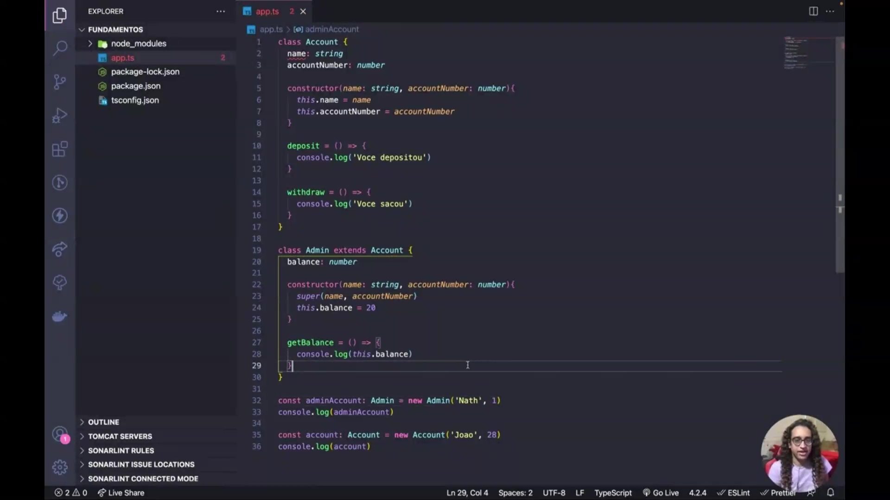
</p>

Neste estágio inicial da aula, é apresentada a estrutura básica da classe `Account` e a criação da classe `Admin`. A classe `Admin` é definida inicialmente com uma propriedade exclusiva de saldo (`balance`) do tipo *number* e um método específico para consulta desse valor, o `getBalance`. No construtor da classe `Admin`, o saldo é definido automaticamente como 20.

```typescript
class Account {
  name: string
  accountNumber: number

  constructor (name: string, accountNumber: number){
    this.name = name
    this.accountNumber = accountNumber
  }

  deposit = () => {
    console.log('Voce depositou')
  }

  withdraw = () => {
    console.log('Voce sacou')
  }
}

class Admin extends Account {
  balance: number

  constructor(name: string, accountNumber: number){
    super(name, accountNumber)
    this.balance = 20
  }

  getBalance = () => {
    console.log(this.balance)
  }
}

const adminAccount = new Admin('Nath', 1)
console.log(adminAccount)

```

<p align="center">
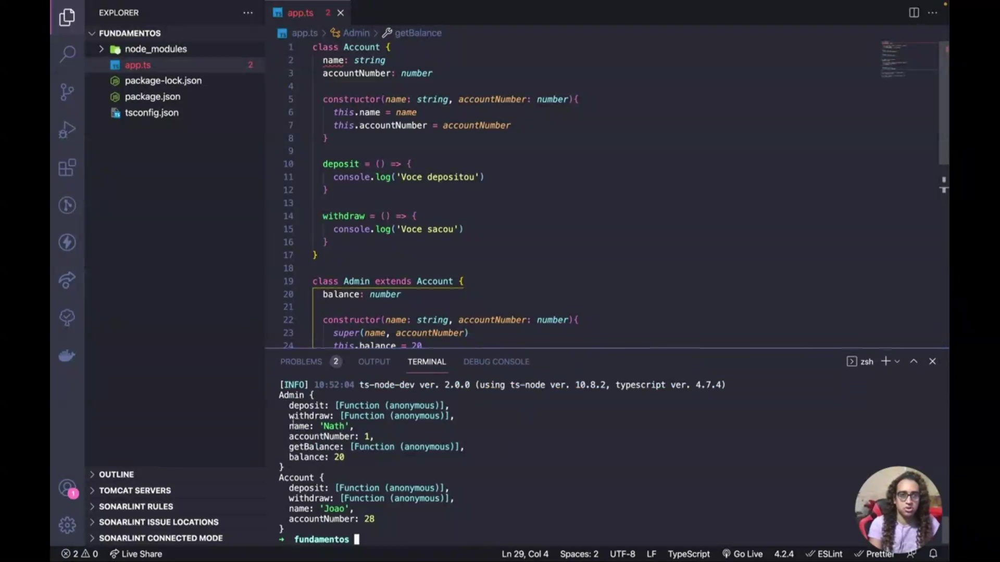
</p>

Ao executar o código via terminal utilizando o `ts-node-dev`, observa-se o comportamento da herança na prática. O objeto instanciado `adminAccount` (do tipo `Admin`) exibe não apenas o seu atributo próprio `balance` e o método `getBalance`, mas também herda as propriedades `name` e `accountNumber`, além dos métodos `deposit` e `withdraw` da classe pai `Account`. Em contraste, um objeto instanciado diretamente da classe `Account` (como o "Joao") possui apenas os elementos definidos em sua própria classe original.

```javascript
[INFO] 10:52:04 ts-node-dev ver. 2.0.0 (using ts-node ver. 10.8.2, typescript ver. 4.7.4)
Admin {
  deposit: [Function (anonymous)],
  withdraw: [Function (anonymous)],
  name: 'Nath',
  accountNumber: 1,
  getBalance: [Function (anonymous)],
  balance: 20
}
Account {
  deposit: [Function (anonymous)],
  withdraw: [Function (anonymous)],
  name: 'Joao',
  accountNumber: 28
}

```

<p align="center">
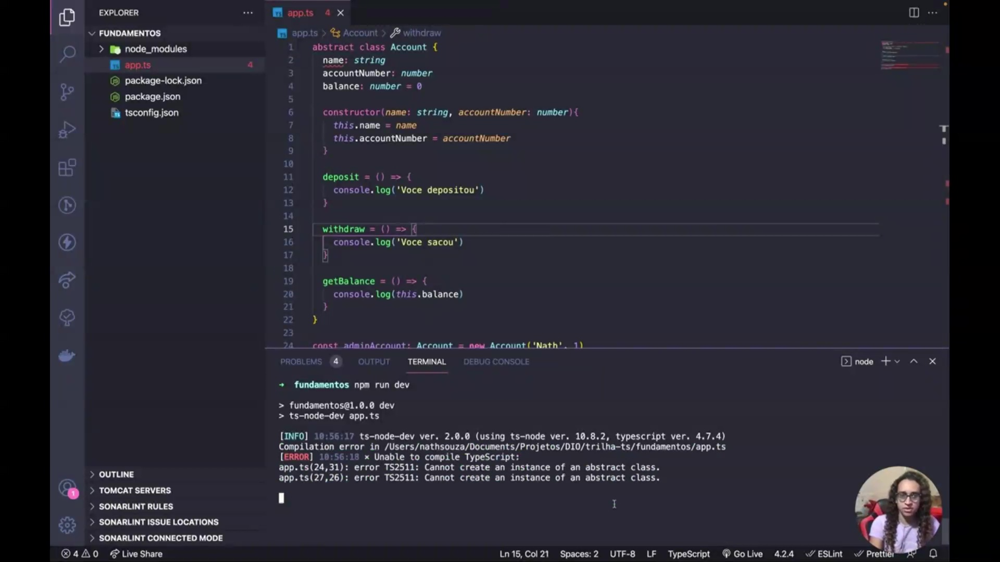
</p>

A aula introduz o conceito de **classes abstratas** utilizando a palavra-chave `abstract`. Ao definir `abstract class Account`, a classe passa a servir exclusivamente como um modelo (blueprint) para outras classes filhas. Uma característica fundamental demonstrada é que classes abstratas não podem ser instanciadas diretamente. O compilador do TypeScript gera erros (TS2511) ao detectar tentativas de criar objetos usando `new Account`, forçando o uso de classes específicas como `Admin` ou `PeopleAccount`.

```typescript
abstract class Account {
  name: string
  accountNumber: number
  balance: number = 0

  constructor(name: string, accountNumber: number){
    this.name = name
    this.accountNumber = accountNumber
  }

  deposit = () => {
    console.log('Voce depositou')
  }

  withdraw() {
    console.log('Voce sacou')
  }

  getBalance = () => {
    console.log(this.balance)
  }
}

// Erro: Cannot create an instance of an abstract class.
const adminAccount = new Account('Nath', 1) 

```

<p align="center">
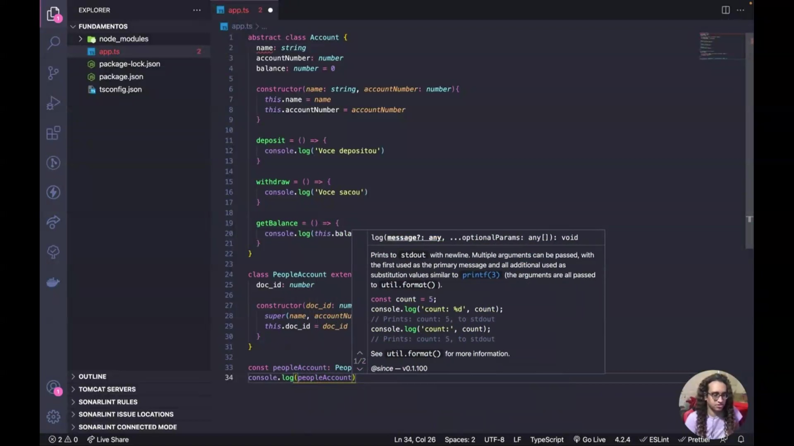
</p>

Para expandir o sistema, é criada a classe `PeopleAccount` que estende a classe abstrata `Account`. Esta nova classe introduz um atributo específico chamado `doc_id`. O exemplo foca na necessidade de utilizar o **superconstrutor** (`super`) dentro do construtor da classe filha. O `super` é responsável por repassar os parâmetros `name` e `accountNumber` para a classe pai, garantindo que a base do objeto seja construída corretamente antes da atribuição das propriedades específicas da classe `PeopleAccount`.

```typescript
class PeopleAccount extends Account {
  doc_id: number

  constructor(doc_id: number, name: string, accountNumber: number){
    super(name, accountNumber)
    this.doc_id = doc_id
  }
}

const peopleAccount = new PeopleAccount(1, 'Nath', 10)
console.log(peopleAccount)

```

<p align="center">
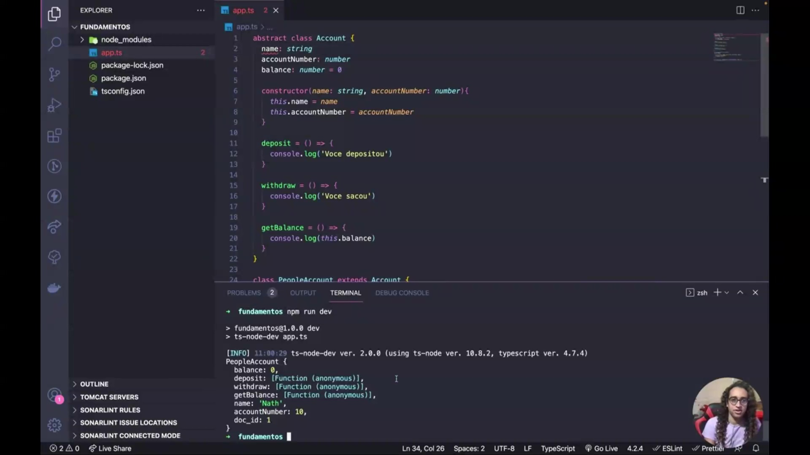
</p>

A execução final no terminal valida a implementação da herança com a classe `PeopleAccount`. O log do objeto mostra a consolidação de todos os membros: o `balance` (iniciado em 0 na classe pai), os métodos herdados (`deposit`, `withdraw`, `getBalance`), as propriedades da classe pai (`name`, `accountNumber`) e a propriedade exclusiva da classe filha (`doc_id`). Isso confirma que a estrutura abstrata funcionou como molde e a classe filha estendeu corretamente as funcionalidades.

🔴 app.ts

```javascript
abstract class Account {
  name: string
  accountNumber: number

  constructor (name: string, accountNumber: number){
    this.name = name
    this.accountNumber = accountNumber
  }

  deposit = () => {
    console.log('Voce depositou')
  }

  withdraw = () => {
    console.log('Voce sacou')
  }
}

class PeopleAccount extends Account {
  doc_id: number

  constructor(doc_id: number, name: string, accountNumber: number){
    super(name, accountNumber)
    this.doc_id = doc_id
  }
}

const peopleAccount = new PeopleAccount(1, 'Nath', 10)
console.log(peopleAccount)
```
🟢 Saída:

```javascript
[INFO] 11:00:29 ts-node-dev ver. 2.0.0 (using ts-node ver. 18.8.2, typescript ver. 4.7.4)
PeopleAccount {
  balance: 0,
  deposit: [Function (anonymous)],
  withdraw: [Function (anonymous)],
  getBalance: [Function (anonymous)],
  name: 'Nath',
  accountNumber: 10,
  doc_id: 1
}

```

## 🟩 Vídeo 05 - Módulos

<video width="60%" controls>
  <source src="000-Midia_e_Anexos/formacao_typescript_fullstack-modulo_01-Curso_02-Video_05.wenm" type="video/webm">
    Seu navegador não suporta vídeo HTML5.
</video>

Link do vídeo: https://web.dio.me/track/formacao-typescript-fullstack-developer/course/programacao-orientada-a-objetos-com-typescript-22/learning/e28bd747-af21-4d88-a5f0-ec9f6470cf01?autoplay=1

O vídeo consiste em uma aula técnica sobre **Programação Orientada a Objetos** utilizando **TypeScript**, focando especificamente nos pilares de **herança** e **polimorfismo**. O instrutor demonstra como criar classes filhas que estendem uma classe abstrata comum para compartilhar atributos e métodos, utilizando o método **super** para inicializar o construtor da classe pai. Além da teoria, o conteúdo aborda práticas de organização de código, como a **modularização** de classes em arquivos separados para facilitar a manutenção do projeto. O conceito de polimorfismo é exemplificado através da **sobrescrita de métodos**, permitindo que classes derivadas alterem o comportamento ou a assinatura de funções herdadas. Por fim, o material prepara o terreno para discussões futuras sobre modificadores de acesso e a palavra-chave **readonly**.

### Anotações

Nesta etapa, o foco está na organização e execução do arquivo principal da aplicação (`app.ts`). Após a criação das classes de conta, o código demonstra a instância de objetos e a chamada de métodos herdados. É possível observar a criação de uma `peopleAccount` (do tipo `PeopleAccount`) e de uma `companyAccount` (do tipo `CompanyAccount`), testando a funcionalidade de depósito em ambas para validar o comportamento do sistema.

🔴 app.ts

```typescript
import { DioAccount } from './class/DioAccount'
import { PeopleAccount } from './class/PeopleAccount'
import { CompanyAccount } from './class/CompanyAccount'

const peopleAccount: PeopleAccount = new PeopleAccount(12, 'Nath', 2)
peopleAccount.deposit()

const companyAccount: CompanyAccount = new CompanyAccount('DIO', 1)
companyAccount.deposit()

```

Aqui é apresentada a estrutura da classe abstrata **DioAccount**, que serve como a "classe mãe" no conceito de herança. Por ser `abstract`, ela não pode ser instanciada diretamente, mas garante que todas as classes filhas (como contas de pessoas físicas ou jurídicas) possuam atributos e métodos essenciais centralizados, como nome, número da conta, saldo e as operações de depósito, saque e verificação de saldo.

🟡 ./class/DioAccount.ts

```typescript
export abstract class DioAccount {
  name: string
  accountNumber: number
  balance: number = 0

  constructor(name: string, accountNumber: number) {
    this.name = name
    this.accountNumber = accountNumber
  }

  deposit = (): void => {
    console.log('Você depositou')
  }

  withdraw = (): void => {
    console.log('Você sacou')
  }

  getBalance = (): void => {
    console.log(this.balance)
  }
}

```

A imagem detalha a implementação da classe **PeopleAccount**, que utiliza o operador `extends` para herdar as funcionalidades de `DioAccount`. Um ponto crucial aqui é o uso do **superconstrutor** (`super`), que é responsável por inicializar as propriedades da classe mãe dentro da classe filha. Além dos atributos herdados, a `PeopleAccount` introduz o atributo específico `doc_id`.

🟡 ./class/PeopleAccount.ts

```typescript
import { DioAccount } from "./DioAccount"

export class PeopleAccount extends DioAccount {
  doc_id: number

  constructor(doc_id: number, name: string, accountNumber: number) {
    super(name, accountNumber)
    this.doc_id = doc_id
  }
}

```

A classe **CompanyAccount** demonstra o conceito de **polimorfismo** na prática. Além de possuir um método exclusivo (`getLoan`), ela sobrescreve o método `deposit` da classe mãe. Ao redefinir o método na classe filha, alteramos o seu fluxo de execução (neste caso, mudando a mensagem exibida no console), permitindo que um mesmo método se comporte de maneiras diferentes dependendo do tipo de objeto que o chama.

🟡 ./class/CompanyAccount.ts

```typescript
import { DioAccount } from "./DioAccount"

export class CompanyAccount extends DioAccount {
  constructor(name: string, accountNumber: number){
    super(name, accountNumber)
  }

  getLoan = (): void => {
    console.log('Você pegou um empréstimo')
  }

  deposit = (): void => {
    console.log('A empresa depositou')
  }
}

```
     
🟢 Saída:

```bash
$ ts-node-dev app.ts 

[INFO] 21:28:28 ts-node-dev ver. 2.0.0 (using ts-node ver. 10.9.2, typescript ver. 5.9.3)
Você depositou
A empresa depositou
```

## 🟩 Vídeo 06 - Visibilidade de atributos e métodos

<video width="60%" controls>
  <source src="000-Midia_e_Anexos/formacao_typescript_fullstack-modulo_01-Curso_02-Video_06.wenm" type="video/webm">
    Seu navegador não suporta vídeo HTML5.
</video>

Link do vídeo: https://web.dio.me/track/formacao-typescript-fullstack-developer/course/programacao-orientada-a-objetos-com-typescript-22/learning/5a96d942-98c2-45cd-b3d4-c289ee9ee214?autoplay=1

Esta aula aborda o conceito de permissionamento em Programação Orientada a Objetos (POO), focando especificamente no uso de modificadores de acesso public e private. Através de uma analogia com o funcionamento de um carro, o conteúdo demonstra como proteger atributos internos de uma classe e a importância de utilizar métodos específicos (Getters e Setters) para manipular dados de forma segura e controlada, garantindo a integridade do software e evitando alterações acidentais.

### Anotações

<p align="center">
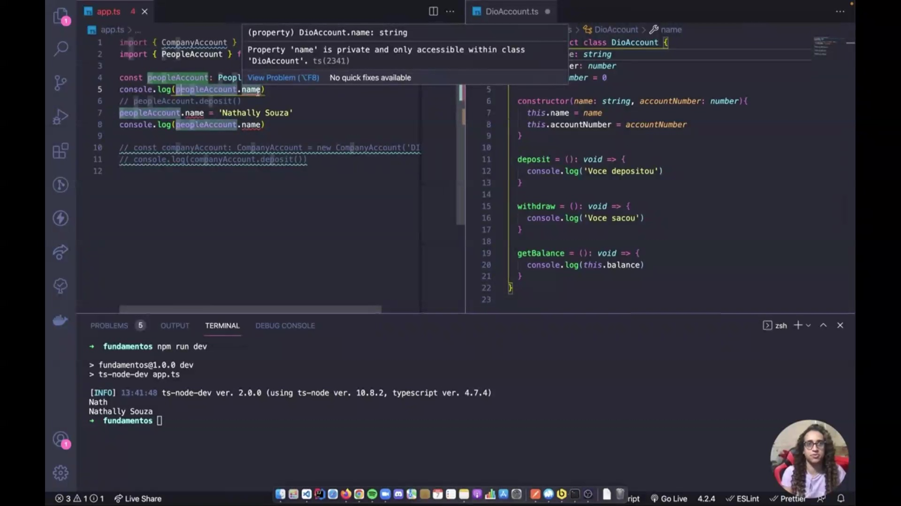
</p>

Ao definir um atributo como privado (`private`), o TypeScript impede o acesso direto a essa propriedade fora da classe onde ela foi declarada. No exemplo abaixo, ao tentar ler ou alterar o atributo `name` da instância `peopleAccount` diretamente no arquivo `app.ts`, o VS Code sinaliza um erro de compilação, informando que a propriedade é acessível apenas dentro da classe `DioAccount`. 

```typescript
// Exemplo de tentativa de acesso direto que gera erro
console.log(peopleAccount.name)
peopleAccount.name = 'Nathally Souza'
console.log(peopleAccount.name)

```

<p align="center">
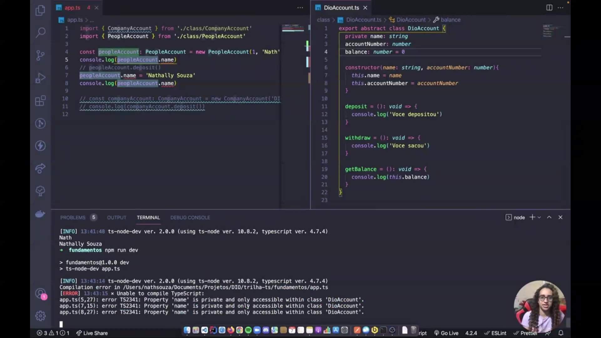
</p>

O erro de acesso a propriedades privadas também é reportado no terminal durante a execução via `ts-node-dev`. O erro `TS2341` confirma que a propriedade `name` não pode ser manipulada externamente, garantindo o encapsulamento dos dados internos do objeto. 

```bash
[ERROR] 13:43:15 Unable to compile TypeScript:
app.ts(5,27): error TS2341: Property 'name' is private and only accessible within class 'DioAccount'
app.ts(7,15): error TS2341: Property 'name' is private and only accessible within class 'DioAccount'
app.ts(8,27): error TS2341: Property 'name' is private and only accessible within class 'DioAccount'.

```

<p align="center">
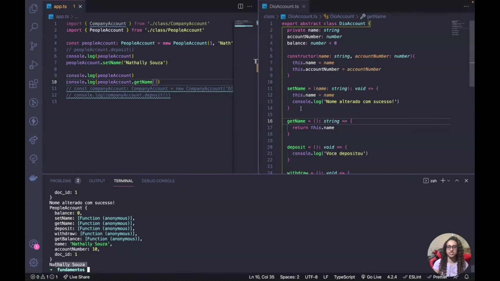
</p>

Para permitir a interação com atributos privados de forma segura, utilizamos métodos conhecidos como **Getters** (para obter o valor) e **Setters** (para configurar ou alterar o valor). Esses métodos são públicos e atuam como intermediários, permitindo que a classe controle como seus dados internos são acessados ou modificados. 

```typescript
// Implementação de Setter e Getter na classe DioAccount
setName = (name: string): void => {
  this.name = name
  console.log('Nome alterado com sucesso!')
}

getName = (): string => {
  return this.name
}

```

<p align="center">
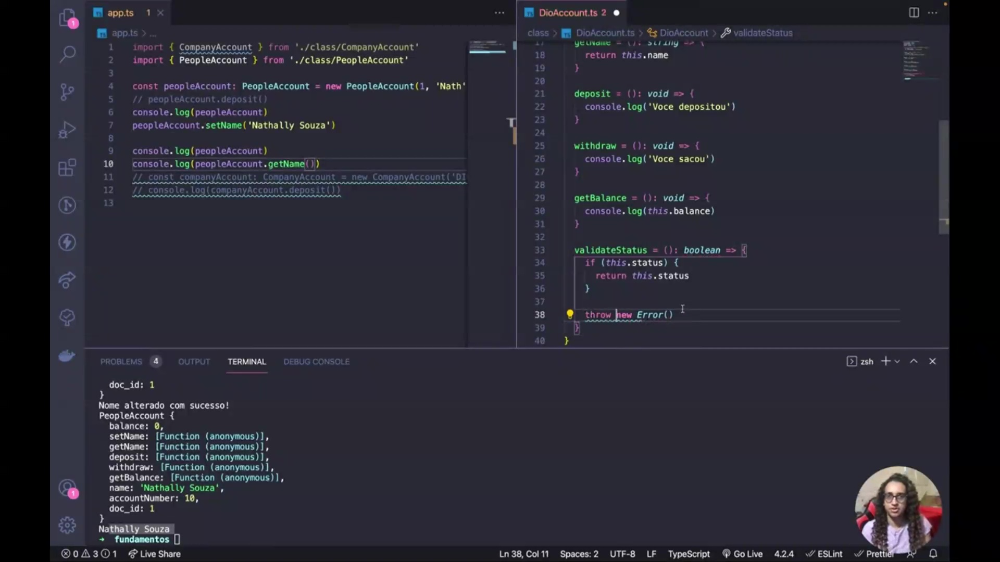
</p>

O permissionamento também se aplica aos métodos. Um método definido como `private` só pode ser invocado internamente pela própria classe. No caso abaixo, o método `validateStatus` é criado para verificar se a conta está ativa antes de realizar operações, mas essa lógica de validação não deve ser acessível por quem utiliza a classe externamente. 

```typescript
private validateStatus = (): boolean => {
  if (this.status) {
    return this.status
  }

  throw new Error()
}

```

<p align="center">
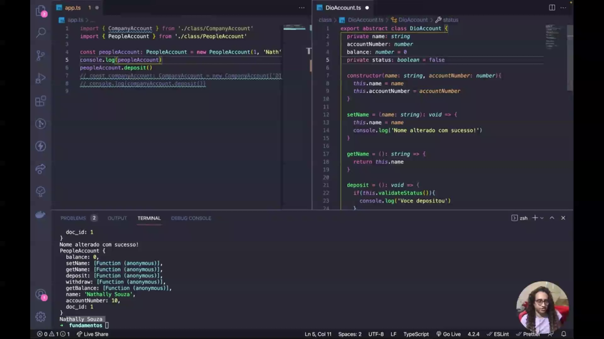
</p>

Com o método de validação interno pronto, ele pode ser utilizado por outros métodos públicos da classe, como o `deposit`. O método `deposit` chama `this.validateStatus()`; se o retorno for verdadeiro, a operação prossegue e exibe a mensagem de confirmação. 

```typescript
deposit = (): void => {
  if(this.validateStatus()){
    console.log('Voce depositou')
  }
}

```

<p align="center">
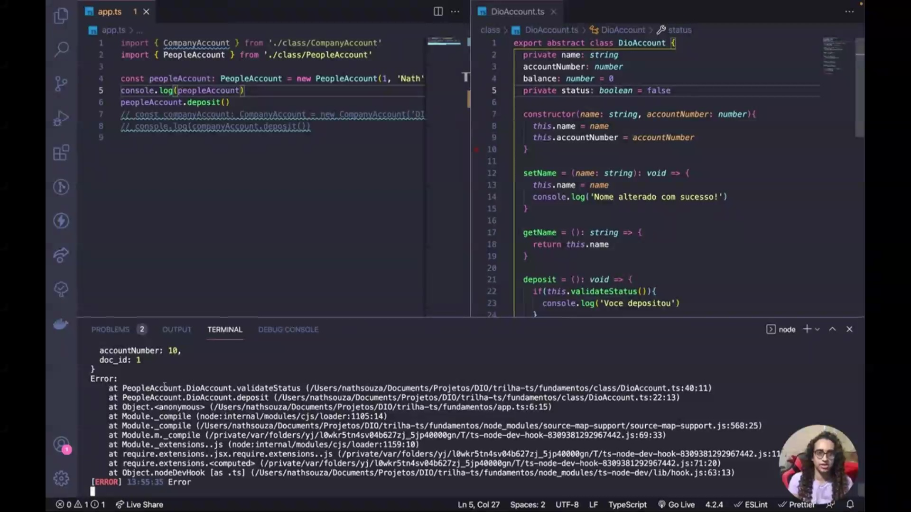
</p>

Para testar o comportamento do sistema de permissões e validações, o atributo `status` é definido inicialmente como `false`. Como o `status` é privado, ele só pode ser alterado internamente na classe ou através de sua inicialização. 

```typescript
private status: boolean = false

```

<p align="center">
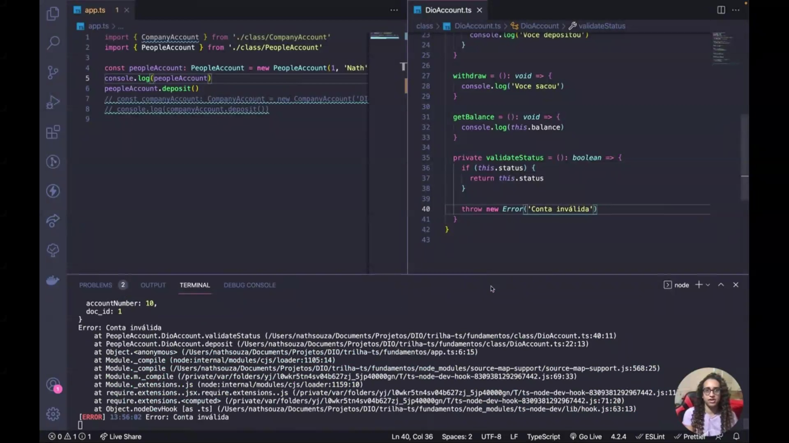
</p>

Para tornar o erro mais descritivo quando uma validação falha, é possível passar uma mensagem personalizada para o objeto `Error`. Assim, caso o `validateStatus` identifique que a conta não está ativa, ele interromperá a execução com uma mensagem clara sobre o problema. 

```typescript
throw new Error('Conta inválida')

```

<p align="center">

</p>

Ao executar o código com o status da conta definido como `false`, o terminal exibe o erro lançado pelo método `validateStatus`. A pilha de erros mostra que a falha ocorreu durante a tentativa de realizar um depósito, resultando na interrupção do programa com a mensagem "Conta inválida". 

```bash
Error: Conta inválida
    at PeopleAccount.DioAccount.validateStatus (.../class/DioAccount.ts:40:11)
    at PeopleAccount.DioAccount.deposit (.../class/DioAccount.ts:22:13)

```

<p align="center">
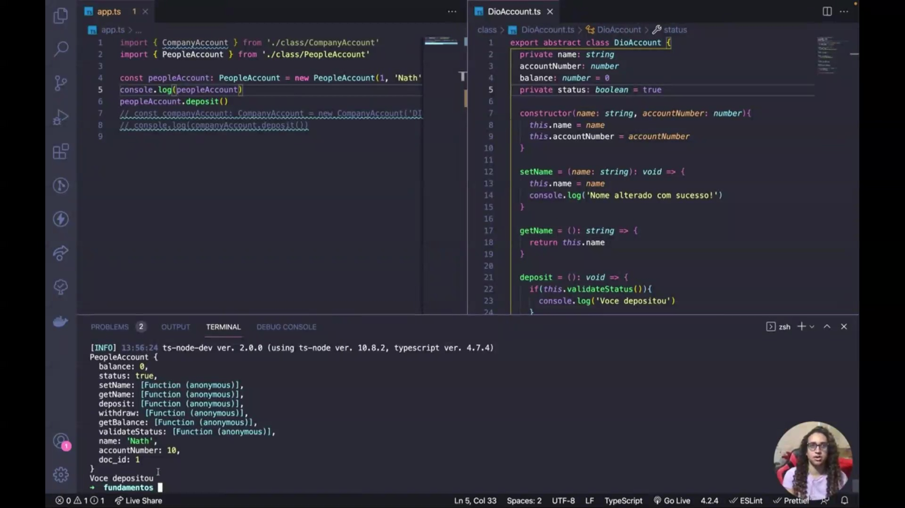
</p>

Quando o `status` da conta é alterado para `true`, a validação interna do método `deposit` passa a permitir a operação. O resultado final no terminal mostra que o objeto foi processado corretamente e a mensagem de sucesso do depósito foi exibida, demonstrando o fluxo completo de permissionamento e lógica interna. 

```bash
PeopleAccount {
  balance: 0,
  status: true,
  ...
  name: 'Nath',
  accountNumber: 10
}
Voce depositou

```      

## 🟩 Vídeo 07 - Readonly

<video width="60%" controls>
  <source src="000-Midia_e_Anexos/formacao_typescript_fullstack-modulo_01-Curso_02-Video_07.wenm" type="video/webm">
    Seu navegador não suporta vídeo HTML5.
</video>

Link do vídeo: https://web.dio.me/track/formacao-typescript-fullstack-developer/course/programacao-orientada-a-objetos-com-typescript-22/learning/6629ae1a-cacd-49d4-9f34-8ba6fbae024d?autoplay=1

Este conteúdo aborda conceitos avançados de Programação Orientada a Objetos (POO) utilizando TypeScript, com foco especial no modificador de acesso readonly e no Princípio da Responsabilidade Única (SRP). O instrutor demonstra como garantir a imutabilidade de atributos após a instanciação e a importância de criar métodos modulares e especializados para facilitar a manutenção e a escalabilidade do código.

### Anotações

<p align="center">
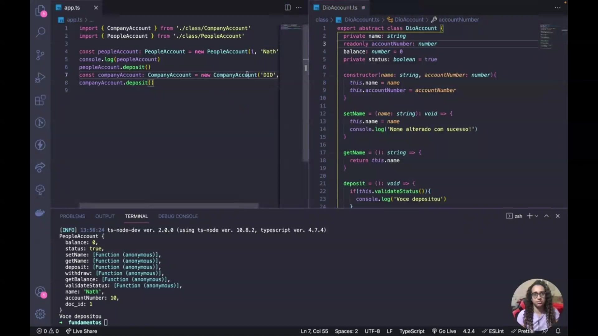
</p>

Nesta etapa, exploramos o uso da palavra reservada `readonly` no TypeScript para definir permissões de acesso. Ao aplicar esse modificador ao atributo `accountNumber`, indicamos que este valor deve ser apenas de leitura. A estrutura da classe `DioAccount` demonstra como esse atributo é declarado e inicializado através do construtor, garantindo que ele receba um valor no momento da criação da instância.

```typescript
export abstract class DioAccount {
  private name: string
  readonly accountNumber: number
  balance: number = 0
  private status: boolean = true

  constructor(name: string, accountNumber: number){
    this.name = name
    this.accountNumber = accountNumber
  }

  setName = (name: string): void => {
    this.name = name
    console.log('Nome alterado com sucesso!')
  }

  getName = (): string => {
    return this.name
  }

  deposit = (): void => {
    if(this.validateStatus()){
      console.log('Voce depositou')
    }
  }
}

```

<p align="center">
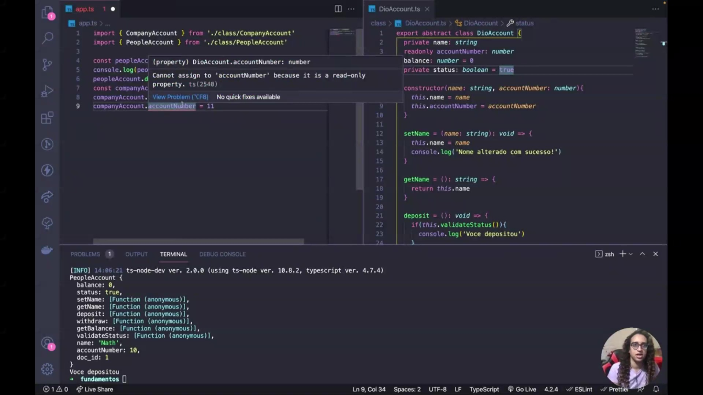
</p>

A principal característica do `readonly` é impedir alterações após a inicialização do objeto. Ao tentar atribuir um novo valor ao `accountNumber` da instância `companyAccount` fora da classe, o compilador do TypeScript sinaliza um erro, protegendo a integridade do dado e garantindo que o número da conta permaneça imutável.

```typescript
companyAccount.accountNumber = 11

```

<p align="center">
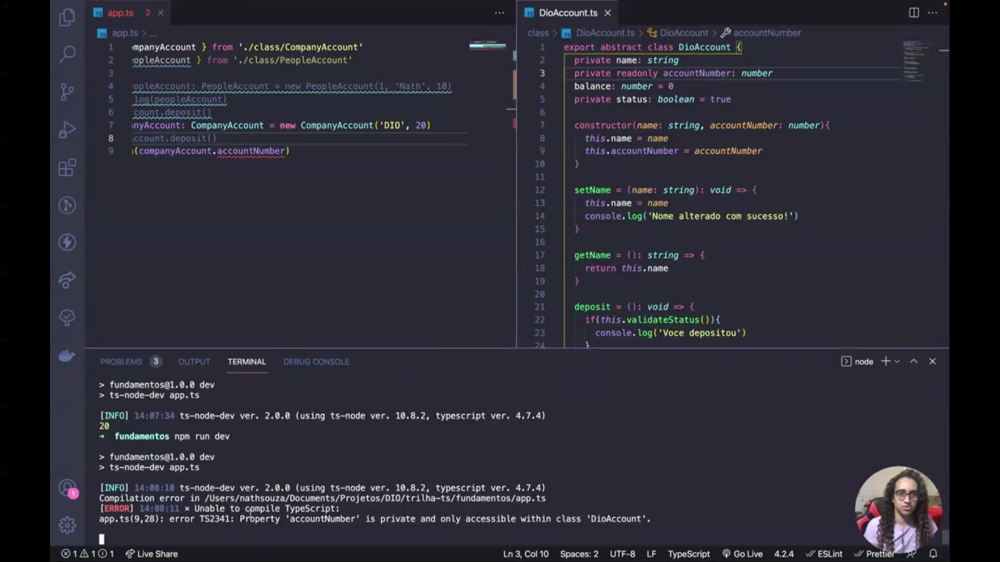
</p>

Os modificadores podem ser combinados para restringir ainda mais o acesso. Ao definir o atributo como `private readonly`, ele deixa de ser acessível para leitura externa direta. O erro apresentado no VS Code mostra que tentar realizar um `console.log` diretamente no `accountNumber` a partir da instância não é mais permitido, pois a propriedade agora é privada à classe `DioAccount`.

```typescript
private readonly accountNumber: number

```

<p align="center">
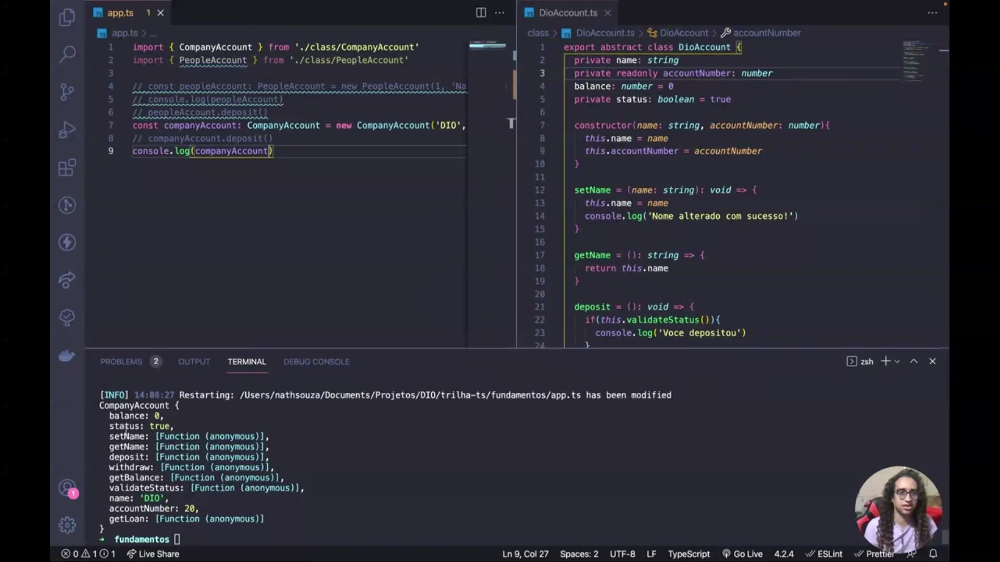
</p>

Embora o acesso direto ao atributo privado seja bloqueado pelo compilador para garantir a segurança do código, é possível visualizar o estado interno do objeto ao imprimir a instância completa no terminal. O log exibe a estrutura da `CompanyAccount` com seus respectivos valores, confirmando que o `accountNumber` mantém o valor atribuído durante a construção.

```typescript
console.log(companyAccount)

```

<p align="center">
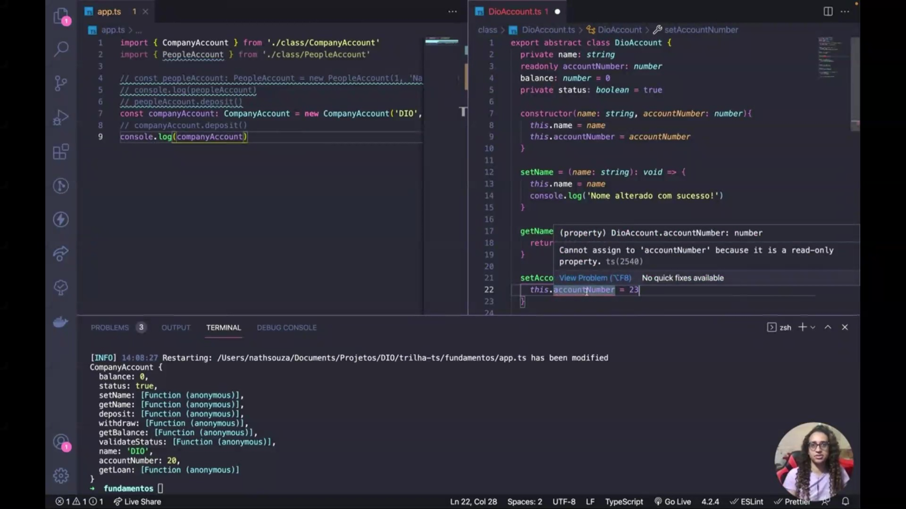
</p>

O modificador `readonly` também protege o atributo contra modificações internas dentro da própria classe. Mesmo em métodos criados para atualização de dados, o TypeScript impede que o `accountNumber` receba um novo valor, reforçando o conceito de que propriedades de apenas leitura só podem ter seus valores definidos no construtor.

```typescript
this.accountNumber = 23

```

<p align="center">
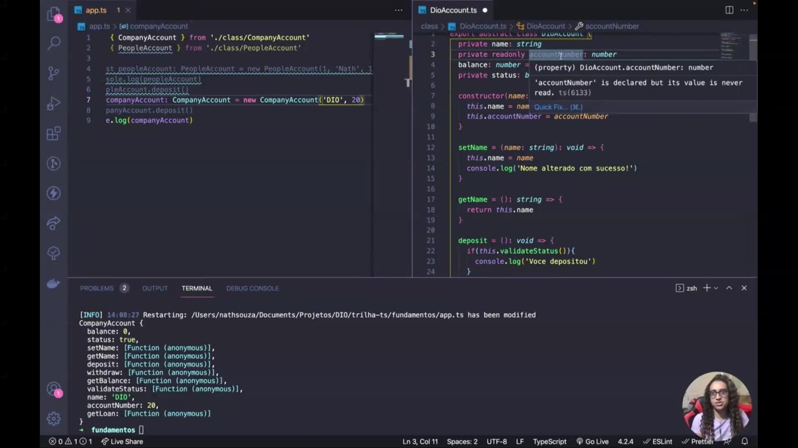
</p>

Concluímos a organização da classe aplicando o princípio da responsabilidade única. Cada método deve executar apenas uma tarefa específica. No exemplo do método `deposit`, a lógica de depósito é executada apenas se a validação externa do status da conta for bem-sucedida através do método `validateStatus`. Isso isola as regras de negócio e facilita manutenções futuras, pois alterações na validação não impactam diretamente o fluxo de depósito.

```typescript
deposit = (): void => {
  if(this.validateStatus()){
    console.log('Voce depositou')
  }
}

```

# Certificado: Programação Orientada a Objetos com TypeScript

- Link na plataforma: https://hermes.dio.me/certificates/ZLOUZY3S.pdf
- Certificado em pdf: [Certificado-Programacao.Orientada.a.Objetos.com.TypeScript.pdf](000-Midia_e_Anexos/Certificado-Programacao.Orientada.a.Objetos.com.TypeScript.pdf)
